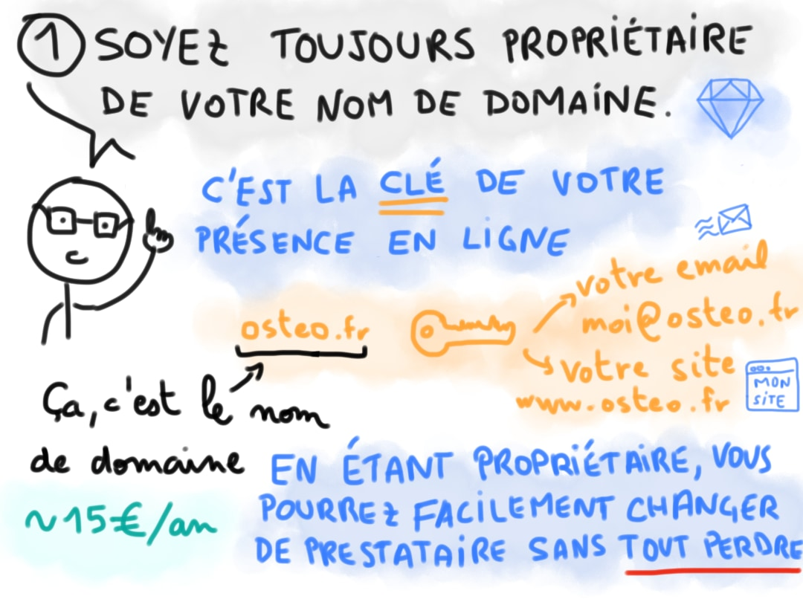
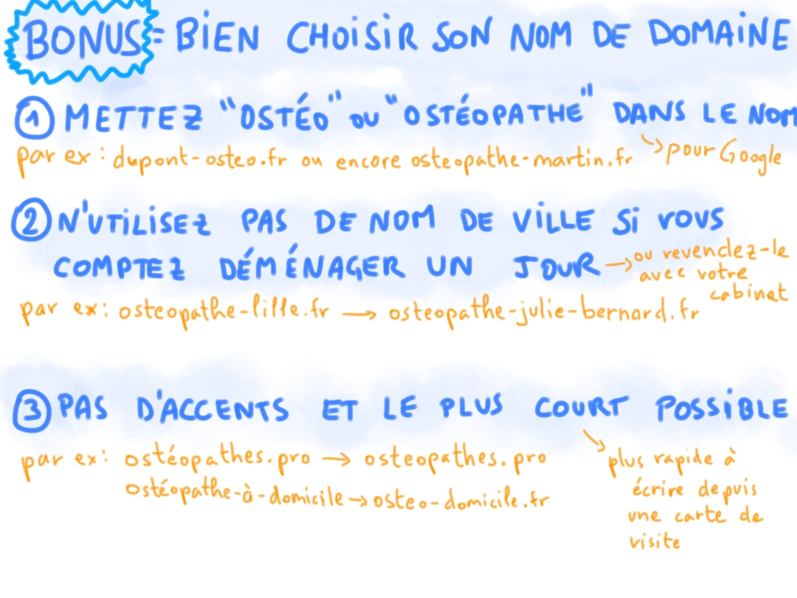

Après plusieurs demandes par story, voici la BD sur les 5 choses à savoir pour faire son site web d'ostéopathe.
Ce sont avant tout des conseils pour partir sur de bonnes bases pour pouvoir changer d'avis et ne pas vous retrouver coincé·e.
Quelques conseils additionnels vous permettrons de sortir du lot plus facilement et de ne pas perdre les points essentiels de vue.

Rendez-vous après la BD pour ajouter quelques précisions sur ce sujet et vous donner quelques conseils supplémentaires.

Contactez-nous si vous avez des questions, on sera ravis d'y répondre. Sur ce, place aux conseils pour faire son site ostéo en dessins 😉

<!--more-->

Vous pouvez également lire la BD sur [Facebook](https://www.facebook.com/osteopathes.pro/posts/pfbid02fzcYsaZEsxNotBFZvQEDt5BhNVLTK5tNCBXTPM2PNycnNxv9wZW5csukqDrsDjs2l) ou [Instagram](https://www.instagram.com/p/CciM3moKlBQ/)

Votre site web est l'**un des premiers endroits où les patient·e·s chercheront des
informations sur votre cabinet et sur vous**. Veillez donc à ce qu'il contienne
toutes les informations essentielles et faciles d'accès:
- l'adresse de votre cabinet d'ostéopathie et comment s'y rendre facilement (parking, transports en commun, etc.);
- une présentation de vous-même et de votre pratique;
- vos tarifs et les moyens de paiement;
- les horaires d'ouverture;
- les moyens de prendre rendez-vous, que ce soit en ligne ou par téléphone ou les deux.

## C'est en faisant qu'on apprend, mais vous pouvez apprendre de mes erreurs
Mon premier site d'ostéopathe fut l'occasion d'essayer pas mal de choses, et par la
même occasion, de faire pas mal d'erreurs. Depuis j'ai également accompagné de nombreux
ostéopathes à améliorer leur site et leur référencement, et à se sortir de situations
difficiles; voici donc quelques conseils complémentaires pour mettre toutes les chances
de votre côté.

### Un bon site est facile à naviguer
Si un patient·e ne peut pas trouver ce qu'il ou elle cherche sur votre site, il
abandonnera rapidement et partira. Assurez-vous que votre contenu est clairement
organisé et facile à comprendre.

### Un bon site est bien conçu
Un site web avec un bon design et une bonne expérience utilisateur retiendra plus
facilement vos patients·es qu'un site ordinaire ou encombré. *Un bon
design n'est cependant pas toujours synonyme de dernier cri*. De nombreux sites
aux allures modernes sont très lents à s'afficher, fonctionnent mal sur certains appareils
comme les mobiles ou utilisent des polices difficiles à lire, en particulier auprès d'une patientèle
âgée. Pensez donc à essayer votre site dans un maximum de situations différentes pour
qu'il puisse correspondre à vos potentiels·les patients·es.

### Un bon site web permet aux patient·e·s de se faire une première opinion de vous
Il est important d'avoir une présentation et des photos de vous et de votre cabinet
sur le site. En effet, c'est souvent par l'intermédiaire de ces quelques éléments visuels que vos
futurs·es patients·es se feront une première idée de vous et s'ils ou elles peuvent vous
accorder leur confiance. Soignez donc les photos avec un bon éclairage et une qualité
visuelle satisfaisante. Votre présentation permettra de compléter les images en
présentant vos spécificités et votre approche.

## Un site ne remplace pas les réseaux sociaux ou un système de prise de rendez-vous
Un site est un atout qui se construit sur le long terme, c'est-à-dire sur plusieurs
années. Il permet de centraliser les informations à votre sujet et du cabinet où vous
exercez. Les réseaux sociaux peuvent vous permettre de développer une communauté,
les outils en ligne comme la prise de rendez-vous peuvent être amenés à changer et ne
remplacent donc pas un site personnel. Votre site et votre domaine seront eux fixes
et permettront aux patients·es qui vous connaissent de toujours pouvoir vous
retrouver et de vous contacter.

## Restez toujours propriétaire de votre nom de domaine
S'il n'y avait qu'**une seule chose à retenir pour ne pas vous en mordre les doigts un jour**,
c'est bien ceci, et c'est pourquoi je le répète en fin d'article.

Comme le dit l'adage, "la confiance n'exclut pas le contrôle",
c'est pourquoi il est **essentiel** d'être en permanence le propriétaire direct,
sans intermédiaire ou prestataire, de votre domaine (par exemple: www.osteopathe-sever.fr).

Un domaine est un investissement qui vous *coûte de l'argent chaque année* et
que vous construisez au fil du temps avec le site web qui lui est rattaché.
Ne pas être propriétaire de votre domaine peut vous exposer au **risque de perdre
tout l'argent investi** au cours du temps à un prestataire avec lequel vous
seriez en conflit: il pourrait simplement ne pas vous rendre le domaine
et vous resteriez sans rien et avec des recours presque inexistants.

Être propriétaire du domaine n'exclut pas la possibilité pour
une agence web ou tout autre prestataire de configurer celui-ci
pour que tout marche avec votre site web. Gardez donc à l'esprit qu'il
n'est jamais nécessaire de céder la propriété sur votre domaine, et que
vous **devez** la conserver à tout moment, au risque d'être "pris en otage"
par un prestataire peu scrupuleux.

## Prenez l'avis de professionnels
Lorsqu'il s'agit du site web pour votre cabinet d'ostéopathie, il y a de
nombreuses offres et de nombreux facteurs à prendre en compte. J'espère qu'avec
ces quelques conseils, vous serez en mesure de faire de meilleurs choix et surtout,
de pouvoir changer d'avis et de ne jamais vous retrouver coincé·e dans une mauvaise situation.

Si vous avez un doute sur un prestataire, une situation dans laquelle vous
êtes, contactez-nous et je serai heureux de vous apporter mon expertise
et mon aide.

Enfin, si vous souhaitez mettre en place votre site en suivant tous les conseils de cet
article, nous avons mis en place des [sites web pour ostéopathes](https://www.osteopathes.pro/fr/site-internet-osteopathe)
faciles à configurer et à gérer.
