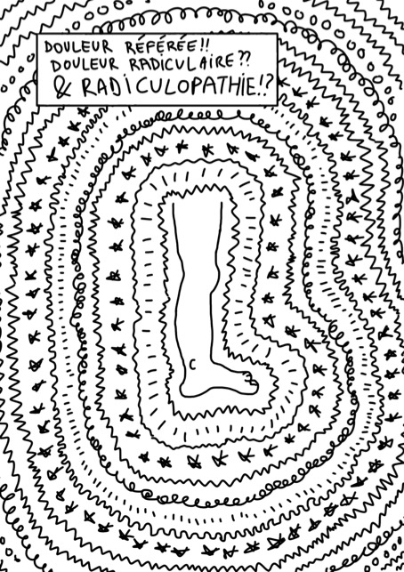

La semaine dernière [Tom Jesson](https://tomjesson.com/) a publié une courte BD intitulée:
«Douleur référée!! Douleur radiculaire?? Radiculopathie !?» que j'ai trouvée excellente.

Pour remettre un peu de contexte, Tom est kinésithérapeute et il publie régulièrement sur le sujet
des douleurs de racines lombaires et le syndrome de la queue de cheval. Ça fait quelques
mois que je suis ses travaux, car ses explications sont souvent simples et permettent
d'aborder des situations cliniques complexes plus sereinement.

Évidemment, lorsque ce « zine » – comme on les appelle en ligne – a été publié, j'ai immédiatement
proposé à Tom de le traduire, ce qui fut chose faite.

<!--more-->

Voilà sans plus attendre le zine. J'espère qu'il pourra apporter des éclaircissements pertinents pour votre pratique.

Bonne lecture !

## 📱 Lire sur votre ordinateur ou smartphone
[Cliquez sur l'image pour accéder à la BD: ](./Tom-Jesson-douleur-referee-douleur-radiculaire-et-radiculopathie-zine-vf.pdf)

## 🖨️ Imprimer le zine sur papier
**Pour imprimer en recto-verso automatique**: réglez votre imprimante en mode paysage, cliquez sur "recto-verso",
pour la reliure, selectionnez "côté long" (et non "côté court") et sélectionnez "imprimer toute l'image"
(et non "remplir le papier en entier"). Vous pouvez également sélectionner une qualité/résolution
d'impression élevée, bien que la valeur par défaut soit probablement suffisante.

Une fois que vous avez imprimé, il suffit de plier le document - les pages devraient être dans le
bon ordre. Si vous disposez d'une agrafeuse longue, vous pouvez également agrafer le dos du document.

L'impression directe à partir de votre navigateur n'est peut-être pas optimale. Il est donc préférable
de télécharger le document et de l'ouvrir dans un autre programme.

[Cliquez sur l'image pour accéder au document: ](./Tom-Jesson-douleur-referee-douleur-radiculaire-et-radiculopathie-zine-vf-recto-verso-auto.pdf)

**Pour imprimer manuellement en recto-verso**: il y a quelques instructions pour
[imprimer manuellement en recto-verso ici](https://captaincarnet.com/imprimer-en-recto-verso-manuellement-les-astuces-pour-faire-bonne-impression/), mais puisque
toutes les imprimantes sont différentes, il faut probablement trouver comment le faire sur la vôtre...

En gros, il y a six pages dans le pdf (chaque page du pdf contient deux pages du zine). Vous
cherchez à faire imprimer les pages 1 et 2 du pdf sur des faces différentes de la même
feuille de papier, et de même pour les pages 3 et 4 et les pages 5 et 6. Il faudra probablement
imprimer d'abord toutes les pages paires ou impaires, puis réinsérer le papier, en espérant que
ce soit dans le bon sens...

Pour ce qui est des paramètres: réglez votre imprimante en mode paysage, selectionnez
"côté long" (et non "côté court") et sélectionnez "imprimer toute l'image"
(et non "remplir le papier en entier"). Vous pouvez également sélectionner une qualité/résolution
d'impression élevée, bien que la valeur par défaut soit probablement suffisante.

Une fois l'impression terminée, pliez le zine. Les pages du zine sont numérotées de 1 à 10,
ce qui vous permet de vous assurer qu'elles sont dans le bon ordre. Si vous disposez d'une
agrafeuse longue, vous pouvez également agrafer le dos du document.

L'impression directe à partir de votre navigateur n'est peut-être pas optimale. Il est donc préférable de télécharger le document et de l'ouvrir dans un autre programme.

[Cliquez sur l'image pour accéder au document: ](./Tom-Jesson-douleur-referee-douleur-radiculaire-et-radiculopathie-zine-vf-recto-verso-manuel.pdf)

## Liens utiles
- [Site web de Tom (en anglais)](https://tomjesson.com/)
- [Newsletter de Tom (en anglais)](https://tomjesson.substack.com/)
- [Livre sur le syndrôme de la queue de cheval (toujours en anglais)](https://thecesbook.com/)