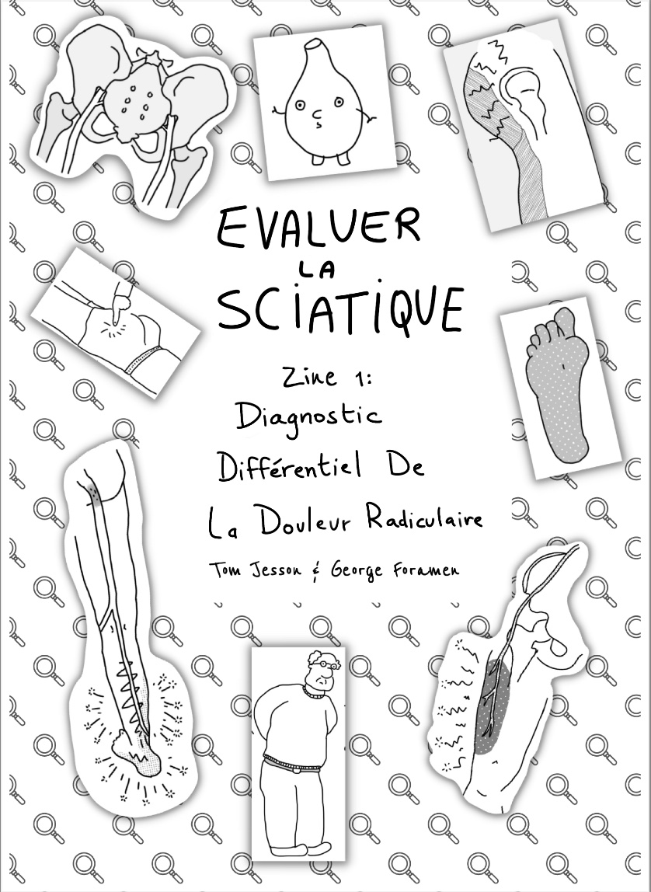

Après le succès du premier *zine* (une BD en ligne à
imprimer soi-même) sur la différenciation entre
[douleur référée, douleur radiculaire et radiculopathie](),
publié par [Tom Jesson](https://tomjesson.com/) en septembre 2022,
il décide de créer un nouveau zine sur
**le diagnostic différentiel de la douleur radiculaire
(en particulier sciatique)**.

Ce nouveau zine permet de répondre à la question
clinique: "Je pense que mon/ma patient·e a une douleur
radiculaire/radiculopathie, mais je ne suis pas sûr·e
– et si c'était autre chose ?".

Tout est expliqué en terme simples et mémorables, et
on espère que ça vous amusera par la même occasion !

<!--more-->

## Encourager cette œuvre
Suite à la précédente traduction qu'on avait faite
sur ce blog, Tom m'a recontacté pour me proposer
d'effectuer de nouveau la traduction de son nouveau zine.

À la différence du zine original, le zine **publié ici
est gratuit** et ce travail a été rendu possible grâce
aux abonné·e·s à osteopathes.pro. Merci du fond du cœur à
eux et elles 🥰. Merci également à
[Yves](https://twitter.com/yschwen) et
[David](https://twitter.com/fredgontrand) pour
la relecture et les conseils.

Pour encourager Tom à écrire une suite et d'autres zines,
pensez à [acheter son zine en anglais](https://tomjesson.gumroad.com/l/ddxzine).

Pour nous encourager à traduire et à mettre à disposition
gratuitement les zines de Tom, rejoignez nos membres et abonné·e·s
ou partager cet article à vos ami·e·s et collègues.

Voici sans plus attendre le zine de Tom. On espère qu'il sera drôle,
utile et pertinent pour votre clinique.

Bonne lecture !

## 📱 Lire sur votre ordinateur ou smartphone
[Cliquez sur l'image pour accéder à la BD: ](./Tom-Jesson-diagnostic-differentiel-sciatalgie-zine-1-vf.pdf)

## 🖨️ Imprimer le zine sur papier
**Pour imprimer en recto-verso automatique**: réglez votre imprimante en mode paysage, cliquez sur "recto-verso",
pour la reliure, selectionnez "côté long" (et non "côté court") et sélectionnez "imprimer toute l'image"
(et non "remplir le papier en entier"). Vous pouvez également sélectionner une qualité/résolution
d'impression élevée, bien que la valeur par défaut soit probablement suffisante.

Une fois que vous avez imprimé, il suffit de plier le document - les pages devraient être dans le
bon ordre. Si vous disposez d'une agrafeuse longue, vous pouvez également agrafer le dos du document.

L'impression directe à partir de votre navigateur n'est peut-être pas optimale. Il est donc préférable
de télécharger le document et de l'ouvrir dans un autre programme.

[Cliquez sur l'image pour accéder au document: ](./Tom-Jesson-diagnostic-differentiel-sciatalgie-zine-1-vf-recto-verso-auto.pdf)

**Pour imprimer manuellement en recto-verso**: il y a quelques instructions pour
[imprimer manuellement en recto-verso ici](https://captaincarnet.com/imprimer-en-recto-verso-manuellement-les-astuces-pour-faire-bonne-impression/), mais puisque
toutes les imprimantes sont différentes, il faut probablement trouver comment le faire sur la vôtre...

En gros, il y a six pages dans le pdf (chaque page du pdf contient deux pages du zine). Vous
cherchez à faire imprimer les pages 1 et 2 du pdf sur des faces différentes de la même
feuille de papier, et de même pour les pages 3 et 4 et les pages 5 et 6. Il faudra probablement
imprimer d'abord toutes les pages paires ou impaires, puis réinsérer le papier, en espérant que
ce soit dans le bon sens...

Pour ce qui est des paramètres: réglez votre imprimante en mode paysage, selectionnez
"côté long" (et non "côté court") et sélectionnez "imprimer toute l'image"
(et non "remplir le papier en entier"). Vous pouvez également sélectionner une qualité/résolution
d'impression élevée, bien que la valeur par défaut soit probablement suffisante.

Une fois l'impression terminée, pliez le zine. Les pages du zine sont numérotées de 1 à 10,
ce qui vous permet de vous assurer qu'elles sont dans le bon ordre. Si vous disposez d'une
agrafeuse longue, vous pouvez également agrafer le dos du document.

L'impression directe à partir de votre navigateur n'est peut-être pas optimale. Il est donc préférable de télécharger le document et de l'ouvrir dans un autre programme.

[Cliquez sur l'image pour accéder au document: ](./Tom-Jesson-diagnostic-differentiel-sciatalgie-zine-1-vf-recto-verso-manuel.pdf)

## Liens utiles
- [Site web de Tom (en anglais)](https://tomjesson.com/)
- [Newsletter de Tom (en anglais)](https://tomjesson.substack.com/)
- [Acheter le zine pour encourager l'auteur à en faire d'autres (en anglais)](https://tomjesson.gumroad.com/l/ddxzine)
- [Son livre sur le syndrôme de la queue de cheval (toujours en anglais)](https://thecesbook.com/)