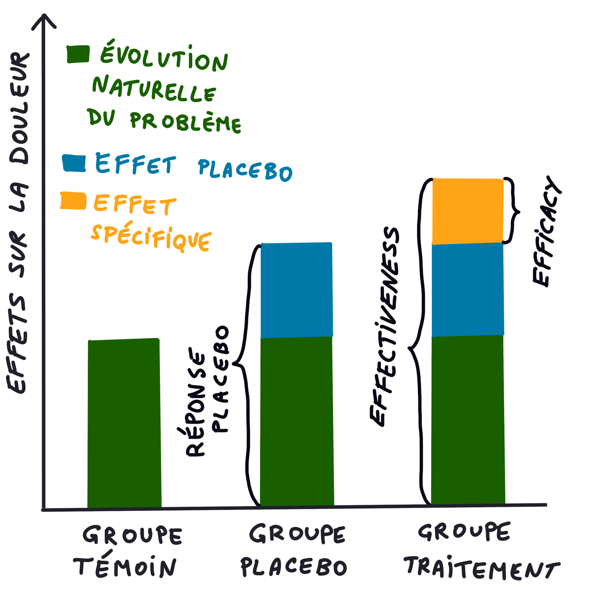
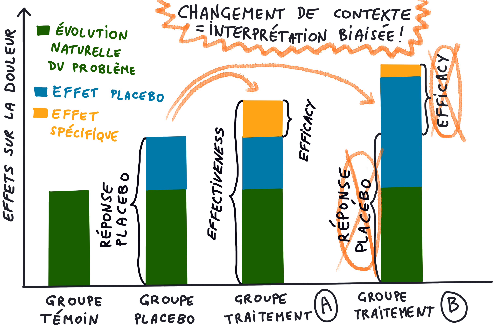

L’ostéopathie est une profession récente qui peine à se faire
reconnaître dans le monde médical. Théorisée par Andrew Taylor
Still, elle se crée à contre-courant de la médecine de l’époque.
De nos jours, la médecine a su évoluer avec l’emergence de
la médecine basée sur les preuves, ou *evidence-based medicine* (EBM),
en finançant de la recherche pour évaluer rigoureusement
l’efficacité des médicaments.\
L’ostéopathie est très appréciée de ses utilisateurs et utilisatrices,
mais une intégration dans le système de santé actuel nécessiterait
une **évaluation objective de son efficacité**. Il y a eu plusieurs
tentatives d’évaluation, mais il apparaît que celle-ci soit
**plus complexe que pour un médicament**.

<!--more-->

Un document INSERM (Barry & Falissard 2012[^1]) cite:
> La plupart de ces études présentent de réelles limites méthodologiques
> (absence d’allocation des traitements en «aveugle»,
> critère d’efficacité subjectif, etc.). Il faut cependant noter
>la grande difficulté qu’il y a à mener ce type d’évaluation de
> façon indiscutable.

[^1]: Barry, C. & Falissard, B., 2012. Évaluation De L’efficacité
      De La Pratique De L’ostéopathie.

L’**ostéopathie est décrite comme une intervention complexe**,
c’est-à-dire comportant plusieurs composants. L’évaluation
des interventions complexes est particulièrement difficile à
mettre en place, mais aussi à comprendre. Par exemple, nous
avons tous entendu parler de l’étude "*LC ostéo*" dont les
conclusions ont été discutées dans la presse et par les
syndicats. Beaucoup d’ostéopathes ne se retrouvaient pas
dans l’intervention évaluée, alors que d’autres estimaient
que le groupe contrôle était déjà de l’ostéopathie. Cela a
généré beaucoup d’incompréhension.

**Est-il possible d’évaluer rigoureusement l’ostéopathie en
recherche ? Cette thérapie est-elle la seule face à ce
problème ? Devons-nous nous inspirer de la recherche sur
les thérapies médicamenteuses pour cela ?** Un article publié
par *David Hohenschurz-Schmidt et coll.* nous éclaire sur le sujet.

## Le contexte de l'étude

### Thérapies non médicamenteuses et non chirurgicales
Sur le plan juridique français, la loi relative aux droits
des malades et à la qualité du système de santé du 4 mars 2002
reconnaît le **soulagement de la douleur** comme un droit
fondamental de toute personne. La lutte contre la douleur
est également une priorité de santé publique inscrite dans
la loi de santé publique de 2004. (DGOS, 2022a[^2])

Dans le troisième plan quinquennal pour l'amélioration de la
prise en chage de la douleur, l'une des priorités souligne la
nécessité d'une « meilleure utilisation des traitements
médicamenteux et des **méthodes non pharmacologiques** » (DGOS, 2022b[^3]).
La crise des opioïdes met en exergue le besoin de ces dernières.

[^2]: Direction générale de l’offre de soins (DGOS), 2022.
      La Douleur. Disponible à l'adresse: https://solidarites-sante.gouv.fr/soins-et-maladies/prises-en-charge-specialisees/douleur/article/la-douleur
      [Consulté le 21 Septembre 2022].
[^3]: Direction générale de l’offre de soins (DGOS), 2022.
      Douleur : L’action Des Pouvoirs Publics.
      Disponible à l'adresse: https://solidarites-sante.gouv.fr/soins-et-maladies/prises-en-charge-specialisees/douleur/article/douleur-l-action-des-pouvoirs-publics
      [Consulté le 21 Septembre 2022].

Les *interventions non médicamenteuses et non chirurgicales* (INM)
comprennent les thérapies cognitives et comportementales (TCC), les
exercices, la rééducation, les thérapies manuelles, l’acupuncture,
les ultrasons, l’éducation, etc. Les guides de bonne pratique
actuels recommandent certaines INM pour la lombalgie commune (HAS, 2019[^4]).

[^4]: Haute Autorité de Santé (HAS), 2019. Prise En Charge
      Du Patient Présentant Une Lombalgie Commune.
      Disponible à l'adresse: https://www.has-sante.fr/jcms/c_2961499/fr/prise-en-charge-du-patient-presentant-une-lombalgie-commune#toc_1_8 [Consulté le 21 Septembre 2022].

Cependant, ces recommandations sont basées sur des **preuves de
niveau faible ou modéré pour la plupart** (Stochkendahl et al., 2018[^5]).
Cette faible qualité de preuve est due à des lacunes méthodologiques
dans les essais cliniques évaluant les INM, notamment sur la
mise en aveugle et l’élaboration du groupe contrôle
(Lavazza et al., 2021[^6] ; Boutron et al., 2004[^7]).

[^5]: Stochkendahl, M.J., Kjaer, P., Hartvigsen, J., Kongsted,
      A., Aaboe, J., Andersen, Margrethe, et al., 2018. National
      Clinical Guidelines For Non-Surgical Treatment Of Patients
      With Recent Onset Low Back Pain Or Lumbar Radiculopathy.
      European Spine Journal, 27(1), pp.60–75.
[^6]: Lavazza, C., Galli, M., Abenavoli, A. & Maggiani, A.,
      Sham Treatment Effects In Manual Therapy Trials On
      Back Pain Patients: A Systematic Review And
      Pairwise Meta-Analysis. BMJ Open, 11(5).
[^7]: Boutron, I., Tubach, F., Giraudeau, B. & Ravaud, P.,
      Blinding Was Judged More Difficult To Achieve
      And Maintain In Nonpharmacologic Than
      Pharmacologic Trials. Journal Of Clinical
      Epidemiology, 57(6), pp.543–550.

Les INM sont considérées, pour beaucoup, comme des
interventions dites “*complexes*”. Les interventions complexes
sont décrites comme des interventions qui contiennent *plusieurs
composants*. Ce qui rend une intervention complexe, c’est
le nombre de composants dans l’intervention, le comportement
demandé à ceux qui délivrent ou qui reçoivent cette intervention,
le degré de flexibilité ou l’adaptation de l’intervention à
l’individu qui la reçoit (Craig et al., 2008[^8]). Ainsi,
évaluer une intervention complexe implique une évaluation
complexe de son efficacité. Il faut faire un choix entre
un idéal méthodologique assez éloigné de la pratique
quotidienne et la réalité locale de faisabilité, plus ressemblante
à ce que les patients verront réellement, mais plus biaisée
et donc moins fiable (Ninot, 2013).

[^8]: Craig, P., Dieppe, P., Macintyre, S., Mitchie, S.,
      Nazareth, I. & Petticrew, M., 2008. Developing And
      Evaluating Complex Interventions: The New Medical
      Research Council Guidance. Bmj, 337(7676), pp.979–983.
[^9]: Ninot, gregory, 2013. Chapitre Introductif Un Besoin
      De Preuves D’Efficacité Et De Coûts / Bénéfices Des
      Interventions Non Médicamenteuses.

### Placebo / Effets contextuels
Dans les essais randomisés, les chercheurs différencient
*efficacy* de *effectiveness*. Ce sont deux termes à ne
pas confondre car le terme *efficacy* désigne la
supériorité à un placebo, alors que le terme *effectiveness*
désigne l’effet global d’un traitement (souvent utilisé
pour comparer deux interventions différentes).

Dans une démarche d’évaluation de l’efficacité (*efficacy*)
d’une thérapie, il faut déterminer si cette thérapie est
**plus favorable** pour le patient que s’il n’en prenait pas
(évolution naturelle de la maladie). Aussi, il faut savoir
si l’intervention proposée est plus efficace qu’un placebo.

> Les effets placebo et nocebo désignent les effets bénéfiques
> ou indésirables qui se produisent dans des contextes médicaux
> cliniques ou de laboratoire, respectivement, après l'administration
> d'un traitement inerte ou dans le cadre de traitements actifs,
> en raison de mécanismes tels que les attentes du patient.

La recherche actuelle intègre à la fois l'étude des réponses
placebo et nocebo en tant que résultat des essais cliniques
et l'étude des effets placebo et nocebo et de leurs mécanismes
psychologiques et neurobiologiques dans divers contextes
cliniques (Evers et al., 2018[^10])

[^10]: Evers, A.W.M., Colloca, L., Blease, C., Annoni, M.,
       Atlas, L.Y., Benedetti, F., et al., 2018. Implications
       Of Placebo And Nocebo Effects For Clinical Practice:
       Expert Consensus. Psychotherapy And Psychosomatics, pp.204–210.

### Les difficultés d’évaluation des interventions complexes
Et c’est *là* que réside la difficulté à évaluer les
interventions complexes: **est-il vraiment pertinent de comparer
la thérapie manuelle à la prise d’une gélule sans principe
actif ? Le groupe contrôle sera-t-il dénué d’effets spécifiques
si l’on touche le patient ?**

L’effet placebo n’est pas immuable: il varie en fonction
d’un certain nombre de facteurs inhérents à l’intervention
proposée. Pour les interventions complexes, on parle
beaucoup d’effets contextuels, ceux-ci peuvent être **responsables
de plus de 50% de l’effet de la thérapie** (Hafliðadóttir et al., 2021[^11]).

[^11]: Hafliðadóttir, S.H., Juhl, C.B., Nielsen, S.M.,
       Henriksen, M., Harris, I.A., Bliddal, H., et al.,
       2021. Placebo Response And Effect In Randomized
       2022. Clinical Trials: Meta-Research With Focus On
       2023. Contextual Effects. Trials, 22(1), pp.1–15.

Ainsi, le groupe contrôle doit prendre en compte tous ces
paramètres qui composent les effets contextuels, notamment
**les attentes du patient qui sont centrales dans l’effet
placebo** (Vase & Wartolowska., 2019[^12]). Il est donc difficile
de maintenir des attentes similaires dans les deux groupes,
si l’intervention dite placebo n’est pas convaincante,
mais aussi si le praticien n’est pas convaincant. En effet,
la mise en aveugle du praticien est problématique, notamment
en thérapie manuelle, puisqu’il/elle est le vecteur de cette thérapie.

[^12]: Vase, L. & Wartolowska, K., 2019. Pain, Placebo,
       And Test Of Treatment Efficacy: A Narrative Review.
       British Journal Of Anaesthesia, 123(2), pp.e254–e262.

## L'étude
En 2022, David Hohenschurz-Schmidt et coll. publient deux
articles (Hohenschurz-Schmidt et al., 2022a[^13]; Hohenschurz-Schmidt
et al., 2022b[^14]) sur les méthodes utilisées dans les
*essais randomisés contrôlés* (ERC) étudiant l’efficacité
(*efficacy*) des INM sur la douleur. Le premier est une
revue systématique de la littérature pour identifier les
différentes méthodes utilisées, le deuxième est une méta-analyse
visant à déterminer l’impact de ces méthodes sur les résultats
des ERC.

[^13]: Hohenschurz-Schmidt, D., Draper-Rodi, D.J., Vase,
       P.L., Scott, D.W., McGregor, P.A., Soliman, D.N.,
       et al., 2022. Blinding And Sham Control Methods In
       Trials Of Physical, Psychological, And Self-Management
       Interventions For Pain (Article I): A Systematic
       Review And Description Of Methods,
[^14]: Hohenschurz-Schmidt, D., Draper-Rodi, D.J., Vase,
       P.L., Scott, D.W., McGregor, P.A., Soliman, D.N.,
       et al., 2022. Blinding And Sham Control Methods In
       Trials Of Physical, Psychological, And Self-Management
       Interventions For Pain (Article II): A Meta-Analysis
       Relating Methods To Trial Results,

### Revue systématique
Une *revue systématique* de la littérature (RS) est une synthèse
des connaissances sur un sujet, faite de manière rigoureuse
et non orientée (tous les articles sur le sujet sont inclus
afin de limiter les biais). Elle doit être structurée et
reproductible.

Cette RS inclut 194 ERC, de 2008 à 2021, avec des populations
douloureuses (sauf douleur expérimentale), comparant un groupe
INM avec un groupe placebo.
Les auteurs ont rassemblé les informations nécessaires de
chaque ERC afin de les présenter et comparer par thérapie.

Cette revue démontre que les interventions «contrôle»
à haute similitude sont réalisables, fournissant probablement
plus d'informations sur l'efficacité et le mécanisme du
traitement que les traitements de contrôle actifs peu
ressemblants tels que l'éducation, la relaxation ou l'exercice.

Le fait d'appeler les interventions de contrôle «*sham*»
plutôt que «*placebo*» témoigne qu'elles peuvent ne pas
être aussi clairement «*inertes*» qu'une gélule de sucre.
Néanmoins, la question demeure de savoir si les tailles
d'effet attendues dans la recherche en pharmacothérapie
peuvent être exigées de manière réaliste des ERC contrôlés
par «*sham*» des interventions de PPS, étant donné les
effets potentiellement considérables produits par ces
comparateurs complexes.

Ce qui constitue une intervention de contrôle appropriée
peut être informé par la recherche sur le placebo et
peut dépendre des objectifs de l'essai :
- Si le but est de créer des niveaux similaires d'attentes
  de bénéfices de la part des patients, alors les études
  doivent explorer si cela peut être réalisé avec des
  contrôles très différents ou même des conceptions sans
  mise en aveugle.
- Si l'objectif est de contrôler les effets de contexte
  ou d'étudier les mécanismes de traitement, une intervention
  factice mais très similaire serait probablement bénéfique.
  L'aveuglement à l'allocation fictive seule peut également
  être réalisé avec des interventions très dissimilaires
  mais également crédibles. Mais cette approche n'est pas
  fiable et la mise en aveugle est probablement facilitée
  par la similitude des interventions.

Imaginons que nous souhaitons évaluer l’efficacité de
l’ostéopathie: il est d’abord opportun de se demander
quelle partie de l’intervention nous souhaitons évaluer
(communication, une technique en particulier, un enchaînement
de techniques, ou encore un traitement sur mesure...).
La question qui se posera sera donc: **la partie du traitement
choisie est-elle supérieure à l’effet placebo?** Ainsi, il
conviendra d’élaborer un «*sham*» qui sera identique en tous
points à l’intervention, sauf sur l’aspect voulu.

L’étude "*LC OSTEO*" (Nguyen et al 2021[^15]) est un excellent
exemple de rigueur méthodologique sur l’évaluation de
l’efficacité d’une prise en charge manuelle chez des
patients présentant une lombalgie chronique ou sub-aigüe:
seule l’application des techniques manuelles change entre
les patients du groupe contrôle et celui de l’intervention.
Le contexte, lui, reste identique : même lieu, même contact
avec le praticien et donc même attente du traitement de la
part du patient. Cet essai randomisé évalue donc uniquement
l’efficacité d’un choix de techniques ostéopathiques, dans
une population bien précise. L’effet démontré est significativement
supérieur au placebo mais non cliniquement pertinent.

[^15]: Nguyen, C., Boutron, I., Zegarra-Parodi, R., Baron, G.,
       Alami, S., Sanchez, K., et al., 2021. Effect Of Osteopathic
       Manipulative Treatment Vs Sham Treatment On Activity
       Limitations In Patients With Nonspecific Subacute And
       Chronic Low Back Pain: A Randomized Clinical Trial.
       JAMA Internal Medicine, 181(5), pp.620–630

Dans l'ensemble, ces résultats attirent l'attention sur
la nécessité de fournir une structure méthodologique sur
la conception des interventions de contrôle et les méthodes
d'aveuglement dans les ECR évaluant l'efficacité, en s'appuyant
sur les pratiques actuelles et les défis communs dans le
domaine de la recherche sur les interventions psychologiques
et physiques.

### Méta-analyse
Le deuxième article est une *méta-analyse* (MA). Une MA est le
plus haut niveau de preuve scientifique. C’est une synthèse
statistique des études incluses dans une RS.

Ici, les études incluses sont les mêmes que celles de la RS,
mais les statistiques sont différentes.

Après analyse de ces 194 publications, il semble que
l’effet des interventions «*contrôle*» soient modérés sur
la douleur, avec beaucoup d’hétérogénéité entre les études.
Une partie de cette hétérogénéité s’explique par des
différences de similarité entre les groupes. Ces résultats
montrent l'**importance capitale de la similarité entre les
interventions expérimentales et celles du groupe contrôle
dans les essais d'efficacité**. Ils fournissent en outre des
preuves quantitatives que la ressemblance de certaines
caractéristiques peut être particulièrement influente.
Plusieurs caractéristiques ont été identifiées:
- Le nombre de séances de traitement,
- Le mode d'application,
- L’individualisation de l'intervention,
- Le contrôle de la fidélité et l'environnement de traitement.

Les différences entre ces facteurs et plusieurs autres,
parfois spécifiques à une thérapie, peuvent conduire à
des différences dans les effets contextuels et donc à des
résultats d'essais biaisés. Outre l'impact sur les résultats
liés à la douleur, de telles différences peuvent compromettre
l'aveuglement des participants et favoriser une perte de
suivi chez les participants du groupe contrôle.

## Conclusion et recherche à venir
En conclusion, **les méthodes en recherche sont capitales
pour une meilleure compréhension des INM et de leurs
effets**. L’ostéopathie est une thérapie qui peut être
évaluée, à condition que ce soit fait dans de bonnes conditions.

Quelques questions à se poser en lisant un essai randomisé:
- Le but de l’étude est-il d’évaluer l’efficacité par rapport
  au placebo (*efficacy*) ou l’efficacité globale (*effectiveness*) ?
- Si on parle d’*efficacy*, le nombre de séances de traitement
  est-il le même dans les deux groupes ? Le contexte est-il
  similaire ? Le niveau d’individualisation est-il le même ?
- Auriez-vous pensé de l’intervention «*sham*» qu’elle soit réelle ?
- Mettez-vous à la place des participants 😉 !

Ces articles donnent une vue d’ensemble sur ce qui se fait
en recherche actuellement et soulignent la nécessité d’une
méthodologie rigoureuse lors de la conception des ERC.
Cette rigueur **peut** et **doit** prendre en compte les
individus dans leur entièreté biopsychosociale, pas uniquement
la foule dans sa globalité. Ces innovations méthodologiques
permettent à la recherche d’évoluer, mais aussi aux cliniciens
d’évoluer dans leur pratique quotidienne. Il est important
de comprendre ces enjeux méthodologiques afin de mieux
saisir le message d’un article scientifique, d’être plus
pertinent face à un patient lorsque la problématique a été
évaluée de cette manière, mais aussi de montrer que notre
belle profession sait évoluer et faire face à ces nouveaux défis.

Prochainement, une étude regroupant plusieurs experts dans
le domaine sera publiée afin de donner des recommandations
sur l’élaboration de groupe contrôle et la mise en aveugle
dans ce type d’ERC.
