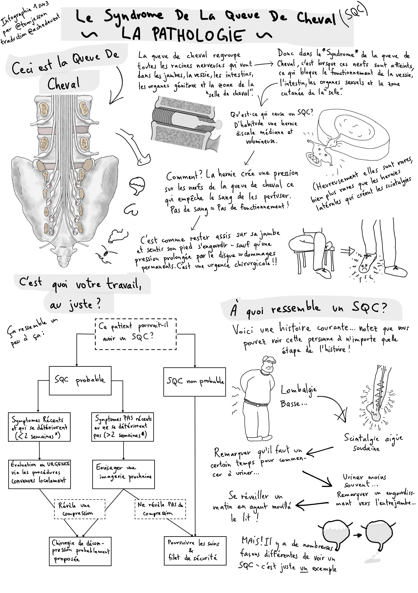
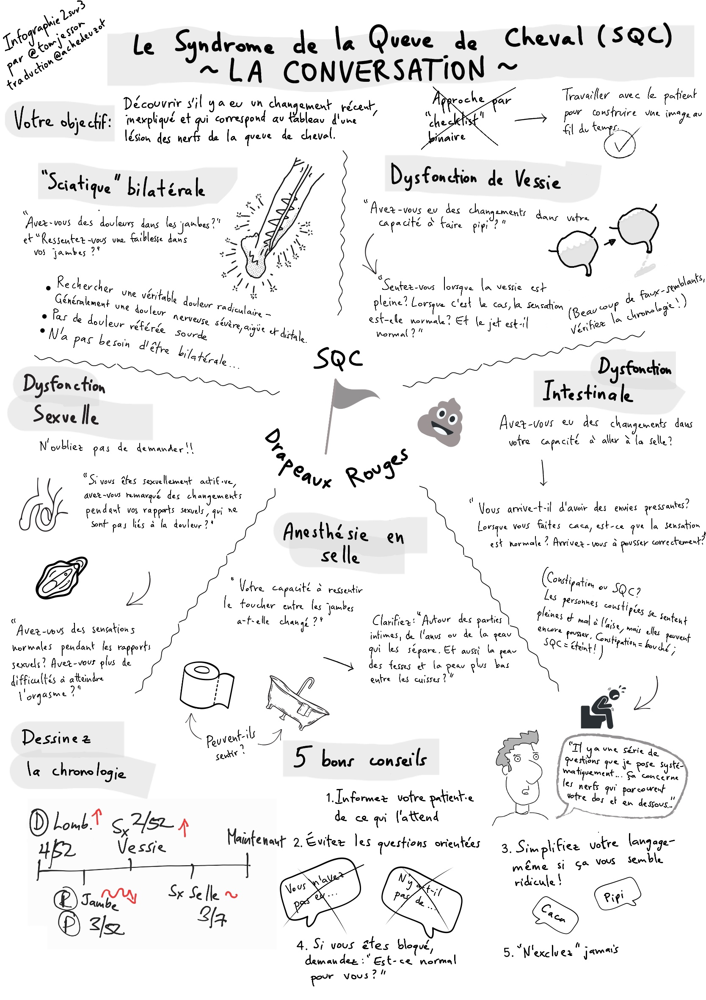
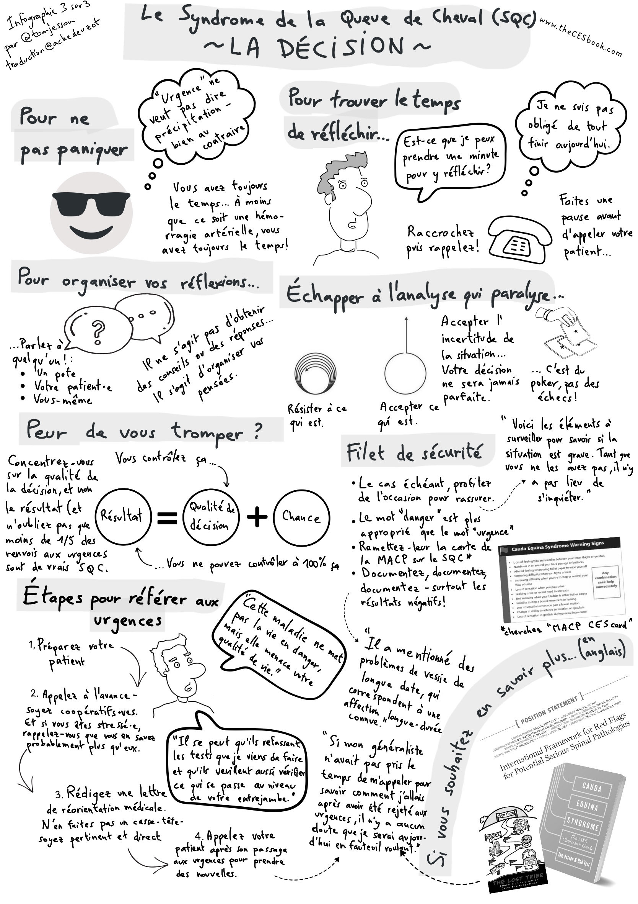

Voici la traduction française en 3 planches de BD qui résume
le Syndrome de la Queue de Cheval (*SQC*) publiée par
[Tom Jesson](https://tomjesson.com/).

Le syndrome de la queue de cheval, également connu sous
le nom de *cauda equina*, est une affection neurologique
qui se caractérise par une compression des nerfs situés
à la base de la colonne vertébrale et pouvant entrainer
des séquelles irréversibles. C'est ce qu'on appelle communément
un « drapeau rouge » 🚩 et on estime à un cas toutes
les 1000 à 2000 lombalgie aigües.

Pour ne pas rater ce syndrôme et vous aider à aborder cette
situation clinique plus sereinement, cette BD résume
l'essentiel en 3 planches: identifier le SQC, comment
l'aborder en consultation et que faire si on a un
doute ou une suspicion.

<!--more-->

Voilà sans plus attendre le résumé en BD. J'espère qu'il pourra apporter des éclaircissements pertinents pour votre pratique.

Bonne lecture !

## 🌐 Lire en ligne 🌐

## ⬇️ Télécharger pour lire hors ligne
[Cliquez sur l'image pour accéder à la BD complète en PDF: ](./le-syndrome-de-la-queue-de-cheval-en-bd-pathologie-discussion-decision.pdf)

## Liens utiles
- [Site web de Tom (en anglais)](https://tomjesson.com/)
- [Newsletter de Tom (en anglais)](https://tomjesson.substack.com/)
- [Livre sur le syndrome de la queue de cheval (toujours en anglais)](https://thecesbook.com/)