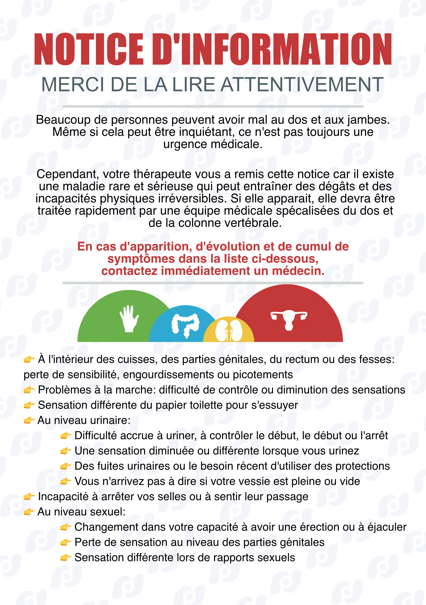

Voici la traduction française en 3 planches de BD qui résume
le Syndrome de la Queue de Cheval (*SQC*) publiée par
[Tom Jesson](https://tomjesson.com/).

Le syndrome de la queue de cheval, également connu sous
le nom de *cauda equina*, est une affection neurologique
qui se caractérise par une compression des nerfs situés
à la base de la colonne vertébrale et pouvant entrainer
des séquelles irréversibles. 
C'est ce qu'on appelle communément un « drapeau rouge » 🚩
et on estime à un (1) cas toutes les 1000 à 2000 lombalgie aigües.

<!--more-->

Pour ne pas rater ce syndrôme et vous aider à aborder cette
situation clinique plus sereinement, cette BD résume
l'essentiel en 3 planches: identifier le SQC, comment
l'aborder en consultation et que faire si on a un
doute ou une suspicion.

Une notice d'information pour vos patient·e·s est
également disponible pour le filet de sécurité (je vous laisse
lire la BD pour savoir de quoi il s'agit).

Voilà sans plus attendre le résumé en BD. J'espère qu'il pourra apporter des éclaircissements pertinents pour votre pratique.

Bonne lecture !

## 🌐 Lire en ligne 🌐

### Filet de sécurité

## ⬇️ Télécharger pour lire hors ligne
[Cliquez sur l'image pour accéder à la BD complète en PDF: ](./le-syndrome-de-la-queue-de-cheval-en-bd-pathologie-discussion-decision.pdf)

[Cliquez sur l'image pour télécharger la notice d'information en PDF: ](./le-syndrome-de-la-queue-de-cheval-notice-information.pdf)
## Liens utiles
- [Site web de Tom (en anglais)](https://tomjesson.com/)
- [Newsletter de Tom (en anglais)](https://tomjesson.substack.com/)
- [Livre sur le syndrome de la queue de cheval (toujours en anglais)](https://thecesbook.com/)