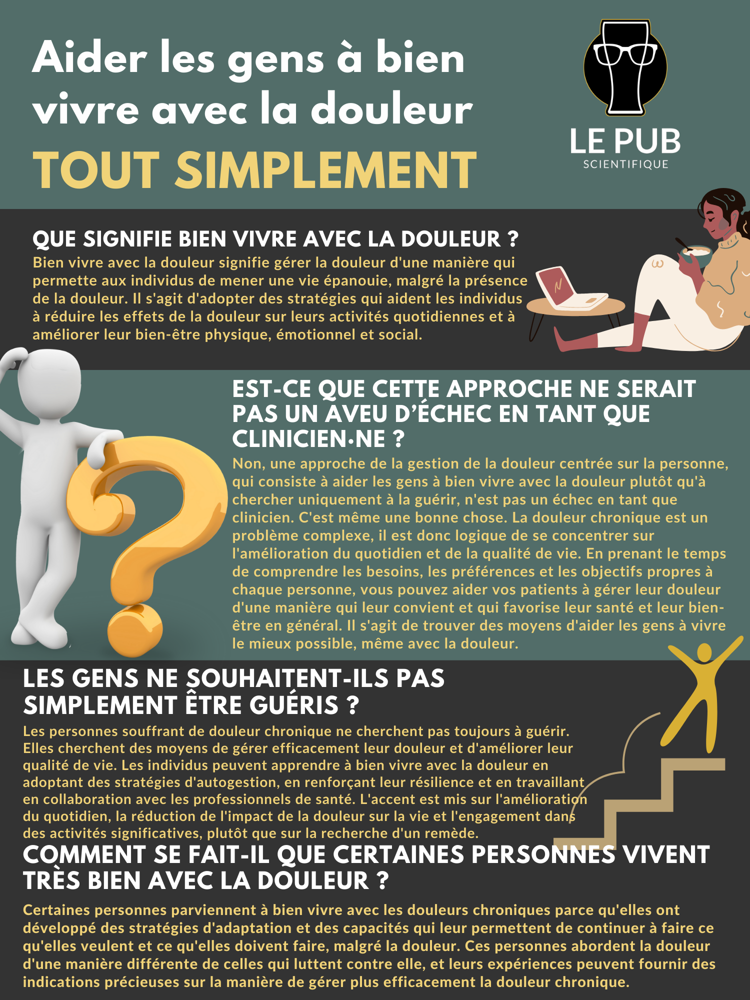
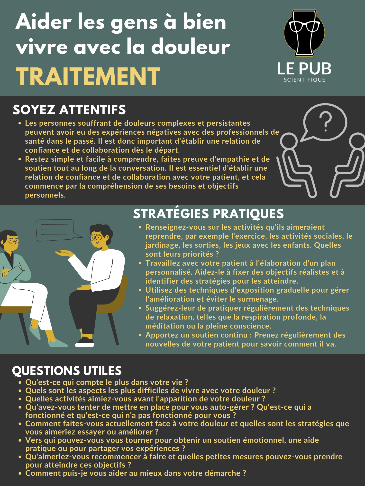
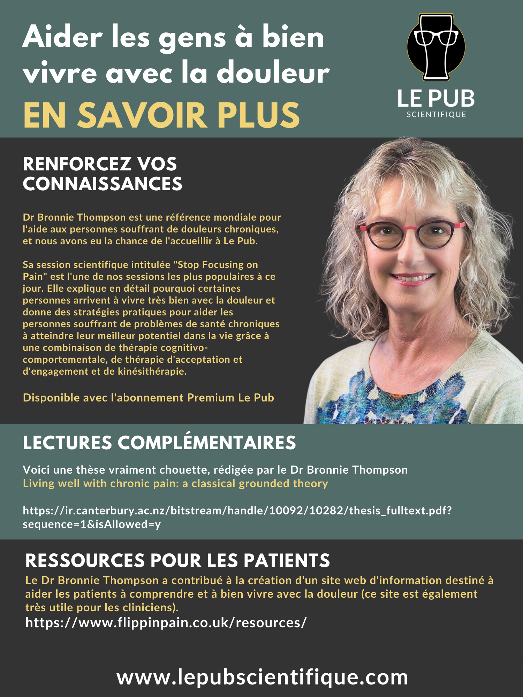

Voici la traduction française en 3 images du guide
*"Aider les gens à bien vivre avec la douleur"*
publié à l'origine par
[Le Pub Scientifique](https://www.lepubscientifique.com/) (site en anglais malgré son nom trompeur 😛).

Ce guide explore **comment améliorer la qualité de vie
des personnes souffrant de douleur chronique** en
adoptant une approche centrée sur la personne.

Le guide aborde comment mieux comprendre les besoins,
les préférences et les objectifs des patient·e·s et
comment collaborer avec eux et elles pour établir un plan
personnalisé. En travaillant ensemble, clinicien·ne·s
et patient·e·s peuvent trouver des moyens de réduire
l'impact de la douleur et d'améliorer leur
bien-être général.

<!--more-->

Quelques **conseils pratiques** et des **questions
clés à poser** sont présents dans le document
pour vous aider à mettre l'accent sur les priorités
des patient·e·s et obtenir une amélioration durable.

La traduction a été effectuée par David Strul et moi même.

On espère que ces quelques réflexions cliniques
vous seront utiles 🤗.

Bonne lecture !

## 🌐 Lire en ligne 🌐

## ⬇️ Télécharger pour lire hors ligne
[Cliquez sur l'image pour accéder au document PDF: ](./aider-les-gens-a-bien-vivre-avec-la-douleur.pdf)

## Liens utiles
- La thèse rédigée par le Dr Bronnie Thompson:
  [*Living well with chronic pain: a classical grounded theory*](https://ir.canterbury.ac.nz/bitstream/handle/10092/10282/thesis_fulltext.pdf?sequence=1&isAllowed=y)
- Le Dr Bronnie Thompson a contribué à la création d'un
  [site web d'information destiné à aider les patient·e·s à comprendre
  et à bien vivre avec la douleur (ce site est également très utile
  pour les cliniciens)](https://www.flippinpain.co.uk/resources/) (en anglais).
- [Le Pub Scientifique (en anglais)](https://www.lepubscientifique.com/)
- [Le compte instagram @lepubscientifique (toujours en anglais)](https://www.instagram.com/lepubscientifique/)