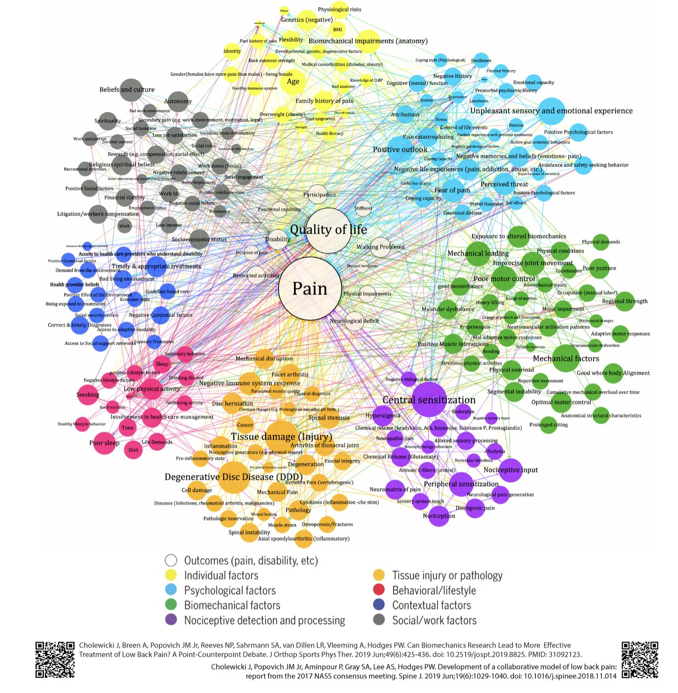
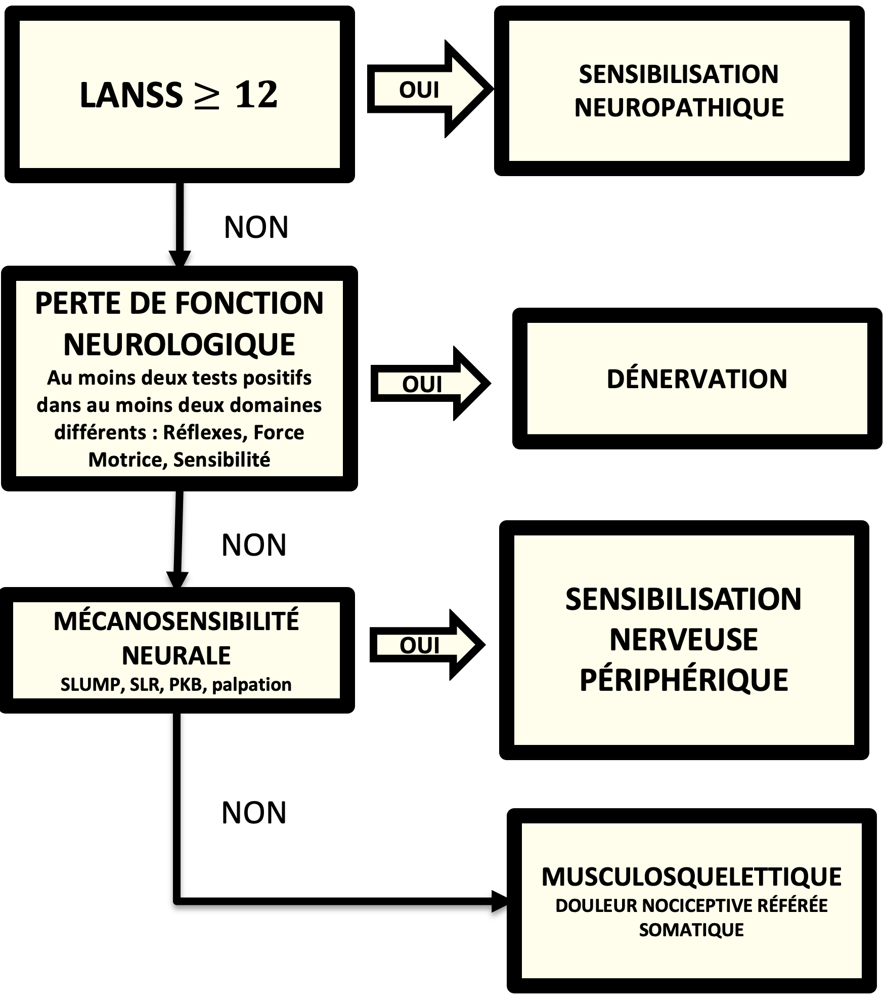
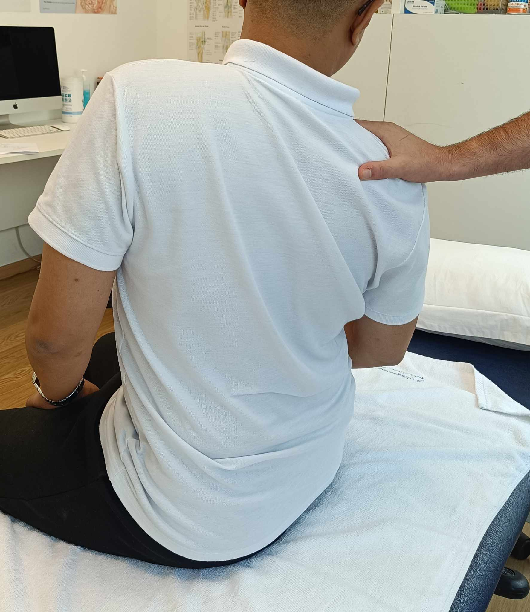
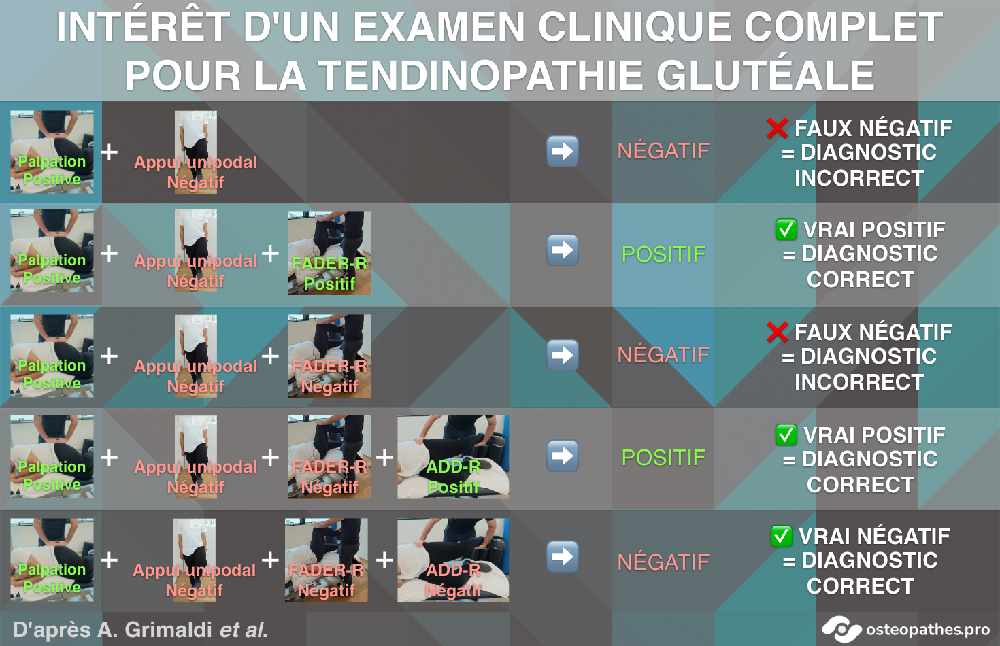
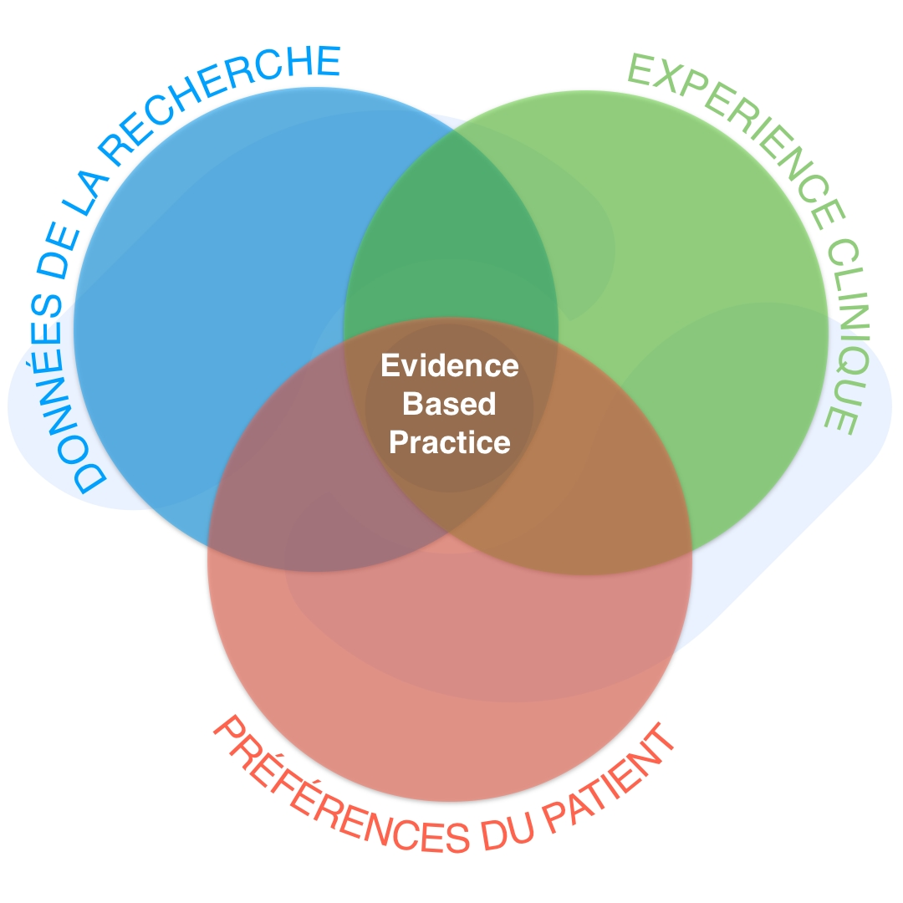
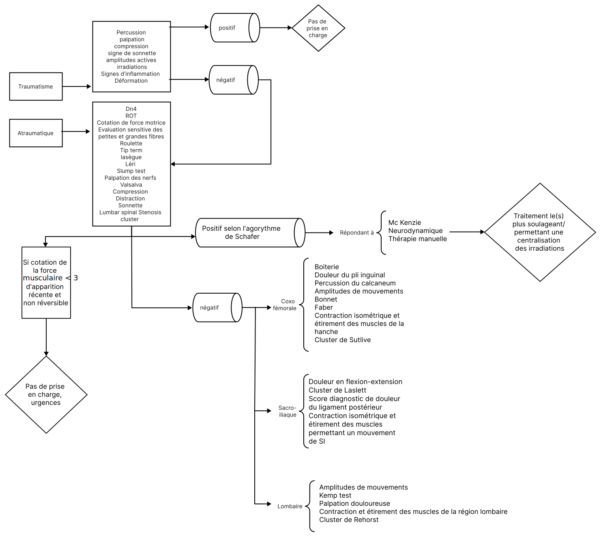

Comme on l'a vu avec l'article sur
[une possible orientation de la profession vue par un kiné](),
l'ostéopathie se trouve à un carrefour crucial, tiraillée entre les
traditions de ses origines et les avancées de la science moderne.
À une époque où la médecine évolue rapidement grâce aux progrès de
la recherche, notre profession est confrontée à un dilemme.

D'un côté, il y a celles et ceux qui, fidèles aux enseignements de
A.T. Still, cherchent à **préserver les méthodes traditionnelles qui
ont fait la réputation de l'ostéopathie**. De l'autre, nous observons
un mouvement croissant d'ostéopathes qui, convaincus par la nécessité
d'une démarche scientifique, aspirent à **intégrer les données
probantes actuelles dans leur pratique (l'Evidence Based Practice ou EBP)**,
même si cela signifie remettre en question certains des principes
fondateurs de notre discipline. Entre les deux, de nombreux
praticien·ne·s se sentent démunis, partagé·e·s entre la loyauté
envers leurs racines et le désir d'offrir à leurs
patient·e·s des soins fondés sur des preuves solides.

Cet article se veut être **un exemple et un guide pour les ostéopathes
qui souhaitent s'orienter vers une pratique fondée sur les preuves
et ne sachant pas par où commencer**.
En effet, nous ne pouvons plus pratiquer seulement par le biais
des liens anatomiques en sachant que cette approche est
mécaniquement dénuée de sens à la lumière des éléments fournis par
la recherche[^1].

[^1]: Hidalgo DF, MacMillan A, Thomson OP. "It’s all
  connected, so it all matters: - the fallacy of osteopathic
  anatomical possibilism". International Journal of
  Osteopathic Medicine [Internet]. 15 févr 2024 [cité 7
  mars 2024]; DOI:https://doi.org/10.1016/j.ijosm.2024.100718.
  Disponible sur:
  https://www.journalofosteopathicmedicine.com/article/S1746-0689(24)00011-7/abstract

À travers **l'approche d'une lombalgie aiguë non traumatique**
qui devrait être familière à tous les ostéopathes, j'espere illustrer
mes propos et vous donner un **aperçu concret des outils et des méthodes que
l'EBP met à notre disposition**, pour faire évoluer notre pratique
vers une ostéopathie contemporaine, respectée et scientifiquement fondée.


Avertissement: Il est évident que je ne suis qu’un ostéopathe qui
essaye au mieux de fonder sa pratique sur des données probantes,
il est plus que probable que certains tests, certaines explications ou
certaines sources ne soient pas les plus optimales, j’accueillerai
avec plaisir toute donnée qui me permettra de m’améliorer.


<!--more-->
## Déroulement de notre cas pratique
Avant d'entrer dans le vif du sujet, je souhaitais rappeler
rapidement quelques notions essentielles pour mieux comprendre
le déroulement de notre cas pratique.

### L’importance du modèle bio-psycho-social (BPS).
#### Contexte du patient
Il est très important de s’intéresser au contexte du patient ou de la
patiente et son ressenti vis-à-vis de cette douleur. Il existe des
outils pouvant nous permettre de classer et repérer des éléments liés
au contexte, c’est le système de drapeau qui est détaillé sur la
page physiopedia que vous pouvez trouver en référence[^2].

[^2]: Physiopedia [Internet]. [cité 5 mars 2024]. The
  Flag System. Disponible sur: https://www.physio-pedia.com/The_Flag_System

La réassurance du patient est un élément central, il est important
de rassurer et redonner confiance à nos patient·e·s. Sans minimiser
leur douleur ou leur ressenti, il nous incombe de diminuer et de gérer
le catastrophisme dont ils et elles peuvent faire preuve. Le catastrophisme
est l’un des principaux facteurs de chronicisation de la douleur[^3][^4].

[^3]: Otero-Ketterer E, Peñacoba-Puente C, Ferreira
  Pinheiro-Araujo C, Valera-Calero JA, Ortega-Santiago R.
  Biopsychosocial Factors for Chronicity in Individuals
  with Non-Specific Low Back Pain: An Umbrella Review.
  Int J Environ Res Public Health. 16 août
  2022;19(16):10145.
[^4]: Yamada AS, Simon D, Antunes FTT, Say KG,
  Souza AHD. Psychosocial factors associated with
  disability in patients with non-specific chronic low
  back pain: A cross-sectional study. Rehabilitacion
  (Madr). 2023;57(2):100750.

L'éducation thérapeutique sur les phénomènes douloureux est également une
option pour rassurer nos patient·e·s[^5][^6].

[^5]: Mittinty MM, Vanlint S, Stocks N, Mittinty MN,
  Moseley GL. Exploring effect of pain education on
  chronic pain patients’ expectation of recovery and
  pain intensity. Scand J Pain. 25 avr 2018;18(2):211‑9.
[^6]: Pontin JCB, Gioia KCSD, Dias AS, Teramatsu CT,
  Matuti GDS, Mafra ADL. The positives effects of a pain
  education program on patients with chronic pain:
  observational study. Brazilian Journal Of Pain
  [Internet]. 2021 [cité 6 mars 2024]; Disponible sur:
  http://www.scielo.br/scielo.php?script=sci_issues&pid=2595-3192&lng=en&nrm=isso

#### Exemples de phénomènes et facteurs pouvant conduire à de la douleur aigue
Voyons sur le schema ci-dessous quelques exemples de phénomènes et de facteurs
pouvant conduire à de la douleur. Nombre de phénomènes douloureux sont
décrits dans « Explain Pain » de Buttler et Moseley[^7].

[^7]: Noigroup [Internet]. [cité 29 mars 2023].
  Explain Pain Second Edition. Disponible sur:
  https://www.noigroup.com/product/explain-pain-second-edition/

Ils nous renseignent, entre autres, sur le déclenchement de systèmes
de défense générateurs de douleur, sans qu’il n’y ait nécessairement
de lésion anatomique. Notre rôle est aussi d’expliquer et de
sensibiliser le patient à son contexte (stress, facteur génétique,
activité physique, etc).[^8]

[^8]: Cholewicki J, Breen A, Popovich JM, Reeves
  NP, Sahrmann SA, van Dillen LR, et al. Can
  Biomechanics Research Lead to More Effective
  Treatment of Low Back Pain? A Point-Counterpoint
  Debate. J Orthop Sports Phys Ther. juin
  2019;49(6):425‑36.

*Figure 1: Facteurs impliqués dans la douleur par Cholewicki et al.*

### Un cluster de tests, c’est quoi et à quoi ça sert ?
Dans l'exemple que nous verrons plus loin, je parlerai de
plusieurs clusters. Il me semble donc important de les définir.

Un cluster de tests est un ensemble de tests cliniques à effectuer
pour répondre à un questionnement sur la probabilité qu’un·e patient·e
soit atteint ou non d’un trouble ou d’une pathologie.

Les clusters de tests nous permettent d’avoir des suspicions
diagnostiques plus ou moins fondées selon leur *sensibilité*
(probabilité que les tests soient positifs lorsque le patient **est**
atteint du trouble), et leur *spécificité* (probabilité que les tests
soient négatifs lorsque le patient **n’est PAS** atteint du trouble).

L’intérêt que présentent les **clusters** par rapport aux tests
*ostéopathiques* classiques réside dans leur valeur diagnostique
ainsi que leur reproductibilité entre différents opérateurs. La
recherche d’une dysfonction somatique (DS) représente l’objectif
de l’examen de l’ostéopathe, néanmoins nous savons aujourd’hui que
ce modèle est d'un intérêt limité, notamment par le manque de
reproductibilité (10 ostéopathes trouveront sur un même sujet 10 DS
différentes), ainsi que le manque d’objectivité, effectivement notre
palpation est extrêmement subjective et ne représente pas un moyen
diagnostic fiable (y compris pour les tests segmentaires vertébraux).[^9]

[^9]: Fryer G. Somatic dysfunction: An osteopathic
  conundrum. International Journal of Osteopathic
  Medicine. déc 2016;22:52‑63.

Les tests que nous décrirons plus tard se basent généralement sur
la reproduction de douleur chez le ou la patiente, ou sur certains facteurs
plus objectifs que notre palpation.

## La lombalgie aiguë non traumatique en pratique ostéopathique EBP
Pour simplifier ce texte, et le raccourcir, nous partirons
du postulat que le patient ne présente aucun drapeaux rouges[^10],
et que l’examen neurologique du patient est totalement négatif.
Pour ce qui est de la théorie et de la pratique de l’examen
neurologique je vous invite à consulter, par exemple, les formations de L. Fabre
sur le sujet. Néanmoins voici un algorithme fourni par Schafer *et al.*
en 2009, qui nous permet de discriminer différents mécanismes
neurologiques de mécanismes musculosquelettiques, traduit par L. Fabre,
également [disponible sur son site](https://gestiondeladouleurenthrapiemanuelle.wordpress.com/)[^11].

[^10]: DePalma MG. Red flags of low back pain.
  JAAPA. août 2020;33(8):8‑11.
[^11]: Schäfer A, Hall T, Briffa K. Classification of low
  back-related leg pain--a proposed patho-mechanism-
  based approach. Man Ther. avr 2009;14(2):222‑30.

*Figure 2: Algorithme de Schafer de discrimination des douleurs neuropathiques*

## Examen clinique de la région lombo-pelvienne
Notre examen clinique vise à identifier le tissu
douloureux et à exclure des causes potentiellement graves
de douleur lombaire.

### Amplitudes de mouvement
Nous pouvons commencer par l'observation des grandes amplitudes
de mouvement dans tous les plans (extension, flexion,
latéroflexion, rotation, ...) de la colonne lombaire et des
articulations coxo-fémorales.

Ces observations réalisées de manière active et passive peuvent
nous donner des informations sur les éventuelles restrictions,
les mouvements provoquant de la douleur **ou** pouvant la soulager.

Dans le cadre d’une recherche de restriction d’amplitude, l’utilisation
d’un goniomètre permet d’obtenir des résultats plus objectifs. Et,
permet un suivi plus objectif dans le temps.

L’observation des grandes amplitudes est plus ou moins reproductible
en fonction du type de mouvement analysé, ainsi que de la méthode
employée[^12].

[^12]: Robinson HS, Mengshoel AM. Assessments of
  lumbar flexion range of motion: intertester reliability
  and concurrent validity of 2 commonly used clinical
  tests. Spine (Phila Pa 1976). 15 févr 2014;39(4):E270-275.

Les amplitudes passives peuvent nous aider à repérer une région
pouvant générer de la douleur sur un étirement passif.

### Contraction isométrique
Les contractions isométriques des différents groupes musculaires
peuvent nous indiquer si la contraction sans déplacement est à
l’origine d’une sensibilité.

### Cluster de tests lombaire
La palpation des vertèbres lombaires douloureuses peut nous
indiquer un facteur nociceptif à la pression provenant de la
région lombaire[^13].

[^13]: Bhattacharyya A, Hopkinson LD, Nolet PS,
  Srbely J. The reliability of pressure pain threshold in
  individuals with low back or neck pain: a systematic
  review. British Journal of Pain. 1 déc
  2023;17(6):579‑91.

Le cluster de Rehorst nous propose une alternative intéressante
afin de suspecter une instabilité lombaire chez le patient[^14].

[^14]: Areeudomwong P, Jirarattanaphochai K,
  Ruanjai T, Buttagat V. Clinical utility of a cluster of tests
  as a diagnostic support tool for clinical lumbar
  instability. Musculoskelet Sci Pract. déc
  2020;50:102224.

Le test de Kemp, lorsqu’il est positif localement, tendra à nous
indiquer un syndrome facettaire. Il est impératif d'effectuer un
examen neurologique et discal complet avant de suspecter un
syndrome facettaire, d’autant plus que le test de Kemp ne dispose
que d’une sensibilité et d’une spécificité relativement faibles[^15].

[^15]: Stuber K, Lerede C, Kristmanson K, Sajko S, Bruno P.
  The diagnostic accuracy of the Kemp's test: a systematic
  review. J Can Chiropr Assoc. 2014 Sep;58(3):258-67.
  PMID: 25202153; PMCID: PMC4139762.

*Figure 3: Kemp test en position assise par l'auteur*

### Cluster de tests sacro-iliaques
L'utilisation du cluster de Laslett peut nous permettre de
suspecter une composante nociceptive provenant des articulations
sacro-iliaques (SI). Les résultats de ce cluster de 5 ou 6 tests ne
donnent que 35% de justesse quant au diagnostic lorsque 3 tests
ou plus sont positifs[^16].

[^16]: Laslett M, Aprill CN, McDonald B, Young SB.
  Diagnosis of sacroiliac joint pain: validity of individual
  provocation tests and composites of tests. Man Ther.
  août 2005;10(3):207‑18.

De plus, il existe un score diagnostic pouvant indiquer une douleur
provenant du ligament postérieur de l’articulation sacro iliaque.
Le point intéressant de ce cluster est qu’il permet avec une bonne
sensibilité et une bonne spécificité de discriminer une douleur
sacro-iliaque d’une douleur liée à une discopathie ou à une sténose
lombaire[^17].

[^17]: Diagnostic Scoring System for Sacroiliac Joint
  Pain Originating from the Posterior Ligament | Pain
  Medicine | Oxford Academic [Internet]. [cité 16 mars
  2024]. Disponible sur:
  https://academic.oup.com/painmedicine/article/18/2/228/2924700?login=false

La localisation de la douleur, et des éléments pouvant corroborer
une douleur de SI sont à rechercher pour augmenter la probabilité
que les clusters de SI soient pertinents.

### Cluster de tests coxo-fémoraux
Des signes d’appel, tels qu’une douleur localisée dans l'aine
ou une boiterie peuvent nous orienter vers une douleur de coxo-fémorale.

Le cluster de Sutlive peut nous indiquer la présence d’un phénomène
arthrosique douloureux[^18].

[^18]: Sutlive TG, Lopez HP, Schnitker DE, Yawn BP,
  Sutlive TG, Lopez HP, et al. Reliability of clinical
  examination for diagnosis of hip osteoarthritis. Arthritis
  Care Res. 15 févr 2007;57(1):149‑54.

Le cluster de Grimaldi nous orientera plutôt vers une tendinopathie
des fessiers[^19].

[^19]: Grimaldi A. Diagnosing Gluteal Tendinopathy in
  Clinical Practice [Internet]. Dr Alison Grimaldi. 2024
  [cité 16 mars 2024]. Disponible sur:
  https://dralisongrimaldi.com/blog/diagnosing-gluteal-tendinopathy-in-clinical-practice/

*Figure 4: Cluster de Grimaldi par Dr A. Grimaldi*


L'exemple ci-dessus est fondé sur le cas d'un patient ayant une
tendinopathie des muscles fessiers et qui se présente pour un
bilan de sa douleur.
L'examen clinique nécessite une sensibilité à la palpation
(test de palpation positif) et au moins un autre test positif parmi
ceux qui ont démontré avoir un effet modéré à important sur
l'augmentation de la probabilité de la condition lorsqu'ils sont
positifs: Test SLS (Single Leg Stance) ou Test d'appui unipodal ;
FADER-R : Flexion-Adduction-Rotation Externe-Résistée (Rotation Interne) ;
ADD-R : Adduction - Résistée (Abduction).


## Traitement
### Principe de prise en charge
L’ensemble de ces tests nous donne des informations, et des
suspicions sur ce qu’il peut potentiellement se passer dans le
corps de notre patient. Jusqu’ici nous n’avons pas recherché de
*dysfonction ostéopathique*, et nous n’allons pas le faire pour
l’ensemble des raisons qui font que ce modèle ne présente pas une
base diagnostique solide comme évoqué précédemment[^2].

En fonction du mécanisme qui semble à l’œuvre chez ce patient,
nous allons adapter notre plan de traitement en se basant sur
différents principes qui seront mis en avant par le schéma suivant[^20].

[^20]: What is Evidence-Based Practice? [Internet].
  [cité 6 mars 2024]. Disponible sur: http://accelerate.uofuhealth.utah.edu/improvement/what-is-evidence-based-practice

*Figure 5: Représentation des composantes de l'EBP*

Dans une pratique EBP, il ne s’agit pas d’élaborer un plan de
traitement basé à parts égales sur ces trois piliers, mais bien de
replacer chaque composante dans le cadre de la consultation.

- Le ou la patiente nous consulte avec ses attentes, ses croyances et
  l’ensemble de son contexte.
- Afin de répondre à ses attentes de la meilleure manière possible
  nous devons utiliser les éléments fournis par la littérature qui
  semblent présenter le plus de chances de succès.
- Et évaluer la pertinence de cette solution vis-à-vis du contexte
  et des objectifs du patient par le biais de notre expertise clinique.

Il est fondamental d’établir un objectif clair et défini avec notre
patient·e, afin d’y répondre en fonction des outils à notre disposition,
tout en connaissant les limites de notre pratique et de nos champs d’action.

Il est donc impératif de connaître les effets physiologiques de nos
outils selon les données de la recherche afin de les utiliser au mieux.

### Effets des outils à notre disposition
Les manipulations et mobilisations articulaires semblent avoir des
effets intéressants sur la douleur et la mobilité des segments
vertébraux sur le court terme (une vingtaine de minutes ou plus
selon les auteurs). Il est à noter que ces manipulations sont non-
spécifiques, il est impossible de manipuler exactement une vertèbre,
globalement le résultat sera le même si nous manipulons une vertèbre
dorsale moyenne ou une lombaire[^21].

[^21]: Rubinstein SM, de Zoete A, van Middelkoop
  M, Assendelft WJJ, de Boer MR, van Tulder MW.
  Benefits and harms of spinal manipulative therapy for
  the treatment of chronic low back pain: systematic
  review and meta-analysis of randomised controlled
  trials. BMJ. 13 mars 2019;364:l689.

Les techniques d'énergie musculaire en contraction isométrique,
permettent quant à elles, un effet antalgique (30min-1h), et ont
l’avantage d’être réalisables par le ou la patiente en autonomie. L’ajout
d’une période réfractaire et d’un étirement permet d’augmenter la
résistance à la douleur provoquée par l’étirement[^22][^23].

[^22]: Rio E, Kidgell D, Purdam C, Gaida J, Moseley
  GL, Pearce AJ, et al. Isometric exercise induces
  analgesia and reduces inhibition in patellar
  tendinopathy. Br J Sports Med. oct
  2015;49(19):1277‑83.
[^23]: Rio E, van Ark M, Docking S, Moseley GL,
  Kidgell D, Gaida JE, et al. Isometric Contractions Are
  More Analgesic Than Isotonic Contractions for Patellar
  Tendon Pain: An In-Season Randomized Clinical Trial.
  Clin J Sport Med. mai 2017;27(3):253‑9.

Les mobilisations assistées peuvent avoir l’avantage de faire faire
au patient des mouvements à l’origine douloureux plus facilement,
en lui faisant prendre confiance en ce mouvement[^24].

[^24]: Stathopoulos N, Dimitriadis Z, Koumantakis
  GA. Effectiveness of Mulligan’s Mobilization With
  Movement Techniques on Range of Motion in
  Peripheral Joint Pathologies: A Systematic Review
  With Meta-analysis Between 2008 and 2018. J
  Manipulative Physiol Ther. juill 2019;42(6):439‑49.

Les mobilisations actives et l’activité physiques sont les
traitement les plus efficaces dans le cadre des troubles
musculosquelettiques, notamment concernant les lombalgies[^25][^26].
Les mobilisations type Mc Kenzie semblent avoir une efficacité sur
différents paramètres de la lombalgie aigue[^27].

[^25]: Hayden JA, Ellis J, Ogilvie R, Malmivaara A,
  van Tulder MW. Exercise therapy for chronic low back
  pain. Cochrane Database Syst Rev. 28 sept
  2021;9(9):CD009790.
[^26]: Owen PJ, Miller CT, Mundell NL, Verswijveren
  SJJM, Tagliaferri SD, Brisby H, et al. Which specific
  modes of exercise training are most effective for
  treating low back pain? Network meta-analysis. Br J
  Sports Med. nov 2020;54(21):1279‑87.
[^27]: Clare HA, Adams R, Maher CG. A systematic
  review of efficacy of McKenzie therapy for spinal pain.
  Aust J Physiother. 2004;50(4):209‑16.

Le crânien peut permettre une para-sympathicotonie sur le court
terme, pouvant être utile sur un·e patient·e stressé, ou anxieux. Il
est important d’être transparent quant à l’utilité et aux effets
de ce type de mobilisations[^28].

[^28]: Edwards DJ, Young H, Cutis A, Johnston R. The
  Immediate Effect of Therapeutic Touch and Deep
  Touch Pressure on Range of Motion, Interoceptive
  Accuracy and Heart Rate Variability: A Randomized
  Controlled Trial With Moderation Analysis. Front
  Integr Neurosci. 2018;12:41.

Les techniques viscérales ne semblent présenter aucune preuve en
termes d’amélioration de douleur, ou de fonction chez les patient·e·s
lombalgiques[^29]. La seule indication de ces techniques dans notre
exemple serait les attentes du patient.

[^29]: Ceballos-Laita L, Mingo-Gómez MT, Medrano-
  de-la-Fuente R, Hernando-Garijo I, Jiménez-Del-Barrio
  S. The effectiveness of visceral osteopathy in pain,
  disability, and physical function in patients with low-
  back pain. A systematic review and meta-analysis.
  Explore (NY). 2023;19(2):195‑202.

## Conclusion
Dépendamment des résultats obtenus lors de l’examen clinique,
nous pouvons envisager différents plans d’intervention physique,
selon les effets de nos techniques et ce à quoi le ou la patiente est
réceptif nous chercherons à améliorer sa symptomatologie, avec
son consentement et son accord explicite tout au long de la consultation.

La communication, les explications, la relation patient/thérapeute
sont autant de facteur qui participent largement à la réussite d’une
consultation, ces facteurs peuvent eux aussi être entrainés et
améliorés par des bases scientifiques.

Le schéma suivant retranscrit l’ensemble des données relatives à
l’examen clinique évoquées précédemment sous forme d’arbre décisionnel.

*Figure 6: Arbre diagnostique dans le cadre de la lombalgie aigue, Q.
André.*

## Quelques liens utiles
- Neurosciences de la douleur par L. Fabre: https://www.cfpco.fr/videopack/cd7e7afd-055f-43fe-8fb6-0f63d719f6eb/neurosciences-de-la-douleur---par-laurent-fabre?st=a2edc8ee-33cf-4542-8b28-0cefe37460cd
- Cluster de Laslett: https://www.youtube.com/watch?v=g8txpsqHYpQ
- Cluster de Rehorst: https://www.youtube.com/watch?v=usvVumUTTtw
- Cluster de Sutlive: https://www.youtube.com/watch?v=8xrDWgIUMO4
- Cluster de Grimaldi: https://dralisongrimaldi.com/blog/diagnosing-gluteal-tendinopathy-in-clinical-practice/
- Physiotutor: https://www.physiotutors.com/
- Physiopedia : https://www.physio-pedia.com/
- Guide de l’entretien motivationnel: https://www.dunod.com/sciences-humaines-et-sociales/guide-pratique-entretien-motivationnel-20-fiches-pour
- Explain Pain: https://www.noigroup.com/product/explain-pain-second-edition/
