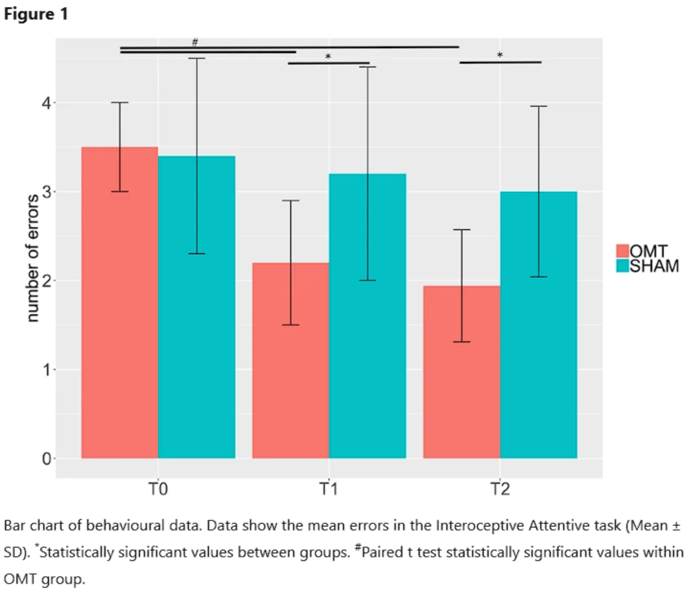

Suite à la parution du billet de blog
[«Science et ostéopathie: Que reste-t-il à un ostéopathe EBP ?»]()
de nombreux partages et échanges ont eu lieu. Parmi ces échanges,
Joseph KALLEL souhaitait apporter une critique argumentée du billet de blog.

Dans une démarche sincère, Anthony HALIMI, l’auteur du premier billet de blog
et Joseph ont repris chacune des critiques autour des différents thèmes.
Une partie des échanges s’est faite à l’écrit, une autre par conversations
téléphoniques durant plusieurs heures. Les échanges entre les deux
protagonistes sont répertoriés en annexe et lorsqu’un consensus a pu être
atteint entre les deux auteurs, celui-ci est indiqué. Une absence de
consensus se traduit par la présence des deux avis divergents rapportés ici.

<!--more-->
## Le rôle essentiel sur le triage
**Consensus**
C’est vrai que ce n’est pas spécifique, mais matériellement les ostéopathes
sont très bien placés : accès rapide, durée de séance de 30 minutes à 1 heure.

## Modèle biomécanique remis en cause
**Consensus**
- L'approche biomédicale est différente de l'approche biopsychosociale
- Il est nécessaire d'adapter notre approche à chaque individu
- Différence entre pathologie organique et pathologie fonctionnelle

**Divergences**
### Avis Anthony:
- La biologie joue très probablement dans les douleurs, qu’il faut
  distinguer de la biomécanique. Mais au vu de tous les éléments
  cités sur la non-spécificité de la TM (*Thérapie Manuelle*),
  l’ensemble de la littérature qui montre que sur une population
  générale de patients ayant des lombalgies persistantes, faire des
  exercices de marche aérobique ont des effets similaires à des
  exercices ciblés sur le dos, les études ne trouvant pas spécialement
  de corrélation entre dureté des muscles et douleurs/invalidité,
  entre mobilité et douleur, les études qui trouvent des effets de
  médiation des facteurs psychologiques sur la douleur… Le plus sage,
  s’il y a compétition entre faire une manipulation ciblée sur la structure,
  et une manipulation ciblée sur la psychologie, reste de cibler la psychologie.

- Il est possible que dans quelques cas la biomécanique soit très importante:
  exemple spondylolisthésis avec fluage radiculaire qui déclenche des
  douleurs neuropathiques cohérentes. Mais dans la plupart de ces cas, ce
  n’est pas la thérapie manuelle qui pourra changer les choses, les effets
  biomécaniques étant très transitoires. Il peut rester encore quelques situations
  où cela est pertinent, comme par exemple une zone mécano-sensible à cause
  de cytokines pro-inflammatoires enchassées, dont la proportion est diminuée
  par la contrainte mécanique. Mais ces situations, si elles existent,
  restent probablement, soit très rares, soit très mal identifiées en clinique.

- Les impacts des contraintes mécaniques sur la nociception sont très mal
  identifiées. Il est assez rare de voir que la contrainte mécanique déclenche
  de la nociception sauf sous état de sensibilité (inflammation par exemple).
  Une restriction de mobilité des fascias par exemple n’aura probablement que
  peu d’impact sur la nociception.

### Avis Joseph
- Pouvons-nous avoir un impact biomécanique à travers notre approche manuelle ?
  On a pu identifier qu’une donnée mécanique perçue palpatoirement correspondrait
  à un facteur de risque d’otite moyenne aigue chez l’enfant[^1],
  que l’on pouvait avoir un impact sur les tissus à travers les techniques
  fasciales[^2] ou encore sur le fascia thoraco lombaire et la raideur des
  muscles érecteurs du rachis[^3]. La biomécanique dans la prise en charge est
  évidemment moins importante que ce que l’on a pu penser pendant des années mais
  est-elle vraiment nulle ? Lorsque l’on pose notre main sur un patient il y a
  une information mécanique qui provoquera une réaction mécanochimique permettant
  de modifier le comportement et les informations de la zone touchée.
- Cet impact biomécanique est-il pertinent dans la prise en charge de la douleur ?
  Il est important selon moi, et moins selon Anthony. Par exemple, plus un cas
  est aigü, plus les facteurs tissulaires seront importants, on peut supposer
  que l’impact spécifique sera donc plus important dans ces cas-là que dans un cas chronique.
- Je suis globalement d’accord sur l’impact prédominant des facteurs psycho-sociaux
  sur les douleurs dans le cadre de la prise en charge mais selon moi il n’y a
  pas compétition.

[^1]: Morin C, Dorion D, Moutquin JM, Levasseur M. Suture restriction of
      the temporal bone as a risk factor for acute otitis media in children:
      cohort study. BMC Pediatr. 2012 Nov 20;12:181.
      doi: 10.1186/1471-2431-12-181. PMID: 23167940; PMCID: PMC3529688 :
      https://bmcpediatr.biomedcentral.com/articles/10.1186/1471-2431-12-181

[^2]: Ducoux B, Dever-Normand A, Normand V, Pizon M. Étude endoscopique in
      vivo de l’effet des techniques ostéopathiques fasciales sur les
      tissus sous-cutanés et la matrice extracellulaire. Rev Osteopath.
      2018;20:25-34 :
      https://www.osteopathie.org/documents.php?url=2018-article-l-osteopathie-sous-la-peau_1855.pdf

[^3]: Karine Devantéry sur les effets de techniques myofasciale : Devantéry K,
      Morin M, Grimard J, Gaudreault N. Effects of a Myofascial Technique on
      the Stiffness and Thickness of the Thoracolumbar Fascia and Lumbar
      Erector Spinae Muscles in Adults with Chronic Low Back Pain: A Randomized
      before-and-after Experimental Study. Bioengineering (Basel). 2023 Mar
      6;10(3):332. doi: 10.3390/bioengineering10030332. PMID: 36978723;
      PMCID: PMC10045407 : https://www.mdpi.com/2306-5354/10/3/332

## Échanges supplémentaires

### Fiabilité de la palpation
**Absence de consensus**

#### Avis Joseph
Concernant l’étude de *Nolet et al*[^7] il y a une recherche sur des points
douloureux, c’est intéressant mais il n’est pas en lien avec une
palpation ostéopathique. Une perception manuelle n’est pas forcément corrélée
avec une zone douloureuse et non plus inversement.

Le toucher ostéopathique prend en compte un grand nombre d’informations qui,
« captées par les différents sens de l'ostéopathe sont traitées et
interprétées dans son cerveau, en tenant compte des connaissances
anatomiques, physiologiques et pathologiques permanentes, des modèles de
soins ostéopathiques, et de l'expérience clinique personnelle de l’ostéopathe »
*Esteves JE et al*[^4]. Le toucher ostéopathique est une synergie des sens
permettant un contact empathique et perceptif de ce qui se passe chez le
patient. L’analyse de *Heche et al.*[^5] sur le sujet me semble pertinente.

Pour obtenir une meilleure fiabilité il est nécessaire de permettre au
thérapeute d’exprimer son niveau de confiance dans son diagnostic; de réduire
les risques de modifier les propriétés tissulaires en évitant les tests
mécaniques trop appuyés; de favoriser une position en décubitus dorsal pour
le patient afin d’éviter les modifications de tension dues à une position
changeante; la posture interne de l’ostéopathe doit être relâchée, réduisant
ainsi les interférences entre ses propres tensions physiques et celles perçues
chez son patient; de s’éloigner progressivement d’une approche purement
mécanique ou de repérage de structure anatomique afin d’évaluer le mouvement
global d’une zone; une standardisation de la palpation; un entrainement
préalable pour établir un consensus.

L’étude de *Vismara et al*[^6][^7] montre une fiabilité lors de l’établissement
d’un consensus palpatoire préalable, et qui s’éloigne d’une approche purement
articulaire mécanique. Il est question d’apprécier la zone dans son ensemble et
pas une partie seulement. Nous sommes d’accord sur le possible biais d’allégeance
ici car c'est la première étude à notre connaissance qui évalue la fiabilité
palpatoire en utilisant ce modèle depuis sa proposition en 2020.

Par-dessus ça, je pense que l’on peut obtenir une cohérence interne (intra-examinateur)
pour évaluer l’évolution lors de la séance.

**Sources additionnelles**
- Cooperstein R, Young M. The reliability of spinal motion palpation
  determination of the location of the stiffest spinal site is influenced
  by confidence rangs : a secondary analysis of three studies. Chiropr Amp
  Man Ther. 2016;24(1). doi:10.1186/s12998-016- 0131-x

[^4]: Esteves JE, Spence C. Developing competence in diagnostic palpation:
      Perspectives from neuroscience and education. Int J Osteopath Med.
      2014;17(1):52-60. doi:10.1016/j.ijosm.2013.07.001

[^5]: Hêche M, Zegarra-Parodi R, Kipfer S. Exploration des modèles
      ostéopathiques utilisés pour interpréter les perceptions lors d’un test
      palpatoire fascial, viscéral ou crânien – une étude qualitative.
      Mains Libres. 2022;(2):75-84. doi:10.55498/mainslibres.2022.10.2.75

[^6]: Vismara L, Bergna A, Tarantino AG et al. Reliability and Validity of the
      Variability Model Testing Procedure for Somatic Dysfunction Assessment:
      A Comparison with Gait Analysis Parameters in Healthy Subjects.
      Healthcare. 2024;12(2):175. doi:10.3390/healthcare12020175

[^7]: Bergna A, Vismara L, Parravicini G, Dal Farra F. A new perspective for
      Somatic Dysfunction in Osteopathy: the Variability Model. J Bodyw Mov
      Ther. 2020 Jul;24(3):181-189. doi: 10.1016/j.jbmt.2020.03.008. Epub
      2020 Mar 15. PMID: 32825986.

#### Avis Anthony
La palpation dans des conditions expérimentales peine à être reproductible
hormis pour la palpation recherchant à reproduire la douleur des patients,
et encore celle-ci n’est pas systématiquement reproductible. C’est par exemple
ce qui a été retrouvé pour les évaluations palpatoires du rachis lombaire dans
l'étude de *Nolet et al*[^8].

L’expérience influence peut-être la performance d'après *Lavazza et al.*[^9],
mais à l’heure actuelle, étant donné que la plupart des études sur la
palpation peinent à trouver une fiabilité, et quand c’est évalué, encore moins
de validité, peut-être que s’orienter sur la base du ressenti palpatoire n’est
pas la manière la plus optimale.

Les attentes influencent totalement notre évaluation des tests. Et pas que
sur des ressentis, même des choses qui paraissent « objectives » comme la
mesure d’un angle articulaire avec un goniomètre qui variait de 11°
d’amplitude dans l'étude de *Rotem-Lehrer et al*[^10].

Pourquoi ne pas le faire au cas où ? Peut-être simplement que la palpation
elle-même peut induire des attentes ou des croyances de peur-évitement. On sait
que sans rien dire, en Belgique, les patients qui entendent un bruit articulaire
pensent que leur vertèbre est remise en place d'après *Demoulin et al.*[^11].
Palper peut induire la croyance chez la personne qu’ils ont mal
parce que leurs vertèbres sont bloquées, leurs muscles sont trop tendus,…

Si cela n’apporte pas d’information fiable, en tout cas, pas que l’on sache
actuellement, autant s’abstenir, sauf attentes particulières des patients.

[^8]: Nolet, P. S., Yu, H., Côté, P., Meyer, A.-L., Kristman, V. L., Sutton, D.,
      Murnaghan, K., & Lemeunier, N. (2021). Reliability and validity of manual
      palpation for the assessment of patients with low back pain: a systematic
      and critical review. Chiropractic & Manual Therapies, 29(1).
      https://doi.org/10.1186/s12998-021-00384-3

[^9]: Lavazza, C., Milano, V., Abenavoli, A., & Maggiani, A. (2018). How type
      and number of training sessions influence the reliability of palpation.
      Journal of Bodywork and Movement Therapies, 22(2), 396–401.
      http://dx.doi.org/10.1016/j.jbmt.2017.07.012

[^10]: Rotem-Lehrer, N., Singer, N., Reshit, O., & Springer, S. (2016). Measuring
       Up to Expectation: Cognitive Bias in Wrist Range-of-Motion Measurement.
       The Journal of Orthopaedic and Sports Physical Therapy, 46(12), 1037–1041.
       http://dx.doi.org/10.2519/jospt.2016.6845

[^11]: Demoulin, C., Baeri, D., Toussaint, G., Cagnie, B., Beernaert, A., Kaux,
       J. F., & Vanderthommen, M. (2017). Beliefs in the population about
       cracking sounds produced during spinal manipulation. Joint, Bone, Spine:
       Revue Du Rhumatisme. https://doi.org/10.1016/j.jbspin.2017.04.006

### Specificité de la thérapie manuelle
**Échanges**


Ici aussi ça mériterait un peu de nuance. Même si elle n’est pas
aussi complexe que l’on pourrait croire, affirmer qu’elles sont toutes
interchangeables me semble précipité.

Une analyse des études utilisés sur leur contexte, les limites énoncées et
la population étudiée serait nécessaire. Je n’ai pas creusé suffisamment le
sujet mais je me garde de conclure aussi durement.



En ce qui me concerne, j’ai beaucoup étudié le sujet, discuté avec
des chercheurs,… Ca ne me semble pas exagéré de dire ça **aujourd'hui**.
Évidemment, peut-être que dans 15 ans on trouvera des TM (*Thérapies Manuelles*)
spécifiques si on a des cliniques spécifiques, mais ça on le saura pas dans nos
cabinets, il faudra attendre que de la recherche valide. En attendant, je maintiens ce que j’ai dit.



Pour reprendre ton exemple de Bialosky, il fait référence à deux études
évaluant l’amélioration de cervicalgies à la suite de manipulations
thoraciques ainsi que l’amélioration de douleur de coude à la suite de
manipulation cervicales. Aux vues de la proximité (dorsales – cervicales)
et de leur rapport biomécanique (dans une certaine mesure) et du lien
neurologique existant (cervicales-coude) les résultats ne m’étonnent pas
et ne me font pas conclure à un mode d’action uniquement non spécifique.
J’imagine qu’il en existe d’autres mais c’est celle que je relève ici
et qui sont dans l’étude que tu m’as proposée.

Pour l’étude LC-ostéo elle a évalué l’impact des techniques manuelles
seules sur la lombalgie chronique. Les résultats montrent d’une part un
effet significatif différent pour le groupe OMT comparé au sham, il y a
donc une partie spécifique aux techniques selon ces résultats + une
absence de pertinence clinique : les effets spécifiques de l’approche
manuelle ne sont donc pas les facteurs les plus efficaces sur une prise
en charge de lombalgie chronique. Est-ce étonnant lorsqu’on sait que les
risques de passage à la chronicité sont des facteurs psycho-sociaux ? Pas selon moi.

Cerritelli et al. a évalué l’effet du toucher lorsque le thérapeute a
son attention porté sur le patient, lui-même sous IRM. Ils ont trouvé un effet
significatif, l’attention de l’opérateur a un impact spécifique sur la réponse
du patient : “In other words, the present results showed that, if a
particular cognitive status of the operator is sustained over time, it is
able to elicit significant effects in the subjects’ functional connectivity
between areas processing the interoceptive and attentional value of touch”.

Il y a ici aussi un effet spécifique relevé (qui fait le lien avec l’intéroception en fin de texte).

Référence:
: Cerritelli F, Chiacchiaretta P, Gambi F, Ferretti A. Effect of Continuous
  Touch on Brain Functional Connectivity Is Modified by the Operator's
  Tactile Attention. Front Hum Neurosci. 2017 Jul 20;11:368.
  doi: 10.3389/fnhum.2017.00368. PMID: 28775685; PMCID: PMC5517483


**Consensus et divergences**

Nous sommes en consensus pour dire qu’il n’y a probablement pas d’importance
d’être **spécifique** dans les manipulations (T3 ou L2 par exemple) pour les
lombalgies et cervicalgies chroniques et aigues pour améliorer l’intensité
des douleurs des patients[^12]. Manquant d’étude ou la fonction était
“outcome primaire”, Joseph a un doute sur l’amélioration de la fonction.

Ici, spécifique veut dire que les effets dépassent les attentes du patient.
Manipuler L2 donnera un meilleur résultat pour une lombalgie par exemple
car ça fera plus sens pour le patient. Le résultat étant attribué à l’attente
et non spécifiquement au choix de la vertèbre manipulée.

C’est très probable vu les études sur les lombalgies aigües et chroniques
et les cervicalgies chroniques ne trouvant pas d’effets **cliniquement**
significatifs sur les facteurs sus-visés.

Précision selon Joseph: un second doute subsiste pour questionner une
comparaison en sous-groupe selon le type de plainte. L’hypothèse étant
que l’efficacité d’une technique (manipulation, mobilisation, massage,
déroulé myofascial) peut varier considérablement en fonction du motif.
Ex : les deux études dysménorrhée primaire incluses dans *Molina-Álvarez et
al 2022*[^13], pour les otites, la plagiocéphalie et d’autres.

D’autant plus que l’on manque d’études sur les techniques dites
“tissulaires” utilisées en ostéopathie.

Anthony interprète l’étude de *Morin 2012*, au vu de la plausibilité scientifique
de l’affirmation (liée à la cohérence externe de l’étude), comme étant plus
probablement dans les quelques pourcents de la recherche trouvant des résultats
liés au hasard plutôt que d’une vraie spécificité, de même pour la dysménorrhée primaire.

Les seules règles qu’on puisse tirer à l’heure actuelle pour les pathologies
musculosquelettiques seraient donc: mettre ses mains sur le patient, bouger ou
faire semblant de bouger, et d’aller vite, et éventuellement de porter son
attention sur ce qu’on fait si l’on considère l’étude de *Cerritelli 2019* n’ayant
pas évalué l’impact sur la douleur.

[^12]: Nim, C. G., Downie, A., O’Neill, S., Kawchuk, G. N., Perle, S. M.,
       & Leboeuf-Yde, C. (2021). The importance of selecting the correct site to
       apply spinal manipulation when treating spinal pain: Myth or reality?
       A systematic review. Scientific Reports, 11(1), 1–13.
       http://dx.doi.org/10.1038/s41598-021-02882-z

[^13]: Molina-Álvarez, M., Arribas-Romano, A., Rodríguez-Rivera, C., García,
       M. M., Fernández-Carnero, J., Armijo-Olivo, S., & Goicoechea Garcia,
       C. (2022). Manual therapy effect in placebo-controlled trials: A
       systematic review and meta-analysis. International Journal of Environmental
       Research and Public Health, 19(21), 14021. http://dx.doi.org/10.3390/ijerph192114021

### L’approche émotionnelle en ostéopathie
**Divergences**

#### Avis Joseph
La plainte du patient émerge au sein d’un contexte qui englobe également la
dimension émotionnelle. À travers l’échange, l’écoute empathique, et le
toucher prolongé, le patient peut se recentrer sur ce qu’il éprouve et
prendre conscience de certaines sensations ou émotions auparavant masquées.
En s’autorisant à sentir et verbaliser, le patient peut libérer des tensions
dans l’instant et/ou prendre conscience de la nécessité d’un travail complémentaire.

L’intéroception c’est la capacité de percevoir les informations physiologiques
de notre corps. C’est le processus par lequel l’organisme sent, interprète,
et intègre les informations provenant de l’intérieur du corps. Cela permet de
déclencher une réponse physiologique adaptée pour maintenir l’homéostasie[^14].
Ces réponses jouent un rôle dans la régulation des émotions, dans la prise de
décision, dans la régulation de la douleur, de la faim, du sommeil etc...
Ça mérite donc de s’y intéresser tant cela peut avoir un impact sur la
demande du patient.

L’applicabilité à l’ostéopathie tend à être corrélée par d’autres études:
Ceritelli F. et al.[^15], Ceritelli F. et al.[^16], Cella M. et al.[^17].
Quant au paradigme de l’ostéopathie, il ne se résume pas à relâcher des fascias
ou à faire bouger des structures mais à aider une personne à travers une
approche manuelle. Le toucher prolongé tel qu’il est utilisé lors des techniques
“tissulaires” me semble plutôt bien intégré dans le modèle de pensée
ostéopathique. L’autorégulation du corps, donc un rôle de l’intéroception,
l’est également.

La question du champ de compétence et de la limite à ne pas dépasser se
posent. D’où l’intérêt d’une régulation nécessaire pour encadrer ces approches
utiles pour le patient, pour limiter les dérives et sécuriser les prises en
charge. Ce n’est pas l’ostéopathe qui lui impose quelque interprétation que
ce soit, c’est le patient qui s'oriente à travers son vécu. Le risque réside
surtout dans le forçage d’un thérapeute qui pousserait son patient à aller
plus loin et ferait des interprétations sauvages.

[^14]: Chen WG, Schloesser D, Arensdorf AM, Simmons JM, Cui C, Valentino R,
       Gnadt JW, Nielsen L, Hillaire-Clarke CS, Spruance V, Horowitz TS,
       Vallejo YF, Langevin HM. The Emerging Science of Interoception:
       Sensing, Integrating, Interpreting, and Regulating Signals within the Self.
       Trends Neurosci. 2021 Jan;44(1):3-16. doi: 10.1016/j.tins.2020.10.007.
       PMID: 33378655; PMCID: PMC7780231.

[^15]: Cerritelli F, Chiacchiaretta P, Gambi F, Ferretti A. Effect of Continuous
       Touch on Brain Functional Connectivity Is Modified by the Operator's
       Tactile Attention. Front Hum Neurosci. 2017 Jul 20;11:368. doi:
       10.3389/fnhum.2017.00368. PMID: 28775685; PMCID: PMC5517483.

[^16]: Cerritelli F, Chiacchiaretta P, Gambi F, Perrucci MG, Barassi G,
       Visciano C, Bellomo RG, Saggini R, Ferretti A. Effect of manual approaches
       with osteopathic modality on brain correlates of interoception: an fMRI
       study. Sci Rep. 2020 Feb 21;10(1):3214. doi:
       10.1038/s41598-020-60253-1. PMID: 32081945; PMCID: PMC7035282.

[^17]: Cella, Mattia, Acella, Eric, Aquino, Alessandro and Pisa, Viviana.
      "Cranial osteopathic techniques and electroencephalogram (EEG) alpha
      power: a controlled crossover trial" Journal of Osteopathic Medicine,
      vol. 122, no. 8, 2022, pp. 401-409. https://doi.org/10.1515/jom-2021-0257

#### Avis Anthony
L’impact de la thérapie manuelle sur les émotions pourrait être réel mais
plusieurs éléments doivent être pondérés avant qu’un ostéopathe EBP s’empare
de ce champ d’intervention. Nous allons séparer cela en 2 volets.

##### D’un point de vue pragmatique
Nous n’avons pas d’éléments concrets et solides de l’utilisation de
l’ostéopathie pour gérer les troubles du « Je ne me sens pas bien dans ma vie ».
En l’absence de tout élément, il convient d’orienter les patients avec le
mal-être vers des thérapies éprouvées menées par des thérapeutes qualifiés **en
premier lieu**.

Les ostéopathes n’ont pas les compétences d’identifier les différents
troubles psychiatriques pouvant se cacher parmi les patients en mal-être.
La règle première doit être de ne pas nuire. Un coach sportif pourra tout à
fait proposer de l’exercice thérapeutique à un patient ayant une lombalgie
pour l’aider à aller mieux. Mais dans les très rares cas où ce patient aurait
une lombalgie liée à une cause spécifique tel qu’un spondylodiscite, que le
coach n’est pas capable d’identifier, les conséquences pourrait être dramatiques.
De la même manière, même si les ostéopathes étaient en mesures de traiter
ces troubles émotionnels par de la thérapie ostéopathique, la sécurité ne
pourrait être assurée.

##### D’un point de vue théorique
L’intéroception est certainement intéressante pour bien des raisons. Mais il y
a plusieurs points intéressants à rappeler:

L’intéroception est trèèèèèèèès loin du paradigme actuel de l’ostéopathie. On
n’est pas en train d’essayer de libérer des fascias ou quoique ce soit, on
est en train de dire qu’après avoir manipulé des gens, ils sentent
(peut-être) mieux leur cœur battre.

Il ne faut pas trop s’emballer sur les résultats. Voilà à quoi ressemblent
les intervalles de confiance dans l’étude de Cerritelli 2020:

Peu de patients nous consultent parce qu’ils sont inquiets à l’idée de compter
leurs battements cardiaques. Il faut faire attention à ne pas trop extrapoler
des données de sciences fondamentales qui doivent encore faire leur chemin vers
la clinique avant d’être utilisables.

La plupart du temps, l’intensité de la douleur, la fonction et parfois l’interférence
de la douleur, sont au cœur des préoccupations de nos patients. Et des études ont
déjà évaluées les effets des thérapies manuelles, très similaires à celles de
Cerritelli sur ces paramètres (enfin, je crois, puisque ce qui y est fait est
mal rapporté).

Les protocoles ne décrivaient pas le discours donné aux personnes, difficile
de savoir s’il s’agissait d’un vrai effet de la thérapie manuelle ou d’un effet
lié aux suggestions de faire attention à leur corps.

## Réponse reçue de la part de M Zegarra-Parodi
M Rafael Zegarra-Parodi, ostéopathe et cofondateur de BMS
Formation, ainsi que chercheur affilié à l’AT Still Research
Institute à Kirksville aux États-Unis (profil ORCID: [https://orcid.org/0000-0002-2418-8592](https://orcid.org/0000-0002-2418-8592)),
nous a contactés pour fournir les précisions suivantes:

* Le principe ostéopathique d'unité Body-Mind-Spirit est un
  héritage culturel des autochtones amérindiens et a été
  réintroduit pour guider la prise en charge des patients
  lors de la dernière mise à jour des principes de l’ostéopathie aux États-Unis (Rogers et al., 2002).
* Toutefois, pour que ce principe soit utilisé de manière
  optimale et réponde aux valeurs et attentes des patients dans
  une approche Evidence-Based Practice (EBP) centrée sur la
  personne, une meilleure définition et compréhension sont
  nécessaires. Pour remédier à cela, Rafael est le premier
  auteur de 4 articles indexés et co-auteur de 3 autres articles
  indexés visant à enrichir la pratique ostéopathique. Ces
  articles mettent en lumière la manière dont le principe
  ostéopathique actuel de l’unité Body-Mind-Spirit soutient
  des approches EBP centrées sur la personne et culturellement sensibles.
* Cette approche vise à affiner le raisonnement clinique des
  ostéopathes et à maîtriser les compétences professionnelles
  spécifiques appréciées par nos patients, ne se limitant
  pas à un cadre épistémologique unique des thérapies
  manuelles confiné au « musculoskeletal care ».

**4 articles indexés publiés en tant que premier auteur**
1. Refining the biopsychosocial model for musculoskeletal practice by introducing religion and spirituality dimensions into the clinical scenario: https://www.sciencedirect.com/science/article/abs/pii/S1746068919300094
2. The Native American heritage of the body-mind-spirit paradigm in osteopathic principles and practices: https://www.sciencedirect.com/science/article/abs/pii/S1746068919300793
3. The legacy and implications of the body-mind-spirit osteopathic tenet: A discussion paper evaluating its clinical relevance in contemporary osteopathic care: https://www.sciencedirect.com/science/article/abs/pii/S1746068921000286
4. Historical Osteopathic Principles and Practices in Contemporary Care: An Anthropological Perspective to Foster Evidence-Informed and Culturally Sensitive Patient-Centered Care: A Commentary: https://www.mdpi.com/2227-9032/11/1/10

**3 articles publiés en tant que co-auteur**
1. Relevance of historical osteopathic principles and practices in contemporary care: Another perspective from traditional/complementary and alternative medicine: https://www.journalofosteopathicmedicine.com/article/S1746-0689(22)00023-2/fulltext
2. Exploration des modèles ostéopathiques utilisés pour interpréter les perceptions lors d’un test palpatoire fascial, viscéral ou crânien – une étude qualitative: https://www.mainslibres.ch/mains-libres/2022/mains-libres-2-22/exploration-des-modeles-osteopathiques-utilises-pour-interpreter-les-perceptions-lors-d-un-test-palpatoire-fascial-visceral-ou-cranien-une-etude-qualitative
3. The Revisions of the First Autobiography of AT Still, the Founder of Osteopathy, as a Step towards Integration in the American Healthcare System: A Comparative and Historiographic Review: https://www.mdpi.com/2227-9032/12/2/130

Pour celles et ceux qui ne maîtrisent pas l'anglais, une version
traduite en français sous forme d’e-book de l'article publié en
décembre 2023 dans la revue
[scientifique Healthcare est disponible ici](https://doi.org/10.3390%2Fhealthcare11010010).
Cet article propose une approche issue de l’anthropologie médicale
pour décrire les principes de l’ostéopathie. Le cadre conceptuel
Cynefin y est présenté comme un outil pour la prise de décision
clinique, permettant une approche centrée sur la personne et
intégrant diverses approches ostéopathiques qui ne se
limitent pas au « musculoskeletal care ».

Une vidéo est également disponible, qui résume l'article et
sous-titrée en français:
[https://www.youtube.com/watch?v=S5XXoar6DUE](https://www.youtube.com/watch?v=S5XXoar6DUE).

## Le mot de la fin
Cet article fait suite à un échange entre deux personnes, Anthony et Joseph,
les arguments avancés sont basés sur leurs réflexions et les études à leur
connaissance. En tant que lecteurs et professionnels, vous êtes encouragés à
considérer cet échange comme un point de départ pour votre propre exploration
et réflexion critique.

Vous pouvez écouter le dernier podcast de
[Kookie learning](https://kookielearning.com/) par
Marco GABUTTI ([@marco_gabutti](https://www.instagram.com/marco_gabutti/))
“Plaidoyer pour une manualité moderne” avec David FERREIRA
([@structuralosteo](https://www.instagram.com/structuralosteo/)) ainsi
que l'épisode de
[Soignant-Soigné par Baptiste Blanchard avec Antoine COULY](https://podcast.ausha.co/soignants-soignes/n013-antoine-coulis-alias-cerveau-muscle-le-modele-bio-psychosocial-un-eclaircissement-necessaire)
([@cerveaumuscle](https://www.instagram.com/cerveaumuscle)) qui aborde
quelques-uns des sujets évoqués dans l’article.

Un podcast entre Anthony HALIMI et Marco GABUTTI est en cours de préparation
sur l’abord spécifique et mécanique en thérapie manuelle.

## Annexes
### Discussions écrites sur le rôle de triage

Ce n’est pas le propre de l’ostéopathie, c’est une nécessité pour toute
profession de première intention.



Ce qui est propre aux ostéopathes ici c’est un agenda accessible
virtuellement sans délai qui renforce de beaucoup le besoin et
l’utilité de compétences claires en triage.



Ok pour ça.


### Discussions écrites sur l’impact de la biomécanique

Je plaide personnellement pour que l’on garde cet aspect biomécanique
qui a son importance s'il est intégré dans le raisonnement triptique BPS.



Ce n’est pas le modèle BPS qui met à l’écart la biomécanique, ce sont
les études sur la biomécanique. Il existe un consensus scientifique
aujourd’hui qui pointe vers une absence d’effets spécifiques de la
thérapie manuelle cliniquement significatifs. Ce n’est pas une interprétation
hasardeuse. Le mécanisme d’action non mécanique, c’était déjà la conclusion
de la revue de Bialosky de 2009 (il y a 15 ans !), et la majorité des
études parues depuis ne font que renforcer cette conclusion.
LC-Ostéo est un exemple parmi un grand nombre d’études.



Mon erreur. C’est “biologique” pas biomécanique dans le modèle
bio-psycho-social (BPS), il y a confusion de ma part. Pour la partie
biomécanique je réponds dans la partie sur “l'ostéopathie structurelle”.


#### Échanges supplémentaires

Les travaux de Chantal Morin sur l’évaluation temporale comme facteur
de risque de l’otite moyenne aigüe chez l’enfant en est un exemple. Je trouve
là dedans le concept de l’ostéopathie structurelle (structural osteo le
defend pas mal) remet l’importance de la structure dans le raisonnement clinique.



Est-ce que tu saurais dire quel est son argumentaire, son nom n’étant pas un
argument en soit ?

Autre point: dire on dit « Bio », « Psycho », « Social » donc il faut mettre
de la biomécanique, ça n’a pas plus de sens que de dire que comme je suis
**masseur**-kinésithérapeute, je dois masser.

Le modèle BPS a à l’origine été décrit pour qu’on comprenne que la maladie
s’inscrit dans ces 3 dimensions donc pas pour séparer les actions en 3
entités distinctes. Mais il est vrai qu’Engel s’en est aussi servi de cadre
(ou modèle d’implémentation, en plus d’être un modèle théorique).

Dans le sens de cadre, si tu veux l’utiliser comme cela, il faut rappeler
que la neurophysiologie et les neurotransmetteurs, c’est aussi du **bio**.



L’idée de ma réponse étant de susciter la réflexion et pas d’apporter des
réponses définitives, j’ai mentionné [@structuralosteo](https://www.instagram.com/structuralosteo/)
car c’est une source d’information facile d’accès et qui peut aider à se faire une idée.

L’aspect biomécanique peut être défendu par l’idée que chaque structure
a une capacité de déformabilité. Une structure moins déformable sera plus
raide qu’une structure plus déformable, qui elle sera moins raide.
Donc plus une structure est raide plus il y a besoin de force pour la déformer.
Par exemple lors de la course il y a une déformation du tibia d’environ
1mm dans sa hauteur vers le haut et vers le bas, lors de la mastication il y
a aussi une déformation du crâne sous l’effet de la contraction des muscles
masticateurs, etc... Moins une structure est raide, plus elle est capable
d’absorber les forces qui lui sont imposées (parce que plus facilement déformable).
L’aspect biomécanique ici serait qu’en travaillant sur cette capacité de
déformabilité des structures, on augmenterait leur potentiel d’absorption de force,
diminuant ainsi les contraintes. Reprenons l’exemple du tibia: avec une raideur
moins élevée il absorbera plus facilement les forces et lors de la course
les contraintes exercées sur le genou seront moins importantes. Ça pourrait
être pertinent pour une consultation de gonalgie. C’est théorique et le bénéfice
post manipulation n’est pas évalué, mais c’est une théorie qui ne me semble pas
déconnectée des données disponibles. J’insiste tout de même sur une chose: l'exemple
est là pour illustrer mon propos. Selon moi une raideur isolée du tibia n’a que
peu de chance de créer des problèmes mais l’ajout de plusieurs facteurs dont
celui-ci oui.

Un autre point pour appuyer cette théorie sur la biomécanique c’est l’anatomie
et la physiologie. Les travaux du Professeur Guimberteau montrent la
continuité tissulaire de la surface de la peau jusqu’à l’os. Il remet même en
question le terme de “tissus conjonctif” pour l’appeler “tissu constitutif”.
Des essais in vivo de “déroulé tissulaire” lors de chirurgie du coude ont
montré un effet sur la structure tissulaire par endoscopie (comparé à rien,
du light touch et des massages). Je me garde bien de conclure que l’effet
montré ici est responsable de l’efficacité clinique de ces techniques mais
je suis convaincu que c’est un facteur parmi tous les autres qui entre en jeu.
Un des rôles du fascia est également d’absorber les forces et il y a un lien
entre son épaississement et la diminution de flexibilité des articulations.
Un effet dessus peut donc être intéressant et ça semble être possible.
Pour revenir sur la capacité d’absorption de force et l’exemple de la gonalgie
et du tibia ajoutant une vision tissulaire au raisonnement cela ne me
semble pas non plus être une théorie déconnectée des données disponibles.
L’impact manuel sur les tissus me semble assez clair, l’impact de la
modification tissulaire sur la clinique l’est moins, c’est théorique.

Je ne suis malheureusement pas un expert mais un jeune ostéopathe qui commence
à peine à entrer dans le monde pro. Un échange plus fertile pourrait avoir
lieu en discutant avec des ostéopathes plus compétents parce que je serai
limité en termes de méthodologie et d’analyse d’articles. Quoique de la
compréhension que j’en ai je ne pense pas être trop loin des interprétations
que l’on peut en tirer. (Je reviendrai sur LC osteo pour la spécificité de la
manipulation plus bas). Pour ce modèle Marco Gabutti, Chantal Morin ou le
professeur Guimberteau par exemple. Plus il y aura d’échange entre des
gens voulant tirer au clair toutes ces informations, plus on arrivera à se
comprendre.


### Discussions écrites sur la fiabilité de la palpation

Pour voir plus large dans la littérature on observe quand même une
tendance qui augmente la fiabilité à travers un entrainement pour créer
un consensus palpatoire.

Ce sujet est selon moi mal traité et mal compris.



On peut différer dans l’interprétation, mais être sûr de qui est la
personne qui comprend mal, s’il y en a une, c’est difficile.

La fiabilité de la palpation est effectivement dans les choux, sur plein
d’éléments, je peux vraiment te sortir une très grande liste d’études
trouvant une mauvaise fiabilité. Ça va me prendre du temps vu la longueur
de la liste et donc du coup je préfèrerais le faire seulement si tu
es sûr de toi sur la fiabilité de la palpation dans la littérature.



Je ne remets pas en question l’existence de beaucoup de sources
remettant en cause la fiabilité de la palpation, je remets en question
l’application clinique et les conclusions que l’on peut en tirer. Je peux
t’envoyer le papier que j’ai écrit à ce sujet, il est toujours en processus
de peer reviewing mais un retour de plus est toujours le bienvenu.
Mais je vais résumer mon raisonnement sous le prochain paragraphe.



On peut émettre des hypothèses *ad hoc* pour expliquer pourquoi ce n’est
pas fiable et j’accepte l’idée du manque d’entraînement, mais dans ce cas
là il faut un critère précis de à partir de combien d’entraînement c’est
censé être bon et que celui-ci soit déterminé a priori avant de faire une
revue systématique de la littérature et pas tiré a posteriori. Dans tous les
cas je te propose qu’on prenne l’exemple de la palpation de la mobilité spinale.

Wong en 2017 a proposé d’améliorer les stratégies palpatoires avec un
protocole bien plus précis mais faut bien voir les contraintes du protocole,
encore pour vraiment améliorer la fiabilité il proposait d’utiliser des
outils mécaniques.



J’entends l’utilisation d’outils mécaniques pour évaluer la
mobilité, cependant l’idée est de voir comment améliorer la validité de la
palpation et il me semble incorporer l’outils mécanique.
Il semble conclure que l’évaluation manuelle n’apportera pas de
fiabilité très élevée, mais on peut en discuter. Je propose en dessous
quelques points qui selon moi aideraient pour les protocoles. J’ai pour
ambition d’en réaliser un dans les années à venir.



La fiabilité ce n’est que l’agrément entre les examinateurs. Si je
t’entraine assez longtemps avec une autre personne je peux m’arranger pour
que vous disiez la même chose sans pour autant que ce soit vrai. Si j’arrive
à vous entrainer à repérer un vin rouge ou vin blanc au goût, je pense
que j’arriverai à faire en sorte que vous internalisiez un certain
nombre d’indices vous permettant de trouver la réponse attendue,
indépendamment de la couleur du vin.

C’est très bien exemplifié par l’étude de Landel en 2008, où 2 praticiens
entraînés avec le même modèle (Maitland) tombent plutôt d’accord sur l’endroit
le plus mobile et pourtant ça correspond pas du tout à ce qu’on peut voir en IRM.

Références:
: Wong, A. Y. L., & Kawchuk, G. N. (2017). The Clinical Value of
  Assessing Lumbar Posteroanterior Segmental Stiffness: A Narrative
  Review of Manual and Instrumented Methods. PM and R, 9(8), 816–830.

: Landel, R., Kulig, K., Fredericson, M., Li, B., & Powers, C. M. (2008).
  Intertester reliability and validity of motion assessments during
  lumbar spine accessory motion testing. Physical Therapy, 88(1), 43–49.



Justement, un des problèmes dans ces évaluations est que l’on évalue
la “mobilité” spinale. On part d'un modèle qui postule que la capacité
de mouvement évaluée est articulaire. En posant ses mains sur la zone
lombaire on touche de la peau jusqu’à l’os, il n’y a aucune séparation entre
les tissus: penser que l’on évalue uniquement l’articulation ne fait pas sens
selon moi. Les informations récupérées par l’opérateur seront sur la zone
pas sur une structure précise (pas à ma connaissance). Ici l'IRM ne mesure
qu’une seule chose. Dans les limites de l’étude de Landel c’est d’ailleurs
reconnu: il est proposé que les opérateurs évaluent la mobilité à travers
la résistance des tissus. Je pense que c’est encore réducteur: leurs
perceptions sont basées sur un mélange de toutes ces informations.

Pour ce qui est de l’entrainement sur le vin c’est positif justement. Si on arrive
à créer un référentiel interne pour évaluer le patient, le thérapeute au
sein de sa consultation et de son référentiel pourra évaluer l’évolution.
Un second thérapeute pourra avoir un référentiel interne différent mais
évoluera toujours dans le sien et évaluera son patient en début et en fin de
la même manière.

Il existe d'autres limites dans les études évaluant la palpation :
- Pas de possibilité d’échelonner la perception (absent/léger/moyen/modéré/intense...).
  On a établi une meilleure fiabilité corrélée au dégrée de confiance du thérapeute.
- La répétition des tests peut avoir un effet correcteur (dans l’étude de Landel
  ce n’est pas le cas et ils le relèvent)
- L’état de tension du patient (en position assise par exemple il peut avoir un
  degré de relâchement plus ou moins important modifiant les perceptions des
  opérateurs). Chang et al 2021 le prend en note dans ses limites.
- Rechercher des informations plus larges que ce que le modèle pense que l’on évalue
- Une comparaison avec des outils d’imagerie pas corrélés: parce que l’on pense
  évaluer quelque chose de précis alors que c’est bien plus large
- Une absence de consensus palpatoire pour établir ce cadre.
- Les tension interne du thérapeute. En fonction du type de palpation évalué
  la tension du thérapeute pourra jouer sur ses perceptions. Par exemple: si
  tu touches une surface en contractant ton épaule droite ta perception ne sera
  pas la même entre ta main droite et gauche.
- Chercher un lien entre l’information palpatoire et la douleur. Une perception
  sous la main n’est pas forcément liée à une douleur et l’inverse non plus.
  Quoique de ce que j’en comprend cette donnée est tout de même celle considéré
  comme la plus fiable selon les études.

Ce sont pour moi des limites à éliminer pour se rapprocher de la compréhension clinique.

La dernière étude de Vismara et al. (2024) sur le sujet prend en compte ces limites.
On n’est plus sur des flexion ou inclinaison de vertèbre mais on est sur la
perception de l’état tissulaire d’une zone.

Références:
: Vismara L, Bergna A, Tarantino AG et al. Reliability and Validity of the
  Variability Model Testing Procedure for Somatic Dysfunction Assessment:
  A Comparison with Gait Analysis Parameters in Healthy Subjects. Healthcare.
  2024;12(2):175. doi:10.3390/healthcare12020175

La palpation fait intervenir plusieurs sens et non seulement le toucher
extéroceptif. C’est une combinaison de sens. Cette analyse me semble extrêmement
approprié sur le sujet: Hêche M, Zegarra-Parodi R, Kipfer S.
Exploration des modèles ostéopathiques utilisés pour interpréter les
perceptions lors d’un test palpatoire fascial, viscéral ou crânien – une étude qualitative. Mains Libres. 2022;(2):75-84. doi:10.55498/mainslibres.2022.10.2.75


### Discussions sur l’approche émotionnelle en ostéopathie

Pour commencer mettre dans le même panier « méditation pleine conscience »
et « techniques énergétique » c’est délaisser toutes les recherches des
dernières années sur la méditation et son effet sur l’intéroception, le
bien-être émotionnel et la plasticité cérébrale.

De plus à travers le toucher, l’ostéopatie trouve certainement une
spécificité ici de par la compréhension de l’intéroception en neurosciences.
Les travaux de BMS (ndlr: Body Mind Spirit, voir R. Zegarra-Parodi) sur le sujet
sont passionnants.



Pour clarifier, bien que je reconnaisse la fragilité des études sur la
méditation, je ne la mets pas du tout au même niveau que l’énergétique. J’ai
posé un cadre précis, la méditation ne doit pas être utilisée hors du champ
de pratique de l’ostéopathie. Il est hors de question de faire de la MBCT
(Mindfulness-Based Cognitive Therapy) pour de la dépression ou du MBSR
(Mindfulness Based Stress Reduction) pour de l’anxiété. Ce sont des pathologies
qui doivent être gérées par des professionnels qualifiés, ce n’est ni les
ostéopathes, ni les kinés, ni les médecins généralistes ... Des psychiatres
et psychologues doivent, selon moi, pratiquer ce genre de thérapies qui sont
dans leur champ d’intervention.



Je me permets de clarifier également, je ne parle pas de prendre en charge
un patient pour de la dépression ou de l’anxiété hors du cadre d’un suivi
en psychothérapie. Tout ce dont je parle fait partie du parcours de soin
du patient et je pense que l’on a toute notre place dans ce dit parcours.
De plus sur notre approche il n’est pas non plus question de faire de thérapie
cognitivo-comportementale, je parle d’outils manuels qui ne sont pas utilisés
par les psychologues et les psychiatres. J’entends le risque de dérive.
Cependant on sait grâce aux données disponibles qu’il y a un intérêt à
travailler dessus via le toucher l’intéroception, et cela s’inscrit parfaitement
dans le modelé BPS ou BMS (Body Mind Spirit) (principe ostéopathique 2002).

On peut choisir de ne pas l’utiliser pour risque de dérives et donc
laisser cet outil aux professionnels non règlementés (quid des dérives chez eux ?)
ou on peut choisir de l’étudier d'avantage et de créer un cadre pour en
offrir une meilleure compréhension et une meilleure utilisation.



L’amélioration de l’intéroception est un concept encore trop loin de la
clinique pour être employé de manière claire. Je n’ai jamais eu aucun patient
qui cherchait un ostéopathe parce que son intéroception était perturbée.



Alors évidemment qu’aucun patient ne viendra pour “une intéroception perturbée”.
Tout comme aucun patient ne viendra pour “un déficit sérotoninergique” mais
viendra parce qu’il “ne se sent pas bien en ce moment”.

L’intéroception c’est la capacité de percevoir les informations physiologiques
de notre corps. C’est le processus par lequel l’organisme sent, interprète,
et intègre les informations provenant de l’intérieur du corps. Cela permet de
déclencher une réponse physiologique adaptée pour maintenir l’homéostasie.
Ces réponses jouent un rôle dans la régulation des émotions, dans la prise de
décision, dans la régulation de la douleur, de la faim, du sommeil etc...

Le patient viendra pour donc ces symptômes-là. **Attention**, je ne dis pas
qu’un trouble de régulation émotionnel, du sommeil etc est forcément lié
à l’intéroception.

Pour n’en citer qu’une: Chen WG, Schloesser D, Arensdorf AM, Simmons JM,
Cui C, Valentino R, Gnadt JW, Nielsen L, Hillaire-Clarke CS, Spruance V,
Horowitz TS, Vallejo YF, Langevin HM. The Emerging Science of Interoception:
Sensing, Integrating, Interpreting, and Regulating Signals within the Self.
Trends Neurosci. 2021 Jan;44(1):3-16. doi: 10.1016/j.tins.2020.10.007. PMID:
33378655; PMCID: PMC7780231.

On a de plus en plus de données qui montrent un impact sur les techniques
qualifié de “douces” (c’est un autre débat) en ostéopathie sur le système
intéroceptif.

Pour revenir sur ce que j’ai dit, c’est un outil qui fait de plus en plus
ses preuves et qui sera utilisé, réglementé ou non. À nous de savoir si
l’on préfère le laisser hors champ réglementaire ou si l’on préfère
l’encadrer et l’évaluer, comme c’est actuellement le cas.


## Modifications de l’article

> **Modification 2024/05/22** : Section corrigée sur M Zegarra-Parodi.
