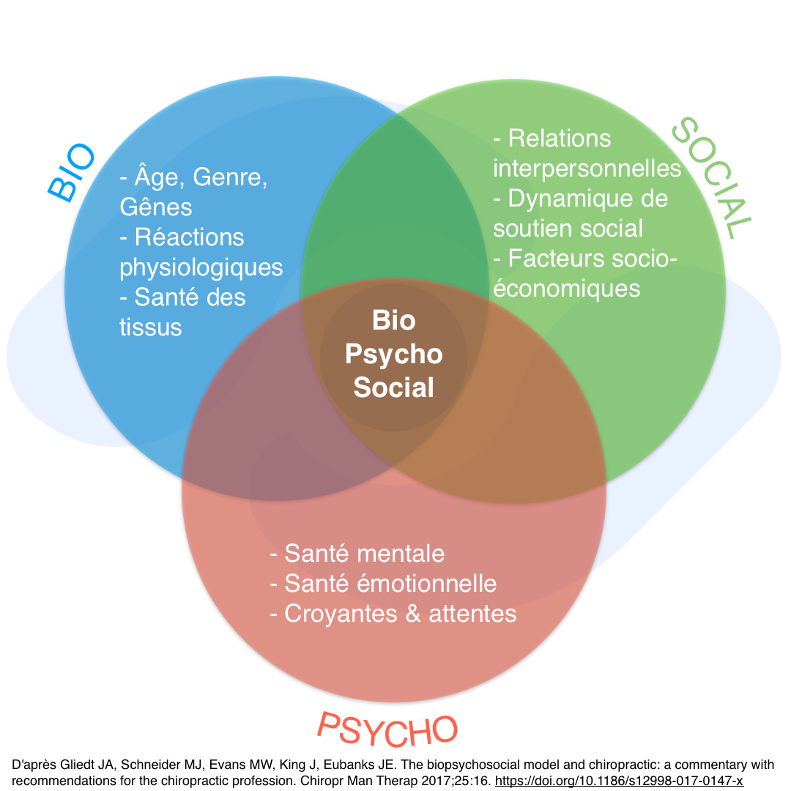

Au cours de ces dernières années, une **augmentation fulgurante des écrits
scientifiques sur le modèle biopsychosocial** (BPS) a vu le jour dans
le domaine du soin. Bien que George Engel soit considéré comme le père
de cette approche depuis 1977, l’idée d’intégrer les composantes psychologique
et sociale avec les éléments biologiques dans la maladie a été mentionnée
par de nombreux auteurs avant lui (Victor Frankl (1946) ; John Romano (1947))[^1].

D’abord exprimé sous le nom de « psycho somatic social » par Roy Grinker en 1952,
il en adopta peu de temps après, le terme définitif de « biopsychosocial »[^1].
C’est seulement en 1977 qu’Engel démocratisera ce concept par son célèbre article
« *The need for a new medical model : A challenge for medicine* »[^2]. Bien que
majoritairement considéré dans le cadre des maladies mentales, cette approche
n’est pas la propriété exclusive du domaine de la psychiatrie. Avant 1977,
différents spécialistes s’étaient déjà intéressés à ce concept dans d’autres
disciplines telles que l’ergothérapie, la pédiatrie, la médecine générale ou
les soins infirmiers[^1].

Aujourd’hui, ce modèle s’est fortement étendu dans le domaine du soin et
spécifiquement dans le cadre du traitement de la douleur. Le terme *BPS* est
**devenu omniprésent** lorsque l’on s’intéresse aux différents types de thérapies
existantes. Il est actuellement considéré comme le modèle à utiliser lors
d’une prise en charge thérapeutique et plus particulièrement en
thérapie manuelle[^3],[^4]. Les **guides de bonnes pratiques** sont largement
favorables à son application dans la prise en charge de la douleur liée aux
troubles musculo-squelettiques[^5].
Les dernières **recommandations de l’Organisation Mondiale de la Santé** concernant
les douleurs chroniques lombaires vont notamment dans ce sens[^6].

Par ailleurs, une modélisation implique une **simplification de la réalité**.
Pour chaque modèle, il est important de **questionner sa validité** ainsi que des
limites imposées par sa conception. Cependant, comme le mentionne Weiner
(2008), peu d’investissements ont été mis en œuvre dans la critique du
modèle BPS[^7]. Bien que discrète, la littérature actuellement disponible met
en évidence **un certain nombre de problématiques concernant cette approche**.
Il pourrait être cité le manque de cohérence du concept quant à la théorie
sur laquelle il s’appuie[^8], son **manque de validité scientifique**[^1],[^8],[^9],[^10]
ou encore, la mauvaise intégration du caractère subjectif et individuel de
la personne douloureuse[^8]. Bien que ces limites soient intéressantes,
ce présent article se focalise sur la manière même dont le modèle *BPS* a
été conceptualisé et exprimé, pouvant **induire en erreur** sur son interprétation
et son utilisation. Par la suite, nous aborderons certaines **pistes de réflexion**
concernant les causes d’une mauvaise application de ce dernier. Sensibiliser les
professionnels de (la) santé aux **limites du modèle biopsychosocial** pour les
intégrer à leur réflexion clinique pourrait tendre à améliorer son utilisation.

<!--more-->

## Un héritage brumeux
L’une des principales critiques évoquées dans la littérature sur le modèle *BPS*,
concerne le **manque de clarté dans sa réalisation clinique**, caractérisant ainsi
le modèle comme trop flou[^1],[^8],[^11],[^12]. George Engel exposa de manière
claire le « *pourquoi* » utiliser ce nouveau cadre de prise en charge[^2].
En revanche, bien qu’il essayât de proposer une application pratique en 1980[^13],
le « *comment* » reste relativement confus.

En intégrant les composantes psychologique et sociale, Ghaemi (2009) critique
le **modèle comme étant trop éclectique**, amenant à une diversité
d’utilisations[^11]. Il dénonce la vision holistique du concept ainsi que le
**manque de lignes directrices** sur son application. Cela pourrait conduire le
clinicien à être libre dans sa manière de l’interpréter et de l’utiliser **en
fonction de ses préférences et affinités avec les différentes composantes**:

> This eclectic freedom borders on anarchy: one can emphasis the « bio » if
> one wishes, or « psycho » or the « social » (...) this results in the
> ultimate paradox : free to do whatever one chooses, one enacts one’s own
> dogmas (conscious or unconscious).[^11]

En pédagogie, il n’est pas rare de s’appuyer sur des images et de schémas
pour rendre un sujet plus facilement assimilable. L’explication du modèle
BPS est souvent accompagnée d’un diagramme de « Venn » (Fig 1). Il permet
de montrer visuellement et distinctement les trois composantes du modèle
ainsi que leurs interactions possibles.

Cependant, Stilwell & Harman (2019) critiquent cette idée de fragmenter
nettement les différents éléments qui induit que[^14] :

1. Le modèle est alors défini comme **linéaire** et serait donc
   capable de séparer la douleur humaine en parties distinctes.
2. Les praticiens auraient tendance à **séparer la douleur en deux**:
    biologique et psychosociale. Ils tendraient par la suite à mettre
    l’accent sur l’un des deux éléments.

Paradoxalement à l’intention d’Engel, **le thérapeute pourrait donc être
naturellement amené à une utilisation limitée du modèle et par conséquent,
revenir à une vision réductionniste de la douleur**. Les hypothèses
exposées précédemment par les différents auteurs sont soutenues par la
pratique clinique. Les travaux de Wendy NG et al.(2021) exposent qu’un
nombre important de professionnels de santé déplorent le manque de clarté
du concept[^15]. De plus, ils expriment leur incapacité à mettre en lien
les différentes composantes qui le sous-tendent ainsi que leur difficulté
à mettre en œuvre une approche holistique.

<u>Note à l’ostéopathie</u>:
: Pour aller plus loin, dans le livre dirigé par le Dr Pierre-Luc L’Hermite
« Mythologies ostéopathiques » (2024)[^16], le chapitre 2 rédigé par
le Dr Jerry Draper-Rodi nous apporte des éléments sur la difficulté de
l’approche holistique dans le domaine de l’ostéopathie.

## Une vision *BIO*-psycho-sociale
Bien que la recherche tende à mettre en lumière l’implication psychologique
et sociale dans le contexte de la douleur, l’approche biomédicale du soin
reste cependant bien ancrée. La **vision patho-anatomique représente le
modèle explicatif le plus exploité en première intention** pour justifier
la douleur[^12],[^17]. Plusieurs raisons peuvent expliquer que certains
praticiens de santé restent sur un modèle biomédical centré malgré leur
sensibilisation au modèle *BPS*:

Comme le mentionnent Meskouto et al.(2022), la littérature disponible
concernant la prise en charge *BPS* de la lombalgie chez les
kinésithérapeutes investigue en première intention la symptomatologie sous
un prisme structurel[^17]. De fait, elle met l’accent sur l’évaluation
de la douleur par sa localisation, son intensité ainsi que ses caractéristiques
déclenchantes et aggravantes (mouvements, postures). **Les mesures des
aspects psychologiques et sociaux font l’objet d’une moindre attention et
sont rarement évaluées ou mentionnées sur le plan principal**[^17]. Il tombe
sous le sens que cette priorité patho-anatomique semble être justifiée par
la recherche de pathologie nécessitant une prise en charge médicale (*red flag*).
Néanmoins, **une sensibilisation trop importante au biomédical pourrait provoquer
un oubli des autres composantes du modèle biopsychosocial**.

En comparaison à l’aspect biomédical, l’investigation des éléments
psycho-sociaux lors de la prise en charge de la douleur reste relativement
nouvelle. La littérature fait émerger actuellement un nombre important de
guidelines, d’outils d’évaluation différents pouvant provoquer la confusion
et la difficulté d’évaluer de manière concrète les sphères psychologique
et sociale[^15]. Il existe également des facteurs personnels aux professionnels
de santé pouvant influencer le choix de rester sur un aspect biomédical de
la prise en charge. Par exemple, certains praticiens peuvent considérer
que leur rôle et leur champ d’action n’est pas de dépister les aspects cognitifs[^15].
Ils peuvent également se sentir mal à l’aise ou réticents à l’idée de poser
des questions sur la vie intime des personnes, craignant d’être trop invasifs[^15].
Pour finir, les attentes du demandeur de soin pourraient également impacter la
direction vers laquelle le thérapeute oriente son attention. En effet,
la personne douloureuse souhaite généralement avoir de son professionnel
de santé une évaluation rigoureuse pour expliquer la douleur et plus
particulièrement un **diagnostic biomédical précis**.[15]

<u>Note à l’ostéopathie</u>:
: La lecture de l’article “‘It's all connected, so it all matters’ -
the fallacy of osteopathic anatomical possibilism” par Hidalgo et al.(2024)
est une bonne manière de comprendre pourquoi l’ostéopathie telle qu’elle est
enseignée et appliquée aujourd’hui, peut conduire ses thérapeutes à une
vision réductionniste biomécanique de la douleur[^18].

## Une vision bio-*PSYCHO-SOCIALE*
À contrario, certains auteurs mettent en garde sur la tendance actuelle
à minimiser la composante mécanique de la douleur. La découverte des
composantes psychologique et sociale impliquées dans la douleur suscite
un engouement particulier auprès de la communauté scientifique.

Les études identifiant les facteurs biomécaniques comme n’étant pas
prédictifs ou causals de la douleur auraient tendance à être mises en
avant, délaissant ainsi le coté mécanique de la douleur au profit des
aspects cognitifs[^19]. Cela pourrait sans doute s’expliquer par
l’enthousiasme actuel autour des découvertes relativement récentes
concernant les éléments cognitifs dans l’expérience douloureuse. Il
en découle de nouvelles tendances thérapeutiques dans le traitement de la
douleur[^20]. On pourrait par exemple, citer l’éducation aux
neurosciences de la douleur, l’une des thérapies montantes, en particulier
dans le domaine des troubles musculo-squelettiques[^21],[^22]. Malgré la
pertinence de cette thérapeutique, elle est souvent amenée, peut-être à tort,
à se focaliser sur le cerveau et notamment sur les facteurs psychosociaux
pour expliquer le symptôme[^12],[^17]. **Une vision trop
« neurocentrique » pourrait entraîner une investigation partielle de la
douleur et avoir des conséquences négatives pour la personne douloureuse**[^12],[^14].

Hancock & al.(2011) évoquent que de mauvaises interprétations pourraient
être faites en conséquence des difficultés actuellement rencontrées par la
recherche scientifique sur la partie « bio » de la douleur[^23]. Par
exemple, affirmer que « *la présence d'une pathologie chez certaines
personnes ne souffrant pas de lombalgie signifie qu'elle n'est pas importante* »
ou encore, « *jusqu’à ce qu’un diagnostic montre une amélioration des résultats,
il n’est pas important de le faire* » devrait être revu[^23]. Hancock et al.
expriment que le manque de résultats sur un diagnostic clinique ne signifie
pas que le diagnostic est inutile. En effet, **pour affirmer qu’un diagnostic
est utile, il faut qu’un traitement efficace y soit associé**. Malheureusement,
les expérimentations scientifiques actuelles peuvent rencontrer des difficultés
à trouver le bon traitement pour un diagnostic précis[^23]. De même, bien
qu’elle soit de plus en plus étudiée, la littérature s’intéressant à **la
relation entre l’évolution d’une pathologie et la douleur ressentie** reste
peu développée. Par exemple, il serait tout à fait possible de penser qu’une hernie
discale asymptomatique deviendrait douloureuse à partir d’un certain stade[^23].

En outre, il est important de garder en tête qu’il existe de la
littérature soutenant la partie biomédicale de la douleur. Il pourrait être
possible de retrouver des relations entre les facteurs biologiques/mécaniques
et la douleur, tels que la posture[^19], les discopathies[^24] ou encore
les déformations vertébrales par la classification *MODIC*[^24],[^25],[^26].
Toutefois, il est important de comprendre que la recherche scientifique sur
la partie patho-anatomique de la douleur est soumise à certaines difficultés.
**En effet, les faibles qualités méthodologiques des études, l’hétérogénéité
trop importante des échantillons peuvent provoquer des incohérences, des
divergences dans les résultats empêchant ainsi d’émettre de véritables
conclusions**[^26],[^27].

Plusieurs auteurs appellent donc la communauté scientifique à ne pas délaisser
la composante biomécanique de la douleur. **Elle doit continuer à être investiguée
de manière égale et parallèle aux autres éléments du modèle *BPS***[^19],[^23].
En outre, les cliniciens ne devraient pas négliger la partie biologique et
mécanique de la douleur dans leur raisonnement clinique ainsi que dans leurs
justifications auprès de la personne demandeuse de soin. **L’investigation et
l’explication devraient intégrer automatiquement les 3 composantes, c’est-à-dire
la partie biologique et la partie psychologique et la partie sociale**.

## Le modèle BPS, un défi pour la recherche scientifique
George Box a expliqué qu’un modèle « *cherche à représenter les objets
empiriques, les phénomènes et les processus physiques d'une manière
logique et objective* »[^1]. De cette manière, pour qu’un modèle soit valide
scientifiquement, il est important qu’il respecte des critères spécifiques
dits quantitatifs. Ces critères doivent en effet être *prédictifs, testables et
mesurables*. Bien que le cadre biopsychosocial ait été source de propositions
d’approches scientifiques[^9], il reste fortement critiqué par de nombreux
auteurs[^1],[^8],[^9],[^10]. **Mais finalement, ce modèle serait-il
concrètement compatible avec le cadre de l’expérimentation scientifique ?**

Le modèle proposé par Engel s’est initialement construit autour de la
**théorie générale des systèmes** de Ludwig Von Bertalanffy[^1],[^8]. Cette théorie
implique l’étude et les relations existantes entre les différents systèmes du
monde. Un système est alors défini comme un « *complexe d’éléments en
interactions* »[^28]. En ce sens, il ne peut pas être décrit comme la somme
de ses parties mais plutôt par l’**émergence finale des interactions entre elles**.
En d’autres termes, la modification d’un de ses éléments peut entraîner des
changements intrasystémiques pouvant avoir un impact sur une partie ou
l’ensemble du système[^1]. Puis, par relation intersystémique, affecter d’autres
systèmes.

Le modèle *BPS* s’intéresse donc à l’interaction complexe entre les
différents systèmes biologique, psychologique et social. En outre, un modèle
basé sur une théorie tellement délicate qu’il serait compliqué d’en imposer
le cadre et les critères scientifiques. Cette volonté pourrait même aller à
l’encontre de l’essence principale du concept. Bien que le cadre conceptuel
du *BPS* soit critiqué car non scientifique[^1],[^8],[^9],[^10], différents
auteurs dont Engel[^12], ainsi que certains cliniciens semblent à l’inverse
être réticents quant à la scientifisation de ce modèle[^15]. Par exemple,
tenter de standardiser l’évaluation des aspects psychologique et sociale de
manière objective par des outils tels que les questionnaires, ne tiendrait
en réalité pas compte de l’individualité et la subjectivité de la
personne[^8],[^15],[^17]. **En effet, les composantes cognitives pourraient
être fortement influencées par les caractères ethniques, culturels,
linguistiques et/ou religieux[^29] choses auxquelles les questionnaires actuels
ne semblent pas être sensibles**[^15],[^17]. Développer les recherches sur les
sciences sociales et ethnico-culturelles devrait être prioritaire pour améliorer
l’évaluation et la prise en charge selon le modèle biopsychosocial[^8],[^17].

<u>Note à l’ostéopathie</u>:
: La lecture du commentaire de Zegarra-Parodi et al.(2019), peut amener
des éléments pertinents afin d’introduire les influences religieuses et
spirituelles dans un cadre de prise en charge biopsychosociale[^29].

## Conclusion
Comme le disait George Box « *tous les modèles sont faux mais certains
sont utiles* ». Il est essentiel d’être conscient que le modèle biopsychosocial
a joué un rôle prépondérant dans l’exploration et la compréhension des
mécanismes qui sous-tendent l’expérience douloureuse. Il a initié une
**prise en charge moderne de la douleur**, en poussant les différents thérapeutes
à communiquer entre eux, amenant ainsi la multidisciplinarité dans le domaine
du soin. Pour la plupart des thérapeutes, l’idée générale de ce modèle reste
relativement comprise. En revanche, sa mise en pratique semble être plus difficile.
Pour cause, l’héritage de George Engel reste relativement brumeux. Les
différents thérapeutes peuvent alors en faire une interprétation personnelle,
pouvant conduire à des utilisations diverses, parfois incomplètes. De plus,
les guidelines et les outils disponible dans la littérature sont confrontés à
la **difficulté de prendre en compte les différences subjectives et individuelles
de la personne douloureuse**. Les professionnels de santé semblent donc réticents
à les utiliser. La modélisation fragmentée des composantes biologique, psychologique
et sociale pourrait être également à l’origine d’une application partielle
du concept en fonction de l’aisance des praticiens à leur égard. Pour finir,
les avancées scientifiques sur **les différents aspects du concept pourraient être
à tort mal interprétées par les cliniciens, apporter de mauvaises conclusions**,
impactant ainsi leur prise en charge thérapeutique en délaissant ou en
favorisant certains éléments du modèle.

**La prise de conscience par les professionnels de (la) santé des
problématiques soulevées par la littérature sur le modèle biopsychosocial pourrait
être à l’origine d’une amélioration dans son application. Connaître les limites
et savoir les intégrer dans la réflexion clinique autour de la prise en charge
de la personne douloureuse permettrait de limiter les erreurs et l’emploi
partiel de cet outil.**

[^1]: Lugg W. The biopsychosocial model - history, controversy and Engel.
      Australas Psychiatry 2022;30:55–9. https://doi.org/10.1177/10398562211037333.
[^2]: Engel GL. The Need for a New Medical Model: A Challenge for Biomedicine.
      Science 1977;196:129–36. https://doi.org/10.1126/science.847460.
[^3]: Fryer G. Integrating osteopathic approaches based on biopsychosocial
      therapeutic mechanisms. Part 1: The mechanisms. International Journal
      of Osteopathic Medicine 2017;25:30–41. https://doi.org/10.1016/j.ijosm.2017.05.002.
[^4]: Gliedt JA, Schneider MJ, Evans MW, King J, Eubanks JE. The biopsychosocial
      model and chiropractic: a commentary with recommendations for the
      chiropractic profession. Chiropr Man Therap 2017;25:16. https://doi.org/10.1186/s12998-017-0147-x.
[^5]: Lin I, Wiles L, Waller R, Goucke R, Nagree Y, Gibberd M, et al. What
      does best practice care for musculoskeletal pain look like? Eleven
      consistent recommendations from high-quality clinical practice guidelines:
      systematic review. Br J Sports Med 2020;54:79–86. https://doi.org/10.1136/bjsports-2018-099878.
[^6]: WHO guideline for non-surgical management of chronic primary low back
      pain in adults in primary and community care settings. Geneva, Switzerland:
      World Health Organization; 2023.
[^7]: Weiner BK. Spine update: the biopsychosocial model and spine care.
      Spine (Phila Pa 1976) 2008;33:219–23. https://doi.org/10.1097/BRS.0b013e3181604572.
[^8]: Benning TB. Limitations of the biopsychosocial model in psychiatry.
      Adv Med Educ Pract 2015;6:347–52. https://doi.org/10.2147/AMEP.S82937.
[^9]: Smith RC. Making the biopsychosocial model more scientific-its general
      and specific models. Soc Sci Med 2021;272:113568.
      https://doi.org/10.1016/j.socscimed.2020.113568.
[^10]: Roberts A. The biopsychosocial model: Its use and abuse.
       Med Health Care Philos 2023;26:367–84. https://doi.org/10.1007/s11019-023-10150-2.
[^11]: Ghaemi SN. The rise and fall of the biopsychosocial model.
       Br J Psychiatry 2009;195:3–4. https://doi.org/10.1192/bjp.bp.109.063859.
[^12]: Cormack B, Stilwell P, Coninx S, Gibson J. The biopsychosocial model is
       lost in translation: from misrepresentation to an enactive
       modernization. Physiother Theory Pract 2023;39:2273–88.
       https://doi.org/10.1080/09593985.2022.2080130.
[^13]: Engel GL. The clinical application of the biopsychosocial model.
       Am J Psychiatry 1980;137:535–44. https://doi.org/10.1176/ajp.137.5.535.
[^14]: Stilwell P, Harman K. An enactive approach to pain: beyond the
       biopsychosocial model. Phenom Cogn Sci 2019;18:637–65. https://doi.org/10.1007/s11097-019-09624-7.
[^15]: Ng W, Slater H, Starcevich C, Wright A, Mitchell T, Beales D.
       Barriers and enablers influencing healthcare professionals’ adoption of
       a biopsychosocial approach to musculoskeletal pain: a systematic review
       and qualitative evidence synthesis. Pain 2021;162:2154–85.
       https://doi.org/10.1097/j.pain.0000000000002217.
[^16]: L’Hermite P-L. Mythologies ostéopathiques. Paris: l’Harmattan; 2024.
[^17]: Mescouto K, Olson RE, Hodges PW, Setchell J. A critical review of the
       biopsychosocial model of low back pain care: time for a new approach?
       Disabil Rehabil 2022;44:3270–84. https://doi.org/10.1080/09638288.2020.1851783.
[^18]: Hidalgo DF, MacMillan A, Thomson OP. ‘It’s all connected, so it all
       matters’ - the fallacy of osteopathic anatomical possibilism.
       International Journal of Osteopathic Medicine 2024;52:100718.
       https://doi.org/10.1016/j.ijosm.2024.100718.
[^19]: Harrison DE, Oakley PA, Moustafa IM. Don’t Throw the “Bio” out of
       the Bio-Psycho-Social Model: Editorial for Spine Rehabilitation in 2022
       and Beyond. J Clin Med 2023;12:5602. https://doi.org/10.3390/jcm12175602.
[^20]: Osinski T, Pallot A. Rééducation des patients douloureux: éléments pour
       une pratique clinique raisonnée. Issy-les-Moulineaux: Elsevier-Masson; 2022.
[^21]: Butler DS, Moseley GL, Bacelon M. Expliquer la douleur. Adelaide,
       Australia: Noigroup Publications; 2021.
[^22]: Osinski T, Pallot A. Éducation aux neurosciences de la douleur. Rééducation
       des patients douloureux: éléments pour une pratique clinique raisonnée,
       Issy-les-Moulineaux: Elsevier-Masson; 2022, p. 182.
[^23]: Hancock MJ, Maher CG, Laslett M, Hay E, Koes B. Discussion paper: what
       happened to the “bio” in the bio-psycho-social model of low back pain?
       Eur Spine J 2011;20:2105–10. https://doi.org/10.1007/s00586-011-1886-3.
[^24]: Brinjikji W, Diehn FE, Jarvik JG, Carr CM, Kallmes DF, Murad MH, et al.
       MRI Findings of Disc Degeneration are More Prevalent in Adults with Low
       Back Pain than in Asymptomatic Controls: A Systematic Review and
       Meta-Analysis. AJNR Am J Neuroradiol 2015;36:2394–9.
       https://doi.org/10.3174/ajnr.A4498.
[^25]: Yang X, Karis DSA, Vleggeert-Lankamp CLA. Association between Modic
       changes, disc degeneration, and neck pain in the cervical spine: a
       systematic review of literature. Spine J 2020;20:754–64.
       https://doi.org/10.1016/j.spinee.2019.11.002.
[^26]: Czaplewski LG, Rimmer O, McHale D, Laslett M. Modic changes as seen on
       MRI are associated with nonspecific chronic lower back pain and disability.
       J Orthop Surg Res 2023;18:351. https://doi.org/10.1186/s13018-023-03839-w.
[^27]: Hopayian K, Raslan E, Soliman S. The association of modic changes and
       chronic low back pain: A systematic review. J Orthop 2023;35:99–106.
       https://doi.org/10.1016/j.jor.2022.11.003.
[^28]: Bertalanffy L von. Théorie générale des systèmes. Paris: Dunod; 2012.
[^29]: Zegarra-Parodi R, Draper-Rodi J, Cerritelli F. Refining the biopsychosocial
       model for musculoskeletal practice by introducing religion and spirituality
       dimensions into the clinical scenario. International Journal of
       Osteopathic Medicine 2019;32:44–8. https://doi.org/10.1016/j.ijosm.2019.04.001.
