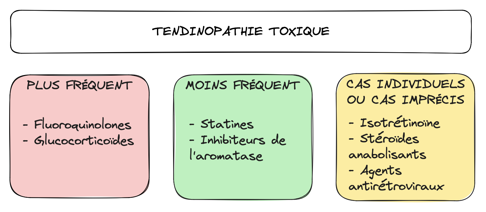
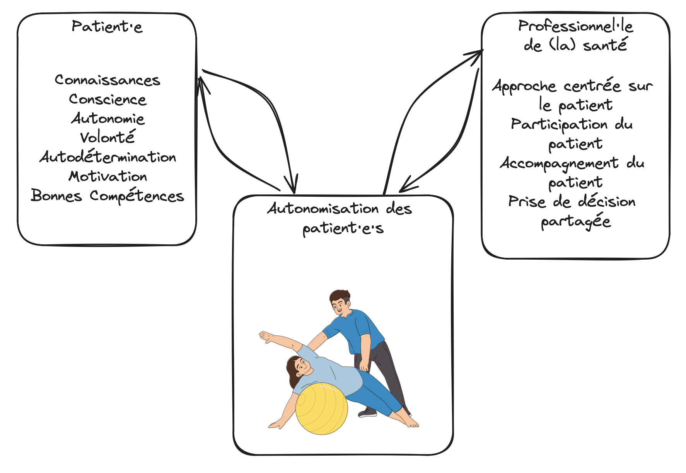

La tendinopathie est une pathologie complexe, multifactorielle **du
tendon**, caractérisée par des douleurs, un déclin fonctionnel et
une tolérance réduite à l'exercice. Les tendinopathies les plus
courantes concernent le tendon de la coiffe des rotateurs, les
tendons s’insérant sur les épicondyles médiaux et latéraux du
coude, le tendon rotulien, les tendons fessiers et le
tendon d'Achille[^1].

[^1]: Millar NL, Silbernagel KG, Thorborg K, Kirwan PD,
    Galatz LM, Abrams GD, Murrell GAC, McInnes IB, Rodeo
      SA. Tendinopathy. Nat Rev Dis Primers. 2021 Jan 7;7(1):1.
      doi: 10.1038/s41572-020-00234-1. Erratum in: Nat Rev
      Dis Primers. 2021 Feb 3;7(1):10. doi:
      10.1038/s41572-021-00251-8. PMID: 33414454.

Les observations épidémiologiques et cliniques soulignent le rôle
d'une **surcharge mécanique répétitive**, mais les **mécanismes intrinsèques**
de la maladie **sont largement inconnus**: en particulier, il est débattu
de savoir si l'inflammation, ou la dégénérescence, a un rôle
pathogénique prédominant.

C'est d'ailleurs pour cela que le terme « tendinite » a été délaissé,
au profit de « tendinopathie », car cette pathologie ne peut être
caractérisée comme une simple inflammation du tendon[^2].

[^2]: Rees JD, Stride M, Scott A.
      Tendons--time to revisit inflammation.
      Br J Sports Med. 2014 Nov;48(21):1553-7.
      doi: 10.1136/bjsports-2012-091957. Epub 2013 Mar 9.
      PMID: 23476034; PMCID: PMC4215290.

Dans cet article, nous allons passer en revue les mécanismes
pathogéniques de la tendinopathie, les tendinopathies les plus
courantes, et les traitements les plus efficaces.

<!--more-->

## Pathogénie de la tendinopathie
La **surexploitation est le premier facteur de la maladie**, avec
une micro-perturbation des fibres tendineuses. Un processus complexe
se met alors en place, principalement dans les zones où
l’approvisionnement en sang est faible. Des facteurs de croissance
sont produits, et l'expression de scleraxis, une protéine qui active
le gène codant pour le collagène de type I-α1 dans les fibroblastes
tendineux, est accrue, ce qui améliore la guérison du tendon grâce
à des lignées cellulaires spécifiques. Cependant, dans le même temps,
des mécanismes nocifs sont activés, avec une expression accrue
des médiateurs inflammatoires. Le résultat est une dégénérescence
et un affaiblissement de la structure tendineuse normale.

De plus, la croissance neuronale accompagnant les néovaisseaux,
conduit à une surexpression du glutamate, de substance P et du peptide
lié au gène calcitonine: cela explique l'apparition de douleurs
et, éventuellement, déclenche une inflammation neurogène.

En résumé, il est concevable que l’inflammation et la
dégénérescence ne s’excluent pas mutuellement, mais travaillent
ensemble dans la cascade pathogénique de la tendinopathie[^3].

[^3]: Abate, M., Gravare Silbernagel, K., Siljeholm, C. et al.
      Pathogenesis of tendinopathies: inflammation or
      degeneration?. Arthritis Res Ther 11, 235 (2009).
      https://doi.org/10.1186/ar2723

D’autres études confirment la **prévalence de glutamate dans la
tendinopathie**. De fait, il est suggéré que l’inflammation précoce
dans la tendinopathie, entraine une prolifération des récepteurs
glutaminergiques, ce qui augmente la sensibilisation périphérique[^4].

[^4]: Wasker SVZ, Challoumas D, Weng W, Murrell GAC, Millar NL.
      Is neurogenic inflammation involved in tendinopathy? A
      systematic review. BMJ Open Sport Exerc Med. 2023
      Feb 9;9(1):e001494. doi: 10.1136/bmjsem-2022-001494.
      PMID: 36793930; PMCID: PMC9923261.

Quel que soit l’événement déclencheur (surstimulation des
ténocytes, perturbation/déchirure du collagène, inflammation),
la pathologie tendineuse est caractérisée par une **réponse
cellulaire significative à la blessure**. Il est peu probable qu’un
modèle unique puisse expliquer pleinement tous les aspects
pathogéniques de la tendinopathie, ainsi que ses liens avec la
douleur et la fonction, car ces processus et leurs relations
sont complexes[^5].

[^5]: Cook JL, Rio E, Purdam CR, Docking SI. Revisiting the
      continuum model of tendon pathology: what is its merit
      in clinical practice and research? Br J Sports Med.
      2016 Oct;50(19):1187-91. doi: 10.1136/bjsports-2015-095422.
      Epub 2016 Apr 28. PMID: 27127294; PMCID: PMC5118437.

Fondamentalement, **une meilleure compréhension de la pathogenèse**
de la tendinopathie et des mécanismes sous-jacents **est essentielle**
si nous voulons développer des stratégies de traitement à long
terme plus efficaces pour la prise en charge de la tendinopathie.

Et bien que le diagnostic repose principalement sur les
symptômes cliniques, dans certains cas, des tests et une
imagerie supplémentaire sont nécessaires. La prise en charge
comprend différents programmes d'exercices, des modalités
thérapeutiques différentes (ondes de choc, kinésiotaping,
exercices physiques…) et parfois des interventions chirurgicales.

Toutefois, leur efficacité reste ambiguë…

## Les tendinopathies les plus courantes
### La tendinopathie de la coiffe des rotateurs
La tendinopathie de la coiffe des rotateurs (TCR) est un
trouble musculosquelettique très répandu, pour laquelle certains
facteurs de risque sont identifiés tel que l’âge (+ de 50 ans)
ou l’activité (notamment avec les bras au-dessus de la tête)[^6].

[^6]: Leong HT, Fu SC, He X, Oh JH, Yamamoto N, Hang S.
      Risk factors for rotator cuff tendinopathy: A
      systematic review and meta-analysis. J Rehabil Med.
      2019 Oct 4;51(9):627-637. doi: 10.2340/16501977-2598.
      PMID: 31489438.

La thérapie manuelle (massages superficiels et profonds,
mobilisation articulaire rythmique, manipulation articulaire…)
est une intervention couramment utilisée par les kinésithérapeutes
dans le traitement de cette affection. Cependant, les preuves
concernant son efficacité ne sont pas concluantes, la thérapie
manuelle seule peut avoir un intérêt faible à modéré sur la douleur,
mais assez peu probant sur la fonction[^7].

[^7]: Desjardins-Charbonneau A, Roy JS, Dionne CE, Frémont P,
      MacDermid JC, Desmeules F. The efficacy of manual therapy
      for rotator cuff tendinopathy: a systematic review and
      meta-analysis. J Orthop Sports Phys Ther. 2015 May;45(5):330-50.
      doi: 10.2519/jospt.2015.5455. Epub 2015 Mar 26. PMID: 25808530.

L'utilisation de kinésiotaping  (bandage adhésif tendu le long du
corps musculaire) ne semble pas présenter plus d’intérêt qu’un
placebo selon cette étude[^8]; ce qui est en accord avec une
précédente étude de 2008[^9]; à noter toutefois que l’on trouve
peu d’études sur le sujet.

[^8]: Taik FZ, Karkouri S, Tahiri L, Aachari I, Moulay Berkchi J,
      Hmamouchi I, Abouqal R, Rkain H, Allali F. Effects of
      kinesiotaping on disability and pain in patients with
      rotator cuff tendinopathy: double-blind randomized
      clinical trial. BMC Musculoskelet Disord. 2022 Jan 26;23(1):90.
      doi: 10.1186/s12891-022-05046-w. PMID: 35081947; PMCID: PMC8790883.

[^9]: Thelen MD, Dauber JA, Stoneman PD. The clinical efficacy of
      kinesio tape for shoulder pain: a randomized, double-blinded,
      clinical trial. J Orthop Sports Phys Ther. 2008 Jul;38(7):389-95.
      doi: 10.2519/jospt.2008.2791. Epub 2008 May 29. PMID: 18591761.

Une solution efficace face à la TCR semble être l’exercice physique.
Une rééducation efficace consisterait à amener de la charge
pendant l’effort, de manière progressive, et sur une durée assez
longue (entre 3 et 6 mois). Le type d’exercice proposé n’est pas
foncièrement important, que l’on travaille sur des exercices
excentriques, isométriques, concentriques, en chaine ouverte ou
fermée, en petite ou grande amplitude articulaire… Tous sont
efficaces contre la douleur et pour améliorer la mobilité de
l’épaule[^10][^11]!

[^10]: Heron SR, Woby SR, Thompson DP. Comparison of three types
       of exercise in the treatment of rotator cuff
       tendinopathy/shoulder impingement syndrome: A randomized
       controlled trial. Physiotherapy. 2017 Jun;103(2):167-173.
       doi: 10.1016/j.physio.2016.09.001. Epub 2016 Sep 21. PMID: 27884499.

[^11]: Dominguez-Romero JG, Jiménez-Rejano JJ, Ridao-Fernández C,
       Chamorro-Moriana G. Exercise-Based Muscle Development Programmes
       and Their Effectiveness in the Functional Recovery of Rotator
       Cuff Tendinopathy: A Systematic Review. Diagnostics (Basel).
       2021 Mar 16;11(3):529. doi: 10.3390/diagnostics11030529.
       PMID: 33809604; PMCID: PMC8002167.

### La tendinopathie calcifiante de la coiffe des rotateurs (cas particulier)
La tendinopathie calcifiante de la coiffe des rotateurs (TCCR)
est une affection très courante de l’épaule causée par la présence
de dépôts calcifiants dans la coiffe des rotateurs (CR) ou dans la
bourse sous-acromiale-sous-deltoïdienne. La TCCR peut être
facilement diagnostiqué grâce à l’imagerie radiographie. Cependant
une échographie peut aider à préciser si la calcification est bien
à l'origine ou non des douleurs, car il est important de rappeler
qu'une calcification sur deux est asymptomatique[^12].

[^12]: Le Goff B, Berthelot JM, Guillot P, Glémarec J, Maugars
       Y. Assessment of calcific tendonitis of rotator cuff by
       ultrasonography: comparison between symptomatic and
       asymptomatic shoulders. Joint Bone Spine.
       2010 May;77(3):258-63. doi: 10.1016/j.jbspin.2010.01.012.
       PMID: 20434387.

Les traitements guidés par imagerie sont actuellement considérés
comme des méthodes peu invasives et efficaces pour traiter la
TCCR (infiltrations, onde de chocs) avec un taux de réussite
d'environ 80 %, l'exercice physique est également numéro
1 en traitement conservateur. La chirurgie reste l’option
thérapeutique la plus invasive et qui n’est pas plus efficace que
d’autres approches moins invasives. Il est important de noter
que les dépôts calcifiants se résorbent spontanément dans
la majorité des cas[^13].

[^13]: Chianca V, Albano D, Messina C, Midiri F, Mauri G,
       Aliprandi A, Catapano M, Pescatori LC, Monaco CG, Gitto S,
       Pisani Mainini A, Corazza A, Rapisarda S, Pozzi G,
       Barile A, Masciocchi C, Sconfienza LM. Rotator cuff
       calcific tendinopathy: from diagnosis to treatment.
       Acta Biomed. 2018 Jan 19;89(1-S):186-196.
       doi: 10.23750/abm.v89i1-S.7022. PMID: 29350647; PMCID: PMC6179075.

### Épicondylite
L’épicondylite ou la tendinopathie des tendons des extenseurs
de l’avant-bras, survient fréquemment entre 34-55 ans,
et guérit généralement spontanément au bout de 2 ans. Le massage,
les exercices excentriques ainsi que les étirements sont des méthodes
très efficaces dans le traitement de l’épicondylite. Il apparait que
les ondes de choc ne sont pas plus efficaces que le renforcement.
Cependant, la combinaison onde de choc + renforcement est plus
avantageuse. De plus le coût bénéfice-risque de ces interventions est
très favorable. Il est d’ailleurs important d’y avoir recours avant
toute opération chirurgicale[^14].

[^14]: Landesa-Piñeiro L, Leirós-Rodríguez R. Physiotherapy
       treatment of lateral epicondylitis: A systematic review.
       J Back Musculoskelet Rehabil. 2022;35(3):463-477.
       doi: 10.3233/BMR-210053. PMID: 34397403.

Ici le kinésiotaping semble intéressant. Toutefois une seule étude a
été trouvée sur le sujet[^15].

[^15]: Shakeri H, Soleimanifar M, Arab AM, Hamneshin Behbahani S.
       The effects of KinesioTape on the treatment of lateral
       epicondylitis. J Hand Ther. 2018 Jan-Mar;31(1):35-41.
       doi: 10.1016/j.jht.2017.01.001. Epub 2017 Feb 28. PMID: 28256305.

À contrario des études plus globales, et sur de plus gros
échantillons, concluent que le kinésio-taping, n'est pas plus
efficace qu'un placebo[^16][^17][^18].

[^16]: Parreira Pdo C, Costa Lda C, Hespanhol LC Jr, Lopes AD,
       Costa LO. Current evidence does not support the use of
       Kinesio Taping in clinical practice: a systematic
       review. J Physiother. 2014 Mar;60(1):31-9.
       doi: 10.1016/j.jphys.2013.12.008. Epub 2014 Apr 24. PMID: 24856938.

[^17]: Celik D, Karaborklu Argut S, Coban O, Eren I. The clinical
       efficacy of kinesio taping in shoulder disorders: a
       systematic review and meta analysis. Clin Rehabil.
       2020 Jun;34(6):723-740. doi: 10.1177/0269215520917747.
       Epub 2020 May 12. PMID: 32397751.

[^18]: Taldykina E., Kozin S. Scientific evidence of kinesiotaping
       in physiotherapy and sports. Review article.
       Health Technologies. 2023;1(2):51-59
       https://doi.org/10.58962/HT.2023.1.2.51-59

Enfin l’arrêt total des activités est à éviter absolument, le maintien
des activités et l’ajout d’exercices de renforcement est la
meilleure option[^19][^20][^21].

[^19]: Lenoir H, Mares O, Carlier Y. Management of lateral
       epicondylitis. Orthop Traumatol Surg Res. 2019 Dec;105(8S)
       :S241-S246. doi: 10.1016/j.otsr.2019.09.004.
       Epub 2019 Sep 19. PMID: 31543413.

[^20]: Ma KL, Wang HQ. Management of Lateral Epicondylitis:
       A Narrative Literature Review. Pain Res Manag. 2020 May 5;
       2020:6965381. doi: 10.1155/2020/6965381.
       PMID: 32454922; PMCID: PMC7222600.

[^21]: Johns N, Shridhar V. Lateral epicondylitis: Current concepts.
       Aust J Gen Pract. 2020 Nov;49(11):707-709.
       doi: 10.31128/AJGP-07-20-5519. PMID: 33123709.

### Tendinopathie d’Achille
La tendinopathie d’Achille (TA), est un problème courant, surtout
chez les coureurs, dont l’étiologie n’est pas totalement connue.
Quelques facteurs de risques se dégagent tel que la prise
d’ofloxacine, la consommation d’alcool, ou une faiblesse des
muscles fléchisseurs du pied[^22]. Toutefois il y a un manque
d’études de qualités sur les facteurs de risques de la TA.

[^22]: van der Vlist AC, Breda SJ, Oei EHG, Verhaar JAN, de Vos RJ.
       Clinical risk factors for Achilles tendinopathy:
       a systematic review. Br J Sports Med. 2019
       Nov;53(21):1352-1361. doi: 10.1136/bjsports-2018-099991.
       Epub 2019 Feb 4. PMID: 30718234; PMCID: PMC6837257.

La majorité des thérapies conservatives de la TA ne disposent
pas de preuves suffisantes, en revanche l'exercice physique et
les ondes de choc constituent des exceptions notables.

L'exercice présente le niveau de preuve le plus élevé. Les effets
de l'exercice peuvent être améliorés par les ondes de chocs,
d’autant que la thérapie par onde de chocs est un traitement
sûr et bien toléré[^23][^24][^25][^26].

[^23]: Stania M, Juras G, Chmielewska D, Polak A, Kucio C,
       Król P. Extracorporeal Shock Wave Therapy for Achilles
       Tendinopathy. Biomed Res Int. 2019 Dec 26;2019:3086910.
       doi: 10.1155/2019/3086910. PMID: 31950037; PMCID: PMC6948318.

[^24]: Maffulli N, Longo UG, Kadakia A, Spiezia F. Achilles
       tendinopathy. Foot Ankle Surg. 2020 Apr;26(3):240-249.
       doi: 10.1016/j.fas.2019.03.009. Epub 2019 Apr 18. PMID: 31031150.

[^25]: Dilger CP, Chimenti RL. Nonsurgical Treatment Options for
       Insertional Achilles Tendinopathy. Foot Ankle Clin.
       2019 Sep;24(3):505-513. doi: 10.1016/j.fcl.2019.04.004.
       Epub 2019 May 22. PMID: 31371000; PMCID: PMC7216975.

[^26]: Zhi X, Liu X, Han J, Xiang Y, Wu H, Wei S, Xu F.
       Nonoperative treatment of insertional Achilles
       tendinopathy: a systematic review. J Orthop Surg Res.
       2021 Mar 30;16(1):233. doi: 10.1186/s13018-021-02370-0.
       PMID: 33785026; PMCID: PMC8008511.

Il est important de rester prudent avec l’utilisation
d’anti-inflammatoires non stéroidiens (AINS) et/ou les injections
locales de corticostéroïdes. La chirurgie doit être envisagée
que s’il y a échec avec les autres thérapies après un délai
d’au moins 6 mois[^27].

[^27]: de Vos RJ, van der Vlist AC, Zwerver J, Meuffels DE,
       Smithuis F, van Ingen R, van der Giesen F, Visser E,
       Balemans A, Pols M, Veen N, den Ouden M, Weir A.
       Dutch multidisciplinary guideline on Achilles tendinopathy.
       Br J Sports Med. 2021 Oct;55(20):1125-1134.
       doi: 10.1136/bjsports-2020-103867. Epub 2021 Jun 29.
       PMID: 34187784; PMCID: PMC8479731.

En terme d’exercices, les exercices isométriques n'apportent
pas d'avantages supplémentaires lorsqu'ils sont combinés avec
des exercices excentriques[^28].

[^28]: Gatz M, Betsch M, Dirrichs T, Schrading S, Tingart M,
       Michalik R, Quack V. Eccentric and Isometric Exercises
       in Achilles Tendinopathy Evaluated by the VISA-A Score and
       Shear Wave Elastography. Sports Health. 2020
       Jul/Aug;12(4):373-381. doi: 10.1177/1941738119893996.
       Epub 2020 Jan 31. PMID: 32003647; PMCID: PMC7787566.

Le kinésiotaping n'a eu aucun effet sur la distance de saut,
la douleur ou l'excitabilité motoneuronale chez les personnes
atteintes de TA. Ces résultats ne soutiennent pas son
utilisation pour le traitement de la TA[^29].

[^29]: Firth BL, Dingley P, Davies ER, Lewis JS, Alexander CM.
       The effect of kinesiotape on function, pain, and
       motoneuronal excitability in healthy people and people
       with Achilles tendinopathy. Clin J Sport Med.
       2010 Nov;20(6):416-21. doi: 10.1097/JSM.0b013e3181f479b0.
       PMID: 21079436.

### Tendinopathie rotulienne
La tendinopathie rotulienne (TR) est une affection
musculosquelettique observée principalement dans les sports
impliquant des activités telles que la course et le saut. Même
si plusieurs options thérapeutiques sont disponibles, la prise en
charge de la TR reste controversée. La gestion conservatrice est
la méthode de traitement la plus privilégiée, qui comprend la
modulation de la douleur, la gestion de l’activité, l‘augmentation
progressive de la charge avec du renforcement fonctionnel. Le but
d’une telle rééducation est de développer la tolérance à la charge
du tendon en s’attaquant dans un premier temps à une réduction
de la douleur, suivie d’une mise en charge progressive[^30].

[^30]: Muaidi QI. Rehabilitation of patellar tendinopathy.
       J Musculoskelet Neuronal Interact. 2020
       Dec 1;20(4):535-540. PMID: 33265081; PMCID: PMC7716685.

Chez les patients atteints de TR, un protocole de renforcement
avec charges progressives a entraîné un résultat clinique
significativement meilleur après 24 semaines, plutôt qu’un
protocole d’exercices excentriques[^31].

[^31]: Breda SJ, Oei EHG, Zwerver J, Visser E, Waarsing E,
       Krestin GP, de Vos RJ. Effectiveness of progressive
       tendon-loading exercise therapy in patients with
       patellar tendinopathy: a randomised clinical trial.
       Br J Sports Med. 2021 May;55(9):501-509.
       doi: 10.1136/bjsports-2020-103403. Epub 2020 Nov 20.
       PMID: 33219115; PMCID: PMC8070614.

Les cas plus complexes et persistants peuvent nécessiter
une intervention chirurgicale. Les techniques arthroscopiques
étant les plus préférables en raison de leur nature peu
invasive, permettant éventuellement un retour au sport plus
rapide[^32]. Quel que soit le traitement, la tendinopathie
rotulienne nécessite une longue période de rééducation appropriée
et une vigilance de la part du patient et du clinicien[^33].

[^32]: Theodorou A, Komnos G, Hantes M. Patellar tendinopathy:
       an overview of prevalence, risk factors, screening,
       diagnosis, treatment and prevention. Arch Orthop Trauma
       Surg. 2023 Nov;143(11):6695-6705.
       doi: 10.1007/s00402-023-04998-5. Epub 2023 Aug 4.
       PMID: 37542006; PMCID: PMC10541843.

[^33]: Rosen AB, Wellsandt E, Nicola M, Tao MA. Clinical Management
       of Patellar Tendinopathy. J Athl Train. 2022 Jul
       1;57(7):621-631. doi: 10.4085/1062-6050-0049.21.
       PMID: 34623447; PMCID: PMC9528703.

L’injection de plasma riches en plaquettes (PRP) est un traitement
à la mode, et plutôt invasif. Cette méta-analyse [^34] qui comprend
8 études sur le sujet, conclut à un résultat cliniquement insuffisant.
La PRP dans le traitement de la TR ne semble donc pas pertinente.

[^34]: Barman A, Sinha MK, Sahoo J, Jena D, Patel V, Patel S,
       Bhattacharjee S, Baral D. Platelet-rich plasma injection in
       the treatment of patellar tendinopathy: a systematic review
       and meta-analysis. Knee Surg Relat Res. 2022 May 4;34(1):22.
       doi: 10.1186/s43019-022-00151-5. PMID: 35509070; PMCID: PMC9066802.

### La tendinopathie glutéale
La tendinopathie glutéale (TG) est considérée comme la cause
la plus fréquente de douleur latérale de hanche. Elle touche
aussi bien les athlètes que les personnes sédentaires dans une
tranche d’âge de 15 à 87 ans, et plus fréquemment entre 54 et 63 ans.
On note également une prévalence de la TG chez les femmes.

On observe que les interventions basées sur l'exercice, y
compris l'éducation, sont supérieures aux interventions
minimales (exercices fictifs ou attentisme) en termes de
fonction/gravité des symptômes à court et à long terme.
En ce qui concerne l'intensité de la douleur, l'exercice physique
et les infiltrations de corticostéroïdes ont eu des effets
similaires, cependant, l'exercice a montré un taux de réussite
supérieur à l'infiltration de corticostéroïdes, à court et à
long terme. Toutefois la fiabilité des données varie de faible
à très faible. C'est pourquoi davantage d’essais contrôlés
randomisés de grande envergure et de haute qualité sont
recommandés[^35].

[^35]: Patricio Cordeiro TT, Rocha EAB, Scattone Silva R.
       Effects of exercise-based interventions on gluteal
       tendinopathy. Systematic review with meta-analysis.
       Sci Rep. 2024 Feb 9;14(1):3343.
       doi: 10.1038/s41598-024-53283-x. PMID: 38336959; PMCID: PMC10858207.

Une étude recommande l’utilisation du plasma riche en plaquettes
(injection de PRP) dans les tendinopathies de grades 1 et 2, ainsi
que l’utilisation d’ondes de choc. La bursectomie avec ou sans
libération de la bandelette ilio-tibiale est également une option
thérapeutique. Il existe des preuves de faible niveau en faveur de
la réparation chirurgicale des tendinopathies de grade 3
(déchirures d'épaisseur partielle) et 4 (déchirures de pleine épaisseur)
mais leurs effets pour les patients restent discutables[^36].

[^36]: Ladurner A, Fitzpatrick J, O'Donnell JM. Treatment of Gluteal
       Tendinopathy: A Systematic Review and Stage-Adjusted Treatment
       Recommendation. Orthop J Sports Med. 2021 Jul
       29;9(7):23259671211016850. doi: 10.1177/23259671211016850.
       PMID: 34377713; PMCID: PMC8330465.

À noter que l’utilisation de PRP reste controversée. Cette méta-analyse
montre des résultats supérieurs au placebo, mais qui restent
cliniquement insignifiants. Le recours au PRP n’est donc pas recommandé[^37] ;
idem pour ces deux méta-analyse qui évaluent la PRP sur les tendinopathies
et les troubles musculosquelettiques[^38][^39].

[^37]: Filardo G, Previtali D, Napoli F, Candrian C, Zaffagnini S,
       Grassi A. PRP Injections for the Treatment of Knee Osteoarthritis:
       A Meta-Analysis of Randomized Controlled Trials. Cartilage.
       2021 Dec;13(1_suppl):364S-375S. doi: 10.1177/1947603520931170.
       Epub 2020 Jun 19. PMID: 32551947; PMCID: PMC8808870.

[^38]: Masiello F, Pati I, Veropalumbo E, Pupella S, Cruciani M, De
       Angelis V. Ultrasound-guided injection of platelet-rich plasma
       for tendinopathies: a systematic review and meta-analysis. Blood
       Transfus. 2023 Mar;21(2):119-136. doi: 10.2450/2022.0087-22.
       Epub 2022 Oct 17. PMID: 36346880; PMCID: PMC10072988.

[^39]: O'Dowd A. Update on the Use of Platelet-Rich Plasma Injections
       in the Management of Musculoskeletal Injuries: A Systematic Review
       of Studies From 2014 to 2021. Orthop J Sports Med. 2022
       Dec 9;10(12):23259671221140888. doi: 10.1177/23259671221140888.
       PMID: 36532150; PMCID: PMC9747876.

## La tendinopathie toxique
Une tendinopathie peut être dû à une complication médicamenteuse, le
cas est rare mais existant, on appelle cela une tendinopathie toxique.
Elle a principalement été associée aux inhibiteurs de l'aromatase, aux
antibiotiques fluoroquinolones, aux glucocorticoïdes et aux statines,
les fluoroquinolones étant les plus fréquemment associées aux troubles
tendineux.

Les tendinopathies toxiques ont également été associées aux inhibiteurs
de métalloprotéinase, aux stéroïdes anabolisants, à l'isotrétinoïne et
aux agents antirétroviraux (principalement des inhibiteurs de protéase).

Les présentations les plus fréquentes associées à une tendinopathie
toxique sont la tendinose, la rupture du tendon et la ténosynovite[^40].

[^40]: Canosa-Carro L, Bravo-Aguilar M, Abuín-Porras V, Almazán-Polo J,
       García-Pérez-de-Sevilla G, Rodríguez-Costa I, López-López D,
       Navarro-Flores E, Romero-Morales C. Current understanding of
       the diagnosis and management of the tendinopathy: An update
       from the lab to the clinical practice. Dis Mon. 2022
       Oct;68(10):101314. doi: 10.1016/j.disamonth.2021.101314.
       Epub 2022 Jan 4. PMID: 34996610.

<!-- Source: https://excalidraw.com/#json=9Vtm6bJV9TMdOCkFF7BJq,z32LRZyFrKYtT1qBMW7ROA -->

## Effet de l’exercice physique sur le tendon
Une méta-analyse de 2015, comprenant 27 études comportant
37 interventions d'exercices, a montré que les tendons réagissent
très bien à une charge mécanique accrue et s'adaptent en modifiant
leurs propriétés mécaniques et morphologiques. Une forte intensité
de contraction musculaire est le plus efficace pour susciter
l'adaptation des tendons, et que des durées d'interventions longues
(> 12 semaines) sont bénéfiques par rapport aux interventions plus
courtes. L'effet du type de contraction musculaire (isométrique,
concentrique, excentrique) semble négligeable; cependant, la revue
suggère que l'entraînement pliométrique (entrainement intense mêlant
force et sauts) n'est peut-être pas optimal pour faciliter
l'adaptation des tendons[^41].

[^41]: Bohm S, Mersmann F, Arampatzis A. Human tendon adaptation
       in response to mechanical loading: a systematic review and
       meta-analysis of exercise intervention studies on healthy
       adults. Sports Med Open. 2015 Dec;1(1):7.
       doi: 10.1186/s40798-015-0009-9. Epub 2015 Mar 27.
       PMID: 27747846; PMCID: PMC4532714.

L'exercice physique stimule également la production de facteurs
de croissance, ce qui augmente la synthèse du collagène tendineux
à la périphérie du tendon. Il semble que **l’entraînement physique**
puisse améliorer la structure et la rigidité du tendon ce qui
contribuerait à **diminuer le risque de blessure**[^42].

[^42]: Svensson RB, Heinemeier KM, Couppé C, Kjaer M, Magnusson SP.
       Effect of aging and exercise on the tendon. J Appl Physiol
       (1985). 2016 Dec 1;121(6):1237-1246.
       doi: 10.1152/japplphysiol.00328.2016. Epub 2016 May 5. PMID: 27150831.

Pour autant, les changements observés dans la structure tendineuse
**ne suffisent pas**, à eux seuls, à expliquer l’amélioration des
symptômes[^43].

[^43]: Drew BT, Smith TO, Littlewood C, Sturrock B. Do structural
       changes (eg, collagen/matrix) explain the response to therapeutic
       exercises in tendinopathy: a systematic review. Br J Sports Med.
       2014 Jun;48(12):966-72. doi: 10.1136/bjsports-2012-091285.
       Epub 2012 Oct 31. PMID: 23118117.

## Facteurs psycho-sociaux de la tendinopathie
Dans les traitements de la tendinopathie, les programmes de
rééducation par l’exercice physique restent la référence, et
l’on observe que les résultats positifs apportés par ces programmes
entretiennent l’idée que la solution est uniquement biomécanique.
Il est pourtant fréquent dans les douleurs chroniques qu’il n’y ait
**pas de lien direct entre ce que l’on observe à l’imagerie et les
symptômes cliniques**[^44].

[^44]: Docking SI, Ooi CC, Connell D. Tendinopathy: Is Imaging Telling
       Us the Entire Story? J Orthop Sports Phys Ther. 2015
       Nov;45(11):842-52. doi: 10.2519/jospt.2015.5880.
       Epub 2015 Sep 21. PMID: 26390270.

Les facteurs psychosociaux (tels que les **stratégies de peur/évitement,
la détresse, le catastrophisme**) sont de plus en plus reconnus comme
des éléments clés dans l’entretien de la tendinopathie[^45].

[^45]: Mallows A, Debenham J, Walker T, Littlewood C. Association
       of psychological variables and outcome in tendinopathy: a
       systematic review. Br J Sports Med. 2017 May;51(9):743-748.
       doi: 10.1136/bjsports-2016-096154. Epub 2016 Nov 16. PMID: 27852585.

Des recherches supplémentaires sont donc nécessaires pour déterminer
la meilleure façon de les aborder avec les patient·e·s. Aborder et
moduler les facteurs psychosociaux par de l’éducation à la douleur,
ainsi que par de l’éducation dans les traitements proposés, semble
crucial[^46][^47][^48].

[^46]: Edgar N, Clifford C, O'Neill S, Pedret C, Kirwan P,
       Millar NL. Biopsychosocial approach to tendinopathy. BMJ Open
       Sport Exerc Med. 2022 Aug 1;8(3):e001326.
       doi: 10.1136/bmjsem-2022-001326. PMID: 35990762; PMCID: PMC9345071.

[^47]: Stubbs C, Mc Auliffe S, Mallows A, O'sullivan K, Haines T,
       Malliaras P. The strength of association between psychological
       factors and clinical outcome in tendinopathy: A systematic
       review. PLoS One. 2020 Nov 30;15(11):e0242568.
       doi: 10.1371/journal.pone.0242568. PMID: 33253233; PMCID: PMC7703922.

[^48]: Mc Auliffe S, Bisset L, Chester R, Coombes BK, Fearon A,
       Kirwan P, McCreesh K, Mitham K, Morrissey D, O'Neill S, Ross MH,
       Sancho I, Stephens G, Vallance P, van den Akker-Scheek I,
       Vicenzino B, Vuvan V, Mallows A, Stubbs C, Malliaras P, Plinsinga
       M. ICON 2020-International Scientific Tendinopathy Symposium
       Consensus: A Scoping Review of Psychological and Psychosocial
       Constructs and Outcome Measures Reported in Tendinopathy Clinical
       Trials. J Orthop Sports Phys Ther. 2022 Jun;52(6):375-388.
       doi: 10.2519/jospt.2022.11005. PMID: 35647878.

<!-- Source: https://excalidraw.com/#json=NuJE3u7eL-uMXgV_DmVoz,caZDqKahhwhimDPJFMShdw -->

## Le diagnostic différentiel
Des études constatent **un pourcentage élevé de douleurs neuropathiques
dans les cas de tendinopathies**[^49][^50].

[^49]: Wheeler PC. Nearly half of patients with chronic tendinopathy
       may have a neuropathic pain component, with significant differences
       seen between different tendon sites: a prospective cohort of
       more than 300 patients. BMJ Open Sport Exerc Med. 2022
       Jul 19;8(3):e001297. doi: 10.1136/bmjsem-2021-001297.
       PMID: 35965784; PMCID: PMC9301817.

[^50]: Cancela-Cilleruelo I, Rodríguez-Jiménez J, Fernández-de-Las-Peñas
       C, Arendt-Nielsen L, Arias-Buría JL. Sensitization-associated
       and neuropathic-associated symptoms in patients with unilateral
       lateral elbow tendinopathy: an exploratory study. Physiother
       Theory Pract. 2023 Oct 5:1-8. doi: 10.1080/09593985.2023.2264384.
       Epub ahead of print. PMID: 37795605.

Il faut dire que les critères diagnostiques de la tendinopathie reposent sur:
- une recherche de douleur à la palpation du tendon,
- une incapacité ou une douleur lors de l’effort contrarié,
- une douleur à l’étirement passif du tendon et
- parfois une incapacité de maintenir l’effort[^51].

Ces signes peuvent être facilement confondus avec une douleur neuropathique.

[^51]: Lésions périarticulaires et ligamentaires du genou, de la
       cheville et de l'épaule. Site Internet. Consulté le 4 juillet 2024.
       Adresse: http://www.lecofer.org/item-cours-1-32-6.php

De plus, la tendinopathie touche une grande variété d’individus,
jeunes et moins jeunes, sportifs ou non. Par conséquent, **il peut y
avoir des variations considérables entre les patients pour ce simple
diagnostic**[^52].

[^52]: Mc Auliffe S, Whiteley R, Malliaras P, O'Sullivan K.
       Central sensitisation in different tendinopathies: are we
       comparing apples and oranges? Br J Sports Med. 2019
       Feb;53(3):142-143. doi: 10.1136/bjsports-2017-098863.
       Epub 2018 May 30. PMID: 29848509.

Les patients souffrant de douleurs neuropathiques se plaignent
d’une douleur spontanée continue ou intermittente. Bien que n’importe
quelle description de douleur puisse s’appliquer, la douleur neuropathique
est souvent décrite comme une douleur de brûlure, d’élancement,
de piqûre, de picotement, de pincement ou de froid douloureux.
La douleur spontanée est parfois dominée par des paroxysmes douloureux
intermittents de type choc électrique, seuls ou en complément d'une
douleur persistante. La lésion du système nerveux peut entraîner des
sensations anormales non douloureuses. Celles-ci incluent la dysesthésie,
qui sont des sensations anormales désagréables, et les paresthésies, qui
sont des sensations anormales qui ne sont pas désagréables. Les deux
peuvent survenir spontanément. Les patients se plaignent le plus souvent
de douleurs provoquées par le toucher ou par le froid. À l’examen, **une
allodynie** (douleur due à un stimulus qui ne provoque normalement pas
de douleur) et **une hyperalgie** (augmentation de la douleur due à un
stimulus qui provoque normalement de la douleur) à des stimuli mécaniques
ou thermiques, peuvent être trouvées en plus de la perte sensorielle.
Il peut y avoir des sensations persistantes, c'est-à-dire une douleur
qui persiste après la fin de la stimulation; de l'hyperpathie, une
réaction douloureuse anormale et souvent explosive à un stimulus, en
particulier un stimulus répétitif en plus d'un seuil augmenté; et des
sensations référées avec renvoi de douleur (ou dysesthésies et paresthésies)
vers d’autres zones, provoquées par la stimulation des zones corporelles
adjacentes[^53].

[^53]: Finnerup NB, Kuner R, Jensen TS. Neuropathic Pain: From
       Mechanisms to Treatment. Physiol Rev. 2021 Jan 1;101(1):259-301.
       doi: 10.1152/physrev.00045.2019. Epub 2020 Jun 25. PMID: 32584191.

On constate dès lors que la douleur neuropathique ratisse large,
une provocation de douleur perçue sur le tendon peut être en réalité
une allodynie avec hyperalgie, l’étirement du tendon peut donner
lieu à un étirement du nerf, une perte de force peut-être en lien
avec une neuropathie périphérique. D’autant plus que les dermatomes
peuvent être très variables selon l’individu. C’est pourquoi un
examen des petites fibres nerveuses devrait être indispensable face
à un diagnostic de tendinopathie[^54].

[^54]: Schmid AB, Hailey L, Tampin B. Entrapment Neuropathies:
       Challenging Common Beliefs With Novel Evidence. J Orthop Sports
       Phys Ther. 2018 Feb;48(2):58-62. doi: 10.2519/jospt.2018.0603.
       PMID: 29385943.

Les tests neurodynamiques ne sont malheureusement pas suffisants
pour écarter efficacement la douleur neuropathique, puisque les
faux négatifs existent[^55].

[^55]: Baselgia LT, Bennett DL, Silbiger RM, Schmid AB. Negative
       Neurodynamic Tests Do Not Exclude Neural Dysfunction in Patients
       With Entrapment Neuropathies. Arch Phys Med Rehabil. 2017
       Mar;98(3):480-486. doi: 10.1016/j.apmr.2016.06.019.
       Epub 2016 Jul 20. PMID: 27449322; PMCID: PMC5324720.

Il est également important de rappeler que les pathologies
vasculaires ont des signes cliniques évoquant la douleur
neuropathique (paresthésies, engourdissements, sensation de
brulure ou de froid douloureux, etc…)[^56]

[^56]: Maladies Cardiovasculaires. Site Internet. Consulté le 4 juillet 2024.
       Adresse: https://www.who.int/fr/news-room/fact-sheets/detail/cardiovascular-diseases-(cvds)

Dès lors, un examen neurologique précis, et une surveillance
des signes évoquant une pathologie vasculaire sont indispensables
face à une suspicion de tendinopathie.

## Conclusion

Bien que la tendinopathie soit une affection courante, les
**erreurs de diagnostic restent monnaie courante**. Le praticien
averti se doit d’écarter une pathologie neurologique ou vasculaire
par un examen clinique complet. La potentialité d’une tendinopathie
toxique doit aussi être surveillée.

Les résultats des thérapies conservatives varient selon le
tendon affecté, mais l’on constate que **l’exercice physique est la
solution la plus avantageuse dans le traitement de la tendinopathie**.
Probablement pas seulement pour les effets biomécaniques observés
sur le tendon, mais aussi car l’activité physique a un effet
sur les facteurs psychosociaux de la douleur.

Le traitement de la tendinopathie ne devrait donc pas se résumer
à un protocole strict mêlant exercices excentriques/concentriques
ou isométriques. Car on l’a vu, le type d’exercice n’est pas primordial.
Le traitement devrait être avant tout centré sur le patient, avec
des exercices qui font sens pour elle ou lui et qui lui sont confortables.
L’augmentation progressive de la charge est pertinente d’un point de
vue structurel, mais autant que l’éducation et le débunkage des
croyances sur la pathologie.

Le traitement par PRP n’est pas une solution recommandée, les résultats
ne sont pas concluants et la méthode reste invasive. L’utilisation de
kinésiotaping n’est pas non plus pertinente, mais a le mérite d’être
non invasive. Les ondes de choc peuvent être intéressantes en complément
de l’activité physique, de par un potentiel effet d’inhibition sur la
douleur. Toutefois cette méthode peut être très inconfortable pour le patient.

Il est également important de rappeler que l’**évolution naturelle
d’une tendinopathie est de deux ans**.

Enfin l’opération chirurgicale ne devrait pas être envisagé,
et réservé uniquement aux cas les plus sévères où l’on observe
une rupture totale du tendon.
