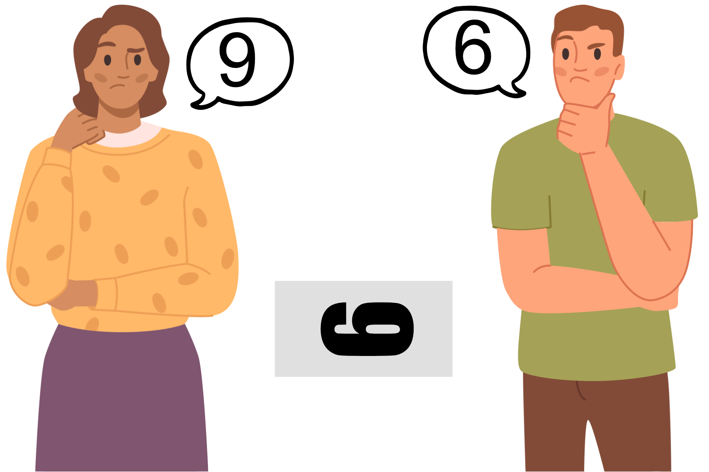
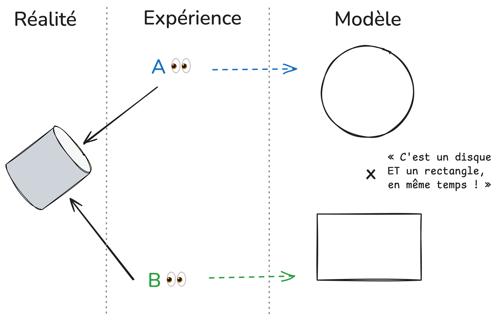

Il existe au sein des ostéopathes de nombreux courants de
pensées qui coexistent et parfois s’opposent, tant dans leurs
approches philosophiques que leurs applications pratiques. Parmi les
différentes têtes de cette hydre, l’une d’entre-elle est caractérisée
par des ostéopathes qui tentent d’agrémenter leur pratique via **les
données les plus récentes de la science**, ces derniers étant généralement
désignés par **ostéopathes EBP** (pour *Evidence Based Practice*).

Souvent, il est reproché aux ostéopathes se réclamant de ce
courant de **tuer l’ostéopathie** par une volonté scientiste d’en
réfuter les textes fondateurs. Ceci serait alors dû à une certaine
étroitesse d’esprit de leur part, ainsi qu’à leur manque d’expérience.
Pour certains, l’ostéopathie serait **même bien trop complexe** pour être
évaluée scientifiquement, la pratique
<abbr title="Evidence Based Practice">EBP</abbr> se révélant alors être appauvrie
et limitée par rapport aux modèles traditionnels.

Au cours de cet article, nous aborderons différents points souvent
reprochés aux ostéopathes <abbr title="Evidence Based Practice">EBP</abbr> et
tenter d’y répondre à l’aide de définitions et d’exemples concrets.
L’idée ici ne sera pas de proposer un contenu exhaustif. Il s’agit plutôt
d'**une invitation auprès de celles et ceux qui ne se seraient pas encore
intéressés à l'<abbr title="Evidence Based Practice">EBP</abbr>**, à faire un pas
de côté par rapport à la philosophie ostéopathique traditionnelle afin d’en
envisager une alternative.

Les ostéopathes <abbr title="Evidence Based Practice">EBP</abbr> représentent-ils
la tête gangrenée de l’ostéopathie ou peuvent-ils être au contraire une
porte de sortie de *l’ostéobashing* ? Tentons ensemble de répondre à ces questions.

<!--more-->


L'auteur s'exprime à titre personnel dans cet article.


## Est-ce un manque d’ouverture d’esprit ?
En suivant les nombreux débats qui existent au sein de la communauté
ostéopathique, il n’est pas rare d’observer de fortes divergences d’opinions
à la fois pratiques et conceptuelles. L’invocation d’un *« manque d’ouverture d’esprit »*
afin de décrédibiliser le contradicteur est alors fréquente.

Ainsi, l’ostéopathe <abbr title="Evidence Based Practice">EBP</abbr>
serait fermé d’esprit aux idées développées dans les textes fondateurs de
l’ostéopathie. Sa position idéologique se retrouve alors assimilée à de
l’inculture ou à l’incompréhension du savoir ancien par manque de
souplesse intellectuelle ou scientisme.
Il est aussi souvent justifié que la vérité est relative et dépend du
point de vue, cet argument arguant qu’une pluralité de réponses se valent
dans leurs descriptions parfois opposées du réel.

Qu’en est-il ?

Si l’ouverture d’esprit se caractérise par la capacité d’une personne
à aborder une idée nouvelle, ainsi que d’en accepter sa libre expression,
on peut dès lors remarquer plusieurs choses à l’appel de cet argument.

### L'ouverture d'esprit et l'esprit critique ?
Si l’ouverture d’esprit est **une qualité indéniable**, elle demeure bien
incomplète si cet esprit n’est pas critique.

Comme le dit Jean Rostand:
> avoir l’esprit ouvert n’est pas l’avoir béant à toutes les sottises.

L’esprit critique se caractérise par **la capacité à interroger les
limites d’un raisonnement** à l’aide d’outils d’analyse critique. Il est une
composante du rationalisme en philosophie et vise à **remettre en doute les
informations qui nous parviennent de manière sensible** (par empirisme).

Ainsi, s’il est indéniable que nous ressentons des choses variées lors
d’une consultation, nous pouvons cependant interroger la nature de ces
sensations, mouvements, “blocages” ou autres MRP: sont-ils provoqués par
un phénomène physique mesurable ? Où s’agit-il ici d’une sorte
d’illusion constructiviste de notre cerveau issue du toucher ?

Pour illustrer cette dernière question, nous pouvons prendre l’exemple
d’une des nombreuses illusions d’optique nous faisant percevoir des
mouvements factices: ici, aucun d’entre nous ne s'aventurait à dire que cette
figure sur une feuille de papier bouge *réellement*:
, via Wikimedia Commons")

Tout comme il existe aussi des illusions auditives: et pourtant là non plus
personne ne jurerait que le chanteur de Scorpions affirme qu’il a
*« les pieds qui puent »*:


Ainsi, si **notre vue et notre ouïe sont corruptibles**, qu’en est-il de notre
toucher ?

En psychologie, il existe un phénomène appelé **effet idéomoteur** qui consiste
en la réalisation de mouvements réflexes et inconscients chez un sujet en
train de mentaliser ces mouvements. Dit autrement, si on est conditionné à
ressentir un mouvement (ou même une sensation) même en l’absence de stimuli
physique, alors il est tout de même possible de le percevoir.

Dès lors, **l’effet idéomoteur** peut représenter un **biais non négligeable**
dans la perception de mouvements fins.

Nous pouvons alors ici appliquer un principe épistémologique appelé le rasoir
d’Ockham. Cet outil consiste à préférer l’hypothèse la moins coûteuse à
vérifier.
Si nous prenons l’exemple du mouvement respiratoire primaire, voici comment
le rasoir d’Ockham peut s’appliquer:

 - **hypothèse 1**: le mouvement perçu par l’ostéopathe est inhérent au
   vivant et repose sur un concept vitaliste. Il faudrait alors objectiver
   ce mouvement ou le mettre en évidence en dehors des perceptions sensibles
   des ostéopathes, ce qui représente un coût méthodologique.
 - **hypothèse 2**: le mouvement perçu par l’ostéopathe repose sur un
   phénomène psychologique connu, mesurable et reproductible. Ici le coût
   est moindre, cette hypothèse est donc à privilégier le temps de collecter
   de nouvelles données.

L’**effet idéomoteur** pourrait-il donc être la clé du **mouvement respiratoire
primaire** ? Soyons ouvert d’esprit afin de l’envisager.

L’esprit critique revient donc à *« penser contre son cerveau »*,
c'est-à-dire à résister à la première conclusion qui nous apparaît à
l’esprit (Gaston Bachelard).
Ainsi, s'il semble essentiel d’être capable de recevoir une idée nouvelle,
la passer sous le crible de la critique est une condition sage avant
de l’adopter.
Faisons donc preuve **d’ouverture d’esprit critique** !

Quelques ressources pour aller plus loin:
 - [L'ouverture d'esprit et ses limites](https://www.youtube.com/watch?v=wtJwVZGuiOY)
 - [L’effet idéomoteur, ou comment la pensée crée le mouvement (3/6) | Votre cerveau, saison 2](https://www.youtube.com/watch?v=OaaQXoHyu00)
 - [Rasoir d’Ockham](https://cortecs.org/superieur/rasoir-occam10/)

### Ouverture d’esprit et relativisme
L’ouverture d’esprit est parfois définie à tort par le **relativisme**,
doctrine philosophique qui suggère qu’aucune connaissance n’est objective
et qu’il n’existe pas de vérité absolue.

Au regard de la méthode scientifique, si certains aspects pourraient
permettre de défendre une position pseudo relativiste (erreurs de mesure,
variabilité d’interprétation des résultats, modèles réformables, etc…),
d’autres sont antinomiques: il faudra par exemple des **arguments d’une
extrême robustesse** pour remettre en question la rotondité de la Terre.
Cette dernière ne pouvant par ailleurs pas être à la fois ronde et plate[^1].

[^1]: Harding, P. and Hare, W. (2000), Portraying Science Accurately in
      Classrooms: Emphasizing Open-Mindedness Rather Than Relativism.
      J. Res. Sci. Teach., 37: 225-236.
      https://doi.org/10.1002/(SICI)1098-2736(200003)37:3<225::AID-TEA1>3.0.CO;2-G

Par analogie avec l’ostéopathie, il devient donc incongru d’affirmer que
toutes les approches ou sensibilités se valent en termes de pertinence et
d’efficacité clinique.

### Ouverture d’esprit et dogmatisme
L’accusation d’un manque d’ouverture d’esprit est souvent associée avec
le fait d’être dogmatique ou scientiste.

Le **dogmatisme** se caractérise par la tendance qu’a une philosophie
ou une école de pensée à **être hermétique à toute forme de critique et
de remise en question** de ses connaissances.
Si la méthode scientifique demeure à ce jour le procédé le plus efficace
pour décrire les phénomènes naturels et comprendre les mécanismes qui
les sous tendent, elle n’a pas pour objectif ou prétention de détenir **LA vérité**.
Ainsi, si une expérience ou une démonstration vient contredire une
hypothèse ou une théorie, alors ces dernières seront soit améliorées, soit
réformées. Cette capacité à façonner la science et à en transformer les
modèles et théories nécessite donc bel et bien une bonne capacité
d’ouverture d’esprit. De fait, **la démarche scientifique est antinomique
avec une attitude dogmatique**.

Le **scientisme** quant à lui est la position philosophique selon laquelle
**la connaissance n’est atteignable que par la méthode scientifique**. La
science pouvant se définir comme étant un corpus de connaissances, et
la méthode scientifique comme étant la démarche permettant de compléter ce corpus.
Le scientisme peut également désigner péjorativement la croyance selon
laquelle la méthode scientifique devrait idéalement être appliquée à tous
les domaines de l’humanité, tels que la morale, l’éthique ou la politique.
Il peut être décrit par certains comme une forme de dogmatisme scientifique ou
de foi en la science.

Dans le cadre de l’ostéopathie, nous voyons que **l’application de la
méthodologie scientifique n’a rien de scientiste**: en effet, le champ de
la santé étant intrinsèquement lié à des phénomènes naturels, il semble tout
indiqué que la méthode scientifique puisse s’y appliquer, **l’ostéopathie n’y
faisant pas exception**.

Enfin, toute personne qui exige de l’ouverture d’esprit de la part
de son interlocuteur devrait donc lui-même être en capacité de se poser
cette question:
> Suis-je suffisamment ouvert d’esprit pour envisager que ce que
> je crois n’est peut-être pas vrai ?

Si la réponse est négative, c’est que la personne fermée d’esprit n’est
peut être pas celle désignée.

Ainsi, une personne ouverte d’esprit serait capable d’encaisser plus
facilement une **dissonance cognitive** lorsque ses croyances sont remises
en question, ce qui encore une fois corrobore avec l’attitude nécessaire
pour se remettre en question afin de parfaire ses connaissances[^2].

[^2]: Hunt, M. F., Jr., & Miller, G. R. (1968). Open- and closed-mindedness,
      belief-discrepant communication behvior, and tolerance for cognitive
      inconsistency. Journal of Personality and Social Psychology,
      8(1, Pt.1), 35–37. https://doi.org/10.1037/h0021238

### Le cas des EBPresques
Les débats internes à l’ostéopathie ne peuvent pas se réduire à
une dichotomie opposant les traditionalistes et les
<abbr title="Evidence Based Practice">EBP</abbr>s. S’il existe
très probablement des débats au sein des différents courants traditionalistes,
nous allons **évoquer ici les critiques que les ostéopathes se
revendiquant d’une pratique dite
<abbr title="Evidence Based Practice">EBP</abbr> se reprochent entre eux**.

En premier lieu, précisons que l’usage du terme *“ostéopathie
<abbr title="Evidence Based Practice">EBP</abbr>”* est un oxymore
issu du langage courant et ne valide de ce fait pas le concept
ostéopathique du point de vue scientifique. Nous l’utiliserons tout
le long de cet article dans un but de praticité, sous-entendant qu’un
ostéopathe peut pratiquer la thérapie manuelle, le diagnostic d’exclusion
et le relationnel patient/praticien avec l’apport des données scientifiques.

Ceci étant dit, il peut maintenant **devenir intéressant pour certains
ostéopathes de se réclamer d’une pratique informée par la science** sans
même y être formé ou en comprendre les mécanismes.
Ces derniers pourraient donc être tentés d’appliquer simplement ce
qui est prouvé, tout en reniant strictement tout ce qui ne l’est pas.
Ne leur en déplaise, **la réalité est souvent plus nuancée**, et ce même
dans les sciences les plus précises.

En bref, pour tenter d’apporter des preuves de l’efficacité d’une approche
thérapeutique, la démarche consiste à **réaliser un essai clinique**. Pour que
le résultat de cet essai soit crédible, il faut que sa méthodologie soit
performante et que ses **résultats puissent être reproductibles** si l’essai
est réitéré. Si plusieurs essais cliniques sont réalisés sur le même thème,
ceci peut permettre la **réalisation d’une méta-analyse** permettant de
synthétiser l’ensemble des résultats en un seul. La méta-analyse est aujourd’hui
ce qui est considéré comme étant **le plus haut niveau de preuve scientifique**.

Mais rappelons alors qu’un essai clinique, si performant soit-il, aura
tendance à être réalisé dans un contexte expérimental très strict[^3]
avec des critères d’exclusions et d’inclusions. Dès lors, son résultat
pourrait ne pas être parfaitement reflété dans une situation dite réelle,
ou clinique.
En effet, un essai clinique contrôlé et randomisé s’intéresse à une
population donnée, mais **pas à l’individu que nous avons en face de nous
dans notre cabinet**[^4].

[^3]: Loudon K, Treweek S, Sullivan F, Donnan P, Thorpe K E, Zwarenstein M et
      al. The PRECIS-2 tool: designing trials that are fit for purpose
      BMJ 2015; 350 :h2147 doi:10.1136/bmj.h2147
[^4]: Eschwège, Eveline and Gilles Bouvenot. “Essais explicatifs ou pragmatiques,
      le dualisme.” Revue de Médecine Interne 15 (1994): 357-361.

Or, d’après *David L Sackett*[^5], l’<abbr title="Evidence Based Practice">EBP</abbr>
se définit par
> l’utilisation consciencieuse et judicieuse des meilleures données actuelles
> de la recherche clinique dans la prise en charge personnalisée de chaque patient.
> [Ainsi,] les bons thérapeuthes s'appuient à la fois sur leur expertise clinique
> individuelle et sur les meilleures données externes disponibles, et aucune de
> ces deux approches n'est suffisante à elle seule.

[^5]: Sackett D L, Rosenberg W M C, Gray J A M, Haynes R B, Richardson W S.
      Evidence based medicine: what it is and what it isn't
      BMJ 1996; 312 :71 doi:10.1136/bmj.312.7023.71

Pour être réalisée de manière optimale, l’approche
<abbr title="Evidence Based Practice">EBP</abbr> nécessite donc d’utiliser
les données de la science, mais ceci en fonction des particularités du
patient et de l’expérience clinique du praticien. Dès lors, l’utilisation
de données de la recherche **ne peut se faire sans un raisonnement clinique
rigoureux et une écoute active du patient** afin de capter et considérer les
facteurs non pris en compte par les essais cliniques.

La donnée probante naît en dehors de la relation patient·e-praticien·ne,
mais devient pertinente si elle est évaluée au-dedans de cette relation.
Un·e patient·e, n’est pas une statistique.

Ainsi, l’**étude LC-Ostéo**[^6] nous montrait par exemple que les manipulations
ont un effet statistique faible sur les lombalgies communes subaiguës et
chroniques et un effet clinique questionnable.

[^6]: Nguyen C, Boutron I, Zegarra-Parodi R, et al. Effect of Osteopathic
      Manipulative Treatment vs Sham Treatment on Activity Limitations
      in Patients With Nonspecific Subacute and Chronic Low Back Pain:
      A Randomized Clinical Trial. JAMA Intern Med. 2021;181(5):620–630.
      doi:10.1001/jamainternmed.2021.0005

**Un ostéopathe <abbr title="Evidence Based Practice">EBP</abbr> devrait-il
donc en conclure qu’il ne sert a rien de manipuler ses
patient·e·s lombalgiques chroniques ?**

Rappelons alors que si un effet est statistiquement faible sur une
population, **c’est qu’il peut se révéler nul sur un individu et fort chez
un autre qui serait très répondant**. Sans ouvrir la porte au relativisme
du *“toutes les approches se valent”* rappelons que l’intérêt des manipulations
est tout de même assez bien documenté. Et mentionnons également que si
l'étiologie de la très répandue lombalgie commune est souvent
idiopathique, cela signifie que nous ne savons pas tout, ce qui est
la norme plutôt que l'exception en science.

De plus, une douleur chronique est définie par l’[IASP](https://www.iasp-pain.org/)
par **une douleur ayant un retentissement fonctionnel et psychologique depuis
plus de 3 mois**. Mais est ce que toute douleur de plus de 3 mois est une
douleur chronique ?[^7]

[^7]: Taylor AJ, Kerry R. When Chronic Pain Is Not "Chronic Pain":
      Lessons From 3 Decades of Pain. J Orthop Sports Phys Ther.
      2017 Aug;47(8):515-517. doi: 10.2519/jospt.2017.0606. PMID: 28760092.

Cet effet de seuil n’écarte en réalité pas toutes les situations ambiguës,
et devra également être **reconsidéré en fonction du contexte clinique**.

Pour revenir à la question, un ostéopathe
<abbr title="Evidence Based Practice">EBP</abbr> devrait-il conclure qu’il
ne sert à rien de manipuler ses patients lombalgiques chroniques? Ou
pourrait-il autrement garder cette donnée en mémoire et la réévaluer
dans les différents contextes de ses relations patient·e-praticien·ne ?

**Restons donc critiques**, même avec les données scientifiques, les
définitions et les recommandations de bonne pratique[^8].

[^8]: Haute Autorité de Santé. traitement du patient présentant une lombalgie commune.
      Fiche mémo. 2019 [en ligne].
      https://www.has-sante.fr/upload/docs/application/pdf/2019-04/fm_lombalgie_v2_2.pdf
      [Page consultée le 24/05/2025].

## «L’<abbr title="Evidence Based Practice">EBP</abbr> ce n’est plus de l’ostéopathie !»
Un autre argument fréquemment avancé est que si on se limite à ce
qui est prouvé scientifiquement, alors on ne fera plus rien.
Aussi, certains craignent que l’<abbr title="Evidence Based Practice">EBP</abbr>
amène à **une ultra protocolisation de nos consultations et nous fasse
perdre l’individualisation de notre prise en charge** en fonction du patient.

Que peut-on en dire ?

### Si on fait de l’<abbr title="Evidence Based Practice">EBP</abbr> on ne fait plus rien ?
Le fait de penser que l’<abbr title="Evidence Based Practice">EBP</abbr> va
nous faire perdre en diversité d’actes traduit probablement une incompréhension
de ce qu’elle est.
L’Evidence Based Practice (ou Pratique Fondée sur les Preuves en français) est
une démarche de prise en charge médicale se basant sur un triptyque:
 - La pratique **doit être actualisée et basée sur les données
   scientifiques contemporaines**. Ceci permet d’orienter le traitement en
   fonction des meilleurs niveaux de preuves d’efficacité disponible dans
   le corpus de connaissances.
 - L’**expérience du professionnel est prise en compte dans le choix du
   traitement**. Ceci implique que dans le cadre d’un manque de données probantes,
   il est toujours possible pour le·la praticien·ne de se baser sur son savoir acquis
   au cours de ses années de pratique. Ce dernier point peut rassurer certains
   praticiens qui ont l’impression que leur expérience est remise en question
   par *“les plus jeunes”*. Mais il est important de rappeler que si l’expérience
   peut être un atout, elle n’est pas un joker quant à l’actualisation de ses
   connaissances. Nous aborderons ce sujet plus loin dans l'article.
 - Enfin, **les préférences et les particularités du patient** sont à prendre
   en compte. Ceci relève de l’éthique, de la potentialisation des effets contextuels,
   et permet de nous orienter vers une approche centrée sur le patient.

Par exemple, les données scientifiques actuelles semblent nous montrer que
la **fiabilité de la palpation** basée sur la recherche de dysfonctions
somatiques est **faiblement reproductible en inter-praticien**. De plus,
il semble que ce ne soit pas le traitement de ces dysfonctions qui expliquerait
les résultats que nous observons en clinique.

Cela veut-il dire qu’il faille tout jeter aux oubliettes ? Probablement pas.

### Manualité et clusters de tests
La **manualité est une des composantes identitaires de notre profession** et
représente probablement ce que viennent rechercher la plupart des patient·e·s
qui nous consultent. L’abandonner reviendrait donc à retirer un choix
thérapeutique en accord avec les préférences du patient. Mais si les tests
ostéopathiques classiques montrent effectivement des limites, il existe tout
de même des clusters de tests à utiliser afin d'augmenter notre efficacité
diagnostique et notre compétence de triage.\
Voir à ce sujet l’article de Quentin ANDRÉ pour aller plus loin:
[À quoi peut ressembler une pratique ostéopathique EBP]().

### Modèle Biopsychosocial
C’est également en rapport avec les différents points de l’
<abbr title="Evidence Based Practice">EBP</abbr> que les autorités de
santé internationales recommandent l’utilisation du modèle
biopsychosocial. Ce dernier a été proposé par le psychiatre
*George Libman Engel* et propose une vision systémique englobant et
améliorant le modèle biomédical classique.

Ainsi, le **modèle biomédical** laissait entendre que la seule
régulation des facteurs biologiques et physiopathologiques du
patient suffisait à réaliser une prise en charge optimale.
Pour parodier, chez les médecins, l’application de ce
modèle pouvait prendre la forme d’un pharmaco-solutionnisme.

Le **modèle biopsychosocial** (BPS), tout en conservant les critères
biologiques du modèle biomédical, incorpore également les
dimensions psychologiques et sociales du patient.
La pratique n’est donc plus orientée sur le symptôme, mais **sur le
patient** avec son symptôme et son histoire[^9].

[^9]: Berquin, A. Le modèle biopsychosocial : beaucoup plus qu’un
      supplément d’empathie, Rev Med Suisse, Vol. 6, no. 258,
      2010, pp. 1511–1513.


Il est à noter que le modèle biopsychosocial n’a rien à voir
avec la psychosomatique et s’intéresse davantage aux processus
cognitifs, comportementaux et émotionnels du patient qu’aux
psychopathologies.


Observons maintenant le modèle ostéopathique classique:

Afin de traiter le symptôme de son patient, l’ostéopathe va
rechercher une chaîne dysfonctionnelle, afin de la traiter pour
rétablir l’homéostasie.
Nous remarquons dès lors que ce modèle est finalement plus proche
dans sa structure du modèle biomédical que du biopsychosocial.

Le modèle ostéopathique présente dès lors deux limites par rapport
au biopsychosocial :
- S’il propose une vision holistique, nous devons reconnaître que
  **son approche ne se limite qu’à travers le corps du patient**.
  Certain·e·s objecteront que l’ostéopathe sait que le stress à
  une interaction avec les douleurs. Mais cela ne revient pas à
  prendre en compte les processus cognitifs, comportementaux et
  émotionnels du patient.
  Dit autrement: demander au patient s'il est stressé, ce n’est
  pas pratiquer selon le modèle biopsychosocial.
  Pour cela, des formations à l’entretien motivationnel et aux
  thérapies cognitives et comportementales sont necessaires.
- Puisque c’est l’ostéopathe qui recherche les dysfonctions, cette
  approche ne permet pas la participation active du patient et
  son autonomisation. Elle est donc **praticien-centrée et
  non-patient centrée**.

Au final, intégrer la manualité de l’ostéopathie dans un modèle
<abbr title="Evidence Based Practice">EBP</abbr> et donc
<abbr title="Bio-Psycho-Social">BPS</abbr> **ne fera qu’agrandir
la compréhension et l’approche que l’ostéopathe aura auprès de
son patient**, tant au niveau technique, qu’au niveau intersubjectif[^10].

[^10]: Thomson, Oliver & MacMillan, Andrew. (2023). What's wrong
       with osteopathy?. International Journal of Osteopathic Medicine.
       48. 100659. 10.1016/j.ijosm.2023.100659.

Concernant la crainte d’un manque d’individualisation de prise en
charge du patient dans le cadre d’une consultation
<abbr title="Evidence Based Practice">EBP</abbr>, il faut alors
rappeler que les processus cognitifs, comportementaux, émotionnels,
sensoriels, expérientiels, les croyances et représentations de nos
patients sont représentés sur un spectre d’une très grande
variabilité interpersonnelle. Une approche phénoménologique de nos
patients est donc de mise afin d’essayer d’en identifier la singularité.

De plus, **l’augmentation de notre palette diagnostique et technique**
amènera de facto à plus de diversité au cours de nos consultations.
À l’inverse, comme le disait Abraham Maslow
> si le seul outil que vous avez est un marteau, il est tentant de
> tout considérer comme un clou.

Chaque consultation demeure donc unique.
En résumé, **en pratiquant de manière
<abbr title="Evidence Based Practice">EBP</abbr>, on enlève peu,
et on rajoute beaucoup** !

### Pourquoi est-ce important de réviser nos modèles ?
Dans le domaine scientifique, **un modèle est une représentation
simplifiée de la réalité d’un phénomène**. Il est donc une tentative
d’extraire du réel les mécanismes qui sous tendent ce que l’on perçoit
empiriquement et sera, par essence, imparfait.

Par exemple, dans le cadre de l’ostéopathie, nous constatons tous
que nos patients vont globalement mieux une fois qu’ils sont passés entre
nos mains. C’est via cette observation que le modèle ostéopathique
classique a tenté une explication: ce serait par le traitement de
chaînes dysfonctionnelles que nous aiderions nos patients à retrouver
leur plein état de santé.

Mais ce modèle est-il le plus pertinent pour expliquer les
processus sous-jacents à notre prise en charge ?

Si tel est le cas, **ce modèle explique-t-il aussi nos échecs de traitement**?
Ainsi, que penser d’un patient qui n’irait pas mieux au bout de deux ou
trois consultations malgré la réduction de ses dysfonctions ?

Sur ce dernier point, certains argueront que c’est parce que le
praticien n’est pas assez compétent et/ou n’a pas trouvé la bonne
dysfonction.

Cet argument rencontre deux limites :
- il est un argument *ad hoc*, c'est-à-dire qu’il rajoute une
  hypothèse supplémentaire pour empêcher la réfutabilité du modèle
  ostéopathique. Or, une proposition irréfutable est une erreur
  épistémologique et ne peut être scientifique.
  Par exemple, la théorie de la gravitation est très facilement réfutable:
  il suffirait d’observer un objet flotter au-dessus du sol sans aucune
  autre explication rationnelle.
  Dit autrement, pour qu’une théorie ou un modèle soit scientifique, il
  faut qu’il puisse être possible de le mettre en déroute par une observation
  et/ou une démonstration.
- il représente une oeillère ontologique, en cela qu’il force le
  raisonnement selon le seul point de vue du modèle ostéopathique
  (Rappelons-nous de la [loi du marteau de Maslow](https://fr.wikipedia.org/wiki/Loi_de_l%27instrument))

Il devient alors probant de *faire un pas de côté*, de raisonner via
la complexe neurophysiologie de la douleur et d’agrémenter notre
travail d’outils supplémentaires tels que des tests d’exclusions plus
exhaustifs, des exercices et techniques plus adaptés et une approche centrée sur le patient.

Certains pourraient alors objecter que «&nbsp;**la science n’explique pas tout**&nbsp;»
ce qui est vrai. Mais rappelons dès lors que le concept ostéopathique
explique moins de choses que la science.

Refuser une explication sous prétexte qu’elle est incomplète revient à
céder à ce que l’on appelle le biais de la solution parfaite. Ici,
l’intérêt est donc de privilégier le modèle le plus proche de la
réalité en dépit de ses inconnues.

> Tous les modèles sont faux, mais certains sont utiles

disait George Box

### La carte n’est pas le territoire

Ainsi, comme l'illustrait l’analogie du scientifique et philosophe
Alfred Korzybski,

> Une carte n’est pas le territoire

Une carte n’est qu’une tentative de reproduire la réalité d’un
territoire géographique. Elle contiendra de ce fait des approximations
dans un but de praticité, ou parfois des erreurs pour causes méthodologiques.

Ainsi, si la projection cartographique de Mercator à pour avantage de
préserver les angles afin de faciliter la navigation maritime, le Groenland y
apparaît **aussi grand que l’Afrique** alors qu’il est **en réalité 14 fois plus petit**!

La projection de Peters quant à elle est plus égalitaire en termes de superficie
des territoires, mais en déforme les angles, rendant la navigation difficile.
Cela provient du fait qu’il est mathématiquement impossible de représenter
une sphère sur une surface plane.

, via Wikimedia Commons")

Mais que dire d’un navigateur qui utiliserait une projection platiste
de la Terre ? Les distances et trajectoires calculées s’en retrouveraient
complètement fausses et le marin n’arriverait pas à bon port.

Maintenant, que penser de la carte “*dysfonction ostéopathique*” afin
d’expliquer le territoire “*être humain*” ?

Selon les données scientifiques, cette carte de lecture ne permet pas
de prédire ce que l’on observe lors de nos consultations. Elle ne semble
pas non plus expliquer la complexité des phénomènes neurophysiologiques
douloureux, ainsi que leur interrelation psychosociale.

Veuillez voir ceci comme une invitation métaphorique à oser utiliser
d’autres cartes plus adaptées et référencées.

Pour conclure, si la carte utilisée est importante, un bon marin vous
rappellera tout de même de regarder la mer. Ainsi pour le redire, une
donnée scientifique demeure une donnée, mais ne dispense pas de la
réévaluer selon le contexte clinique du patient.

### Est-ce plus efficace ?
Si un changement de paradigme est proposé, il est normal de se questionner
sur la potentielle utilité de cette transition. Sous réserve de poursuivre
les recherches, plusieurs études prometteuses ont été réalisée et sont
actuellement en cours:

Ainsi, OstéoMAP[^11] a conclu que l’incorporation de la thérapie d’acceptation
et d'engagement (en anglais, *acceptance and commitment therapy* ou ACT)
et de la méditation pleine conscience à la pratique de l’ostéopathie permettait
d’obtenir “*des effets positifs sur la douleur, la fonction, l’humeur
et l'adaptation et que les patients semblaient développer plus de
flexibilité psychologique*” dans le cadre de la douleur chronique.

[^11]: Carnes, Dawn & Mars, Tom & Plunkett, Austin & Nanke, Lorraine
       & Abbey, H.. (2017). A mixed methods evaluation of a
       third wave cognitive behavioural therapy and osteopathic
       treatment programme for chronic pain in primary care
       (OsteoMAP). International Journal of Osteopathic Medicine.
       24. 10.1016/j.ijosm.2017.03.005.

De plus, les recommandations du NICE nous indiquent que la thérapie
manuelle ne devrait être proposée que conjointement à des exercices
ou des outils issus de la psychologie dans le cadre de la lombalgie
commune avec ou sans sciatalgie[^12][^13].

[^12]: National Institute for Health and Care Excellence (NICE).
       Chronic pain (primary and secondary) in over 16s: assessment of all
       chronic pain and management of chronic primary pain
       07 Avril 2021 [en ligne].
       https://www.nice.org.uk/guidance/ng193/chapter/Recommendations#managing-chronic-primary-pain
       [Page consultée le 24/05/2025].

[^13]: National Institute for Health and Care Excellence (NICE).
       Low back pain and sciatica in over 16s: assessment and management
       11 Décembre 2020 [en ligne].
       https://www.nice.org.uk/guidance/NG59/chapter/Recommendations#non-invasive-treatments-for-low-back-pain-and-sciatica
       [Page consultée le 24/05/2025].

Ainsi, il apparaît que travailler avec le modèle <abbr title="BioPsychoSocial">BPS</abbr>
permet de mieux interagir avec les phénomènes douloureux complexes
de nos patient·e·s que le seul modèle ostéopathique.

Concernant nos compétences de triage, différentes études nous montrent
que **jusqu’à 30% de nos patients souffrent d’hypertension sans le savoir**[^14],
et que **jusqu’à la moitié de ceux présentant une lombalgie ont des douleurs
neuropathiques**[^15][^16]. Il devient donc nécessaire de maîtriser les différents
questionnaires et tests cliniques permettant d’identifier ces patients afin
de mieux les réorienter et/ou les prendre en charge[^17].

[^14]: Taylor AJ, Kerry R. Vascular profiling: should manual therapists
       take blood pressure? Man Ther. 2013 Aug;18(4):351-3.
       doi: 10.1016/j.math.2012.08.001. Epub 2012 Sep 25. PMID: 23021565.

[^15]: Spahr N, Hodkinson D, Jolly K, Williams S, Howard M, Thacker M.
       Distinguishing between nociceptive and neuropathic components
       in chronic low back pain using behavioural evaluation and
       sensory examination. Musculoskelet Sci Pract. 2017 Feb;27:40-48.
       doi: 10.1016/j.msksp.2016.12.006. Epub 2016 Dec 12.
       PMID: 28637600; PMCID: PMC5329124.

[^16]: Jiang Z, Davies B, Zipser C, Margetis K, Martin A, Matsoukas S,
       Zipser-Mohammadzada F, Kheram N, Boraschi A, Zakin E, Obadaseraye OR,
       Fehlings MG, Wilson J, Yurac R, Cook CE, Milligan J, Tabrah J, Widdop S,
       Wood L, Roberts EA, Rujeedawa T, Tetreault L; AO Spine RECODE-DCM
       Diagnostic Criteria Incubator. The value of Clinical signs in
       the diagnosis of Degenerative Cervical Myelopathy - A
       Systematic review and Meta-analysis. Global Spine J.
       2024 May;14(4):1369-1394. doi: 10.1177/21925682231209869.
       Epub 2023 Oct 30. PMID: 37903098; PMCID: PMC11289551.

[^17]: Truini A, Aleksovska K, Anderson CC, Attal N, Baron R, Bennett DL,
       Bouhassira D, Cruccu G, Eisenberg E, Enax-Krumova E, Davis KD,
       Di Stefano G, Finnerup NB, Garcia-Larrea L, Hanafi I, Haroutounian S,
       Karlsson P, Rakusa M, Rice ASC, Sachau J, Smith BH, Sommer C,
       Tölle T, Valls-Solé J, Veluchamy A. Joint European Academy of
       Neurology-European Pain Federation-Neuropathic Pain Special
       Interest Group of the International Association for the Study
       of Pain guidelines on neuropathic pain assessment. Eur J Neurol.
       2023 Aug;30(8):2177-2196. doi: 10.1111/ene.15831. Epub 2023 May 30. PMID: 37253688.

Nous voyons donc ici qu’en plus de diversifier notre approche,
l'agrémentation d’outils <abbr title="Evidence Based Practice">EBP</abbr> à
notre pratique manuelle est pertinente pour augmenter la sécurité et
l'efficacité de nos décisions thérapeuthiques[^18].

[^18]: Vlaeyen JWS, Maher CG, Wiech K, Van Zundert J, Meloto CB,
       Diatchenko L, Battié MC, Goossens M, Koes B, Linton SJ. Low back pain.
       Nat Rev Dis Primers. 2018 Dec 13;4(1):52. doi: 10.1038/s41572-018-0052-1. PMID: 30546064.

## «Ceux qui critiquent l’ostéopathie sont des jeunes sans expérience»

L’appel à l’inexpérience est souvent utilisé contre l’ostéopathe
qui critique sa propre discipline, notamment le *jeune ostéopathe*.
Ainsi, son manque d’expertise clinique et son ignorance des textes
fondateurs de l’ostéopathie seraient les moteurs de sa critique.
Cette idée, en plus de réduire l’accès à la connaissance par la
seule expérience pratique, relève d’une probable **confusion entre
expérience et compétence**.

Quelles sont les différences entre l’expérience et la compétence et
comment sont-elles interreliées ?

### L’expérience
L’**expérience** peut se définir comme étant la somme des
connaissances acquises à travers l'interaction avec
l’environnement et la pratique. Elle a donc des liens avec,
entre autres, l’empirisme et le pragmatisme[^19].

[^19]: Bandini, A. (2018), « Empirisme », version Grand Public,
       dans M. Kristanek (dir.), l’Encyclopédie philosophique,
       Septembre 2018 [en ligne].
       http://encyclo-philo.fr/empirisme-a/
       [Page consultée le 24/05/2025].

L’*empirisme* est la doctrine philosophique stipulant que
la connaissance est accessible par l’expérience sensible.
Le *pragmatisme* lui, peut être considéré comme une forme
d’empirisme par l’action et la pratique. Il en appelle à ce qui est concret.

Rapporté à l’ostéopathie, l’empirisme serait, par exemple, le
fait d’apprendre à déterminer un schéma dysfonctionnel à
travers ce que l’on ressent avec nos mains. Quant au pragmatisme,
il reviendrait au fait d’utiliser des techniques spécifiques
en fonction des résultats obtenus par le passé.

Si l’empirisme est une composante de la méthode scientifique,
il est important de préciser qu’il ne se rapporte pas à
la subjectivité de chacun. Ainsi, pour minimiser les biais
issus de nos perceptions sensibles qui sont faillibles,
une expérience empirique doit être reproductible et
intersubjective. Dit autrement, elle **doit être cohérente
entre plusieurs observateurs**.

Or, nous savons que nos perceptions ne sont pas
reproductibles d’un praticien à l’autre et constituent
donc un faible outil diagnostic. Nous avons également à
notre connaissance qu’il y a peu de différence d’efficacité
entre l’usage d’une technique manuelle par rapport à une autre.
Cela met donc à mal la solidité des connaissances
prétendument empiriques et pragmatiques de notre profession.

De plus, il existe un débat philosophique soulignant
les limites de l’acquisition de la connaissance via
la seule expérience, jugeant cette dernière sujette
à l’erreur, à la passion et l’opposant à la raison.

### La Compétence
La compétence, elle, pourrait se définir par la
capacité à mobiliser nos connaissances dans l’action et
dans un contexte adapté. Ainsi, si l’on articule la
compétence avec l’expérience, la compétence reviendrait
à utiliser les connaissances issues de l'expérience et à les réutiliser[^20].

[^20]: Richard Wittorski. De la fabrication des compétences.
       Éducation permanente, 1998, La compétence au travail, 135, pp.57-69.
       hal-00172696 https://hal.science/hal-00172696/document

Mais que devient la compétence si les connaissances
issues de l’expérience ne sont pas fiables ?

> La compétence correspond à la mobilisation dans l’action
> d’un certain nombre de savoirs combinés de façon spécifique
> en fonction du cadre de perception que se construit
> l’auteur de la situation.

Richard Wittorski – *Analyse du travail et production de compétences collectives*

### La Connaissance
Nous nous retrouvons donc à devoir définir ce qu’est une
connaissance. Nous allons dans un but de simplification nous
contenter de sa définition épistémologique la plus simple:\
Une connaissance est **une croyance vraie justifiée**[^21][^22][^23].

[^21]: The Analysis of Knowledge, Mar 2017 [en ligne].
       https://plato.stanford.edu/entries/knowledge-analysis/
       [Page consultée le 24/05/2025].

[^22]: Etienne Klein - Croyances scientifiques. YouTube,
       publié par Pas Moi, consulté le 24/05/2025, https://youtu.be/mMJDcyEGbcg

[^23]: Monsieur Phi - LA SCIENCE EST UNE CROYANCE
      (si c'est vrai c'est très grave) | Quelques bases en épistémologie. YouTube,
      publié par Monsieur Phi, consulté le 24/05/2025, https://youtu.be/YQ_qr-LA3AU

Nous pouvons donc ici décomposer cette définition en trois points :
- une connaissance est une forme de croyance;
- “*vraie*” signifie que ce qui est faux ne peut pas être su;
- “*justifiée*” implique qu’une connaissance soit factive,
  c’est à dire relative à un fait.

Une connaissance serait donc tout ce qui est vrai en
dehors de nos conceptions intériorisées. Ainsi, dès lors
qu’une connaissance nous parvient, cette dernière prend
la forme d’une croyance qui nous est propre.

Une croyance à contrario, peut se définir par le fait
de tenir pour vrai quelque chose indépendamment
de sa factivité et de sa réalité[^24].

[^24]: Spinoza, Court traité de dieu, de l’homme et de la
       santé de son âme. Traduit par Charles Appuhn.
       Mars 2012 [en ligne]
       http://hyperspinoza.caute.lautre.net
       [Page consultée le 24/05/2025].

Ainsi, par exemple:
- Croire que la Terre est ronde est une croyance.
- Cette croyance est vraie car elle peut
  être justifiée par des faits.
- La Terre demeure ronde même si certain·e·s la croient plate.
- C’est une connaissance.

Autre exemple:
- Croire que le <abbr title="Mouvement Respiratoire Primaire">MRP</abbr> existe est une croyance.
- Cette croyance est fausse car elle ne peut
  être justifiée par des faits.
- Le <abbr title="Mouvement Respiratoire Primaire">MRP</abbr> n’existe pas même si certain·e·s y croient.
- C’est une croyance.

On pourra objecter que ce n’est pas parce que
l’existence du <abbr title="Mouvement Respiratoire Primaire">MRP</abbr>
n’a pas encore été prouvée que ce ne sera pas le cas à l’avenir.
Si ceci demeure effectivement une possibilité, nous pouvons néanmoins souligner
plusieurs remarques à cet argument:

- Il est un biais de raisonnement nommé *“appel à Galilée”*.
  Ce dernier consiste à invoquer le fait que la thèse sur
  l’héliocentrisme de Galilée à rencontré une très forte
  opposition avant d’être reconnue comme valide par la suite.
  L’idée ici est donc de considérer que si cet exemple
  existe, alors il peut s’appliquer à une autre hypothèse
  aujourd’hui refusée.
  Mais rappelons que c’est l'inquisition et non la communauté
  scientifique qui refusait de considérer la thèse de Galilée.
  D’autre part, soulignons que 99,9999999…% des hypothèses
  pouvant être formulées dans l’absolu demeureront
  fausses sur un temps infini faute de preuves. Nous pouvons
  par exemple ici formuler l’hypothèse qu’il y a du fromage
  sur Saturne et en attendre la preuve pour l’éternité.

- Ensuite, s’échiner à chercher ou attendre une preuve de
  l’existence du MRP pourrait nous empêcher de réfléchir à
  une alternative plus probante.
  En effet, il existe de nombreux concepts pris très au
  sérieux dans les sciences les plus précises qui se
  sont avérés faux parfois plusieurs siècles plus tard.
  C’est le cas par exemple de l'éther dans l’histoire de
  la physique qui a été réfuté en 1905 par Albert
  Einstein avec sa théorie de la relativité restreinte. Ici,
  qu’un concept comme le MRP soit faux serait donc
  plus la norme que l'exception.

Précisons ici que cet argumentaire n’est pas une
injonction à ne plus toucher la tête de nos patient·e·s.
En effet, il n'est pas déraisonnable de penser que
l’abord du crâne puisse apporter quelque bénéfices
selon le contexte. Il s’agit plus ici d’interroger
si c’est réellement “l’hypothèse MRP” qui explique
au mieux ce que nous observons au cabinet. En l’absence
de ce questionnement, le risque est de faire un *biais
d’attribution causale*, c'est-à-dire d’attribuer de
mauvaises causes à de vraies conséquences, et de
tomber dans une apophénie.


Une apophénie est un trouble de la perception qui fait relier
des événements ou des phénomènes n’ayant aucun lien entre eux.


Nous voyons ici qu’il est raisonnable de reconsidérer
une croyance jugée a priori vraie.

Ainsi pour revenir à la notion d’expérience: au vu de
l’évolution des connaissances scientifiques, il apparaît
rationnel de penser qu’un vieux médecin expérimenté du
XIXème siècle était à certains égards moins compétent
qu’un jeune médecin sans expérience d’aujourd’hui.

Nous pouvons donc raisonnablement **interroger la plus
value de l’expérience d’un praticien si cette dernière
est basée sur des croyances fausses** plutôt que sur
des connaissances. Dès lors, un jeune ostéopathe avec
peu d'expérience clinique pourra s’appuyer sur ses
compétences, si tant est que ces dernières soient
basées sur des connaissances.

### Mais faut-il alors rejeter l’expérience ?
Il serait probablement radical et déraisonnable de penser cela.
L'expérience peut nous servir à agir dans des situations
moins théoriques, ou dans lesquelles les connaissances
deviennent parcellaires ou difficiles à articuler entre
elles. Ainsi, **certaines décisions médicales se prennent
parfois de manière quasi intuitive**, ces dernières étant
appuyées sur l'expérience du praticien ou une certaine
capacité de lecture à froid[^25][^26][^27][^28][^29][^30].

[^25]: COLINO, Stacey (National Geographic). L'intuition des médecins
       surpasse les modèles prédictifs de l'intelligence artificielle.
       [en ligne]. Disponible sur: https://www.nationalgeographic.fr/sciences/sante-publique-medecine-traitement-intuition-des-medecins-surpasse-les-modeles-predictifs-intelligence-artificielle-ia-technologie
       [Consulté le 25/04/2025].

[^26]: Oostendorp RAB, Scholten-Peeters GGM, Mulder J, Van Trijffel E,
       Rutten GM, De Kooning M, Laekeman M, Roussel N, Nijs J, Elvers JWH.
       Exploratory Study of Associations and Agreement between
       Prognostic Patient-Registered Factors, Physiotherapists'
       Intuitive Synthesis, and Patient-Reported Factors in Whiplash-Associated Disorders.
       J Clin Med. 2023 Mar 16;12(6):2330.
       doi: 10.3390/jcm12062330. PMID: 36983329; PMCID: PMC10051901.

[^27]: Marwaha JS, Beaulieu-Jones BR, Berrigan M, Yuan W,
       Odom SR, Cook CH, Scott BB, Gupta A, Parsons CS,
       Seshadri AJ, Brat GA. Quantifying the Prognostic
       Value of Preoperative Surgeon Intuition: Comparing
       Surgeon Intuition and Clinical Risk Prediction as
       Derived from the American College of Surgeons NSQIP
       Risk Calculator. J Am Coll Surg. 2023 Jun 1;236(6):1093-1103.
       doi: 10.1097/XCS.0000000000000658. Epub 2023 Feb 23.
       PMID: 36815715; PMCID: PMC10192014.

[^28]: Vanstone M, Monteiro S, Colvin E, Norman G, Sherbino J,
       Sibbald M, Dore K, Peters A. Experienced physician
       descriptions of intuition in clinical reasoning: a
       typology. Diagnosis (Berl). 2019 Aug 27;6(3):259-268.
       doi: 10.1515/dx-2018-0069. PMID: 30877781.

[^29]: Zelis N, Mauritz AN, Kuijpers LIJ, Buijs J, de Leeuw PW,
       Stassen PM. Short-term mortality in older medical emergency
       patients can be predicted using clinical intuition: A
       prospective study. PLoS One. 2019 Jan 2;14(1):e0208741.
       doi: 10.1371/journal.pone.0208741. PMID: 30601815; PMCID: PMC6314634.

[^30]: Stolper CF, van de Wiel MWJ, van Bokhoven MA, Dinant GJ,
       Van Royen P. Patients' gut feelings seem useful in
       primary care professionals' decision making. BMC
       Prim Care. 2022 Jul 20;23(1):178.
       doi: 10.1186/s12875-022-01794-9. PMID: 35858872; PMCID: PMC9301863.

Par ailleurs, l'expérience du praticien est un des
éléments du modèle *Evidence Based Medecine*. Son
utilisation y est couplée avec les données de la
science et les préférences du patient.

L’expérience est donc une denrée précieuse à la pratique
d’un thérapeuthe et donc d’un ostéopathe. Mais utilisée
seule, elle est sujette à l’erreur et ne peut s’exercer
parfaitement sans un certain rationalisme et scepticisme.
Il s’agit aussi de ne pas tomber dans un *ipsedixitisme*,
c'est-à-dire de croire en quelque chose sous le seul
prétexte qu’un maître à penser ou un enseignant l’ait affirmé.

## Conclusion
Nous avons vu que beaucoup des arguments opposés à une
pratique EBP dans notre profession ne sont pas fondés,
voire parfois se retournent contre ceux qui les utilisent.

Ainsi, une **pratique informée par la science requiert
d’être ouvert d’esprit et critique afin d’être en capacité
de se remettre en question**. L’idée ici n’étant pas d’être
ouvert à des idées fermées.

Cette ouverture permettra d’interroger les limites et impasses
du concept ostéopathique afin d'améliorer notre pratique avec
des connaissances et modèles plus éprouvés tels que la
neurophysiologie de la douleur et le biopsychosocial.

Enfin, il semble important de sortir de sa zone de confort
et de s'interroger sur ce que l’on croit savoir. Les questions
métacognitives que nous pouvons nous poser étant “*Pourquoi je
pense ce que je pense ?*” et “*Quelles sont les raisons que
j’ai de croire ce que je crois ?*”

À l’aune des critiques qui fusent à notre égard, plutôt que
d’y être hermétique, il demeure **nécessaire de les considérer
afin de nous remettre en question si nous tenons à conserver
et mériter la confiance acquise** auprès de l’opinion publique,
ceci relevant de l’éthique et de la déontologie.

Enfin, il semble que la remise en question des principes
ostéopathiques ainsi que l'agrémentation de nouvelles approches
thérapeutiques sont synonymes de liberté intellectuelle.

Comme le disait Richard Feynman “*Je préfère avoir des questions
auxquelles on ne peut pas répondre, que des réponses
qu'on ne peut pas questionner*”.
