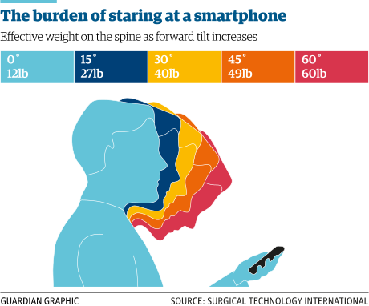

Quand avons-nous commencé à nous dire de nous tenir
droits ? Comment la posture est-elle devenue si chargée
de sens ? Et que peut nous apprendre l’histoire de cette
idée étrange sur notre approche de la santé et de la douleur aujourd’hui ?

> Cet article est une traduction de
> [*Upright and Uptight: the invention of posture*](https://medium.com/@thomas_jesson/upright-and-uptight-the-invention-of-posture-fe48282a4487),
> écrit par Tom Jesson. Il est traduit et publié ici
> avec l’autorisation de l’auteur.

<!--more-->

## Partie 1: du militaire au civil, puis à la médecine

Selon l’historien [Sander Gillman](https://link.springer.com/article/10.1007/s10912-013-9266-0),
l’injonction à se tenir droit trouve ses racines dans
le développement de la formation militaire au XVIe siècle.
Des postures comme celle montrée dans cette gravure flamande
ont commencé comme des instructions pratiques sur la manière
de manipuler les armes telles que les mousquets et les piques.
Mais, selon Gillman, à la fin du XVIIIe siècle, elles avaient
acquis un sens plus large: elles étaient devenues un moyen
de transformer un homme en soldat. La posture devenait un
outil de transformation personnelle et un instrument de discipline.

Ces idées ont ensuite gagné la vie civile au cours du
XVIIIe siècle. L’acteur napolitain Tiberio Fiorillo devient
célèbre à Londres comme *« maître de posture »*, enseignant
l’art de la tenue aux riches et aux gens à la mode. Samuel
Johnson le décrit comme *« celui qui enseigne ou pratique
les contorsions artificielles du corps »*, suggérant que, pour
Johnson du moins, la « bonne posture » n’était pas un état
naturel mais un état imposé.

À mesure que la posture s’imposait dans la vie civile,
les notions de bonnes et mauvaises postures prenaient de
l’importance. Au XIXe siècle, elle devient liée à la santé
et à la maladie. Des courants comme la gymnastique suédoise
ou la *krankengymnastik* allemande (précurseurs de la
kinésithérapie moderne) introduisent l’idée d’une posture
idéale et de postures pathologiques – telles que la cyphose,
la lordose, le dos plat ou cambré. La classe moyenne, en
particulier, investit dans des manuels d’auto-soin, vendus
par millions, leur enseignant comment se tenir droit. Et avec la
maladie vient la morale: Gillman note qu’au milieu du XIXe
siècle, *« la frontière entre [la posture] et la position
morale était devenue complètement floue »*.

En 1855, l’anatomiste allemand Christian Wilhelm Braune
introduisit l'étude de la posture dans le champ médical en
faisant tomber un fil à plomb le long du dos de ses sujets
de recherche alors qu’ils se tenaient au garde-à-vous, et
en mesurant les résultats obtenus.
Selon l’historien William McNeill, cette quantification de la
posture jette les bases des discussions sur la
*« ligne droite à l’intérieur du corps »*, qui
sous-tendent l’orthopédie moderne.

À la fin du XIXe siècle, la posture, après s’être libérée
du milieu militaire pour entrer dans la vie civile, était
désormais infusée de significations concernant non seulement
la discipline, mais aussi la santé, la maladie, la moralité et
la décadence. Elle était également devenue médicalisée.
Puis vinrent quelques décennies remarquables de ce que
les historiens [David Yosifon et Peter N.
Stearns](https://www.jstor.org/stable/2651198?seq=1#page_scan_tab_contents)
appellent les *guerres de la posture*.

## Les guerres de la posture!

Les gens du XIXe siècle avaient été aidés dans leurs efforts
pour s’asseoir et se tenir droits par leurs vêtements plus
rigides et formels — tels que les corsets, les vestes et
les grands manteaux — et par leurs meubles rigides,
moins accommodants. Mais vers la fin du XIXe siècle, les
vêtements et les meubles devinrent moins contraignants.
Cela reflétait un changement idéologique plus large dans la
société, passant de la recherche de la bienséance à un mode
de vie plus détendu et confortable. Ce changement était
étroitement lié à l’essor du consumérisme: les personnes
détendues et en quête de plaisir achètent plus de choses.
Ainsi, les corsets firent place à la robe à franges
délibérément ample et sans contrainte des années 1920; et
les fauteuils rigides du salon furent remplacés par des
canapés à ressorts. En conséquence, les gens commencèrent
à s'avachir et à se laisser aller.

Mais aucun changement culturel n’est sans opposition.
De nombreuses personnes se battirent pour protéger
les habitudes et pratiques traditionnelles de l’essor
du consumérisme et de l’assouplissement de la discipline.
La posture devint un champ de bataille pour une contre-attaque
culturelle qui dura bien jusque dans les années 1950:
les guerres de la posture.

Cette contre-attaque consistait en d’interminables arguments
médicaux et moraux pour défendre une bonne posture, ciblant
particulièrement les enfants et leurs parents inquiets.
La posture devint un sujet central dans les manuels parentaux,
et en 1890, la moitié des enfants étaient identifiés comme ayant
des courbures vertébrales « anormales ». En 1920, l’école devint
le principal lieu de correction de la posture. Jessie Bancroft,
l’une des fondatrices de l’*American Posture League*, encouragea
les enseignants et les infirmières scolaires, dans son livre
*The Posture of School Children* (*La Posture des Enfants
Scolarisés*), à développer leur capacité à repérer les enfants
ayant une mauvaise posture. Yosifon et Stearns qualifient les
programmes de correction de la posture organisés dans les écoles
publiques américaines de « croisade ». Les collèges américains
commencèrent à évaluer, photographier et corriger la posture
des étudiants à leur inscription, ce qui mena à un scandale
des décennies plus tard lorsque des photographies de nus
d’étudiants furent découvertes dans les archives des écoles
de la Ivy League. L’utilisation des écoles comme champ de
bataille pour les guerres de la posture était, selon Yosifon
et Stearns, motivée par un désir de renforcer la discipline
chez les jeunes.

.")

À cette époque plus détendue, l’*étiquette* n’était plus un
argument crédible pour maintenir une bonne posture, et
des justifications médicales furent utilisées à la place.
La posture était perçue comme une composante essentielle de
la bonne santé, et le corps était envisagé comme une
machine devant être maintenue en alignement. Se voûter et
se laisser aller était censé contraindre les organes à ne
pas fonctionner correctement. Cette médicalisation impliquait
la codification et la quantification de la posture dans des
tests comme le Bancroft test (1938) ou le Iowa posture test
(1940). Les exercices devinrent la méthode principale de
correction, et aux États-Unis, Bancroft s’inspira des
systèmes d’exercice allemands, suédois et militaires qui
avaient mis l’accent sur la posture au XIXe siècle.

L’association de la posture et de la moralité se poursuivit,
et peut-être même s’intensifia; un médecin rapporta que la
mauvaise posture était un indice « de gens sournois, de lâches
et de criminels ». Une manière dont les gens expliquaient
cela était de lier une mauvaise posture à une faiblesse de
caractère et à un manque de maîtrise de soi. Nous voyons
aujourd’hui la même logique dans les discussions sur l’obésité.

Yosifon et Stearn affirment qu’un des moteurs clés de cette
médicalisation était simplement l’intérêt professionnel.
La médecine et les disciplines adjacentes commencèrent à
incorporer la posture comme moyen d’accroître l’importance
sociale de leurs propres disciplines. Par exemple, en 1927,
les chiropraticiens commencèrent à organiser des concours de
*Miss Posture Parfaite*, mêlant les idées de santé et de beauté
pour promouvoir leur nouvelle discipline. Un ancien manuel de
kinésithérapie, [*Lectures on massage and electricity in the
treatment of disease* (*Leçons sur le massage et l’électricité
dans le traitement des maladies.*)](http://wellcomelibrary.org/item/b2040735x#?c=0&m=0&s=0&cv=0) préconisait que les
parents vérifient les courbures de la colonne vertébrale de
leurs enfants chaque année, car *« il est impossible de
trop insister sur l’importance de détecter la maladie tôt »*,
et fournissait des instructions sur la meilleure posture assise
pour maintenir une colonne vertébrale en bonne santé.
L’auteur, un médecin, expliquait :

Pour les yeux modernes, la branche la plus désagréable de
cette histoire est l’association de la posture avec la
supériorité nationale ou raciale. L’augmentation de
l’immigration fut un aspect du changement social rapide de
cette période, et l’anxiété à ce sujet semble avoir imprégné
le discours sur la posture. L’eugéniste américain B.G. Jeffries
disait que *« la posture parfaite est l’antithèse de la maladie
et de la décadence morale »*. Le psychologue William Sheldon
utilisa les photos de nus de la Ivy League pour développer
ses théories sur les types corporels ectomorphes, endomorphes
et mésomorphes, et leur relation avec les hiérarchies sociales.
En 1922, le *Lancet* notait que *« certaines races primitives
qui ont l’habitude de s’accroupir […] gardent les genoux et
le dos pliés et ont une démarche et une posture pas beaucoup
meilleures que celles des grands singes. En règle générale,
plus le peuple est civilisé, meilleure est la posture »*.
Les sciences raciales européennes utilisèrent le concept de
la ligne à plomb pour démontrer que les races orientales
étaient plus faibles et plus corrompues. Ces idées trouvèrent
leurs extrêmes en Europe, en Russie et en Chine, où les
sociétés fascistes, stalinistes et maoïstes associèrent
explicitement la posture à leurs divers projets politiques.
Le marxisme considérait la posture droite comme
[*« l’orthopédie morale de la dignité humaine »*](http://tannerlectures.utah.edu/_documents/a-to-z/w/Waldron_09.pdf)
(Ernst Bloch);
le fascisme la voyait comme un trait caractéristique de
l’*übermensch* (ndt: surhomme) aryen.

## La posture défaite ?
Finalement, le consumérisme libéral et le « mode détendu »
l’emportèrent. Se voûter, autrefois novateur et rebelle,
devint si ordinaire que pendant son mandat, l’homme le
plus puissant du monde, Barack Obama, s’asseyait régulièrement
dans le Bureau ovale les pieds sur son bureau.

Yosifon et Stearn affirment que *les guerres de la posture*
furent gagnées brusquement dans les années 60, avec la
« disparition virtuelle » du discours sur la posture dans
les discours moraux, médicaux et parentaux. Par exemple, en
1967, le médecin [J.P. Keeve](https://www.ncbi.nlm.nih.gov/pubmed/5180473)
écrivit un article anti-posture « démystificateur » dans le
Journal of School Health, ressemblant de manière frappante à
un [Adam Meakins](https://x.com/AdamMeakins) rétro.
Il est intéressant de voir que des idées qui semblent
maintenant audacieuses et contre-intuitives sont en
réalité présentes depuis un demi-siècle.

> Un autre sujet de préoccupation mal orientée, souvent mis en
> avant par le personnel scolaire et des parents excessivement
> inquiets, est la question de la posture et de la forme physique.
> Nous continuons à croire, malgré les conclusions de la recherche
> qui disent le contraire, qu’un enfant en bonne santé devrait,
> d’une certaine manière, accomplir ses tâches quotidiennes bien
> plus efficacement s’il essayait de ressembler à un cadet
> exemplaire de *West Point* – de préférence au garde-à-vous.
> Il n’existe aucun fait scientifique pour étayer les bienfaits
> de cet idéal esthétique, et pourtant, beaucoup d’attention
> est consacrée à la « correction des postures défectueuses »
> dans de nombreux systèmes scolaires. En réalité, les mythes
> entourant les tentatives d’agir sur ou pour le système
> musculo-squelettique des enfants sont aujourd’hui plus forts
> que jamais. J’aimerais utiliser ce sujet du bon [...]

Mais nous savons que la posture n’a pas disparu. La plupart
des manuels de kinésithérapie continuent à lui consacrer
quelques colonnes, et la plupart des kinésithérapeutes
l’évaluent toujours, bien que sous des termes plus
(faussement ?) sophistiqués, tels que le positionnement
de la scapula, l’inclinaison pelvienne et la rigidité
segmentaire. Il y a à peine une décennie, [une série d’essais
en kinésithérapie](https://www.ncbi.nlm.nih.gov/pubmed/17013655)
a testé l’entraînement et l’éducation à la posture dans les
écoles avec des enfants dès neuf ans, leur conseillant de
ne pas ressembler au personnage de dessin animé « Lazy Leo, qui
rend ses disques très malheureux en étant paresseux et en
faisant tout de travers ». Les chercheurs ont mis des affiches
dans les salles de classe, formé les enseignants à repérer
et corriger la mauvaise posture, et ont recruté un groupe
d’enfants pour dénoncer leurs camarades, tout comme l’avait
fait l’*American Postural League* il y a cent ans. Il semble
que la posture soit toujours, parfois, un moyen clandestin
de contrôler et de discipliner les enfants, et que la
kinésithérapie puisse être complice.

La culture en général continue également d’exprimer des
angoisses concernant les changements sociaux à travers
la posture, par exemple par la peur des nouvelles technologies causant le « cou de smartphone », ou l’allongement des heures
de travail nécessitant des bureaux debout. Des dispositifs
comme *Upright*™ se fixent à la colonne vertébrale lombaire
de l’utilisateur et vibrent lorsque son dos commence à se
courber. Notre culture reste imprégnée de certaines façons
de penser la posture qui sont paranoïaques ou punitives.

***

[Le site personnel de Tom Jesson](http://tomjesson.com/)
