L’enquête *« Ostéo Pour Tous : Accès aux soins »* a été réalisée
entre le 1er avril et le 8 juillet 2025.

Cette enquête, menée par l’association Ostéo Pour Tous, vise à
mieux comprendre le point de vue de la profession sur l’accès
aux soins. Elle a pour objectif de permettre aux associations
socio-professionnelles et caritatives du paysage ostéopathique
français d’ajuster leur stratégie de plaidoyer auprès des
pouvoirs publics, des complémentaires santé et de la Sécurité sociale.

Sur cette période de près de trois mois, presque **900 ostéopathes en
exercice** ont répondu au sondage.

Les résultats de cette enquête sont présentés dans ce rapport, qui
synthétise les réponses aux questions ouvertes et les opinions
des participants. Un accès aux **résultats bruts publiés en open-data**
est également disponible en fin de rapport.

<!--more-->

## Méthodologie
L’enquête comportait **29 questions**, dont **3 questions ouvertes**
et a été mise en place par l'
[association Ostéo Pour Tous](https://osteopourtous.eu/).
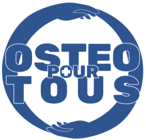

Elle a été diffusée par plusieurs canaux:
- Emailing ciblé auprès des ostéopathes
- Transmission via les organisations socio-professionnelles
- Partage par les associations caritatives d’ostéopathes
- Publications sur les groupes Facebook dédiés à la profession
- Diffusion sur les réseaux sociaux (Facebook, Instagram, LinkedIn)
  via les pages des acteurs de la profession

Pour répondre au questionnaire, les participant·e·s devaient fournir:
- Une adresse e-mail valide
- Leur identité (nom, prénom)
- Leur département d’exercice professionnel
Les données ont ensuite été vérifiées dans le **répertoire
<abbr title="Répertoire Partagé des Professions intervenant dans le système de Santé">RPPS</abbr>**,
afin de ne conserver que les réponses des ostéopathes disposant
d’une autorisation d’exercice.

Sur les 931 réponses initiales, **12 ont été invalidées** pour
des réponses données par des personnes n’étant pas inscrites
au <abbr title="Répertoire Partagé des Professions intervenant dans le système de Santé">RPPS</abbr>,
et **22 ont été invalidées** car envoyées en doublon. Seule
la dernière réponse envoyée a été conservée dans ces cas.

Cette procédure a permis d’écarter au total **34 réponses invalides**,
ramenant le **nombre de réponses valides à 897**. Cette sélection
rigoureuse assure la fiabilité des résultats.

Après ces **vérifications manuelles**, les données ont été
**anonymisées** avant d’être analysées. Il était précisé dès
l’introduction du questionnaire qu’une procédure d’anonymisation
serait appliquée, afin de garantir la confidentialité des répondants.

Pour l’analyse des données et la rédaction du rapport
d’enquête, l’association *Ostéo Pour Tous* a bénéficié de
l’accompagnement d’osteopathes.pro.

## Profil des répondants

- **Nombre total de répondants** : 897 ostéopathes
- **Âge moyen** : 36 ans
- **Âge médian** : 34 ans
- **Âge du plus jeune répondant** : 22 ans
- **Âge du plus âgé** : 83 ans

[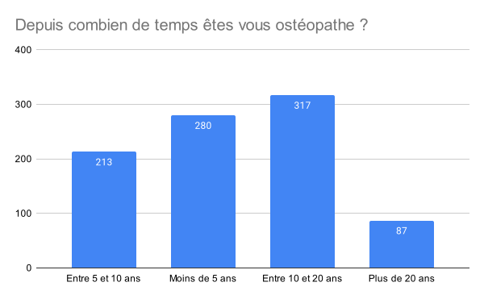](./01-depuis-combien-de-temps-etes-vous-osteopathe.svg)

Les répondants sont répartis sur **95 départements**,
y compris les **DOM-TOM**.

Les **20 départements les plus représentés** sont les suivants:
*Représentant 51 % de l’ensemble des répondants, par ordre décroissant*

- Gironde
- Rhône
- Paris
- Îlle-et-Vilaine
- Seine-et-Marne
- Bouches-du-Rhône
- Isère
- Hauts-de-Seine
- Haute-Garonne
- Yvelines
- Alpes-Maritimes
- Drôme
- Maine-et-Loire
- Loire-Atlantique
- Essonne
- Hérault
- Nord
- Haute-Savoie
- Seine-Saint-Denis
- Les DOM-TOM

Cet échantillon est **territorialement diversifié**,
couvrant **95 % du territoire français**. Il reflète également
une **diversité générationnelle**, avec des ostéopathes issus
de l’ensemble des tranches d’âge en exercice.

On constate une représentation équilibrée entre les départements dits **ruraux** et **urbains**.

Enfin, la répartition des âges semble en cohérence avec la
**démographie nationale de la profession**.

## Résultats du sondage (questions fermées)
[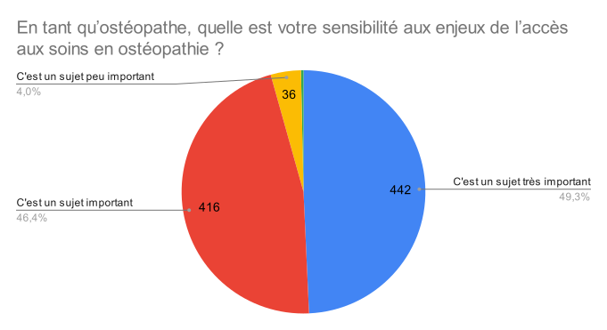](./02-en-tant-qu-osteopathe-quelle-est-votre-sensibilite-aux-enjeux-de-l-acces-aux-soins-en-osteopathie.svg)

[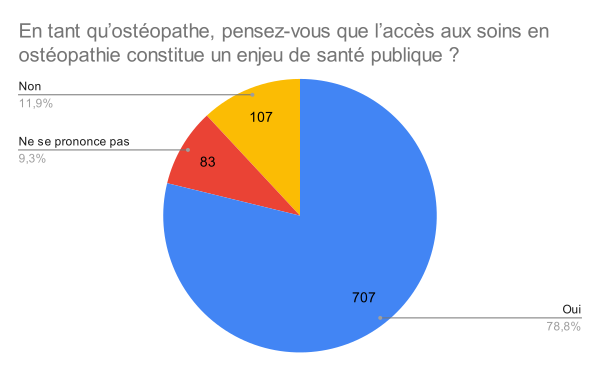](./03-en-tant-qu-osteopathe-pensez-vous-que-l-acces-aux-soins-en-osteopathie-constitue-un-enjeu-de-sante-publique.svg)

[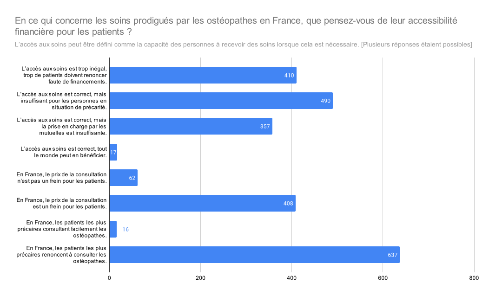](./04-accessibilite-financiere-des-soins-osteopathiques-prodigues-en-france.svg)

[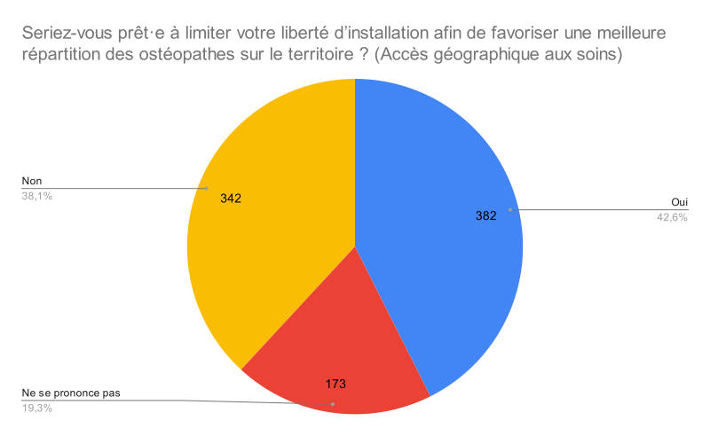](./05-seriez-vous-pret-a-limiter-votre-liberte-d-installation-afin-de-favoriser-une-meilleure-repartition-des-osteopathes-sur-le-territoire.svg)

[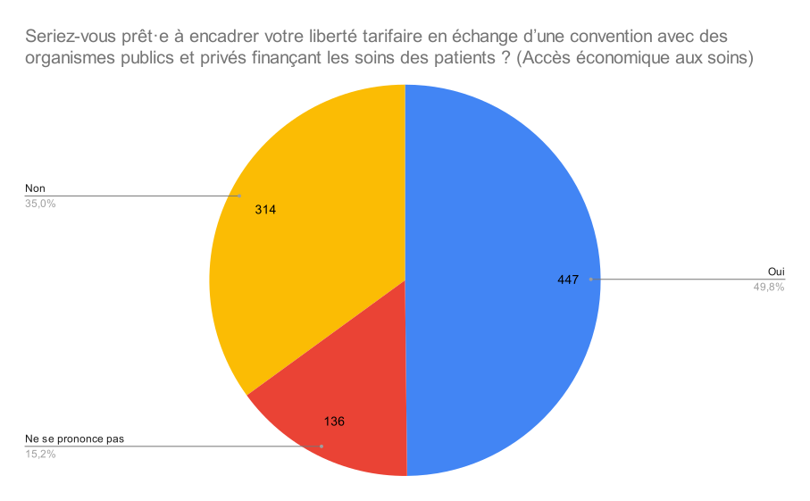](./06-seriez-vous-pret-a-encadrer-votre-liberte-tarifaire-en-echange-d-une-convention-avec-des-organismes-publics-et-prives-financant-les-soins-des-patients.svg)

[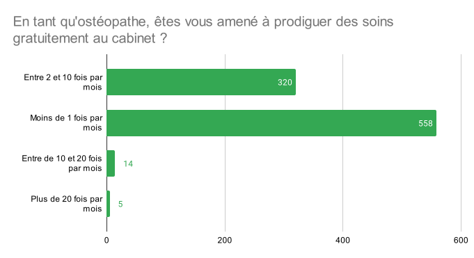](./08-en-tant-qu-osteopathe-etes-vous-amene-a-prodiguer-des-soins-gratuitement-au-cabinet.svg)

[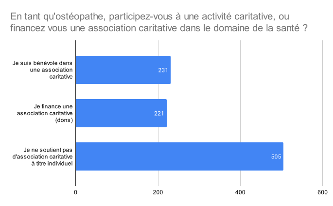](./09-en-tant-qu-osteopathe-participez-vous-a-une-activite-caritative-ou-financez-vous-une-association-caritative-dans-le-domaine-de-la-santé.svg)

[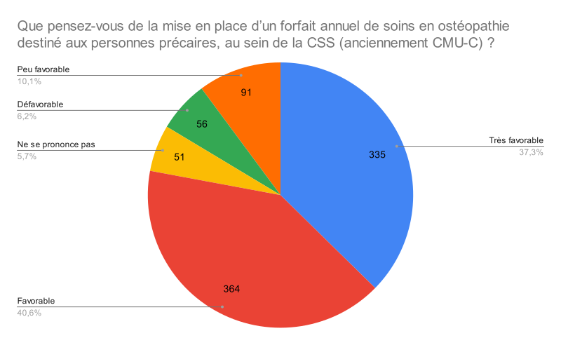](./10-que-pensez-vous-de-la-mise-en-place-d-un-forfait-annuel-de-soins-en-osteopathie-destine-aux-personnes-precaires-au-sein-de-la-css-anciennement-cmu-c.svg)

[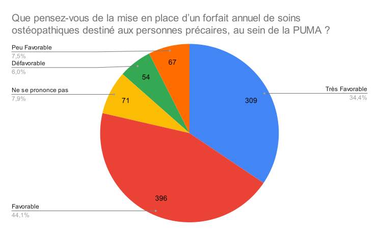](./11-que-pensez-vous-de-la-mise-en-place-d-un-forfait-annuel-de-soins-en-osteopathie-destine-aux-personnes-precaires-au-sein-de-la-puma.svg)

La Protection Universelle Maladie (PUMA) permet la prise en charge
des frais de santé sans rupture de droits. Cela signifie que cette
prise en charge est assurée même en cas de changement de situation
professionnelle, familiale ou de résidence. Pour avoir droit à la
PUMA, vous devez travailler ou résider en France de manière stable
ou régulière.

L'Aide Médicale de l'État (AME) est un dispositif permettant aux
étrangers en situation irrégulière de bénéficier d'un accès aux
soins. Elle est attribuée sous conditions de résidence et de ressources.

[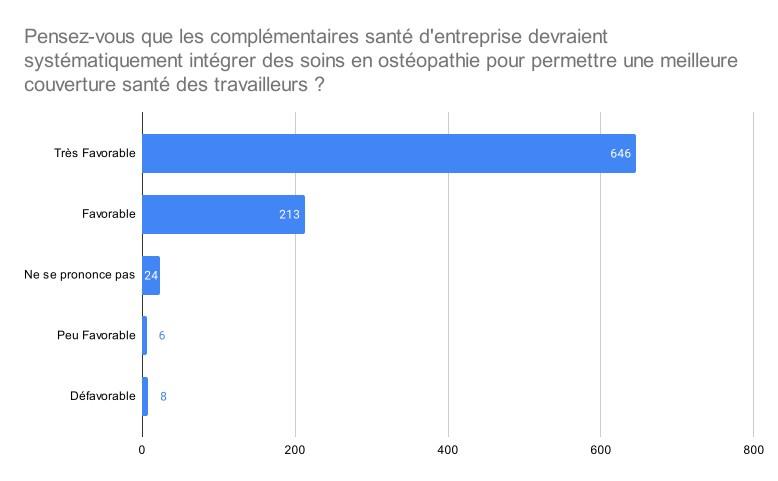](./13-pensez-vous-que-les-complementaires-sante-d-entreprise-devraient-systematiquement-integrer-des-soins-en-osteopathie-pour-permettre-une-meilleure-couverture-sante-des-travailleurs.svg)

[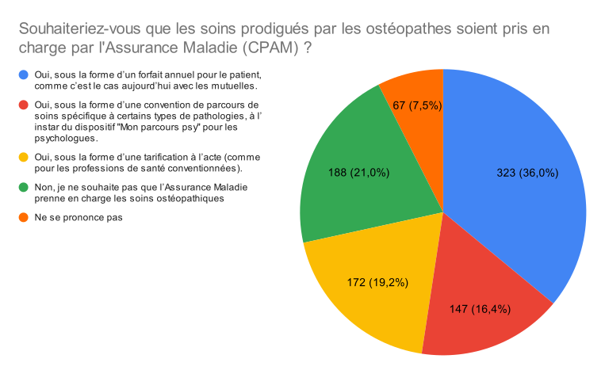](./14-souhaiteriez-vous-que-les-soins-prodigues-par-les-osteopathes-soient-pris-en-charge-par-assurance-maladie-cpam.svg)

[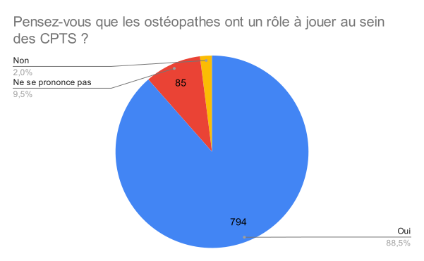](./15-pensez-vous-que-les-osteopathes-ont-un-role-a-jouer-au-sein-des-cpts.svg)

Les Communautés Professionnelles Territoriales de Santé (CPTS)
regroupent les professionnels d’un même territoire qui souhaitent
s’organiser – à leur initiative – autour d’un projet de santé pour
répondre à des problématiques communes.
Pour en savoir plus sur les
<abbr title="Communautés Professionnelles Territoriales de Santé">CPTS</abbr>, consultez [notre article sur le rôle
des ostéopathes au sein des CPTS]().

[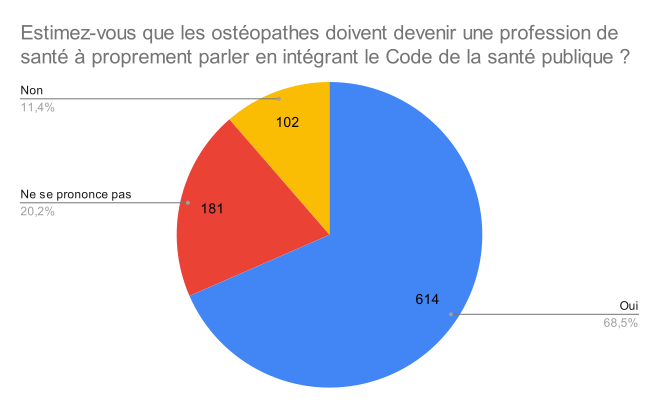](./16-estimez-vous-que-les-osteopathes-doivent-devenir-une-profession-de-sante-a-proprement-parler-en-integrant-le-code-de-la-sante-publique.svg)

### Questions sur le paysage associatif

[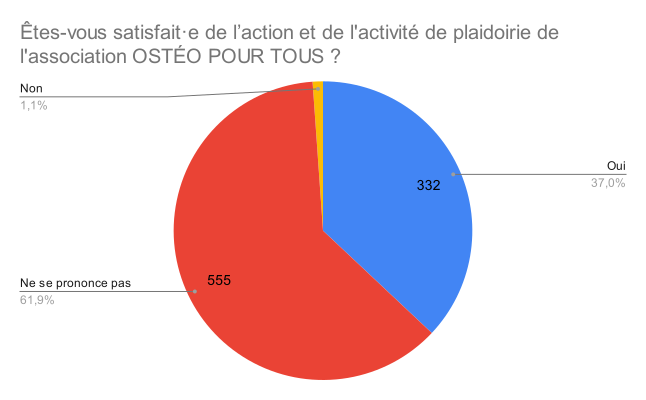](./17-etes-vous-satisfait-de-l-action-et-de-l-activite-de-plaidoirie-de-l-association-osteo-pour-tous.svg)

[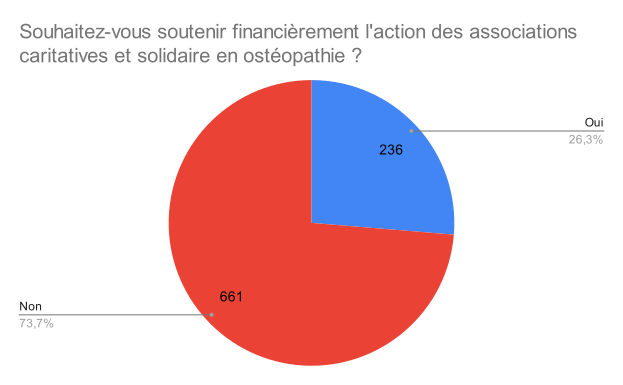](./18-souhaitez-vous-soutenir-financierement-l-action-des-associations-caritatives-et-solidaire-en-osteopathie.svg)

[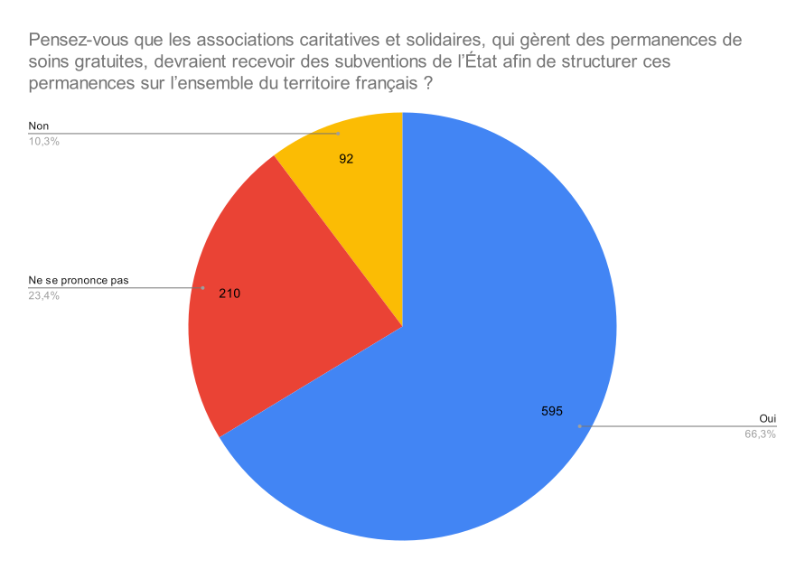](./19-pensez-vous-que-les-associations-caritatives-et-solidaires-qui-gerent-des-permanences-de-soins-gratuites-devraient-recevoir-des-subventions-de-l-etat-afin-de-structurer-ces-permanences-sur-l-ensemble-du-territoire-francais.svg)

[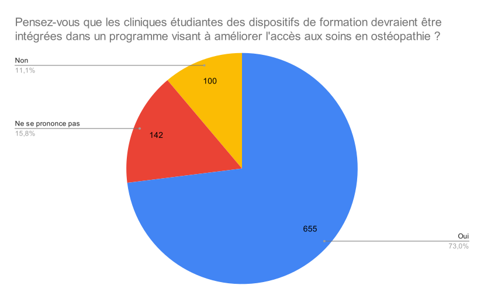](./21-pensez-vous-que-les-cliniques-etudiantes-des-dispositifs-de-formation-devraient-etre-integres-dans-un-programme-visant-a-ameliorer-l-acces-aux-soins-en-osteopathie.svg)

## Résultats du sondage (questions ouvertes)

Pour chaque question, nous avons classifié les réponses libres en
trois catégories principales, selon les opinions exprimées par
les répondant·e·s:
- ✅ les éléments consensuels ou majoritaires
- 🟰 les propositions modérées ou propositions
- ❌ les positions minoritaires, clivantes ou radicales

### Question: Plus globalement, que pensez-vous d'un conventionnement partiel des soins en ostéopathie par l'assurance maladie (CPAM) ?

#### ✅ Éléments consensuels / majoritaires
1. **Accès aux soins facilité pour les patients**
> Cela favoriserai une accessibilité aux soins conforme au
> principe d'égalité.

> Ce serait une bonne initiative qui permettrait à des
> personnes précaires de ne pas renoncer à l’ostéopathie.

2. **Favorable sous conditions**
> Une bonne idée mais les conditions doivent être vraiment
> bien décidées et mise en place.

> Je suis favorable a ce que l'assurance maladie participe au
> frais des séances d'ostéopathie sans que cela impact notre
> liberté de travail, sans que la CPAM ne puisse définir notre
> tarif, notre durée de consultation ou notre lieu d'exercice.
> La participation forfaitaire annuel peut être un bon
> fonctionnement, cela éviterais aussi les abus de
> consultations sans justification (de part le patient ou
> le professionnel).

> Favorable si à la fin la rémunération de l'ostéopathe est
> suffisante afin de ne pas se retrouver dans la même situation
> que les kinésithérapeutes (payés à la fronde, doivent
> prendre plusieurs patients en même temps en conséquence).

3. **Crainte d'une perte de liberté professionnelle et à la rémunération des actes**
> Alors je pense que s'ils paient un kiné 15/16€ que nous on
> serais environ à 10€ et donc pas des consultations de 45 min
> mais de 15 min et je ne vois pas les bénéfices comme ça.

> Je m’y oppose car le fait de rentrer dans ce système va nous
> contraindre sur notre liberté de pratique et la qualité globale
> des soins va descendre en même temps que l’automatisation des
> remboursements.

> Trop restrictif pour la rémunération, cela va engendrer une baisse
> de la qualité des soins.

4. **Inquiétude vis-à-vis de la lourdeur administrative**
> Pourquoi pas, mais cela ne doit pas nous cloisonner à certains
> soins, à un tarif fixe, et pas trop de paperasses.

> Je crains les complications liées à la gestion CPAM : rejets,
> délais, contrôles.

> Ça peut être plus compliqué en terme de gestion administrative
> pour les thérapeutes.

> l'esclavage administratif, la fin d'un soin tourné vers le
> patient pour un acte défini administrativement

5. **Besoin de préalables au conventionnement**
> Je pense que c'est une bonne idée mais que la qualité des
> soins prodigués par les ostéos doit d'abord drastiquement augmenter
> et que le discours de ces derniers doit être largement plus à jour
> au vu des avancées de la science concernant l'ostéo et la
> thérapie manuelle, au risque d'entraîner une frustration des
> autres professions de santé (tels que les kinés, qui se battent
> depuis des années pour des revalorisations substantielles).

> Il faudrait déjà être plus cohérent dans la formation d’ostéopathie.

> Il faudrait que la pratique ostéopathique soit plus homogène pour
> que le remboursement se fasse sans participer à financer des
> dérives thérapeutiques.

> Pourquoi pas mais irréaliste si nous ne nous régissons pas par
> un ordre.

#### 🟰 Propositions modérées

**Forfait annuel, reste à charge ou enveloppe ciblée**
> Favorable sous forme d'un forfait permettant un suivi correcte
> chez tous types de patients y compris les plus précaires

> Je ne vais pas en faveur d'une prise en charge de l'assurance
> maladie mais pourquoi pas une prise en charge de quelques
> euros (20€ par exemple) avec un dépassement d'honoraire à la
> charge du patient remboursé par sa mutuelle

> On peut partir sur une prise ne charge de l'assurance maladie
> dans des cas de pathologies chroniques où le patient ressent
> un bienfait de l'ostéopathie.

> Je pense que cela pourrait être une bonne idée pour certains
> motifs ou parcours de soins

> Intéressant pour donner de l’importance à l’ostéopathie dans
> un parcours de soin, décharger les médecins de certains motifs
> de consultation, et donner l’accès à plus de personnes sans
> que les honoraires soient un frein.

#### ❌ Positions minoritaires, clivantes ou radicales :

1. **Rejet total du conventionnement**
> À voir la mise en place. De ne pas tuer la profession
> en proposant des séances d'ostéo à 30 euros les 45 minutes.

> Aucune intervention de la CPAM dans les actes osteopathiques,
> sinon c’est la mort de l’ostéopathie !

> Absolument contre

> L'ostéopathie est assimilable à du bien-être et non du soin,
> donc rien a faire dans le système de santé.

2. **Critique virulente du système CPAM / État**
> Je ne souhaite pas etre impliqué dans un système que j'estime
> etre corrompu par des lobbys et des politiques dont les intérets
> sont avant tout financiers. Si la sécu était vraiment universelle
> et sociale, alors oui bien sur !

> Personnellement, j'ai toujours peur de perdre la liberté
> d'exercer mon métier comme je l'entends si l'Etat s'en mêle

> Nous ne serons plus libéraux mais salariés de la CPAM...

3. **Mépris ou méfiance vis-à-vis des confrères ou d’autres PS**
> Risque de dérives.

> Il faut y faire très attention a ce que des praticiens abusent
> de la situation pour faire plus de consultation qu'il n'en
> faudrait. Il pourrait y avoir des abus des 2 côtés. La solution
> du forfait limiterait la fraude.

4. **Défense identitaire forte de l’ostéopathie**
> À condition qu’il respecte l’identité de la pratique ostéopathique
> (temps, approche globale, liberté clinique) et qu’il soit
> bien encadré.

> Je suis contre Un tel encadrement nous ferait abdiquer notre
> liberté et notre indépendance professionnelle par un
> encadrement restrictif sur la pratique de l'ostéopathie...

### Question: Quelle est votre opinion sur l’activité des associations caritatives en ostéopathie ?

#### ✅ Éléments consensuels / majoritaires
1. **Appréciation générale positive**

Une majorité significative considère les actions
caritatives en ostéopathie comme: utiles, importantes,
voire indispensables, notamment pour les personnes précaires.
Enrichissantes humainement, y compris pour les praticien·ne·s.

> Très bonne. J’ai travaillé bénévolement pendant 2 ans au
> sein d'une association caritative ostéopathique.

> Elle est indispensable, sûrement insuffisante ou pas
> suffisamment repartie sur le territoire. Il y a aussi un
> manque d'information des ostéopathes qui pourraient orienter
> les patients en difficulté vers ces associations.

> C’est très bien / c’est de l’humanité avant tout.

2. **Bénéfice pour les patients et pour la profession /
   Amélioration de l’image publique de l’ostéopathie /
   Ouverture vers les autres acteurs de santé /
   Accès aux soins pour les populations marginalisées ou isolées.**
> Ce sont de bonnes actions, intéressantes et utiles pour l'accès au soins aux plus démunis.

> C'est à mon sens en dehors des cabinet qu'il est juste d'offrir des consultations.

3. **Manque de visibilité / communication**

Beaucoup ne connaissent pas ces associations ou n’ont jamais
entendu parler de leurs actions: Manque de diffusion d’information /
Pas assez représentées ou coordonnées nationalement.

> Je n’en connais pas.

> Peu connues, trop peu visibles.

4. **Volonté d’engagement conditionnée/ Nombreux ostéopathes
   soutiennent ces actions mais ne peuvent/pensent pas
   s’engager actuellement (temps, finances, informations)**

> C'est bien !! (Pour la réponse d'après, je ne peux pas
> financièrement me le permettre pour l'instant)

> Aucune, cela part d'un bon sentiment mais cela ne rallie
> pas bcp de monde. Je n'en avais d'ailleurs jamais entendu parler.

> Je n'en connais quasiment pas donc je ne sais pas.

#### 🟰 Propositions modérées
1. **Mieux structurer et coordonner les actions**

Appels à une meilleure organisation nationale;
Nécessité de coopérations avec institutions (ARS, CPTS, etc.).

> Il faudrait qu’elles aillent toutes dans le même sens.

> Elles doivent se rapprocher des autres institutions pour
> ne pas rester isolées.

2. **Préférer un modèle de participation symbolique**

Inquiétudes sur les effets négatifs de la gratuité totale:
moins de valeur perçue par les patients, difficulté de
mobilisation durable des praticiens

> La gratuité totale ne me paraît pas propice à la guérison.
> Il faudrait trouver un système de paiement symbolique
> sur le système don/ contredit. »

> Si chacun créait une plage horaire en don libre et sans rdv ...

#### ❌ Positions minoritaires, clivantes ou radicales
1. **Critique du bénévolat comme solution structurelle**

Ces actions pallient un désengagement de l’État, mais ne
peuvent suffire à elles seules. Certaines réponses voient
l’action caritative comme un “pansement” sur une injustice plus large.

> C'est un pansement au manque de responsabilité de l'État

> Elles comblent malheureusement un système défaillant...

2. **Risque de dérive ou perte de sens**

Dérives identitaires, humanitaires opportunistes à l’étranger,
manque d’encadrement professionnel. Certaines associations vues
comme trop politisées ou utilisées à des fins de communication par
des écoles.

> Trop souvent du tourisme humanitaire pour se donner bonne conscience.

> je déplore par contre l'utilisation des associations caritatives
> par les centres de formations (école d'ostéopathie) pour se faire
> de la publicité et de la communication.

> elles devraient être encadrées pour éviter les dérives sectaires.

3. **Discours plus critiques sur la profession elle-même**

Propos acerbes sur les confrères: charlatanisme, formation médiocre.
Crainte que le bénévolat véhicule une image dévalorisée de l’ostéopathie.

> C'est très bien mais elles doivent toujours garder un certain
> recul, permettre l'accès aux soins oui mais pas dévaloriser le métier

> Je trouve que leur action sont inefficaces, ne se prononce pas sur
> certains sujets, et défendent ceux qui pratique une ostéopathie
> imaginaire nous decridibilisant tout en soutenant que nous vallons
> le titre de "professionnel de santé" ce qui nous fait tous
> passer pour des charlatans.

### Question: Nous souhaitons vous laisser un espace de commentaires libre afin que vous puissiez nous transmettre votre opinion sur le sujet de l'accès aux soins ostéo en France.

#### ✅ Éléments consensuels / majoritaires
1. **L'accès aux soins est insuffisant et inégalitaire**

De nombreux ostéopathes estiment que les soins restent réservés
à une population aisée. La barrière financière est fréquemment évoquée.

> Aujourd’hui, j’ai le sentiment que l’ostéopathie reste surtout
> accessible à ceux qui peuvent se permettre ce confort.

> L'Accès aux soins pour tous est une évidence. Cependant ne pas
> continuer à déresponsabiliser les patients parce que c'est
> gratuit ! Un échange doit être mis en place !

2. **La profession est en crise de légitimité et de structuration**

Forte inquiétude sur la démographie (trop d’ostéos, trop
d’écoles, qualité en baisse). Manque de régulation, de cohérence
dans la formation, et d’un cadre clair.

> La démographie ostéopathique est catastrophique, pensons aussi
> à réguler le nombre d'ostéopathes...

> Au delà de l'aspect accès à l'ostéopathie pour les patients,
> il faut aussi penser à encadrer les écoles et limiter le
> nombre d'étudiants car nous sommes déjà trop nombreux.

> Avant de poser la question de l’intégration de l’ostéopathe au
> système de soin, il serait plus urgent de réguler le niveau
> de formation en école et réguler les dérives de nombreux osteo.
> Après nous serons plus pourrons discuter de notre place dans
> le système de santé.

3. **Un besoin fort de reconnaissance / intégration dans le système de santé**

Nombreux souhaits d’une reconnaissance officielle comme
profession de santé.
Intégration dans les parcours de soins, en hôpital, en PMI, EHPAD, entreprises.

> Tant que l'ostéopathie n'aura pas une spécificité propre et un un
> rôle bien défini dans le cadre de santé le chemin sera difficile

> C'est primordial que notre profession soit enfin acceptée au sein
> des établissements de santé (hôpitaux PMI etc..)...

4. **Méfiance vis-à-vis d’un conventionnement mal encadré**

Nombreux expriment une ouverture au conventionnement à condition
de préserver:
- Liberté tarifaire
- Durée de consultation
- Première intention
- Qualité de soin

> L’accès des soins est une chose mais pas au détriment des libertés
> des Osteopathes.

> L’accès aux soins ostéopathiques en France représente un enjeu de
> santé publique certainement insuffisamment pris en compte. Toutefois,
> une réflexion collective est nécessaire pour améliorer
> l’accessibilité sans sacrifier la qualité. Cela implique une
> clarification du rôle de l’ostéopathe, de ses prétentions
> thérapeutiques réels et la dispense de soin pertinent,
> sécuritaire et cohérent avec les besoins actuels de la population.

#### 🟰 Propositions modérées
1. **Mise en place de systèmes alternatifs**

Tarifs solidaires, dons libres, système à quota
(x patients par mois), forfaits avec les mutuelles ou les collectivités

> Je préfère offrir quelques consultations plutôt que m’engager dans
> un système qui me pénalise.

> Pourquoi ne pas mutualiser l’effort, 5% des consultations réservées
> à des patients précaires ?

2. **Collaboration renforcée avec d’autres structures**

CPTS, associations médico-sociales, crèches, prisons, hôpitaux.
Suggestion de salariat partiel, postes fléchés dans les zones déficitaires.
> Il faudrait aider les jeunes à s’installer là où il y a des besoins.

3. **Réformer les écoles et la formation initiale**

Numérus clausus; Harmonisation des programmes; Moins de “charlatanisme”

> Avant de demander des subventions et des garanties de l’état et/ou
> des organismes de santé public. Il faudrait réglementer la profession
> et arrêter de faire du charlatanisme. Le crânien, le MPR, les MTR,
> la motilité.. etc sans parler des énergies ou tout autre
> connerie obscurantiste...

#### ❌ Positions minoritaires, clivantes ou radicales
1. **Refus total de toute intégration dans le système public**

Rejet du lien avec la CPAM, l’État, les ordres professionnels.
Rejet de la standardisation et de la médicalisation.

> La situation actuelle des professions de santé rattachées à la CPAM
> me laisse penser que si nous nous retrouvons sous le joug de
> l’Etat, la force de notre profession (une multitude de types de
> soins prodigués de façons différentes) sera affaiblie par une
> uniformisation des soins et une baisse des possibilités de
> spécialisation des ostéopathes.
>
> De plus, cela voudrait dire une main mise de l’Etat et d’une
> poignée de personnes qui ne connaissent pas forcément notre
> métier, sur l’enseignement ostéopathique. Une uniformisation ou
> une diminution de la qualité d’enseignement sont à craindre.
>
> De mon point de vue, notre indépendance reste une force dans
> notre pratique.

1. **Vision élitiste ou méprisante de l’action sociale**

Certains estiment que les précaires “n’ont pas besoin” d’ostéopathie.
D'autres expriment une franche hostilité au soin gratuit,
jugé "dévalorisant".

> Moins d’Etat mais mieux d’Etat. Je ne souhaite pas voir une
> autorité suprême diriger notre profession. Le système est à bout.
> Je préfère rester en dehors.

> si l'acces est trop facile, les patients ne feront pas l"effort
> de se prendre en charge et se déresponsabiliseront sur nous. Ce
> n'est pas dans notre interet de faire des séances gratuites car
> on sera pris pour une profession au rabais.

> Il y a des choses beaucoup plus importantes à tous les niveaux
> de la santé en france qui méritent des financements plutot que
> de se tourner vers l’ostéopathie.

3. **Discours virulents sur les confrères et la profession**

Propos dénonçant le “sectarisme”, les “pseudo-soins”, ou le “charlatanisme”. Appels à “nettoyer la profession avant de vouloir être reconnus”.

> d'abord un sacré ménage à faire dans notre profession...

> Créer un ordre afin d’ éradiquer le charlatanisme et les
> dérives sectaire, ainsi que tout le spirituel qui gangrène
> notre profession, et qui n’est pas isolé, malheureusement.

> Avant de proposer un remboursement quelconque de la part de
> la sécurité sociale, ou des entités médicales étatique, il
> serait temps que l’ostéopathie devienne une profession scientifique
> et non pas une profession spiritualiste.

## Discussion
L’enquête *Accès aux soins pour tous* démontre que les ostéopathes
sont attachés à l’accès aux soins, qu’ils en font une priorité de
santé publique, et qu’ils **souhaitent être mieux intégrés dans ce débat
de société**.

Nous soulignons que les résultats, lorsqu’ils sont analysés selon
l’âge ou le nombre d’années d’installation, varient peu, tous
groupes confondus. Cela traduit un **consensus intra-professionnel** manifeste.

Trois opinions majoritaires se dégagent très nettement (voir graphique 4):
- « En France, les patients les plus précaires renoncent à consulter les ostéopathes. »
- « L’accès aux soins est correct, mais insuffisant pour les personnes en situation de précarité. »
- « L’accès aux soins est trop inégal ; trop de patients doivent renoncer, faute de financement. »

Les ostéopathes restent attachés à leur liberté d’installation, à
la fixation de leurs honoraires, et à l’accès direct aux soins.
Néanmoins, ils se montrent ouverts à des compromis dans le cadre
d’un contrat gagnant-gagnant avec la société, à condition que cela
valorise leur pratique, notamment :
- Une prise en charge globale,
- Une durée de consultation longue,
- Le libre choix du thérapeute,
- La liberté d’organisation du travail,
- Le libre choix des techniques de thérapie manuelle,
- Une rémunération équilibrée pour le praticien.

Une proportion significative de répondants déclare accueillir
gratuitement certains patients dans leur cabinet. Bien que cela
reste minoritaire en volume, ce geste témoigne d’une volonté
réelle de ne pas pratiquer de discrimination économique ni de
priver un patient d’un soin jugé nécessaire.

De manière générale, les ostéopathes se montrent favorables à
un **financement public ciblé vers les plus précaires** et à un **renforcement du financement privé via les complémentaires santé** 
pour les actifs et leurs ayants droits.\
Le dispositif de financement jugé le plus pertinent est
celui de la **Complémentaire Santé Solidaire (CSS, ex-CMU-C)**.
Cependant, on note également un bon niveau d’adhésion à un financement
via la **PUMA** et l’**AME**.

Concernant une éventuelle convention avec l’Assurance maladie
(CPAM), les ostéopathes penchent plutôt pour une **forfaitisation**,
tout en n’excluant pas une **tarification à l’acte** ou un **financement
par pathologie**.

Bien qu’ils soient minoritaires, certains ostéopathes —
comme l’indiquent les données qualitatives — s’opposent fermement à
toute forme de participation collective au financement des soins et à
toute intervention de l’État, par crainte d’une perte d’identité et
d’une dévalorisation de leur activité.

En revanche, la **quasi-totalité des répondants** se déclare favorable
à la **création de postes salariés** dans les hôpitaux, les PMI, ou
d'autres structures publiques, financés par l’État ou l’Assurance Maladie.
Cette proposition fait l’objet de peu d’opposition et bénéficie d’un
fort soutien en raison de la reconnaissance symbolique, financière et
organisationnelle qu’elle implique. Reste en suspens la question
de l’intégration de ces postes dans les parcours de soins.

En ce qui concerne le statut professionnel, les ostéopathes se
montrent largement favorables à une **inscription dans le Code de
la santé publique**, afin d’être reconnus comme 
**professionnels de santé à part entière**.
Ils expriment également une volonté forte de **participer aux
travaux des CPTS** sur les territoires.

Plus largement, les ostéopathes se perçoivent comme une 
**profession de santé**, bien qu’ils ne soient à ce jour
que **professionnels du système de santé** (RPPS).

Ils se sentent concernés par les enjeux sociétaux qui traversent
le champ de la santé et partagés avec les autres professions
médicales et paramédicales.

S’agissant de **l’accès aux soins par des dispositifs internes à
la profession**, les associations caritatives sont encore peu
visibles et **ne peuvent reposer uniquement sur le financement
des praticiens** pour exister.

La profession se montre globalement favorable à ce que ces
associations puissent bénéficier de **financements publics** pour
réaliser leurs missions, ainsi que d’un **soutien via les
écoles d’ostéopathie** dans le cadre de la formation initiale.

Les **cliniques étudiantes obligatoires** sont vues comme un
outil pertinent pour améliorer l’accès aux soins pour les publics
précaires, en complément de l’offre existante.
Un **renforcement des dispositifs ciblant les personnes défavorisées**
dans les parcours de formation est généralement souhaité.

Cependant, les répondants rappellent que **la prise en charge par
des étudiants ne peut être équivalente à celle réalisée par un
professionnel expérimenté**.

Enfin, l’analyse qualitative fait émerger des voix qui alertent
sur le fait que ni le bénévolat, ni les associations caritatives 
**ne constituent des solutions pérennes** à l’enjeu d’un véritable
accès universel aux soins ostéopathiques. Pour l’instant, elles
sont cependant les seules structures permettant un minimum d’accès
solidaire.

Plus globalement, de **vives inquiétudes traversent la profession
quant à son avenir**. Les données qualitatives mettent en lumière ces
craintes, communes à toutes les générations : les ostéopathes appellent
de leurs vœux une **meilleure régulation, une meilleure protection
des patients, plus de contrôle, et davantage de scientificité**.

## Conclusion
Cette enquête a permis de recueillir un large éventail d'opinions
et de perceptions sur l'**accès aux soins en ostéopathie** en France.

Elle révèle un consensus fort sur **l'importance de l'accès aux soins
ostéopathiques**, mais aussi des **inquiétudes quant à la
situation actuelle de la profession**, notamment en termes de
démographie, de formation et de reconnaissance.

Les résultats montrent également **une volonté d'engagement**
de la part des ostéopathes pour améliorer l'accès aux soins,
mais avec **des réserves sur les conditions** de ce conventionnement,
notamment en ce qui concerne la préservation de leur liberté
professionnelle et la qualité des soins.

L'association [Ostéo Pour Tous](https://osteopourtous.eu/) s'engage
à poursuivre son action en faveur d'un accès équitable aux
soins ostéopathiques, en tenant compte des résultats de cette enquête
et en continuant à dialoguer avec les acteurs de la profession et
les institutions concernées.

Nous **remercions tous les ostéopathes qui ont pris le temps de répondre
à ce sondage**. Vos contributions sont précieuses pour
mieux comprendre les enjeux de l'accès aux soins en ostéopathie
et pour orienter les actions futures de l'association Ostéo Pour Tous.

**Pierre-Adrien LIOT**\
Porte Parole Ostéo Pour Tous


Je me joins à Ostéo Pour Tous pour remercier
toutes les personnes qui ont pris le temps de
contribuer à ce rapport.

– Klemen SEVER, Président d'osteopathes.pro


## Méthodologie et représentativité statistique
Notre enquête a été menée avec soin dans l’objectif de proposer
une **photographie, à un instant T, de l’opinion de notre profession
sur l’accès aux soins en ostéopathie en France**. Il s’agit de la
première tentative de mesure de cette opinion professionnelle sur ce sujet.

**Ce travail ne constitue pas une étude scientifique au sens strict,
mais un outil informatif destiné à éclairer la réflexion et à
accompagner la prise de décision**.

Toutefois, nous avons souhaité nous prêter à l’exercice du **calcul
d’échantillonnage afin d’estimer, avec rigueur, le degré de confiance**
avec lequel nous pouvons interpréter nos résultats.

**⚠️ N'oublions pas de relever les limites de notre enquête**:
- **Méthode de diffusion non probabiliste**: la participation s’est
  faite sur la base du **volontariat**, via des canaux numériques
  (emails, réseaux sociaux, relais associatifs), ce qui peut introduire
  un biais d’**auto-sélection**.
- **Biais de représentativité possible**: certains sous-groupes de la
  profession (par exemple, les ostéopathes peu connectés aux réseaux
  ou isolés) peuvent être sous-représentés.
- **Pas de redressement statistique**: les résultats n’ont pas été
  pondérés pour corriger d’éventuels déséquilibres démographiques
  ou territoriaux (par exemple : surreprésentation de départements
  très actifs ou engagés).

Cependant, nous avous souhaité répondre à la question suivante:
**« Est-ce que ce nombre de répondants permet de faire une conclusion
sur l'orientation de l'avis général des ostéopathes de France ? »**

C'est ce qu'on appelle **la représentativité statistique d’un échantillon**.

### 🧠 Les 3 ingrédients nécessaires
Pour répondre à cette question, il nous faut 3 choses :
1. La taille totale de la population
*C’est le nombre total d’ostéopathes en France.*
➡️ En 2025, on estime à environ **39 000** les ostéopathes en exercice en France.

2. Le niveau de confiance
*C'est le degré de certitude qu'on souhaite avoir dans nos résultats.*
➡️ Le plus courant, c’est 95 % de confiance, ce qui veut dire :
«Si nous faisons 100 fois ce même sondage, avec 897 ostéos différents
à chaque fois, nous obtiendrons un résultat similaire au moins 95
fois sur 100.»

3. La marge d’erreur acceptable
*C'est la tolérance que l'on accepte entre le résultat du sondage
et la réalité de la population totale.*
➡️ Exemple: si le sondage dit que 60 % des ostéos veulent être
remboursés, et que la marge d’erreur est ±3 %, alors le vrai
chiffre dans la population est entre 57 % et 63 %.

### 📊 Calculs de taille d’échantillon
#### 📊 Taille d’échantillon nécessaire pour 39 000 ostéopathes
| Confiance | Marge d’erreur | Taille d’échantillon requise |
|-----------|----------------|-----------------------------|
| 90 %      | 5 %            | ≈ 271                       |
| 90 %      | 3 %            | ≈ 754                       |
| 90 %      | 2 %            | ≈ 1 694                     |
| 95 %      | 5 %            | ≈ 381                       |
| 95 %      | 3 %            | ≈ 1 038                     |
| 95 %      | 2 %            | ≈ 2 328                     |
| 99 %      | 5 %            | ≈ 662                       |
| 99 %      | 3 %            | ≈ 1 528                     |
| 99 %      | 2 %            | ≈ 3 392                     |

#### Application à notre enquête
- **Nombre de répondants**: 897 ostéopathes ont répondu à l’enquête.
- **Population totale**: environ 39 000 ostéopathes en France.
- **Confiance**: 95 % (standard pour les sondages professionnels).
- **Marge d’erreur**: environ ±3,2 %.

La population étudiée est plutôt homogène (ostéopathes
professionnels en France), ce qui renforce la validité de notre
échantillon.

Pour résumer, nous avons eu 897 ostéopathes répondants, ce qui
nous donne une marge d’erreur de ±3,2 % à 95 % de confiance. Cette
enquête peut donc être considérée comme représentative de l’opinion
des ostéopathes en France sur l’accès aux soins en ostéopathie.

## Réponses brutes

Vous trouverez [les réponses brutes obtenues et anonymisées et qui
ont été conservées pour ce rapport](https://docs.google.com/spreadsheets/d/1UM-TRfconqwUGzYWyCu6q60EygaOPqwW8F7XXIk3hXs/edit?usp=sharing).

## Modifications de l’article

> **Modification 2025/07/22** : Ajout de la section
> « Méthodologie et représentativité statistique ».