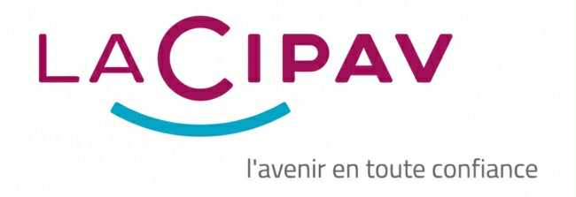
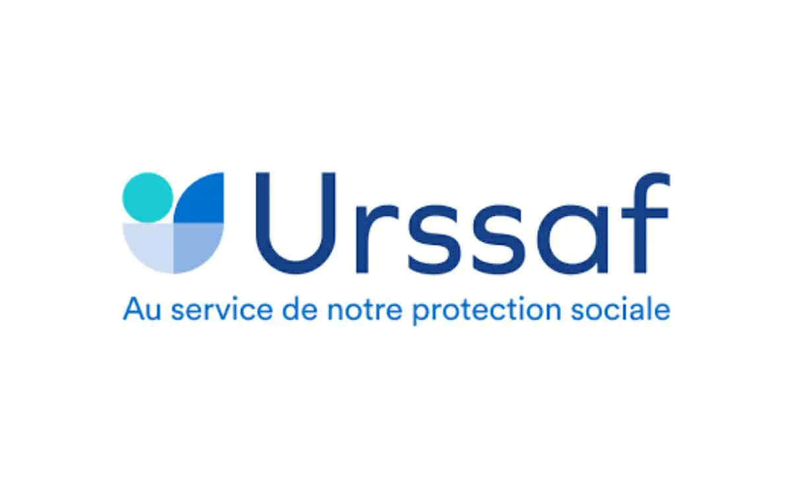
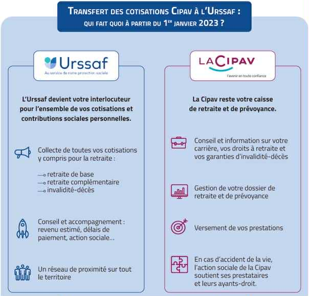
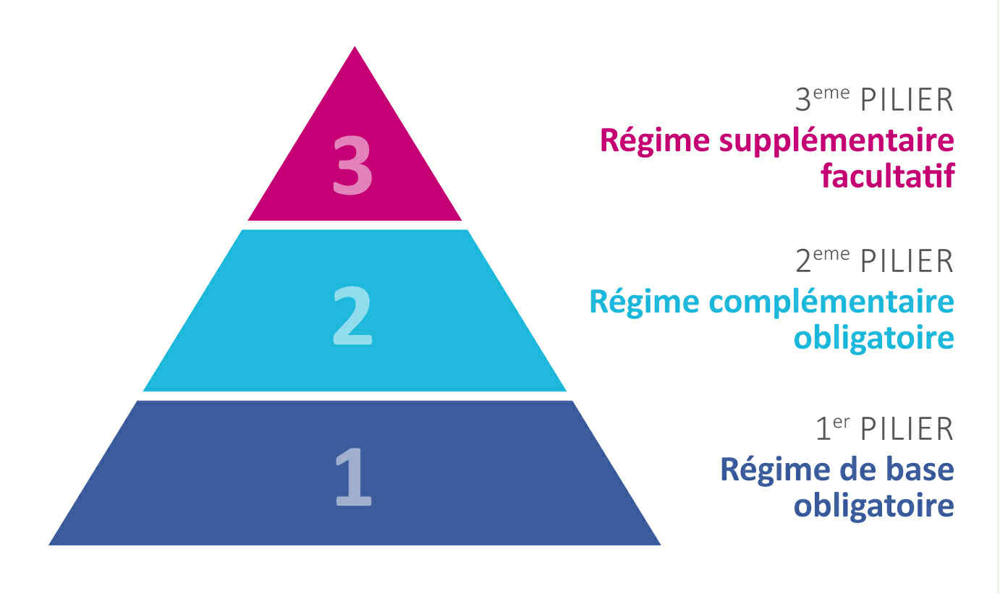
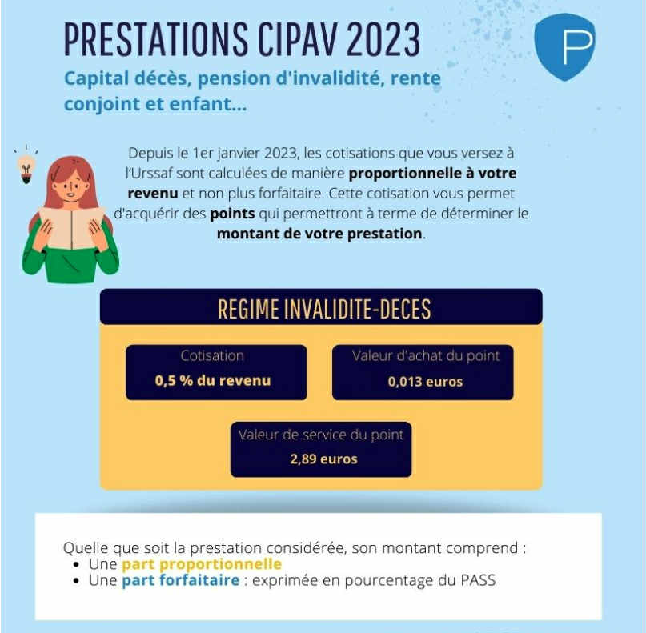

La **Caisse Interprofessionnelle de Prévoyance
et d’Assurance Vieillesse** (CIPAV) est l’organisme de
retraite et de prévoyance des **professions libérales**.

Elle gère les **deux niveaux de retraite obligatoire**
(base et complémentaire), ainsi que le **régime d’invalidité-décès**,
pour près de **400 professions** en France — dont les **ostéopathes**.
Chaque année, la CIPAV verse environ
**803 millions d’euros de prestations** à ses assurés et retraités.
Elle dispose de près de **9,3 milliards d’euros** de réserve
financière en 2024.
Bien qu’il s’agisse d’un **organisme de droit privé**, la CIPAV
exerce une **mission de service public** au sein du système de la Sécurité sociale.

<!--more-->

## La CIPAV et la CNAVPL
La CIPAV fait partie intégrante de la
**Caisse Nationale d’Assurance Vieillesse des Professions Libérales (CNAVPL)**,
qui regroupe l’ensemble des sections professionnelles représentant
les professions libérales françaises. La **CNAVPL**, organisme de Sécurité
sociale, est placée **sous la tutelle administrative du ministère chargé
de la Sécurité sociale**. Elle assure la **gestion du régime d’assurance
vieillesse de base** pour l’ensemble des professionnels libéraux.

Les différentes **sections professionnelles** de la CNAVPL sont les
**interlocutrices de proximité** des assurés. Pour les **ostéopathes**,
la section compétente est donc la **CIPAV**.

### Les dix sections professionnelles de la CNAVPL

* **CARCDSF** – Chirurgiens-dentistes et sages-femmes
* **CARMF** – Médecins
* **CARPIMKO** – Infirmiers, masseurs-kinésithérapeutes, pédicures-podologues, orthophonistes et orthoptistes
* **CARPV** – Vétérinaires
* **CAVAMAC** – Agents généraux d’assurance
* **CAVEC** – Experts-comptables et commissaires aux comptes
* **CAVOM** – Officiers ministériels, officiers publics et compagnies judiciaires
* **CAVP** – Pharmaciens
* **CIPAV** – Professions libérales diverses, dont les ostéopathes
* **CPRN** – Notaires

## Les missions de la CIPAV

Pour résumer, la CIPAV a pour principales missions :
* La **gestion et le conseil carrière** des assurés,
* La **liquidation des droits à la retraite**,
* Le **versement des pensions**,
* Le **versement des prestations d’invalidité-décès**.

## En quoi les ostéopathes sont-ils concernés par la CIPAV ?
Les ostéopathes exerçant **en libéral** (en cabinet individuel,
en groupe ou en collaboration) relèvent du régime de retraite et
de prévoyance géré par la CIPAV.

À ce titre, les cotisations CIPAV sont des prélèvements obligatoires
et les droits qu’ils représentent sont acquis dès le début de l’activité.

Du reste, la CIPAV est un organisme géré par des élus professionnels,
les ostéopathes sont donc aussi électeurs et éligibles pour
la gestion de biens collectifs.

Concrètement :
* 🧾 **Déclaration de revenus professionnels** : chaque année, les
  revenus déclarés servent de base au calcul des cotisations CIPAV (retraite, invalidité-décès).
* 👶 **Congé maternité ou paternité** : en cas de naissance,
  la CIPAV peut intervenir via le régime d’invalidité-décès
  pour certaines prestations temporaires.
* ⚖️ **Accident ou maladie grave** : un ostéopathe peut
  percevoir une rente d’invalidité ou un capital
  décès versé à ses ayants droit.
* 🧓 **Préparation de la retraite** : les points de retraite
  de base et complémentaire sont gérés par la CIPAV, qui délivre
  un relevé de carrière et assure le versement des pensions.
* 🧮 **Changement de statut professionnel** : en cas de cessation
  d’activité, de cumul emploi-retraite, ou de passage en société,
  la CIPAV accompagne l’ostéopathe pour ajuster ses cotisations.
* 📬 **Suivi administratif** : les courriers, attestations de
  droits, relevés de points et notifications proviennent directement de la CIPAV.

En somme, la CIPAV suit **toute la vie professionnelle d’un ostéopathe**,
du premier patient jusqu’à la retraite.

La CIPAV détient une **source de données unique** sur les ostéopathes exerçant en libéral :
* Elle recense **tous les ostéopathes affiliés**,
  donc le **nombre réel d’ostéopathes actifs**.
* Elle est capable de fournir des **statistiques fiables** sur
  l’évolution du nombre d’installations, de cessations d’activité, ou
  sur la **répartition par âge, par région et par sexe**.
* Elle détient des **données économiques** (revenus déclarés,
  tranches de cotisation) qui permettent d’observer :
    * les **tendances économiques du secteur**,
    * les **écarts de revenus** entre régions ou entre générations,
    * les **évolutions du niveau de vie** des ostéopathes libéraux.

👉 Ces informations peuvent être précieuses :
* pour les **institutions publiques** (ARS, URSSAF,
  Ministère de la Santé) qui suivent la démographie des professionnels de santé,
* mais aussi pour les **organisations professionnelles d’ostéopathes**,
  afin d’étayer leurs revendications ou leurs propositions dans les politiques de santé.

## Bien connaître la CIPAV: un enjeu essentiel
Bien connaître la CIPAV, c’est **mieux gérer son entreprise libérale**
et **préparer son avenir personnel**.

Voici pourquoi c’est essentiel :

### A. Optimiser sa gestion financière
* Comprendre les **cotisations obligatoires** permet
  d’anticiper les charges réelles et d’éviter les mauvaises
  surprises de régularisation.
* Savoir comment sont calculées les **prestations de retraite**
  aide à mieux planifier ses revenus futurs et à compléter,
  si besoin, par une épargne volontaire (PER, assurance-vie, etc.).

### B. Sécuriser sa protection sociale
* Connaître les **conditions d’indemnisation en cas
  d’invalidité ou de décès** permet d’évaluer si une
  assurance complémentaire privée est nécessaire.
* Être attentif à son **relevé de points retraite** permet
  de corriger d’éventuelles erreurs administratives avant la liquidation.

### C. Valoriser son activité professionnelle
* Les données de la CIPAV sur les revenus et les
  cotisations peuvent être **utilisées pour des études économiques**
  ou des négociations collectives.
* Un ostéopathe averti peut participer plus efficacement aux
  débats sur la place de la profession dans le système de santé
  ou sur la couverture sociale des indépendants.

### D. Anticiper sa retraite
En simulant régulièrement sa future pension via
l’espace personnel CIPAV, un ostéopathe peut **ajuster ses choix d’activité**
(rythme de travail, statut juridique, cumul emploi-retraite, etc.)
en connaissance de cause.

## Comment ça fonctionne ?

Depuis le **1er janvier 2023**, la **collecte des cotisations
de retraite de base, complémentaire et d’invalidité-décès**
des 190 000 professionnels libéraux affiliés à la **CIPAV** est
assurée par **l’URSSAF**, conformément à la **loi de financement
de la Sécurité sociale pour 2022**.

### 1. Objectif : simplification et qualité de service
* Les affiliés ont désormais **un interlocuteur unique** pour
  toutes leurs cotisations sociales personnelles.
* **Aucune démarche** n’est requise : les paiements se
  poursuivent via l’URSSAF selon les modalités habituelles.
* Accès élargi aux **services de proximité** et aux outils
  URSSAF (revenu estimé, délais, action sociale…).

### 2. Nouvelles modalités de calcul
* Les **cotisations de retraite complémentaire et d’invalidité-décès**
  sont désormais **proportionnelles au revenu**, et non plus forfaitaires.
* Objectifs: **plus de lisibilité, d’équité** et un socle de
  droits renforcé pour la retraite et la prévoyance.
* Possibilité d’**adapter les cotisations en temps réel** selon
  les revenus via l’espace personnel sur urssaf.fr.

### Gouvernance de la CNAVPL et de la CIPAV
La **CNAVPL** est gérée par un Conseil d’administration
composé de **16 membres** titulaires : les présidents des 10 Sections
professionnelles et 6 membres désignés par les syndicats
représentant les professions libérales au niveau national
([UNAPL](https://unapl.fr/) et [CNPL](https://cnpl.org/)).

Pour ce qui est du fonctionnement de la CIPAV, c’est un peu différent.

La **CIPAV** est gérée par un Conseil d’administration
composé de **24 membres titulaires**, assistés d’un nombre égal
de suppléants. Ces représentants sont répartis en
**quatre grands groupes professionnels**, chacun divisé en
deux séries (A et B) selon les catégories de métiers qu’ils représentent.

**Répartition des sièges:**
* **Groupe de l’Aménagement de l’Espace, du Bâti et du Cadre de vie**
    * Série A : 4 titulaires – 4 suppléants
    * Série B : 3 titulaires – 3 suppléants
* **Groupe des Professions de Conseil**
    * Série A : 4 titulaires – 4 suppléants
    * Série B : 3 titulaires – 3 suppléants
* **Groupe Interprofessionnel**
    * Série A : 3 titulaires – 3 suppléants
    * Série B : 4 titulaires – 4 suppléants
* **Groupe des Prestataires**
    * Série A : 1 titulaire – 1 suppléant
    * Série B : 2 titulaires – 2 suppléants

Il s’agit de représentants élus parmi les professionnels
libéraux cotisants et les retraités de la CIPAV.

Les élections sont organisées par la Caisse elle-même afin
de garantir une gestion directe par les personnes directement concernées.

## L’assurance retraite, l’invalidité, le décès: pour les ostéopathes, comment ça marche ?

### Un système fondé sur la répartition
Le système de retraite géré par la CIPAV
fonctionne selon le **principe de la répartition**:
* Les **cotisations versées par les actifs** servent
  à **financer les pensions** des retraités de la même année.
* Ce mécanisme repose sur la **solidarité entre générations**:
  les actifs d’aujourd’hui financent les retraités d’aujourd’hui,
  en espérant que la génération suivante fera de même.

Pour maintenir cet équilibre, la CIPAV :
* **Pilote ses réserves financières**
  (près de **9,3 milliards d’euros** fin 2024),
* Met en œuvre une **politique de placements**
  prudente et durable,
* Surveille le **rapport entre cotisants et retraités**,
  déterminant la viabilité du régime.

### La distinction entre répartition et capitalisation
Deux modèles coexistent dans les systèmes de retraite:
* Le **régime par répartition**: les cotisations des
  actifs financent immédiatement les pensions des
  retraités (principe de solidarité intergénérationnelle).
* Le **régime par capitalisation**: chaque assuré épargne
  individuellement pour sa propre retraite, via des placements
  financiers ou immobiliers (principe d’épargne personnelle).

En France, depuis les **ordonnances de 1945** créant la
Sécurité sociale, le modèle dominant est celui de
la **répartition**, fondé sur deux grands principes:
* La **solidarité** (entre générations et entre professions);
* La **contributivité** (la pension dépend des
  cotisations versées et des revenus antérieurs).

### La structure du système de retraite français

Le système français repose sur **trois niveaux** :
* **Retraite de base** – obligatoire, gérée par les
  régimes de Sécurité sociale (dont la CNAVPL pour les professions libérales) ;
* **Retraite complémentaire** – également obligatoire,
  gérée par des caisses comme la CIPAV ;
* **Retraite supplémentaire** – facultative,
  souscrite individuellement ou collectivement (épargne retraite, PER, contrats d’entreprise…).

### Modalités d’acquisition des droits à la retraite à la CIPAV

**Principe général: un système à points**
Les droits à la retraite des professions libérales
affiliées à la CIPAV s’acquièrent **en contrepartie des
cotisations versées** chaque année. Ces cotisations
permettent d’obtenir des **points de retraite**,
qui s’additionnent tout au long de la carrière.
Le montant total de ces points, multiplié par
la **valeur du point** en vigueur au moment du
départ à la retraite, détermine le **montant de la pension**.

> ➡️ Ce système garantit une **égalité de traitement**:
> pour un revenu identique, tous les professionnels libéraux
> acquièrent le même nombre de points et les mêmes droits,
> quelle que soit leur caisse d’affiliation. Il offre
> aussi une **bonne lisibilité**: chaque cotisation donne
> droit à un supplément de pension clairement identifiable.

**Des règles communes aux autres régimes de base**
Le régime de base des professions libérales fonctionne
selon des principes identiques à ceux des autres
régimes de retraite en France.

Il intègre les mêmes paramètres:
* **Âge légal** de départ à la retraite,
* **Durée d’assurance** (tous régimes confondus),
* **Taux plein**, **décote** et **surcote**,
* **Trimestres d’assurance** validés au titre de l’activité professionnelle.

Ainsi, les trimestres acquis dans différents régimes
(salarié, indépendant, fonction publique, etc.) sont
**additionnés** pour calculer la durée totale d’assurance,
ce qui conditionne le taux de la pension de base.

## Quels sont les enjeux de notre caisse ?
### Enjeux de gestion financière
* **Maintenir l’équilibre du régime par répartition**:
  pression sur le ratio cotisants/retraités (vieillissement,
  stagnation ou baisse des revenus).
* **Gestion des réserves et des placements**: optimiser
  rendement/risque pour sécuriser le paiement des pensions
  tout en respectant la contrainte de liquidité.
* **Adaptation des règles de cotisation** (revenu-proportionnel vs forfait)
  pour conserver lisibilité et solidarité sans
  fragiliser les trésoreries individuelles.

**Conséquence**: nécessité d’outils de pilotage financier
plus fins (scénarios démographiques, stress tests, Asset Liability Management).

### Enjeux de prestations (retraite, invalidité-décès)
* **Garantir le pouvoir d’achat des pensions** face à
  l’inflation et à l’évolution des espérances de vie.
* **Maintenir la lisibilité des droits** (valeur du point,
  règles de calcul) pour éviter la défiance des affiliés.
* **Adapter les prestations d’invalidité**: évolution des
  risques professionnels et extrinsèques (maladies chroniques,
  burn-out) nécessite des prestations mieux calibrées et plus rapides.
* **Capital décès / rentes aux ayants droit**: garantir sécurité
  financière des proches, avec offres complémentaires si besoin.

**Conséquence**: arbitrages entre maintien du niveau des
prestations et soutenabilité contributive.

### Enjeux d’organisation et de service aux affiliés

* **Modernisation des services numériques**: guichet unique (URSSAF/CIPAV),
  espace personnel, simulations retraite en temps réel, télé-déclarations.
* **Proximité et conseil**: conseil carrière / simulation personnalisée,
  accompagnement des transitions (cessation, cumul, changement de statut).
* **Simplification administrative**: réduire la complexité fiscale
  et sociale pour petits revenus ou nouveaux entrants.

**Conséquence**: investissement dans IT, data et formation des conseillers.

### Enjeux de gouvernance et de pilotage

* **Révision périodique des paramètres techniques**
  (valeur d’achat/valeur de service du point) en transparence avec les affiliés.
* **Renforcement de la gouvernance prédictive**:
  scénarios multi-hypothèses (démographie, chômage, évolution des revenus).
* **Dialogue social et représentativité**: garantir
  la voix des petites professions (ostéopathes, etc.) dans les décisions.

**Conséquence**: meilleure communication et processus décisionnels plus participatifs.

### Transition démographique & situation des professions libérales
* **Vieillissement de la population professionnelle**:
  augmentation progressive du nombre de retraités
  par rapport aux actifs → pression financière.
* **Jeunes entrants et attractivité des professions**:
  flux d’installations, revenus d’installation
  plus faibles → impact sur les cotisations futures.
* **Hétérogénéité des métiers**: disparités fortes
  de revenus entre professions et régions ;
* certains métiers très précaires risquent
* d’avoir des droits faibles.

**Conséquence**: nécessité de mécanismes redistributifs
(solidarité inter-professions, minima garantis,
dispositifs d’accompagnement pour jeunes pros).

### Enjeux réglementaires et macro-économiques

* **Évolutions législatives/nationales** (réformes
  des retraites, fiscalité, rapprochement organismes): impact direct sur financements et règles.
* **Contexte économique** (inflation, taux d’intérêt):
  influence sur recettes, placements et revalorisation des pensions.

**Conséquence**: vigilance réglementaire et capacité d’adaptation rapide.

### Invalidité & décès — enjeux spécifiques

* **Prévention et reconnaissance plus rapides**
  des incapacités pour limiter la perte de revenus
  et les sorties prématurées du marché du travail.
* **Réactivité des prestations** (mise en paiement,
  expertise médicale) pour éviter la précarité
  des assurés et de leurs ayants droit.
* **Coordination avec dispositifs privés**: encourager
  des offres complémentaires (assurances privées)
  pour couvrir les lacunes.

**Conséquence**: renforcement des parcours de
prise en charge et des dispositifs d’action sociale.

---

> **En résumé :** La CIPAV doit concilier
> **soutenabilité financière** (face à la transition démographique)
> et **qualité de service** (conseil, rapidité des prestations),
> en modernisant ses outils, en adaptant ses règles de
> cotisation/prestations et en renforçant la proximité
> avec les professions libérales pour garantir à la
> fois des droits lisibles et une protection sociale adaptée.
