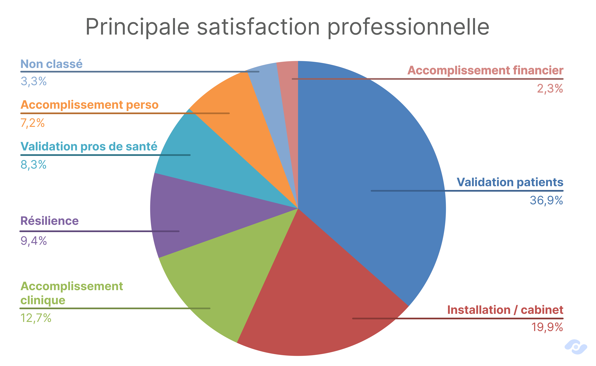
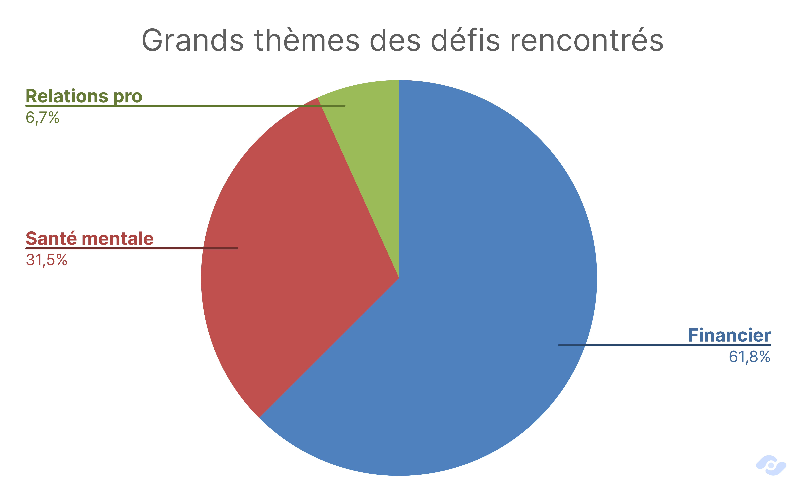
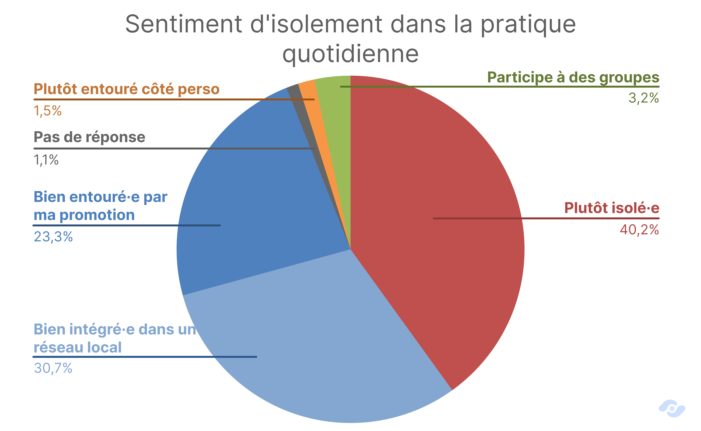
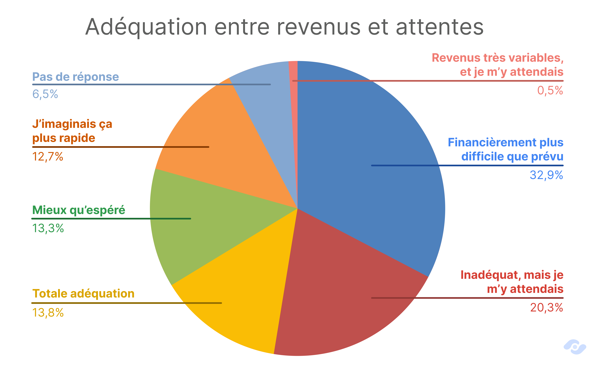
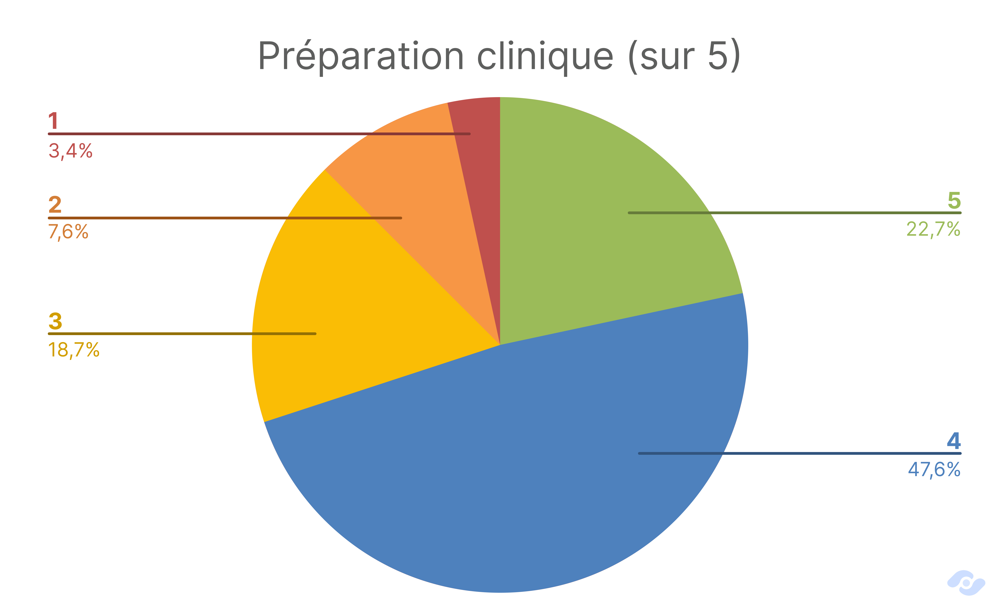
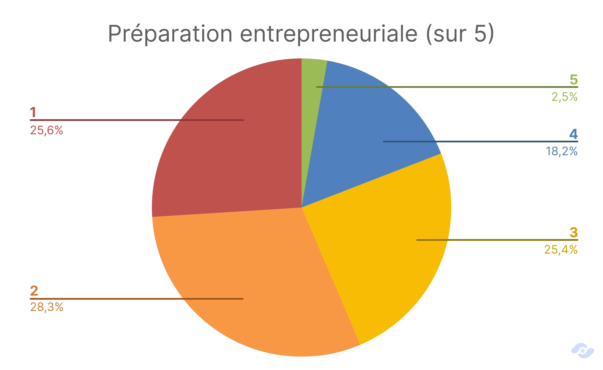
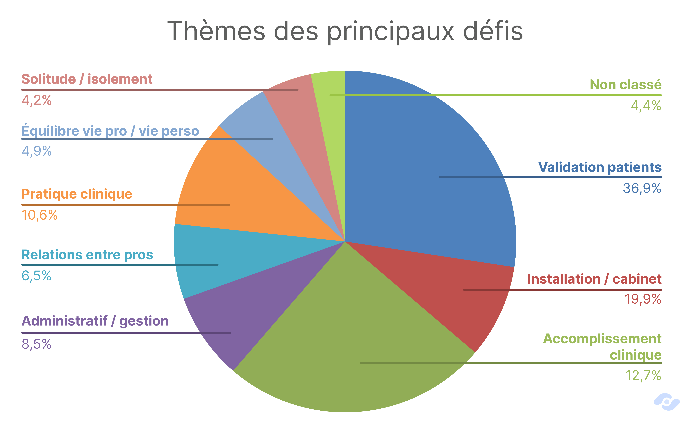
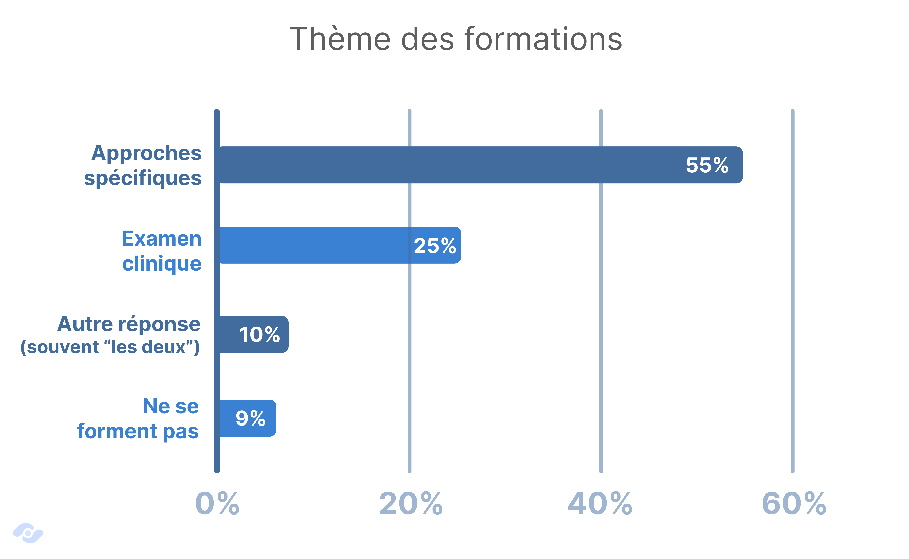
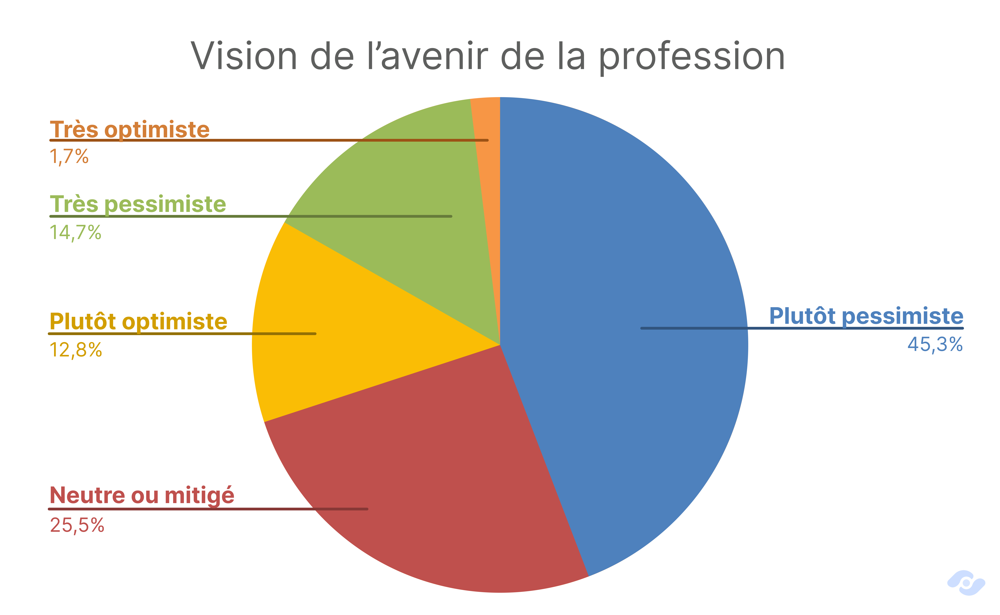
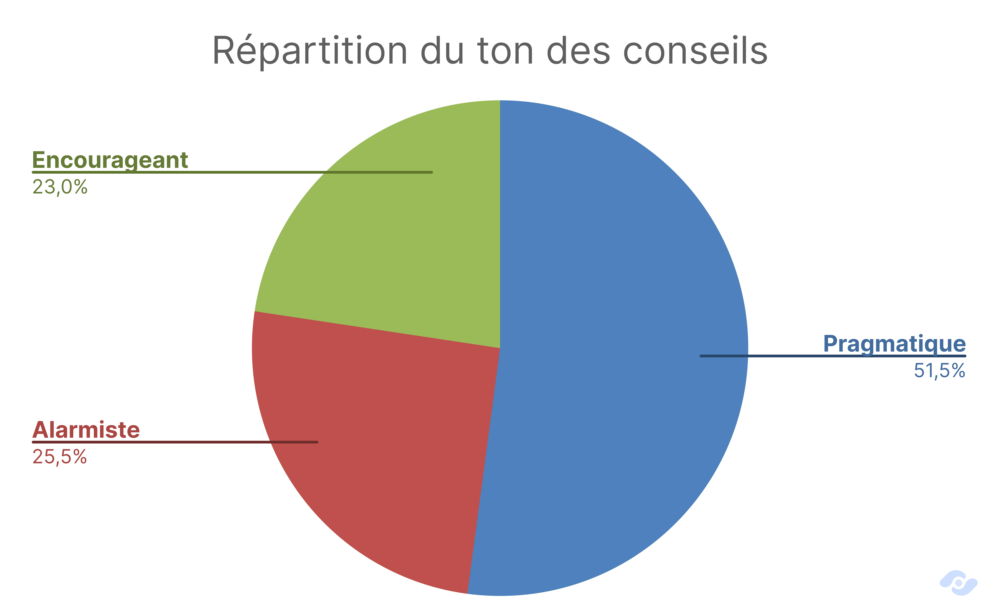

L'ostéopathie est une profession qui ne manque pas de débats. Reconnaissance institutionnelle, densité démographique en hausse, formation qui divise : autant de sujets qui animaient, animent et animeront certainement encore longtemps les débats. Mais derrière ce brouhaha, on a voulu se poser une question plus discrète mais certainement pas moins importante : **Est-ce que les ostéopathes vont bien ?**

Et si la réponse est plus nuancée qu'un oui ou un non, elle pourrait indiquer assez précisément où il faudrait agir…

<!--more-->

<aside aria-labelledby="methodologie-en-bref" class="p-5 mb-10 font-sans text-base leading-7 text-gray-700 border border-blue-200 rounded-xl bg-blue-50 sm:p-8 sm:mb-12">
  <h2 id="methodologie-en-bref" class="mb-5 text-2xl font-bold leading-snug text-gray-900">La méthodo' en bref</h2>
  

    
<strong class="font-bold text-gray-900">475 ostéopathes diplômés</strong> ont répondu à ce questionnaire en ligne, entre le <strong class="font-bold text-gray-900">4 et le 28 novembre 2025</strong>, à tous les stades de carrière — des diplômés de moins de six mois aux praticiens installés depuis plus de dix ans.

    
Deux types de résultats se croisent dans cet article. Les <strong class="font-bold text-gray-900">questions fermées</strong> (échelles de 1 à 5, ressenti sur les revenus, isolement, vision de l'avenir) donnent des mesures nettes. Les <strong class="font-bold text-gray-900">questions ouvertes</strong> ont été lues et classées à la main : les pourcentages qui en découlent indiquent des tendances, pas des mesures exactes.

    
Les répondants étant <strong class="font-bold text-gray-900">volontaires</strong>, ces résultats décrivent fidèlement ce panel sans pouvoir être extrapolés à toute la profession.

  

  <a href="#méthodologie" data-scroll="instant" class="inline-block mt-6 font-bold text-teal-700 underline underline-offset-4 hover:text-teal-900 focus-visible:outline focus-visible:outline-2 focus-visible:outline-offset-4">Lire la méthodologie détaillée →</a>
</aside>

## Un parcours typique par étapes

Afin de saisir les enjeux de la profession d’ostéopathe, il faut comprendre comment ils travaillent. Comment exercent-ils ? Par quel chemin y sont-ils arrivés ? Et comment se construit, concrètement, une patientèle ?

### Débuter : le remplacement et la collaboration, presque un passage obligé

Juste après le diplôme, le champ des possibles paraît vaste ; mais dans les faits, il se resserre assez vite autour de **deux options** : le **remplacement** et la **collaboration**. **63,4&nbsp;% des répondants** ont débuté par l'une ou l'autre avant d'envisager une installation à leur compte, le remplacement étant majoritaire.
À l'inverse, **un peu moins d'un tiers ont fait le choix d'une création directe** : 17,3&nbsp;% en cabinet seul, 12,2&nbsp;% au sein d'un cabinet de groupe ou d'une maison de santé.

Ces débuts par étapes ont une **logique**, qui paraît aujourd'hui évidente : moins d'engagement financier, moins de risque, et la possibilité d'apprendre le métier réel — *la gestion d'un agenda, des patients, le rythme des journées* — sans avoir à porter seul les obligations du cabinet.

Et ça n'a pas toujours été le cas : ce type parcours s'est renforcé avec le temps. Parmi les diplômés depuis plus de 10 ans, la proportion de démarrages en remplacement ou collaboration tombe à **50,5&nbsp;%**, contre 63 à 73&nbsp;% pour les promotions plus récentes. Ce glissement suggère une **évolution** des pratiques d'installation : ce qui relevait autrefois d'un choix individuel s'est progressivement imposé comme une norme.

On peut y lire une forme de maturation collective : la profession a appris qu'il peut être confortable de ne pas s'installer au sortir de l'école, et transmet désormais ce parcours par étapes.

### Aujourd’hui : sept ostéopathes sur dix en cabinet

La phase en remplacement et/ou collaboration mène, pour la grande majorité, à l'**installation**. **69,3&nbsp;%** des répondants exercent aujourd'hui dans leur propre cabinet — 36&nbsp;% seul, 33,3&nbsp;% en groupe ou maison de santé.
Les collaborations représentent **17,9&nbsp;%** du panel, les remplacements 4,8&nbsp;%.

Le contraste avec les débuts est net : là où deux tiers commençaient en remplacement ou collaboration, moins d'un quart s'y trouvent encore. La trajectoire type est donc celle d'une progression vers l'**autonomie** — on continue d’apprendre en s’associant, puis on s'installe chez soi.
Notons au passage que l'installation partagée est presque aussi fréquente que l'installation solitaire : un tiers des répondants exercent au sein d'un cabinet de groupe ou d'une maison de santé pluridisciplinaire.

### Construire sa patientèle : Doctolib, le bouche-à-oreille et le réseau professionnel

Reste, entre le premier remplacement et le cabinet bien installé, tout le travail moins visible : **se faire connaître**. Interrogés sur l'action la plus efficace pour construire leur patientèle, les répondants désignent **trois leviers** principaux. **342 citent l'inscription sur Doctolib** ou une autre plateforme de prise de rendez-vous en ligne, **280 le bouche-à-oreille**, et **101 l'emplacement du cabinet**.
Ces trois leviers ont un point commun : ils reposent sur la **visibilité** et la **satisfaction des patients**, bien plus que sur des dispositifs de communication élaborés.
Les leviers purement numériques — *réseaux sociaux, site web référencé, publicité payante* — semblent plutôt en retrait. C'est un enseignement à contre-courant du discours ambiant sur la nécessité d'une présence en ligne travaillée : ce qui remplit un agenda d'ostéopathe, c'est peut-être d'abord d'être trouvable et d'être recommandé.

Voilà donc le parcours type : des débuts progressifs, une installation majoritaire, et une patientèle qui se construit patiemment. Reste à savoir comment on vit cette trajectoire.

<aside aria-labelledby="ressource-installation" class="p-5 my-8 font-sans text-base leading-7 text-gray-700 border border-teal-200 rounded-xl bg-teal-50 sm:p-8">
  
Un coup de main avec osteopathes.pro

  <h3 id="ressource-installation" class="mb-3 text-xl font-bold leading-snug text-gray-900">Comment développer son cabinet ?</h3>
  
Choisir son lieu d’installation, se faire connaître, développer son réseau : on peut avoir besoin d’un coup de main à chaque étape. Retrouvez nos ressources et notre accompagnement pour faire avancer votre activité. Nous proposons aussi <strong class="font-semibold text-gray-900">un échange gratuit sur ces sujets</strong>.

  

    <a href="https://www.osteopathes.pro/fr#apps" class="font-semibold text-teal-700 underline underline-offset-4 hover:text-teal-900 focus-visible:outline focus-visible:outline-2 focus-visible:outline-offset-4">Découvrir les ressources et accompagnements →</a>
    <a href="https://rendez-vous.osteopathes.pro" class="font-semibold text-teal-700 underline underline-offset-4 hover:text-teal-900 focus-visible:outline focus-visible:outline-2 focus-visible:outline-offset-4">Prendre RDV pour un conseil gratuit →</a>
  

</aside>

## Le vécu réel : comment vont les ostéos ?

On sait désormais par où passent les ostéopathes et où ils aboutissent. Reste la question la plus difficile à mesurer : comment vivent-ils ce parcours ? Nous avons donc laissé la parole ouverte — ce qui procure le plus de fierté, les défis rencontrés, le sentiment d'être entouré ou non — pour saisir ce que les statistiques d'activité ne peuvent pas mettre en lumière.

### La fierté vient d'abord des patients

Commençons par ce qui va bien — et il y a de quoi.
Interrogés sur leur **plus grande fierté professionnelle**, les répondants placent très largement en tête la **reconnaissance de leurs patients** : les retours positifs, les remerciements, le bouche-à-oreille, les patients qui reviennent et qui envoient leur entourage. S'y ajoute ensuite la **reconnaissance d'autres professionnels de santé** — médecins qui recommandent, confiance de kinés ou de sages-femmes.
Ensemble, ces deux formes de reconnaissance représentent environ **45&nbsp;%** des réponses.

Ces praticiens sont fiers de soigner, et ils le sont parce que ça fonctionne. Un patient qui recommande est un patient soulagé ; un médecin qui adresse est un médecin qui fait confiance. Derrière ces chiffres, il y a des milliers de prises en charge réussies, et une profession qui tient sa promesse thérapeutique.

Deux autres registres complètent le tableau : L'**installation** — *avoir monté son cabinet, l'avoir rempli, l'avoir fait tenir* — est citée par environ **20&nbsp;%** des répondants ; et l'**accomplissement clinique** proprement dit — *la satisfaction d'avoir résolu un cas difficile ou soulagé une douleur rebelle* — revient dans **12,7&nbsp;%** des réponses.

Enfin, un thème plus discret mais qui en dit long sur le chemin parcouru : la **résilience**. Presque un répondant sur dix situe sa plus grande fierté dans le simple fait d'avoir tenu — *« être toujours ostéopathe malgré les difficultés », « y être arrivé malgré tout »*.

### Les défis : l'argent et la tête, rarement séparés

Désormais, si on observe globalement les **défis** évoqués par les répondants, **trois grands blocs** émergent :
- **Le premier**, largement dominant, est **financier** : instabilité des revenus, fluctuations de patientèle, difficulté à développer et fidéliser une patientèle…
- **Le second** bloc est de l’ordre de la **santé mentale** : le doute sur sa propre légitimité, le déséquilibre entre vie professionnelle et personnelle, la solitude face au patient.
- **Un troisième** thème, plus discret mais tout de même présent, concerne les **relations** tendues avec d'autres professionnels : médecins peu accueillants, confrères peu bienveillants, titulaires abusifs… peu présent certes, mais assez important pour être évoqué.

Il est intéressant de noter que les deux premiers blocs sont rarement évoqués isolément. Dans plusieurs témoignages, la difficulté financière et le doute sur sa pratique apparaissent dans la même réponse, sans qu'on puisse établir lequel entraîne l'autre à partir de ce type de données.
Cependant, par définition, l'ostéopathe exerce en **libéral**, comme **entrepreneur individuel**. Dès lors, quand les finances vont mal, le raccourci qui consiste à se tenir pour personnellement responsable — à culpabiliser sa propre pratique **plutôt que le contexte** — est facile à emprunter.

Un autre détail mérite qu'on s'y arrête. Lorsqu’on rapproche ces réponses concernant les défis à celles sur la fierté, elles dessinent une configuration particulière chez une partie des répondants : **parmi ceux qui citent explicitement le doute ou la légitimité comme défi majeur, près de 6 sur 10 tirent aussi leur plus grande fierté du regard des autres**. Pour eux, la reconnaissance extérieure ne vient pas confirmer une assurance intérieure — elle semble en tenir lieu.
Ce sentiment persistant de ne pas être tout à fait légitime malgré des résultats objectifs semble récurrent, et on peut y voir un écho au “syndrome de l’imposteur”.

Rien d'alarmant en soi : le doute fait partie de tout métier de soin, et il est même le moteur d'une pratique qui se remet en question. Mais il rappelle qu'**un praticien isolé n'a personne pour lui renvoyer que son travail est bon** — ce qui nous amène à la partie suivante.

### Quatre praticiens sur dix se sentent isolés

A propos du sentiment d’isolement qu’on peut ressentir en tant qu’ostéopathe, on a simplement demandé aux répondants “Dans votre pratique quotidienne, comment vous sentez-vous ?”.
Le résultat est assez net : **40&nbsp;%** des répondants se déclarent "**plutôt isolés**", gérant seuls leurs doutes et leurs cas difficiles. À l'opposé, **30&nbsp;%** se sentent **bien intégrés dans un réseau local** (maison de santé, échanges avec d'autres praticiens), et **23&nbsp;%** restent portés par les liens tissés avec leur **promotion**.
Le chiffre le plus frappant est peut-être le plus faible : seuls **3,4&nbsp;%** des répondants participent à des **groupes de supervision** ou d'analyse de pratique — des dispositifs pourtant conçus précisément pour rompre cet isolement clinique ; mais peut-être trop méconnus ou inaccessibles&nbsp;?

L'écart mérite qu'on s'y arrête : entre **40&nbsp;% de praticiens isolés et 3,4&nbsp;% engagés dans un groupe d'analyse de pratique**, ce n'est probablement pas l'intérêt qui manque, mais l'information, l'accès ou le coût. Des dispositifs existent — encore faut-il savoir qu'ils existent.

<aside aria-labelledby="ressource-entraide" class="p-5 my-8 font-sans text-base leading-7 text-gray-700 border border-teal-200 rounded-xl bg-teal-50 sm:p-8">
  
Entraide entre collègues

  <h3 id="ressource-entraide" class="mb-3 text-xl font-bold leading-snug text-gray-900">Envie d’échanger avec d’autres ostéopathes ?</h3>
  
Un doute sur votre pratique, une difficulté au cabinet, ou simplement envie de discuter ? Le <strong class="font-semibold text-gray-900">Discord d’Ostéo de Demain</strong> permet d’échanger avec des étudiants et des ostéopathes, de poser vos questions et de partager vos expériences (cliniques ou pas). Vous préférez un échange direct ? Écrivez nous pour nous parler de votre situation ou demander un coup de main.

  

    <a href="https://discord.gg/kQjtMS63Yg" class="font-semibold text-teal-700 underline underline-offset-4 hover:text-teal-900 focus-visible:outline focus-visible:outline-2 focus-visible:outline-offset-4">Rejoindre le Discord Ostéo de Demain →</a>
    <a href="mailto:contact@osteopathes.pro" class="font-semibold text-teal-700 underline underline-offset-4 hover:text-teal-900 focus-visible:outline focus-visible:outline-2 focus-visible:outline-offset-4">Nous écrire par email →</a>
  

</aside>

## La réalité financière

On l'a vu, l'aspect financier de la profession semble également au cœur des difficultés rencontrées. **Mais est-ce qu'on le sait avant de s'engager dans ce métier ?**

Interrogés sur l'adéquation entre leurs revenus réels et ce qu'ils avaient imaginé en sortant de l'école, **53&nbsp;%** des répondants expriment une déception : soit ils trouvent la situation financièrement plus difficile que prévu, soit ils s'y attendaient tout en le vivant mal.

À l'inverse, **27&nbsp;%** estiment que leurs revenus correspondent à leurs attentes ou les dépassent (13,3&nbsp;% "c'est mieux qu'espéré", 13,8&nbsp;% "conforme").

<aside aria-labelledby="ressource-revenus" class="p-5 my-8 font-sans text-base leading-7 text-gray-700 border border-teal-200 rounded-xl bg-teal-50 sm:p-8">
  
Comprendre et anticiper ses revenus

  <h3 id="ressource-revenus" class="mb-3 text-xl font-bold leading-snug text-gray-900">Et concrètement, combien gagne un ostéopathe ?</h3>
  
Cette enquête mesure un écart entre les attentes et le vécu, pas des montants. Notre étude démographique détaille les revenus moyens et médians, leur dispersion et leur évolution.

  
Pour explorer votre propre situation, renseignez <strong class="font-semibold text-gray-900">votre nombre de consultations, vos honoraires et vos frais</strong> dans notre simulateur. Vous pourrez comparer des estimations de revenu net selon le régime choisi.

  

    <a href="https://www.osteopathes.pro/fr/choisir-son-statut-juridique-liberal" class="font-semibold text-teal-700 underline underline-offset-4 hover:text-teal-900 focus-visible:outline focus-visible:outline-2 focus-visible:outline-offset-4">Simuler les revenus de mon cabinet →</a>
    <a href="" class="font-semibold text-teal-700 underline underline-offset-4 hover:text-teal-900 focus-visible:outline focus-visible:outline-2 focus-visible:outline-offset-4">Lire notre étude démographique →</a>
  

</aside>

### Un vécu stable à tous les âges de carrière

  

    

      

        Cette section appelle une lecture prudente, pour une raison précise : la question porte sur les revenus « après 1 à 2 ans », or plus d'un tiers des diplômés de moins de 6 mois n'ont pas pu y répondre (sans réponse ou « pas assez d'ancienneté »), et ceux qui l'ont fait se projettent davantage qu'ils ne constatent ; là où les praticiens installés jugent sur une expérience réelle.
        </a>
      

    

  

On a donc observé précédemment une majorité de déception financière ; et ce désenchantement ne semble pas s'atténuer avec le temps. Quel que soit le stade de la carrière, le sentiment de “déception” reste plutôt stable : entre 52&nbsp;% et 62&nbsp;% des répondants jugent leurs revenus décevants, des plus jeunes diplômés aux praticiens installés depuis plus de dix ans.

En revanche, on remarque aussi que la proportion de « c'est mieux que ce que j'espérais » diminue avec l'ancienneté — de 30&nbsp;% chez les plus jeunes diplômés à 3&nbsp;% chez les plus de dix ans — **mais elle ne bascule pas dans la déception**. En effet, elle semble plutôt se déplacer vers le «&nbsp;**conforme**&nbsp;», qui progresse de 16&nbsp;% à 35&nbsp;%.
L'expérience ne semble donc pas dissoudre l'espoir ; elle ne ferait que réaligner peu à peu les attentes sur une réalité possiblement mal anticipée à la sortie de l'école.

### L'installation ne change pas le rapport à l'argent

On pourrait supposer que l'installation en cabinet propre — soit l'aboutissement de la majorité des trajectoires — s'accompagne d'une meilleure satisfaction financière ; ce n'est pas forcément ce que montrent les résultats.
Quel que soit le mode d'exercice actuel, la part de répondants déçus reste majoritaire et stable : **58&nbsp;%** en cabinet seul, **54&nbsp;%** en cabinet de groupe, **53&nbsp;%** en collaboration.
En somme, passer à son propre cabinet ne transforme pas mécaniquement le ressenti financier : l'installation résout certainement un enjeu d'**autonomie**, pas nécessairement de rémunération.

Le constat a au moins un mérite : il déplace la question. Si ni l'expérience ni le mode d'exercice ne suffisent à améliorer le ressenti financier, c'est probablement en amont qu'il faut chercher — du côté de ce qu'on apprend, ou pas, avant de s'installer.

## À quoi l'école prépare (et ne prépare pas)

Visiblement, les étudiants en ostéopathie ne se projettent pas toujours avec justesse sur la réalité financière qui les attend — mais s'agit-il seulement d'un problème d'attentes mal calibrées ?
La durée de formation a d'ailleurs varié selon les générations, certains ayant été formés en 5 ans, d'autres en 6 : autant d'années, en théorie, pour se préparer à l'après-diplôme. Reste à savoir ce que les diplômés retiennent réellement, une fois confrontés au terrain.

Pour le mesurer, deux questions distinctes ont été posées, portant sur deux dimensions indissociables de l'exercice : le sentiment de préparation à la **gestion entrepreneuriale** d'une part, et à la **pratique clinique** d'autre part — chacune notée de 1 à 5.

  

    

      

        Nuance utile à rappeler avant de lire cette partie, les réponses reflètent uniquement le ressenti subjectif des répondants et non une évaluation objective des programmes.
        </a>
      

    

  

### Deux salles, deux ambiances

Sur la préparation à la **pratique clinique** — *gérer le flux de patients, faire face aux « cas difficiles », assumer la solitude face au patient* — les répondants se montrent globalement **satisfaits** : **70,3&nbsp;%** attribuent un score de 4 ou 5 sur 5, et la moyenne s'établit à **3,79/5**. Seulement **10,9&nbsp;%** estiment avoir été mal préparés.

C'est un résultat qu'il faut souligner : **sept diplômés sur dix estiment que leur formation les a rendus capables de bien recevoir un patient**, de raisonner devant un cas et de tenir leur cabinet cliniquement.
Dans les faits, sur ce qui constitue le cœur du métier, **la formation en ostéopathie remplit sa mission aux yeux de ceux qui en sortent**.

De l’autre côté, la **préparation entrepreneuriale** raconte une histoire radicalement différente. Comptabilité, déclarations URSSAF, communication, gestion d'une activité libérale : **53,9&nbsp;%** des répondants se sont sentis **peu ou pas préparés** sur ces aspects (score 1 ou 2), et **25,6&nbsp;%** attribuent la note minimale de 1/5. Environ **20,7&nbsp;%** estiment avoir reçu une formation suffisante (score 4 ou 5). La moyenne tombe à **2,44/5** — soit plus d'un point et demi en dessous de la préparation clinique.

Ce décalage semble se renforcer en comparant les deux réponses de chaque répondant, **74,5&nbsp;% se jugent mieux préparés en clinique qu'en gestion**, contre seulement 7&nbsp;% qui jugent l'inverse. En d’autres termes, le déséquilibre semble un dénominateur commun aux ostéopathes, **indépendamment de l'école ou de l'ancienneté**.

Cette sérénité plus prononcée sur la préparation clinique était tout de même prévisible, les études d'ostéopathie étant **largement plus une formation clinique qu'entrepreneuriale**. Mais la différence marquée des chiffres témoigne d'un angle mort de la formation : après cinq à six ans d'études, plus d'un diplômé sur deux arrive sur le marché avec le sentiment de ne pas avoir les bases pour gérer l'entreprise qu'il vient pourtant de créer.

### Les défis vécus suivent les lacunes ressenties

Cette lacune entrepreneuriale se lit également dans les **défis** que les répondants disent avoir affrontés. En approfondissant l’observation des défis déjà décrite, les thèmes rapportés à l'**entrepreneuriat** englobent **plus de la moitié des réponses** ; et la gestion administrative proprement dite — URSSAF, comptabilité — est citée explicitement par **8,5&nbsp;%** des répondants comme un défi à part entière.

Le contraste avec le versant clinique est net. Les difficultés proprement cliniques ne sont mentionnées que par **10,6&nbsp;%** des répondants — et le plus souvent formulées comme un manque de pratique ponctuel, plutôt que comme un obstacle de fond.
En clair, une fois sur le terrain, ce n'est pas tant le geste ou le raisonnement clinique qui inquiète que tout ce qui l'entoure.

La hiérarchie des défis vécus rejoint ainsi celle des lacunes ressenties : on souffre là où l'on ne se sentait pas préparé.
C'est peut-être le constat le plus encourageant de cette enquête, aussi paradoxal que cela paraisse : facturation, URSSAF, prévisionnel, choix de statut sont des compétences enseignables. Le déficit est net, et il porte sur des savoirs parfaitement transmissibles.

<aside aria-labelledby="ressource-bds" class="p-5 my-8 font-sans text-base leading-7 text-gray-700 border border-teal-200 rounded-xl bg-teal-50 sm:p-8">
  
Les ressources d’osteopathes.pro

  <h3 id="ressource-bds" class="mb-3 text-xl font-bold leading-snug text-gray-900">La gestion du cabinet, ça s’apprend aussi en BD</h3>
  

    <a href="https://www.osteopathes.pro/fr/ressources/bds/comment-anticiper-tes-revenus-en-osteo" class="block w-full rounded-lg md:w-2/5 md:flex-shrink-0 focus-visible:outline focus-visible:outline-2 focus-visible:outline-offset-4 focus-visible:outline-teal-700">
      
    </a>
    

      
Démarches d’installation, chiffre d’affaires, revenu net : nos BD expliquent la gestion du cabinet pas à pas. Celle sur les revenus vous aide à <strong class="font-semibold text-gray-900">comprendre combien de consultations sont nécessaires pour couvrir vos charges et dégager un revenu</strong>.

      

        <a href="https://www.osteopathes.pro/fr/ressources/bds/comment-anticiper-tes-revenus-en-osteo" class="font-semibold text-teal-700 underline underline-offset-4 hover:text-teal-900 focus-visible:outline focus-visible:outline-2 focus-visible:outline-offset-4">Lire la BD sur les revenus →</a>
        <a href="https://www.osteopathes.pro/fr/ressources/bds" class="font-semibold text-teal-700 underline underline-offset-4 hover:text-teal-900 focus-visible:outline focus-visible:outline-2 focus-visible:outline-offset-4">Parcourir toutes nos BD →</a>
      

    

  

</aside>

## La formation continue, un engagement massif

### Une profession qui ne cesse d'évoluer

Lorsqu’on demande si — et à quoi — les ostéopathes se forment, les données montrent une profession qui se forme énormément : **90,7&nbsp;% des répondants déclarent avoir suivi ou prévoir de suivre des formations post-graduées** (seuls 9,3&nbsp;% répondent "non, pas pour le moment"). Ce taux progresse même avec l'ancienneté : on passe **de 80&nbsp;% chez les diplômés de moins de 6&nbsp;mois à plus de 95&nbsp;% dès la tranche des 2-3&nbsp;ans**, avant un léger tassement chez les praticiens de plus de 10&nbsp;ans (93&nbsp;%).

Autrement dit, se former ne semble pas une réaction de jeune diplômé anxieux, mais un trait commun tout au long de la carrière — plutôt positif ! Mais pour se former sur quelles thématiques ?

### Des thématiques presque exclusivement cliniques

C'est ici que le tableau se précise. Parmi les répondants, **plus de la moitié se forme à des approches spécifiques** (*pédiatrie, techniques particulières, prise en charge du sportif ou de la femme enceinte…*) ; et **autour d'un quart des répondants se forme à l'examen clinique** (*neurologique, vasculaire, orthopédique*). Les deux thèmes dominants sont donc l'un comme l'autre de nature clinique : la formation continue prolonge et approfondit le cœur de métier.

  

    

      

        Une précision s'impose avant d'aller plus loin : la question ne proposait initialement que ces deux thèmes, tous deux cliniques. Aucune case «&nbsp;gestion&nbsp;» ou «&nbsp;communication&nbsp;» n'était offerte. L'absence quasi totale de formations entrepreneuriales dans les réponses reflète donc en partie notre propre questionnaire, et non uniquement le comportement des répondants. On ne peut pas en conclure que les ostéopathes ne se forment jamais à la gestion — seulement que peu ont jugé utile de l'ajouter spontanément.
        </a>
      

    

  

Cette réserve posée, un décalage demeure. Le principal déficit ressenti de la formation initiale est entrepreneurial, le principal bloc de défis vécus est financier et administratif ; et pourtant l'offre de formation continue vers laquelle les praticiens se tournent — **et/ou qu'on leur présente en priorité** — reste centrée sur le **geste clinique**. La formation continue, telle qu'elle apparaît dans ce sondage, **approfondit une compétence déjà jugée solide** plutôt qu'elle ne répare celle qui fait défaut.
Ce décalage peut être perçu comme une **opportunité** : une demande qui semble peu couverte. Les organismes qui proposent déjà des formations cliniques disposent du public, de la logistique et de la crédibilité nécessaires pour y ajouter la gestion d'activité. Rien n'indique dans ces réponses que les ostéopathes refuseraient de s'y former — seulement qu'on ne le leur propose guère.

En somme, un tel appétit de formation traduit un vrai engagement envers le métier. Mais s'investir autant dans sa pratique n'empêche pas, on va le voir, de porter un regard beaucoup plus sombre sur l'avenir de la profession.

## La vision de l'avenir : désenchantement ou résilience ?

### Six ostéopathes sur dix pessimistes

À la question sur la vision de l'avenir de l'ostéopathie en France, près de **60%** des répondants se déclarent **pessimistes** : 44,6% "plutôt pessimistes" et 14,7% "très pessimistes", soit 282 personnes sur les 472 ayant répondu.

En face, à peine **14,6%** expriment une forme d'**optimisme** — dont seulement 1,7% de "très optimistes" (8 répondants). Le quart restant (25,6%) se dit neutre ou mitigé. Le curseur collectif penche donc nettement du côté de l'inquiétude, et le mot n'est pas trop fort : les pessimistes sont quatre fois plus nombreux que les optimistes.

### Un pessimisme qui croît avec l'expérience

Le croisement avec l'ancienneté révèle une tendance particulièrement parlante : **le pessimisme croît régulièrement avec l'expérience**. Il passe de 45,5% chez les diplômés de moins de 6 mois à 74,7% chez les praticiens de plus de 10 ans, en augmentation continue à chaque palier d'ancienneté. En parallèle, la part d'optimistes s'effondre symétriquement, de 23% chez les plus jeunes à 10% chez les plus anciens.

Ce gradient est important à **interpréter avec prudence**. La profession est jeune : les plus anciens ont vu leur métier se démocratiser, le nombre de praticiens et d'écoles augmenter, et le paysage se transformer sous leurs yeux. Leur pessimisme reflète sans doute cette évolution vécue de l'intérieur. Mais le recul manque probablement encore pour dire si la profession se "dégrade" réellement ou si elle traverse simplement les tensions de croissance d'un métier récent. Mais dans tous les cas, il contredit l'idée que le pessimisme serait une lubie de jeunes diplômés déçus : ce sont au contraire les plus expérimentés qui sont les plus pessimistes.

### Saturation, reconnaissance, formation : d'où vient l'inquiétude ?

Invités à justifier librement leur vision, 408 répondants ont développé leurs raisons. Le diagnostic est massivement **démographique** : la "saturation" du marché — trop d'ostéopathes, trop de diplômés chaque année, un vécu qui reflète d'une "concurrence" plutôt que de confraternité — domine très largement, citée par quasiment la moitié des répondants. Viennent ensuite les enjeux de **reconnaissance et de statut** (remboursement, cadre légal, place dans le système de santé — 42,9%), puis la qualité de la **formation initiale** et la prolifération des écoles (28,7%). Près d'un répondant sur cinq réclame explicitement une **régulation du nombre de diplômés** — numerus clausus, quotas, fermeture d'écoles (19,6%). Suivent les **dérives et le manque de rigueur** scientifique (18,1%), à égalité avec les **opportunités et l'évolution positive de la profession** (17,9%), puis la **précarité économique** (16,2%) et le **manque de cohésion interne** (7,1%).

Chez les **pessimistes**, la "saturation du marché" écrase tout (**53%**), suivie de la reconnaissance (**36%**), de la qualité de la formation (**35%**) et de la précarité économique (**22%**).

Chez les optimistes, ces thèmes s'effacent presque entièrement au profit de la **reconnaissance** perçue comme un chantier qui avance (**63%**) et des opportunités d'évolution (**43%**).

Il semble alors que pessimistes et optimistes ne regardent pas à travers le même prisme : les premiers voient un **marché qui se referme**, les seconds une **profession qui gagne sa place**.
La **reconnaissance** est d'ailleurs le seul motif à mobiliser fortement les deux camps — mais elle est surtout le moteur des optimistes, qui y voient un chantier qui avance, là où un pessimiste sur trois la cite comme un manque persistant.

### Le conseil aux futurs diplômés : d'abord du pragmatisme

Dernière question ouverte, et sans doute la plus révélatrice de l'état d'esprit collectif : «&nbsp;Quel conseil donneriez-vous à l'étudiant que vous étiez&nbsp;?&nbsp;». **408&nbsp;répondants** y ont répondu sur un ton identifiable.

Le **pragmatisme** arrive en tête (**51,5&nbsp;%**) : des recommandations concrètes et opérationnelles — bien choisir sa zone d'installation, prendre un comptable, faire une étude de marché, se former vite, enchaîner remplacements et collaborations avant de s'installer.
C'est en soi un enseignement. Confrontés à des débuts difficiles et invités à s'adresser à leur propre passé, une majorité d'ostéopathes ne transmettent ni amertume ni découragement, mais un mode d'emploi.

Restent deux registres minoritaires, d'ampleur comparable mais de sens drastiquement opposés. Les **conseils alarmistes** représentent **25,5&nbsp;%** des réponses : de la mise en garde lucide («&nbsp;prépare-toi à galérer&nbsp;», «&nbsp;ne compte pas sur un gros salaire&nbsp;») jusqu'au conseil radical de réorientation. Les **conseils encourageants** en représentent **23&nbsp;%**, centrés sur la persévérance, la confiance en soi et la passion du métier («&nbsp;persévère&nbsp;», «&nbsp;crois en tes capacités&nbsp;», «&nbsp;ne change rien&nbsp;»).

Et là encore, l'**ancienneté déplace le curseur**.
Le ton désenchanté est nettement plus rare chez les diplômés de moins de 6 mois (**17&nbsp;%**) que chez leurs aînés, où il s'installe durablement autour de **27 à 30&nbsp;%**, pour culminer chez les praticiens de plus de 10 ans (**30&nbsp;%**).

À l'inverse, **ce sont les plus jeunes qui délivrent les conseils les plus pragmatiques** (**58,5&nbsp;%**, contre environ **50&nbsp;%** ensuite). Le registre **encourageant**, lui, reste plutôt **constant** tout au long de la carrière (**20 à 25&nbsp;%**). Le désenchantement que l'on lisait déjà dans la vision d'avenir se retrouve alors dans les conseils que la profession s'adresse à elle-même : il n'est pas le fait de débutants déçus, mais s'accentue à mesure que l'on exerce.

## Ce que les ostéopathes ont voulu dire en plus

La dernière question du sondage n'en était pas vraiment une : un simple espace ouvert, « *avez-vous quelque chose à ajouter ?* ». **101&nbsp;répondants** s'en sont saisis. C'est peu en proportion, mais ces contributions sont précieuses : ce sont les seuls moments où les répondants pouvaient s'exprimer sans cadre imposé.

  

    

      

        Une précaution s'impose d'emblée. Ceux qui prennent la peine d'écrire un paragraphe libre ne forment pas un échantillon représentatif : on s'exprime davantage quand on a quelque chose de fort à dire, dans un sens comme dans l'autre. Nous avons codé par thèmes les témoignages exploitables ; les proportions qui suivent sont donc indicatives et servent à repérer des registres récurrents, pas à les quantifier au point près.
        </a>
      

    

  

### Le cœur du propos : « j'aime ce métier, mais… »

S'il fallait retenir une tonalité, ce serait celle de l'**ambivalence**.  L'**attachement au métier** est affirmé dans 26,7&nbsp;% des témoignages — et près de la moitié d'entre eux le formulent en même temps qu'un registre négatif. «&nbsp;Malgré tous les aspects négatifs, j'aime ce que je fais et mon cadre de vie&nbsp;» ; le métier est aimé, c'est son économie et sa reconnaissance qui inquiètent.  Cette coexistence — l'affection et la difficulté dans la même phrase — est sans doute la signature la plus fidèle de l'état d'esprit des répondants.

### L'argent, toujours au premier plan

Le thème le plus présent concerne les **finances**, qui représente près d'un témoignage sur trois. *Charges qui dépassent les revenus, agenda dépendant des notifications Doctolib, prêt étudiant, sentiment de «&nbsp;donner plus de 50&nbsp;% de son chiffre d'affaires&nbsp;»*.

### La tentation de la porte de sortie

En parallèle, la tentation de reconversion apparaît dans 20,8&nbsp;% des témoignages, et la **diversification** — *reprendre des études, exercer à mi-temps, s'appuyer sur une autre activité* — dans 11,9&nbsp;%. Plusieurs praticiens, minoritaires mais nets, confient qu'ils l'exercent désormais à temps partiel «&nbsp;pour ne plus dépendre de la rentabilité du cabinet&nbsp;».
Ce n'est pas un abandon de l'ostéopathie, mais un pas de côté pour continuer à l'exercer autrement.

### Et la charge mentale

Enfin, la charge mentale est présente dans près d'un témoignage sur cinq : *la solitude vécue comme une véritable source d'angoisse, un moral «&nbsp;entièrement dépendant&nbsp;» du remplissage de l'agenda.*
Au final, ces témoignages prolongent le constat des sections précédentes — 40&nbsp;% d'isolement ressenti, 3,4&nbsp;% seulement en supervision.

## Conclusion — l’ostéopathie, un “métier passion” ?

Le point de départ de cette enquête n'était pas comptable, mais **humain** : **Est-ce que les ostéopathes vont bien ?** Après 475&nbsp;réponses, la tentation serait de trancher par un «&nbsp;oui&nbsp;» ou un «&nbsp;non&nbsp;».
Les résultats n'autorisent ni l'un ni l'autre — et c'est peut-être leur enseignement le plus utile.

### Ce qui tient

**7 diplômés sur 10 estiment que leur formation les a rendus capables d'exercer cliniquement**.
9 sur 10 se forment ou comptent se former après le diplôme. Leur plus grande fierté vient de leurs patients — de ceux qui reviennent, qui remercient, qui recommandent — ce qui est le signe le plus simple d'une pratique qui fonctionne.

Et le parcours type s'est structuré avec le temps : les remplacements et collaborations avant l'installation, autrefois un choix individuel, sont devenus une norme transmise. Sur le métier lui-même, la profession sait ce qu'elle fait, et elle le fait bien.

### Ce qui use

**3 répondants sur 4 se sentent mieux armés en clinique qu'en gestion**, et plus d'un sur deux juge ses revenus décevants — une déception qui ne semble s'effacer ni avec les années, ni avec l'ouverture de son propre cabinet.
**4 praticiens sur 10 se sentent isolés quand seuls 3,4&nbsp;% disposent d'un espace pour en parler**. Et près de 6 sur 10 se déclarent pessimistes quant à l'avenir de la profession, avec cette particularité que le pessimisme s'accentue avec l'expérience plutôt que de s'atténuer.

Le tableau n'est donc ni celui d'une profession qui n’a aucun souci, ni celui d'une profession en détresse : c'est celui d'un métier solide dont l'exercice semble toutefois difficile. Mais la distinction n'est pas rhétorique, parce qu'elle désigne précisément où agir.

### Sur la préparation entrepreneuriale

L'enquête livre un constat plutôt net : une moyenne de 2,44 sur 5, un quart des répondants à la note minimale, et cela quelle que soit l'école. C'est aussi un constat corrigible. Facturation, URSSAF, prévisionnel, choix de statut : ce sont des compétences enseignables, à des ostéos qui vont créer ou ont tous créé une entreprise. Aucune donnée de ce sondage ne suggère que le problème soit difficile à résoudre — seulement qu'il ne semble pas résolu.

### Sur la formation continue

Le décalage est tout aussi exploitable. Les ostéopathes se forment massivement, mais l'offre vers laquelle ils se tournent prolonge le versant clinique. Il y a là une demande potentielle qui paraît peu couverte : des formations à la gestion d'activité, conçues pour des praticiens en exercice, par ceux-là mêmes qui proposent déjà les formations cliniques.

### Sur la démographie et la reconnaissance

Sur ce point, les répondants ne se contentent pas de constater : près d'un sur cinq réclame explicitement une régulation du nombre de diplômés, et la reconnaissance institutionnelle est le seul sujet qui mobilise autant les optimistes que les pessimistes — les uns y voyant un chantier qui avance, les autres un manque persistant. Ces deux questions dépassent de loin le praticien isolé : elles engagent les écoles, les instances représentatives et les pouvoirs publics. Mais elles ont le mérite d'être clairement formulées par la profession elle-même.

### Au final

Reste ce que les répondants ont déjà entrepris sans attendre personne. Invités à s'adresser à l'étudiant qu'ils étaient, une majorité d'entre eux ne transmettent ni amertume ni découragement, mais un mode d'emploi : choisir sa zone, faire une étude de marché, prendre un comptable, passer par le remplacement avant de s'installer. Ce corpus de conseils, accumulé réponse après réponse, constitue en soi un début de solution — à condition qu'il circule autrement que par le bouche-à-oreille.
C'est peut-être là ce qui rend l'étiquette de « métier passion » à la fois juste et insuffisante. **La passion est bien réelle** : elle affleure dans un quart des témoignages libres, souvent dans la même phrase que les difficultés. Mais elle ne devrait pas avoir à compenser, à elle seule, une insécurité économique et un isolement que ni la formation ni le cadre actuel ne viennent vraiment amortir. Une profession qui tient grâce à l'attachement de ses membres tient réellement — mais elle tiendrait mieux si l'attachement n'était pas son seul amortisseur.
Cette enquête ne prétend pas trancher : elle repose sur des répondants volontaires et, pour une part, sur des questions ouvertes interprétées avec prudence. Elle n'ouvre pas un verdict, mais une conversation. Et s'il fallait n'en retenir qu'une chose, ce serait celle-ci : il a suffi d'ouvrir un espace de parole pour que des centaines d'ostéopathes s'en emparent — pour dire les difficultés, mais aussi la fierté, et souvent les deux dans la même réponse. C'est déjà une profession qui sait ce dont elle a besoin. Reste à l'écouter.

## Méthodologie

Ce sondage a recueilli **475 réponses**, collectées entre le 4 et le 28 novembre 2025. Il s'agit d'un questionnaire en ligne auquel les répondants ont participé **volontairement**. Les répondants se sont donc manifestés d'eux-mêmes : ils ne constituent pas un échantillon représentatif de la profession, construit selon des quotas. **On répond plus volontiers à une enquête quand on a quelque chose à dire, dans un sens comme dans l'autre**.
Les résultats décrivent donc fidèlement ce que pensent ces 475 ostéopathes, sans qu'on puisse mécaniquement les extrapoler à l'ensemble de la profession. Cela dit, le panel couvre bien l'**ensemble des parcours**, des tout jeunes diplômés aux praticiens installés depuis plus de dix ans, ce qui autorise les comparaisons entre générations présentées dans l'article.

Pour ce qui est des résultats obtenus, il en existe deux natures, à ne pas confondre. Les **questions fermées** — *les échelles de préparation de 1 à 5, le ressenti sur les revenus, le sentiment d'isolement, la vision de l'avenir, le mode d'exercice* — donnent des mesures fermes : chaque répondant a coché une case, le comptage est sans ambiguïté. Les **questions ouvertes** — *les défis rencontrés, le conseil au futur diplômé, la plus grande fierté, les raisons de la vision d'avenir, le témoignage libre* — ont été lues et classées une à une, à la main. Ce classement comporte par définition une part d'appréciation : un même conseil peut être lu comme lucide ou comme décourageant par exemple. Les pourcentages qui en sont issus indiquent des tendances, pas des mesures exactes.

Concernant les pourcentages des questions ouvertes, trois règles s'appliquent. D'abord, chaque taux est calculé sur les répondants ayant répondu à cette question précise, et non sur les 475 : les bases varient donc d'une question à l'autre. Ensuite, une même réponse peut relever de plusieurs thèmes — la somme des pourcentages dépasse alors 100%, et il faut les lire comme des fréquences de mention, non comme la répartition d'un tout. Enfin, les réponses trop singulières pour entrer dans une catégorie sont comptées comme « non classées » et restent au dénominateur.
