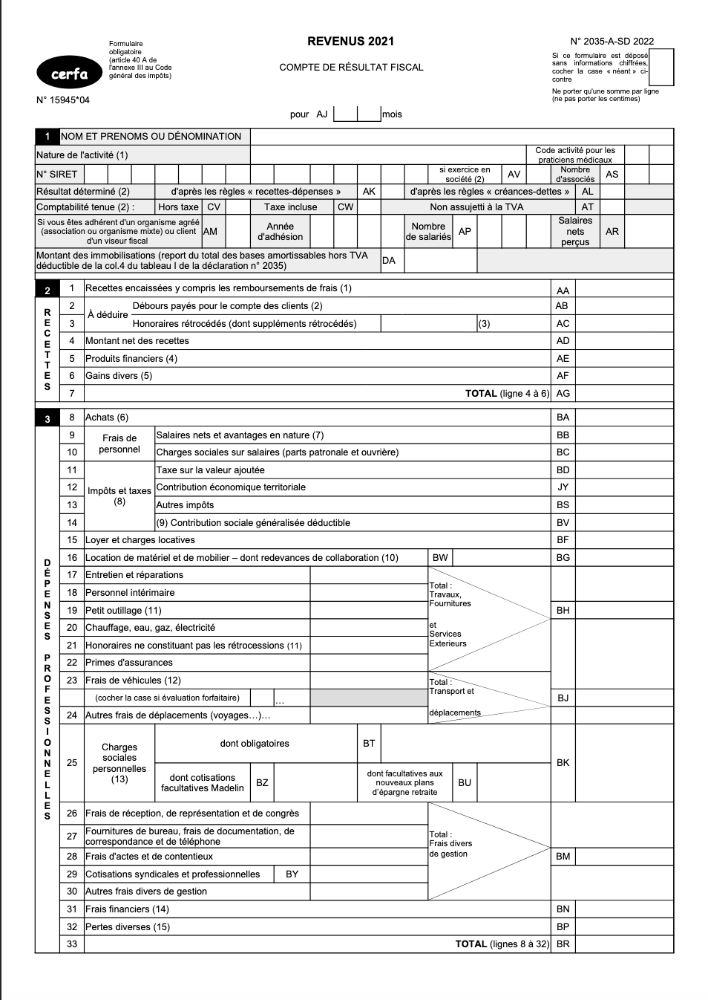

Comme d’autres, l’ostéopathe est en France une profession
réglementée relevant des bénéfices non commerciaux (BNC)
dont l’exercice est essentiellement libéral[^1] [^2].
C’est dans ce cadre que l’ostéopathe va devoir faire ses
choix quant à son statut juridique, social et fiscal.
Les autres situations ne seront pas traitées ici (salariat,
partenariats avec des structures...). Il y a plusieurs
éléments à prendre en compte pour déterminer le statut le
plus adapté à sa situation : le type d’exercice (remplacement,
collaboration, titularisation), la forme juridique (entreprise
individuelle, autre forme) et le statut fiscal (micro-entreprise,
déclaration contrôlée). Prenons chaque éléments un par un...

<!--more-->

[^1]: « Ostéopathe | Bpifrance Création ».
      https://bpifrance-creation.fr/activites-reglementees/osteopathe (consulté le 21 janvier 2023).

[^2]: « Article 29 - LOI n° 2012-387 du 22 mars 2012 relative
      à la simplification du droit et à l’allégement des
      démarches administratives (1) - Légifrance ».
      https://www.legifrance.gouv.fr/jorf/article_jo/JORFARTI000025553548 (consulté le 21 janvier 2023).

## Un peu de lexique
Afin de partir sur de bonnes bases, un peu de terminologie:

- Les rétrocessions d’honoraires sont une recette négative
  pour celui ou celle qui les verse (voir Figure 1),
- Les redevances de collaboration sont des charges pour
  celui ou celle qui les verse (voir Figure 1),
- Le régime de la micro entreprise, ou de l’auto-entreprise,
  est le régime fiscal simplifié. La base de calcul se fait
  sur la totalité des recettes perçues.
- Le régime réel, la déclaration contrôlée, la 2035, font
  référence au régime fiscal pour lequel le professionnel
  déclare ses frais réels. La base de calcul se fait sur
  le BNC, soit les recettes auxquelles sont déduites les charges.

## Type d’exercice
### Remplacement
Un mode d’exercice courant de la profession, notamment au
début, est d’aller de remplacement en remplacement chez
des titulaires déjà installés. Le remplacement est un
contrat à durée déterminée, ne pouvant être signé que
lorsque le ou la titulaire ne peut exercer son activité (maladie,
formation...). Les remplacements supérieurs à 24h doivent
obligatoirement être établis par un contrat écrit, et cela
reste fortement recommandé pour les remplacements courts
afin d’éviter tout problème par la suite (responsabilité, paiement...).

Dans les faits, le ou la titulaire « délègue » son activité
à la personne qui la remplace. Les notes d’honoraire sont
donc au nom du ou de la titulaire, signées par le ou la
remplaçante. Les honoraires sont perçues par l’ostéopathe
titulaire qui verse une rétrocession d’honoraire à la
personne qui remplace[^3]. En effet, la déclaration 2035
(Figure 1) présente les rétrocession d’honoraire comme
un bénéfice négatif pour la personne qui les verse (case AC).
Ce mouvement comptable suppose que la personne ayant réalisé
ce versement est titulaire de l’activité. Pour le ou la
remplaçante, ce sont ses recettes (case AA). Dans le cas où
le ou la remplaçante encaisserait, cela pose deux problématiques:

[^3]: « BOI-BNC-BASE-20-20 - BNC - Base d’imposition -
      Recettes - Nature des recettes | bofip.impots.gouv.fr ».
      https://bofip.impots.gouv.fr/bofip/4650-PGP.html/identifiant%3DBOI-BNC-BASE-20-20-20220209
      (consulté le 21 janvier 2023).

- L’intérêt pour le ou la remplaçante. Au régime réel cela
  n’a pas d’impact, mais si le statut fiscale de micro
  entreprise a été adopté, l’imposition se fera sur la totalité
  des recettes encaissées. La rétrocession sera donc
  implicitement comprise dans l’abattement forfaitaire de 34%;
- La requalification de l’activité. Le versement de rétrocessions
  étant supposé se faire de l’ostéopathe titulaire vers le ou
  la remplaçante, cette dernière pourrait demander à requalifier
  son activité vers une collaboration (en supposant les
  rétrocessions être des redevances, mais sans le contrat adéquat).
  La requalification vers la titularisation est peu probable du
  fait de l’absence de couverture des charges du cabinet, bien
  que dans les faits une seule personne puisse les supporter
  avant une répartition à l’amiable.

Le ou la remplaçante doit être explicitement identifiable sur
les notes d’honoraire, avec les mêmes mentions légales que le
ou la titulaire : nom, prénom, numéro ADELI (ou RPPS le cas échéant),
numéro SIRET. Les informations du cabinet ne changent pas (adresse,
téléphone...).

Les rétrocessions peuvent être calculées de plusieurs façons.
Dans la mesure ou elles doivent refléter la variabilité de
l’activité, elles sont souvent constituées par un pourcentage
des honoraires, le ou la titulaire pouvant couvrir ses charges
de fonctionnement avec le pourcentage restant. La somme
conservée par le ou la titulaire peut cependant être fixée
(à la valeur stricte des charges par exemple) ou variable jusqu’à
un certain plafond (pour éviter de conserver une somme trop
importante en cas de forte activité, par exemple). La
rétrocession perçue par le ou la remplaçante ne peut, par contre,
pas être fixe, au risque de requalification de la relation
professionnelle en salariat, avec régularisation des cotisations
sociales pour le ou la titulaire.

Enfin, la personne en remplacement ne constitue pas sa propre
patientèle dans le cabinet de l’ostéopathe titulaire.

### Collaboration
La collaboration est un contrat obligatoirement écrit conclu
entre deux personnes exerçant la même profession [^4]. Ce
contrat peut être à durée indéterminée. Il n’est pas nécessaire
que l’ostéopathe titulaire soit indisponible pour débuter une
collaboration, les deux pouvant travailler en alternance dans
un même local, ou conjointement dans des pièces séparées. Ce
contrat a pour vocation à rendre le ou la collaboratrice
titulaire, soit par une reprise d’activité soit par une
association, même si ça n’est pas obligatoire.

[^4]: « Article 18 - Loi n° 2005-882 du 2 août 2005 en faveur
      des petites et moyennes entreprises. - Légifrance ».
      https://www.legifrance.gouv.fr/loda/article_lc/LEGIARTI000029336794/

Le ou la collaboratrice encaisse les honoraires à son nom, et
verse une redevance de collaboration à son ou sa titulaire
(case BW sur la déclaration 2035), à l’image d’un « loyer »:
la redevance est donc une charge contrairement à la rétrocession.
De par l’encaissement des honoraires, le statut de la
micro-entreprise peut rapidement perdre de son intérêt en cas
de collaboration, l’abattement forfaitaire de 34 % pouvant
vite être atteint.

Le ou la collaboratrice constitue sa propre patientèle dont
les modalités sont à définir dans le contrat afin d’éviter
les mésententes par la suite (quels patients : nouveaux, plus
souvent vus par le ou la collaboratrice, etc.), car la fin de
la collaboration peut donner lieu à une indemnisation de la part
de l’ostéopathe titulaire pour « racheter » cette patientèle.
À l’inverse, une reprise d’activité peut être valorisée par une
collaboration préalable et la transition de l’ostéopathe
titulaire vers le ou la collaboratrice. Cette période de
transition peut jouer sur le tarif du rachat de la patientèle
le cas échéant, même s’il n’y a pas de règle concernant la fixation du prix.

## La forme juridique
### Entreprise individuelle
La forme la plus courante des professionnels libéraux
est probablement l’Entreprise Individuelle (EI). Ce statut
est le plus simple à appréhender et supporte peu de démarches
administratives. Dans les faits, l’entreprise individuelle ne
crée pas de personnalité morale, à savoir une entité juridique
différenciée de la personne physique qui la compose: l’ostéopathe.
Depuis le 15 mai 2022, les patrimoines professionnel et personnel
de la personne physique sont cependant séparés[^5]. L’entreprise
peut opter pour le régime fiscal qu’elle souhaite, micro entreprise
si elle y est éligible (voir les conditions par la suite) ou
déclaration contrôlée.

[^5]: Décret n° 2022-799 du 12 mai 2022 relatif aux conditions
      de renonciation à la protection du patrimoine personnel
      de l’entrepreneur individuel et du transfert universel
      du patrimoine professionnel. 2022.

### Autres formes juridiques
D’autres formes peuvent présenter des intérêts différents,
qui seront survolés ici. Citons:

- L’Entreprise Individuelle a Responsabilité Limitée (EIRL)
  qui est une forme particulière d’entreprise individuelle
  mais dont la création n’est plus possible depuis février 2022[^6],
- L’Entreprise Unipersonnelle à Responsabilité Limitée (EURL).
  Forme unipersonnelle de la Société A Responsabilité Limitée
  (SARL), elle crée une personnalité morale dissociée de la
  personnalité physique. Elle permet une répartition plus souple
  des bénéfices par le versement d’un salaire et/ou de dividendes,
  peut être imposée à l’impôt sur les sociétés ou sur le revenu.
  Elle nécessite plus de démarches administratives (rédaction de
  statuts, etc.). L’associé de l’EURL est considéré Travailleur
  Non Salarié (TNS) pour ses cotisations sur les salaires (~45%)
  versés le cas échéant[^7] [^8],
- La Société par Actions Simplifiées Unipersonnelle (SASU),
  forme unipersonnelle de la Société par Actions Simplifiées (SAS).
  Elle crée une personnalité morale dissociée de la personnalité
  physique et permet également une répartition souple des
  bénéfices entre salaires et dividendes. L’associé uniquement
  est considéré Travailleur Assimilé Salarié (TAS) et cotise donc
  à ce titre sur ses salaires (~60-70%)[^8] [^9],
- Les entreprises pluripersonnelles: SARL, SAS, etc. pour
  l’exercice à plusieurs, ainsi que leur équivalent libéral,
  les Sociétés d’Exercice Libéral (SEL – SELARL, SELASU...),
  même si les ostéopathes ne peuvent a priori pas faire partie
  de leur constitution car n’ayant pas de décret d’application
  en ce sens[^10],
- Enfin il est possible d’être hébergé au sein de maisons de
  santé même s’il n’est a priori pas possible d’en constituer
  en tant qu’ostéopathe[^11].

[^6]: LOI n° 2022-172 du 14 février 2022 en faveur de
      l’activité professionnelle indépendante (1). 2022.
[^7]: P. Facon, « Protection sociale : comparaison TNS /
      dirigeant assimilé salarié », Le coin des entrepreneurs,
      22 décembre 2020.
      https://www.lecoindesentrepreneurs.fr/protection-sociale-comparaison-tns-dirigeant-assimile-salarie/
      (consulté le 21 janvier 2023).
[^8]: « Régime social du dirigeant : comparaison entre les
      deux régimes | Bpifrance Création ».
      https://bpifrance-creation.fr/encyclopedie/statut-du-dirigeant-son-conjoint/regime-social-du-dirigeant/regime-social-du-dirigeant
      (consulté le 21 janvier 2023).
[^9]: « Les dirigeants assimilés salariés, Urssaf.fr ».
      https://www.urssaf.fr/portail/home/employeur/creer/choisir-une-forme-juridique/le-statut-du-dirigeant/les-dirigeants-assimiles-salarie.html
      (consulté le 21 janvier 2023).
[^10]: « SEL - Société d’exercice libéral | Bpifrance Création ».
      https://bpifrance-creation.fr/encyclopedie/structures-juridiques/entreprendre-a-plusieurs/sel-societe-dexercice-liberal
[^11]: « Constitution d’une maison de santé
      pluriprofessionnelle (MSP) ».
      https://www.ameli.fr/loire-atlantique/exercice-coordonne/exercice-professionnel/organisation-d-exercice-coordonne/constitution-d-une-maison-de-sante-pluriprofessionnelle-msp

## Le régime fiscal
### Micro-BNC
Le statut le plus simple et le plus accessible est le micro-BNC,
régime de la micro-entreprise ou de l’auto-entreprise. C’est le
statut qui requiert le moins de démarches. La déclaration repose
sur un seul chiffre : les recettes perçues[^12]. En 2023, le
plafond à respecter pour pouvoir bénéficier de ce statut est de
77 700€, au moins une des deux années précédentes. Il n’y a
aucune charge à déclarer, elles sont forfaitairement comptées
dans l’abattement de 34 %, ce qui fait une base imposable de
66 % des recettes. L’abattement comprend les frais de
fonctionnement ainsi que les cotisations sociales s’élevant à
21,2 % depuis le 1er octobre 2022. Peu d’aides sont disponibles
pour ce statut, car il est déjà extrêmement simplifié.

[^12]: « BOFiP BOI-BNC-DECLA-20-10 - 02/01/2019 ».
       https://bofip.impots.gouv.fr/bofip/4807-PGP.html/identifiant=BOI-BNC-DECLA-20-10-20190102
       (consulté le 21 janvier 2023).

Pour les professionnels éligible au micro-BNC mais déclarant
volontairement leurs revenus à la déclaration contrôlée tout
en étant adhérents d’une Association de Gestion Agrée (AGA),
une réduction d’impôts pour frais de comptabilité d’un maximum
de 915€ par an [^13] [^14].

[^13]: « BOFiP BOI-IR-RICI-10 - 01/06/2018 ».
       https://bofip.impots.gouv.fr/bofip/3910-PGP.html/identifiant=BOI-IR-RICI-10-20180601
       (consulté le 21 janvier 2023).
[^14]: « Dois-je obligatoirement m’inscrire à un Centre
       de Gestion Agréé (CGA) ? », impots.gouv.fr.
       https://www.impots.gouv.fr/particulier/questions/dois-je-obligatoirement-minscrire-un-centre-de-gestion-agree-cga

### Déclaration contrôlée
Statut obligatoire si dépassement du seuil micro-BNC pendant
deux années de suite, la déclaration contrôlée est un statut
souple où toute la trésorerie de l’activité est déclarée.
En plus des recettes perçues, les différentes charges associées
à l’activité sont comptabilisées selon les catégories de la
déclaration 2035 (voir Figure 1). Bien que plus lourde
administrativement, cette déclaration permet de comptabiliser
ses frais réels, notamment s’ils sont supérieurs au forfait
de 34 % de la micro-entreprise.

Plus souple, cette déclaration permet aussi de comptabiliser
deux forfaits:

- Barème kilométrique à la place des frais réels de véhicule[^15],
- Forfait blanchissage pour le linge professionnel basé sur un
  devis ou une facture de pressing[^16].

[^15]: « Déclaration de revenus 2022 -Frais professionnels:
       les barèmes kilométriques 2022 pour les voitures et
       deux-roues | Service-public.fr ».
       https://www.service-public.fr/particuliers/actualites/A14686
       (consulté le 21 janvier 2023).
[^16]: « Comment Déduire ses Frais de Blanchissage ? | Indy ».
        https://www.indy.fr/blog/comment-deduire-frais-blanchissage/
        (consulté le 21 janvier 2023).

De nombreuses charges peuvent être prises en compte : congrès
et représentation, repas hors domicile, matériel divers...
Ainsi que d’autres avantages ouvrant droit à des réductions
d’impôts ou de cotisations sociales, tels que les chèques
vacances[^17] ou encore les chèques emploi service[^18].

[^17]: « Puis-je Bénéficier des Chèques Vacances en Libéral ? |
       Indy ». https://www.indy.fr/blog/beneficier-cheque-vacance-liberal/
       (consulté le 21 janvier 2023).
[^18]: « Chèques Emploi Service Universels - CESU ».
       https://www.cheque-domicile.fr/cesu-profession-liberale/
       (consulté le 21 janvier 2023).

## Conclusion
Il n’y a pas de statut parfait, mais certains sont plus adaptés
à sa situation que d’autres. Rien ne remplace une réflexion
personnelle sur sa situation, seul ou accompagné d’expertise
comptable ou d’AGA, afin de peser le pour et le contre. Si
vous débutez votre activité, le Guide du Nouveau Diplômé de la Fédération Nationale des Etudiants en Ostéopathie peut vous aider
à vous y retrouver dans les démarches spécifiques à
l’installation[^19]. Si vous êtes déjà en cours d’activité, un
guide fiscal pourra vous êtes d’une grande utilité[^20].

[^19]: FedEO, « Guide nouveau diplômé 2022 », Google Docs.
       https://drive.google.com/file/d/1XDpG_u7rskvwIQimEyoqma6uX6mkcBrh/view
       (consulté le 21 janvier 2023).
[^20]: « GUIDE_FISCAL_BNC_2022.pdf ». Consulté le 21 janvier 2023.
       [En ligne]. Disponible sur:
       https://www.arcolib.fr/sites/default/files/fichiersbasedoc/GUIDE_FISCAL_BNC_2022.pdf

Le statut le plus simple est celui de la micro-entreprise, mais
sa rentabilité peut vite être compromise si l’activité n’est
plus exclusivement constituée de remplacements. La déclaration
contrôlée ajoute de la souplesse à la gestion de sa trésorerie
mais demande plus de rigueur comptable. Enfin, les formes plus
complexes d’entreprise ajoutent encore plus de souplesse aux
versements et aux frais pouvant être comptabilités mais
supportent d’autres contraintes administratives et fiscales.

Plus qu’à faire votre diagnostic !

#### Figure 1 – Formulaire 2035 dans le cas d'une déclaration contrôlée au régime réel
