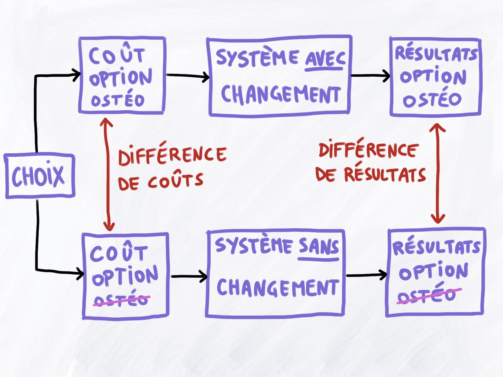

À l’heure où la recherche de preuves d’efficacité spécifique est au centre
des études en ostéopathie, tendant à donner des résultats hétérogènes et
donc non consensuels, il pourrait être pertinent de chercher à évaluer
l’intérêt de l’ostéopathie d’une autre façon.

En l’attente de résultats probants sur son efficacité spécifique et en
considérant un effet global de l’ostéopathie, étant donné aussi
l’attrait et la demande des usagers qui souhaitent en bénéficier,
il semble raisonnable de considérer un intérêt d’une telle approche.

<!--more-->

En effet, l’ostéopathie est une pratique de soin non conventionnelle,
manuelle, dont les principaux motifs de consultations sont des
troubles fonctionnels du système musculo-squelettique[^1], la
question se pose alors de sa place au sein du système de santé
et de son évaluation médico-économique dans la prise en charge de ces troubles.

[^1]: Morin C, Aubin A (2014) Primary Reasons for Osteopathic
      Consultation: A Prospective Survey in Quebec. PLOS ONE
      9(9): e106259. https://doi.org/10.1371/journal.pone.0106259

## Que sont les évaluations médico-économiques ?

Selon l’*Inspection Générale des Affaires Sociales (IGAS)*[^2],
“l’évaluation médico-économique consiste à mettre en regard
les bénéfices cliniques d’une stratégie de soins, d’une
technologie ou d’un produit de santé et ses coûts, en les
comparant à des alternatives, en vue d’une allocation optimale
des ressources disponibles.”

[^2]: Jeantet M, Lopez A, Destais N. Évaluation médico-économique
      en santé. Inspection générale des affaires sociales;
      Décembre 2014. Consulté le 2022-10-30. Disponible en ligne:
      https://www.igas.gouv.fr/IMG/pdf/2014-066R_-_Rapport_DEF.pdf

Elle est présentée par la *Haute Autorité de Santé (HAS)*[^3] comme
un exercice consistant à “mettre en regard les ressources consommées
pour la produire. Cela suppose que les interventions de santé
soumises à la décision publique soient comparées, sur la base
de leurs résultats et de leurs coûts respectifs.” \
La *HAS* souligne que “l’objectif de l’évaluation économique est de hiérarchiser
les différentes options envisageables (...) en vue d’une allocation optimale des ressources.”

[^3]: Collège de la Haute Autorité de Santé. Choix méthodologiques pour
      l'évaluation économique à la HAS;
      Juillet 2020. Consulté le 2022-10-30. Disponible en ligne:
      https://www.has-sante.fr/upload/docs/application/pdf/2020-07/guide_methodologique_evaluation_economique_has_2020_vf.pdf

### Méthodes d'évaluation

L’évaluation comparative, mesurant la différence d’efficacité ou de
bénéfice au regard des coûts de deux interventions, repose sur
deux principaux critères d’évaluation :

  - **Le rapport coût-efficacité**: l’effet des soins est exprimé en
    unités physiques telles que le nombre de malades évités ou le
    nombre d’années de vie gagnées ;
  - **Le rapport coût-utilité**, qui pondère qualitativement les
    années de vie gagnées, ce qui rejoint la notion anglo-saxonne
    de *quality-adjusted-life-years (QALY)*

L’évaluation médico-économique existe depuis les années 1990 en Angleterre,
mais n’a été introduite en France qu’en 2012 et **s’organise dans le
cadre de l’inscription au remboursement des produits de santé**.

Cette évaluation est requise lorsque les produits de santé
satisfont **deux conditions cumulatives**:

 - Une revendication (ou une confirmation) d’une
   *amélioration du service médical rendu (ASMR)* ou d’une
   *amélioration du service attendu (ASA)* de
   niveau I (majeure), II (importante) ou III (modérée)
 - Un impact significatif sur les dépenses de l’assurance maladie

**La plupart des recommandations de pratique clinique de la HAS ne
s'appuient pas sur une évaluation médico-économique, l’approche
médicale prévaut encore largement**.

## L’exemple de la lombalgie

Bien que la lombalgie soit spontanément résolutive dans 80% à 90% des cas,
elle représente **une prévalence en moyenne de 40%** dans la population générale. [^4][^5]

[^4]: D. Hoy, P. Brooks, F. Blyth, R. Buchbinder, The Epidemiology of low back pain,
      Best Practice & Research Clinical Rheumatology, Volume 24, Issue 6, 2010,
      Pages 769-781, ISSN 1521-6942, https://doi.org/10.1016/j.berh.2010.10.002.
[^5]: Manchikanti L, Singh V, Falco FJ, Benyamin RM, Hirsch JA. Epidemiology of
      low back pain in adults. Neuromodulation. 2014 Oct;17 Suppl 2:3-10.
      https://doi.org/10.1111/ner.12018 . PMID: 25395111.

En France, dans un rapport de 2017, l’assurance maladie [^6] précise que la lombalgie :

[^6]: L'Assurance Maladie. Santé travail: enjeux & actions;
      Les lombalgies liées au travail: quelles réponses apporter à un enjeu social,
      économique et de santé publique ? Janvier 2017. Consulté le 2022-10-30.
      Disponible en ligne: https://assurance-maladie.ameli.fr/sites/default/files/2017-01_lombalgies-travail_enjeux-et-actions_assurance-maladie.pdf

 - est le 2e motif de recours au médecin traitant
 - donne lieu à un arrêt de travail 1 fois sur 5
 - représente 30% des arrêts de travail de plus de 6 mois
 - représente 20% des accidents de travail
 - constitue la 3e cause d’admission en invalidité

L’assurance maladie estime que la lombalgie engendre un coût direct
de **plus d’un milliard d’euros** pour les entreprises via leurs
cotisations pour les accidents du travail et les maladies professionnelles,
soit **l’équivalent du coût des autres troubles musculo-squelettiques**.

## La place de l'ostéopathie

La lombalgie se trouve être **le premier motif de consultation en ostéopathie**. [^1]\
L’ostéopathie pourrait avoir une certaine efficacité clinique, pouvant
montrer l’intérêt d’une telle intervention pour la lombalgie[^7][^8].
Au sein de nombreux articles, il y est d’ailleurs régulièrement recommandé
d‘en faire **des évaluations médico-économiques**.

 - À ce jour, **en France** il n’existe **aucune** évaluation médico-économique
   sur la prise en charge ostéopathique de la lombalgie.
 - **À l’international**, certains rapports *coût-efficacité* et *coût-utilité*
   à travers plusieurs études semblent montrer que l’ostéopathie pourrait
   **être une option rentable** dans la prise en charge de la lombalgie[^9][^10][^11][^12][^13].
   *N. B. Une revue de la portée récente non publiée conclut que les données sont insuffisantes et difficilement interprétables pour conclure de cette rentabilité[^14].*

[^7]: Franke, H., Franke, JD. & Fryer, G. Osteopathic manipulative
     treatment for nonspecific low back pain: a systematic review
     and meta-analysis. BMC Musculoskelet Disord 15, 286 (2014).
     https://doi.org/10.1186/1471-2474-15-286

[^8]: Licciardone, J.C., Brimhall, A.K. & King, L.N. Osteopathic
     manipulative treatment for low back pain: a systematic review
     and meta-analysis of randomized controlled trials. BMC Musculoskelet
     Disord 6, 43 (2005). https://doi.org/10.1186/1471-2474-6-43

[^9]: Verhaeghe N, Schepers J, van Dun P, Annemans L. Osteopathic
     care for low back pain and neck pain: A cost-utility analysis.
     Complement Ther Med. 2018 Oct;40:207-213.
     https://doi.org/10.1016/j.ctim.2018.06.001.
     Epub 2018 Jun 9. PMID: 30219451.

[^10]: Tsertsvadze A, Clar C, Court R, Clarke A, Mistry H,
      Sutcliffe P. Cost-effectiveness of manual therapy for the
      management of musculoskeletal conditions: a systematic review
      and narrative synthesis of evidence from randomized controlled
      trials. J Manipulative Physiol Ther. 2014 Jul-Aug;37(6):343-62.
      https://doi.org/10.1016/j.jmpt.2014.05.001.
      Epub 2014 Jun 27. PMID: 24986566.

[^11]: Andronis L, Kinghorn P, Qiao S, Whitehurst DG, Durrell S,
      McLeod H. Cost-Effectiveness of Non-Invasive and
      Non-Pharmacological Interventions for Low Back Pain: a
      Systematic Literature Review. Appl Health Econ Health Policy.
      2017 Apr;15(2):173-201.
      https://doi.org/10.1007/s40258-016-0268-8. PMID: 27550240.

[^12]: Williams NH, Edwards RT, Linck P, Muntz R, Hibbs R,
      Wilkinson C, Russell I, Russell D, Hounsome B. Cost-utility
      analysis of osteopathy in primary care: results from a
      pragmatic randomized controlled trial. Fam Pract. 2004
      Dec;21(6):643-50. https://doi.org/10.1093/fampra/cmh612.
      Epub 2004 Nov 5. PMID: 15531626.

[^13]: UK BEAM Trial Team. United Kingdom back pain
      exercise and manipulation (UK BEAM) randomised trial:
      cost effectiveness of physical treatments for back
      pain in primary care. BMJ. 2004 Dec 11;329(7479):1381.
      https://doi.org/10.1136/bmj.38282.607859.AE.
      Epub 2004 Nov 19. PMID: 15556954; PMCID: PMC535455.

[^14]: A. Dian; 2022; Revue de la portée des évaluations
      médico-économiques de la prise en charge ostéopathique
      de la lombalgie; Mémoire en vue de l'obtention du Diplôme
      d'Ostéopathie.

## Vers un remboursement de l’ostéopathie ?

La réduction du temps d’hospitalisation ou la réduction
de la consommation de médicaments suite à une prise
en charge ostéopathique peuvent être par exemple des
arguments recevables en tant qu’*amélioration du
service médical rendu ou amélioration du service attendu*.

D’autre part, si l’ostéopathie peut s’avérer utile
dans la diminution du temps des arrêts de travail
ou du nombre de ces derniers, cet argument est
tout à fait en faveur d’un intérêt économique,
pour la sécurité sociale, les entreprises et les usagers.

Enfin, il est tout de même bon de continuer de
chercher à évaluer davantage l’efficacité spécifique
de l’ostéopathie et de la soumettre à des évaluations
bénéfice-risque dans le but d’apporter plus de
solidité et d’intérêt à une telle option de soin.

Davantage d’études seront alors nécessaires afin
d’assurer le développement d’évaluations médico-économiques
sérieuses sur cette prise en charge[^14].

En tenant compte alors des conditions d’utilisation
des évaluations médico-économiques, il paraît tout
à fait envisageable de suggérer l’ostéopathie comme
étant une **véritable option de soin** par le biais de
ces évaluations, si celles-ci montrent des résultats
en faveur d’une telle prise en charge thérapeutique.
Une prise en charge économique mesurée par l’assurance
maladie pourrait alors être mise en place étant donné
le coût que représente cette affection à l’heure actuelle.
