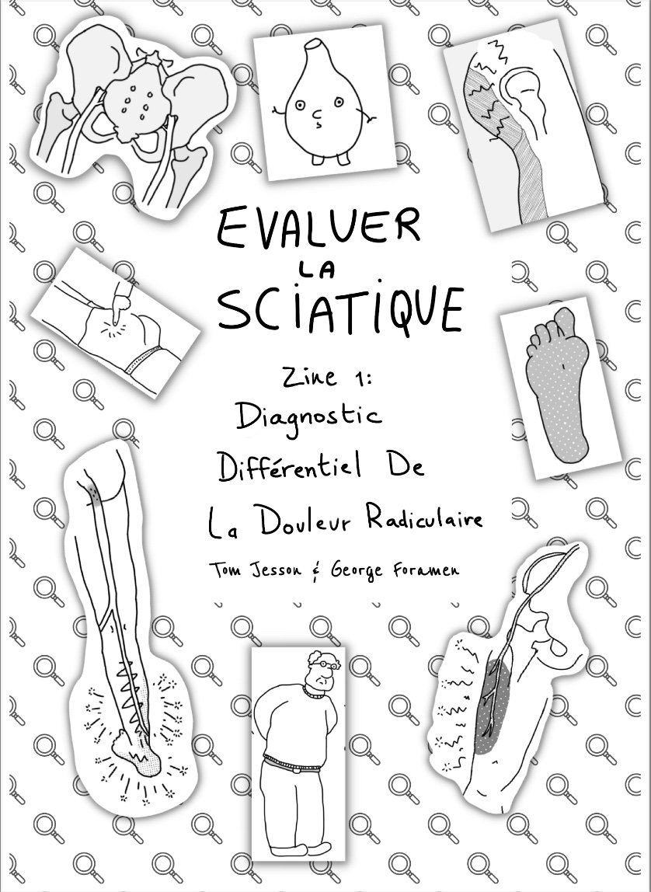

Après le succès du premier *zine* (une BD en ligne à
imprimer soi-même) sur la différenciation entre
[douleur référée, douleur radiculaire et radiculopathie](),
publié par [Tom Jesson](https://tomjesson.com/) en septembre 2022,
il décide de créer un nouveau zine sur
**le diagnostic différentiel de la douleur radiculaire
(en particulier sciatique)**.

Ce nouveau zine permet de répondre à la question
clinique: "Je pense que mon/ma patient·e a une douleur
radiculaire/radiculopathie, mais je ne suis pas sûr·e
– et si c'était autre chose ?".

Tout est expliqué en terme simples et mémorables, et
on espère que ça vous amusera par la même occasion !

<!--more-->

## Encourager cette œuvre
Suite à la précédente traduction qu'on avait faite
sur ce blog, Tom m'a recontacté pour me proposer
d'effectuer de nouveau la traduction de son nouveau zine.

À la différence du zine original, le zine **publié ici
est gratuit** et ce travail a été rendu possible grâce
aux abonné·e·s à osteopathes.pro. Merci du fond du cœur à
eux et elles 🥰. Merci également à
[Yves](https://twitter.com/yschwen) et
[David](https://twitter.com/fredgontrand) pour
la relecture et les conseils.

Pour encourager Tom à écrire une suite et d'autres zines,
pensez à [acheter son zine en anglais](https://tomjesson.gumroad.com/l/ddxzine).

Pour nous encourager à traduire et à mettre à disposition
gratuitement les zines de Tom, rejoignez nos membres et abonné·e·s
ou partager cet article à vos ami·e·s et collègues.

Voici sans plus attendre le zine de Tom. On espère qu'il sera drôle,
utile et pertinent pour votre clinique.

Bonne lecture !

## 📱 Lire sur votre ordinateur ou smartphone
[Cliquez sur l'image pour accéder à la BD: ](./Tom-Jesson-diagnostic_differentiel_sciatalgie_zine_lecture_simple-1-vf.pdf)

## Liens utiles
- [Site web de Tom (en anglais)](https://tomjesson.com/)
- [Newsletter de Tom (en anglais)](https://tomjesson.substack.com/)
- [Acheter le zine pour encourager l'auteur à en faire d'autres (en anglais)](https://tomjesson.gumroad.com/l/ddxzine)
- [Son livre sur le syndrôme de la queue de cheval (toujours en anglais)](https://thecesbook.com/)