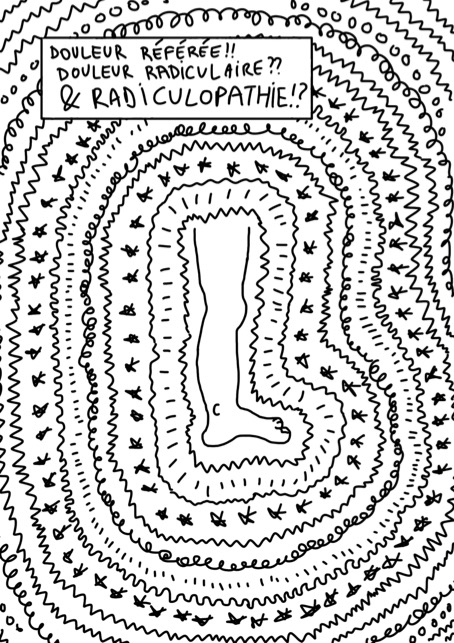

La semaine dernière [Tom Jesson](https://tomjesson.com/) a publié une courte BD intitulée:
«Douleur référée!! Douleur radiculaire?? Radiculopathie !?» que j'ai trouvée excellente.

Pour remettre un peu de contexte, Tom est kinésithérapeute et il publie régulièrement sur le sujet
des douleurs de racines lombaires et le syndrome de la queue de cheval. Ça fait quelques
mois que je suis ses travaux, car ses explications sont souvent simples et permettent
d'aborder des situations cliniques complexes plus sereinement.

Évidemment, lorsque ce « zine » – comme on les appelle en ligne – a été publié, j'ai immédiatement
proposé à Tom de le traduire, ce qui fut chose faite.

<!--more-->

Voilà sans plus attendre le zine. J'espère qu'il pourra apporter des éclaircissements pertinents pour votre pratique.

Bonne lecture !

[Cliquez sur l'image pour accéder à la BD: ](./Tom-Jesson-douleur-referee-douleur-radiculaire-et-radiculopathie-zine-traduction-francaise.pdf)

## Liens utiles
- [Site web de Tom (en anglais)](https://tomjesson.com/)
- [Newsletter de Tom (en anglais)](https://tomjesson.substack.com/)
- [Livre sur le syndrôme de la queue de cheval (toujours en anglais)](https://thecesbook.com/)