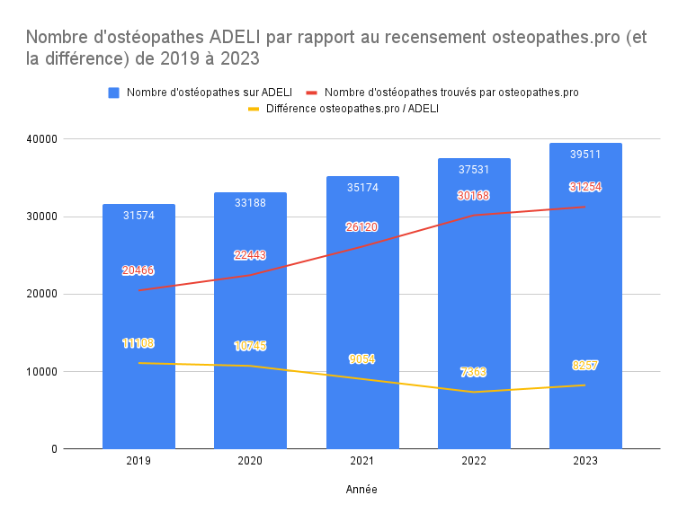
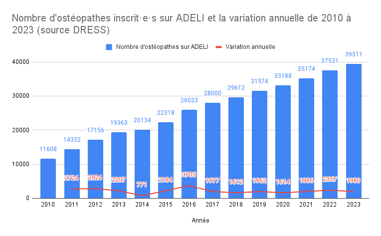
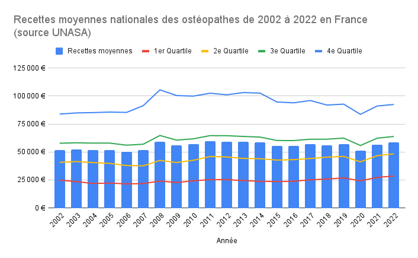
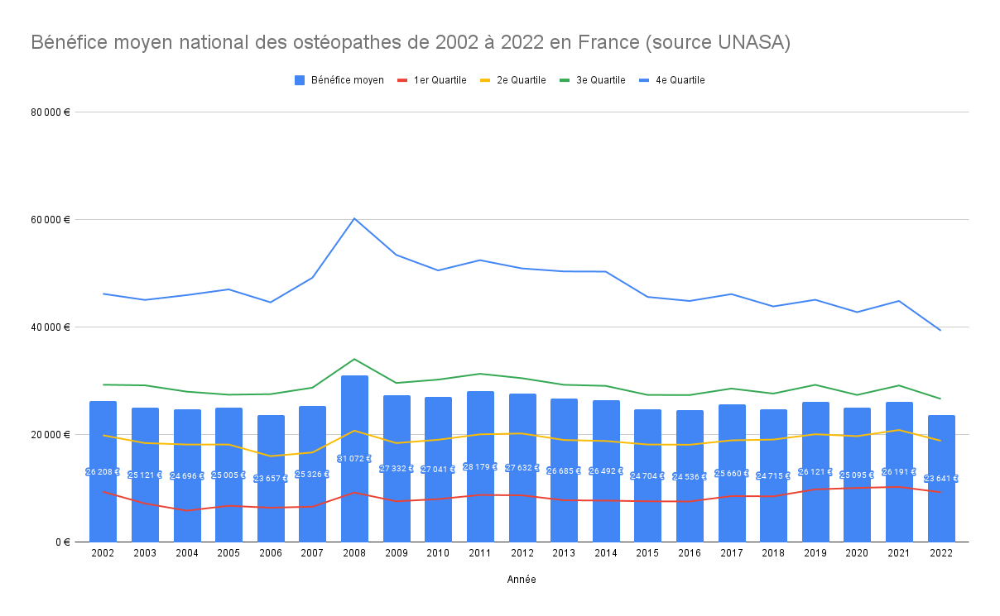
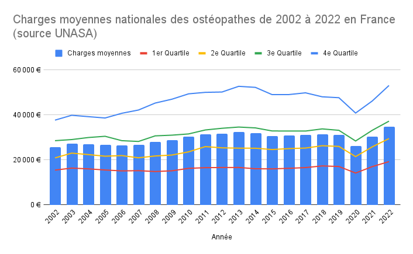
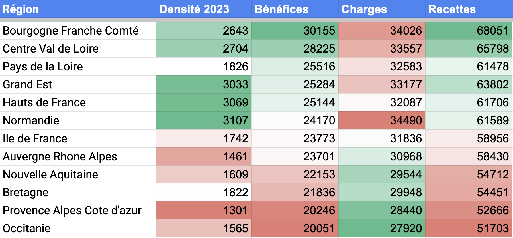
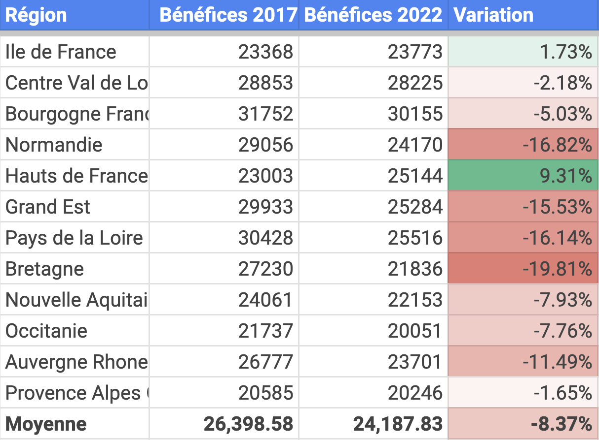
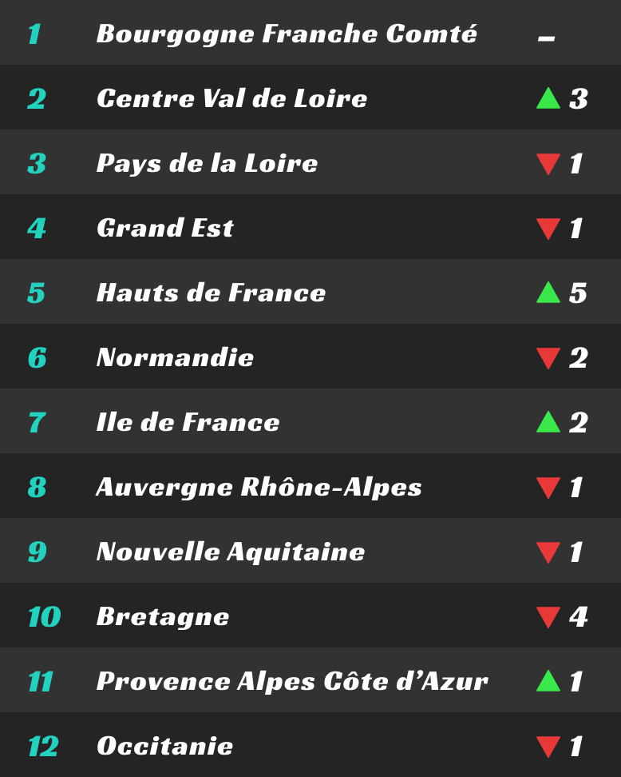

À chaque édition de notre
[carte démographique des ostéopathes](https://www.osteopathes.pro/fr/cartographie),
nous nous efforçons d'améliorer la pertinence de la carte et la précision
de notre analyse.
Nous sommes donc heureux de vous présenter l'édition 2023 de la
démographie des ostéopathes en France.

Nous n'avons pas publié d'article en 2022 car notre méthodologie
est restée la même qu'en 2021 et nous n'avions pas de nouvelles
informations à partager.

Cette année, nous avons pu améliorer la précision de notre méthodologie suite à
la publication du [rapport de l'IGAS (lien vers notre dossier et le sondage)]()
qui est venu apporter de nouvelles données et un éclairage nouveau.
D'autre part, nous avons essayé d'étendre l'analyse de la démographie
des ostéopathes en France en 2023 avec une analyse économique nationale et
régionale pour apporter un éclairage plus complet de la situation.

Nous commencerons par les principaux chiffres, puis nous poursuivrons
avec le détail sur notre méthodologie pour finir sur une discussion de
nos observations et d'autres analyses.

<!--more-->

<div class="p-4 mb-6 border-l-4 border-teal-400 bg-teal-50">
  <div class="flex">
    <div class="flex-shrink-0">
      <svg class="w-5 h-5 text-teal-400" xmlns="http://www.w3.org/2000/svg" viewBox="0 0 20 20" fill="currentColor"><path fill-rule="evenodd" d="M5.05 4.05a7 7 0 119.9 9.9L10 18.9l-4.95-4.95a7 7 0 010-9.9zM10 11a2 2 0 100-4 2 2 0 000 4z" clip-rule="evenodd" /></svg>
    </div>
    <div class="ml-3">
      <p class="text-sm text-teal-700">
        Pour accéder directement à la carte, vous pouvez vous rendre sur la
        <a href="https://www.osteopathes.pro/fr/cartographie" class="font-medium text-teal-700 underline hover:text-teal-600">
          carte interactive de la démographie des ostéopathes en 2023
        </a>
      </p>
    </div>
  </div>
</div>

<div class="w-full px-4 py-4 prose lg:w-9/12 max-w-none font-readable">

## Les principaux chiffres de la démographie des ostéopathes en 2023
Comme chaque fois que nous améliorons la précision de notre méthodologie,
certains résultats peuvent se montrer surprenants. Nous reviendrons
sur ces points dans la discussion plus loin dans cet article.

- Sur les 39&nbsp;511 ostéopathes inscrit·e·s au registre
  <abbr title="Automatisation DEs LIstes">ADELI</abbr> en janvier 2023,
  nous avons pu retrouver **31&nbsp;254 d'entre elles et eux en ligne**.
- En 2022, il y avait 37&nbsp;531 ostéopathes sur le registre ADELI,
  ce qui représente une croissance de 5,3% (+1980) en un an. Cela correspond
  à notre estimation d'environ 2&nbsp;000 diplômé·e·s de plus chaque année.
- Cela se traduit par **35&nbsp;435 cabinets** installés sur le territoire
  français, soit environ 13% des ostéopathes (4&nbsp;181) avec plus d'un cabinet.
- On a également retrouvé 194 cabinets hors de France (0,5%) dans les
  zones limitrophes (Suisse, Luxembourg, Belgique, ...).
- La prise de rendez-vous en ligne continue de progresser de 53% en 2021 à 56% avec
  **17&nbsp;534 ostéopathes**.
- La **moyenne des bénéfices** en 2022 est de 23&nbsp;641€ sur l'année[^1], ce qui
  correspond à 1&nbsp;970€/mois (pour rappel, bénéfices = chiffre d'affaires - charges).
- La répartition des ostéopathes sur le territoire est inégale avec des fortes disparités
  de densité: la plus forte est mesurée à 175 habitants/ostéopathe et
  la plus faible à 39&nbsp;193 habitants/ostéopathe.
- La densité moyenne en 2023 est de 1 ostéopathe pour 2&nbsp;177 habitants[^2].

[^1]: [Statistiques détaillées des ostéopathes en 2022 <abbr title="nion Nationale des Associations Agréés">UNASA</abbr>](https://www.unasa.fr/statistiques-details/?annee=2022&code_profession=851HAK&profession=851HAK&secteur=NULL&decoupage_statistique=national&region=NULL&departement=null)

[^2]: [INSEE: Population française au 1er janvier 2023 est de 68 042 591](https://www.insee.fr/fr/statistiques/5225246) – Consulté le 02/10/2023

## Comment ces données démographiques ont-elles été obtenues ?
Depuis 2021, l'État fournit une extraction publique du registre
<abbr title="Automatisation DEs LIstes">ADELI</abbr>, qui recense tous les
porteurs du titre d'ostéopathe[^3]. Ce dernier a donc constitué
notre point de départ pour rechercher tous les praticien·ne·s sur le territoire.
En effet, tel n'était pas le cas avant 2021 où notre source principale
était le parcours du web seulement.

[^3]: Le [rapport IGAS de 2022](https://www.igas.gouv.fr/IMG/pdf/2021-095r_rapport.pdf)
      a mis en lumière des professionnels de santé n'étant pas enregistrés dans le
      registre ADELI. Cela concerne surtout des médecins (557) et des
      kinésithérapeutes (nombre inconnu).

Nous remercions aussi chaleureusement les ostéopathes ayant pris le temps
d'ajouter leur cabinet sur le site et nous permettant de les recenser
avec fiabilité et précision. Il est toujours possible de le faire
si vous le souhaitez en créant un compte et en renseignant votre
cabinet. 🤗

</div><!-- Close prose for nice layout -->

<div class="flow-root mt-8 mb-8 font-readable">
  <ul>
    <li>
      <div class="relative pb-8">
        <span class="absolute top-5 left-5 -ml-px h-full w-0.5 bg-gray-200" aria-hidden="true"></span>
        <div class="relative flex items-start space-x-3">
          <div class="relative flex items-start space-x-3">
          <div>
            <div class="relative px-1">
              <div class="flex items-center justify-center w-8 h-8 bg-gray-100 rounded-full ring-8 ring-white">
                <svg class="w-5 h-5 text-gray-500" x-description="Heroicon name: solid/user-circle"
                  xmlns="http://www.w3.org/2000/svg" viewBox="0 0 20 20" fill="currentColor" aria-hidden="true"><path fill-rule="evenodd"
                    d="M18 10a8 8 0 11-16 0 8 8 0 0116 0zm-6-3a2 2 0 11-4 0 2 2 0 014 0zm-2 4a5 5 0 00-4.546 2.916A5.986 5.986 0 0010 16a5.986 5.986 0 004.546-2.084A5 5 0 0010 11z"
                    clip-rule="evenodd"></path></svg>
              </div>
            </div>
          </div>
          <div class="flex-1 min-w-0">
            <div>
              <div class="text-sm">
                <span class="font-medium text-gray-900">Récupération du fichier ADELI</span>
              </div>
              <p class="mt-0.5 text-sm text-gray-500">
                39&nbsp;511 ostéopathes inscrit·e·s
              </p>
            </div>
            <div class="mt-2 text-sm text-gray-700">
              <p>
                Le répertoire ADELI public donne uniquement la civilité, le nom, le prénom et le numéro ADELI.
                Il contient (presque) toutes les professions (dont les kinésithérapeutes et les médecins).
              </p>
            </div>
          </div>
        </div>
      </div>
    </li>
    <li>
      <div class="relative pb-8">
        <span class="absolute top-5 left-5 -ml-px h-full w-0.5 bg-gray-200" aria-hidden="true"></span>
        <div class="relative flex items-start space-x-3">
          <div class="relative flex items-start space-x-3">
          <div>
            <div class="relative px-1">
              <div class="flex items-center justify-center w-8 h-8 bg-gray-100 rounded-full ring-8 ring-white">
                <svg class="w-5 h-5 text-gray-500" x-description="Heroicon name: solid/search-circle" xmlns="http://www.w3.org/2000/svg" viewBox="0 0 20 20" fill="currentColor" aria-hidden="true"><path d="M9 9a2 2 0 114 0 2 2 0 01-4 0z" /><path fill-rule="evenodd" d="M10 18a8 8 0 100-16 8 8 0 000 16zm1-13a4 4 0 00-3.446 6.032l-2.261 2.26a1 1 0 101.414 1.415l2.261-2.261A4 4 0 1011 5z" clip-rule="evenodd" /></svg>
              </div>
            </div>
          </div>
          <div class="flex-1 min-w-0">
            <div>
              <div class="text-sm">
                <span class="font-medium text-gray-900">Recherche Internet</span>
              </div>
              <p class="mt-0.5 text-sm text-gray-500">
                31&nbsp;254 ostéopathes trouvé·e·s
              </p>
            </div>
            <div class="mt-2 text-sm text-gray-700">
              <p>
                Nous recherchons chaque ostéopathe sur Internet (sites web, annuaires, réseaux sociaux, lieu Google maps, etc.) et nous supprimons les données de mauvaises qualité (informations datées, incohérentes, etc.)
              </p>
            </div>
          </div>
        </div>
      </div>
    </li>
    <li>
      <div class="relative pb-8">
        <span class="absolute top-5 left-5 -ml-px h-full w-0.5 bg-gray-200" aria-hidden="true"></span>
        <div class="relative flex items-start space-x-3">
          <div class="relative flex items-start space-x-3">
          <div>
            <div class="relative px-1">
              <div class="flex items-center justify-center w-8 h-8 bg-gray-100 rounded-full ring-8 ring-white">
                <svg class="w-5 h-5 text-gray-500" x-description="Heroicon name: solid/library" xmlns="http://www.w3.org/2000/svg" viewBox="0 0 20 20" fill="currentColor" aria-hidden="true"><path fill-rule="evenodd" d="M10.496 2.132a1 1 0 00-.992 0l-7 4A1 1 0 003 8v7a1 1 0 100 2h14a1 1 0 100-2V8a1 1 0 00.496-1.868l-7-4zM6 9a1 1 0 00-1 1v3a1 1 0 102 0v-3a1 1 0 00-1-1zm3 1a1 1 0 012 0v3a1 1 0 11-2 0v-3zm5-1a1 1 0 00-1 1v3a1 1 0 102 0v-3a1 1 0 00-1-1z" clip-rule="evenodd" /></svg>
              </div>
            </div>
          </div>
          <div class="flex-1 min-w-0">
            <div>
              <div class="text-sm">
                <span class="font-medium text-gray-900">Recherche des cabinets d'exercice</span>
              </div>
              <p class="mt-0.5 text-sm text-gray-500">
                35&nbsp;636 cabinets
              </p>
            </div>
            <div class="mt-2 text-sm text-gray-700">
              <p>
                Pour chaque praticien·ne, nous recherchons un ou plusieurs cabinets d'exercice
              </p>
            </div>
          </div>
        </div>
      </div>
    </li>
    <li>
      <div class="relative pb-8">
        <span class="absolute top-5 left-5 -ml-px h-full w-0.5 bg-gray-200" aria-hidden="true"></span>
        <div class="relative flex items-start space-x-3">
          <div class="relative flex items-start space-x-3">
          <div>
            <div class="relative px-1">
              <div class="flex items-center justify-center w-8 h-8 bg-gray-100 rounded-full ring-8 ring-white">
                <svg class="w-5 h-5 text-gray-500" x-description="Heroicon name: solid/globe-alt" xmlns="http://www.w3.org/2000/svg" viewBox="0 0 20 20" fill="currentColor" aria-hidden="true"><path fill-rule="evenodd" d="M4.083 9h1.946c.089-1.546.383-2.97.837-4.118A6.004 6.004 0 004.083 9zM10 2a8 8 0 100 16 8 8 0 000-16zm0 2c-.076 0-.232.032-.465.262-.238.234-.497.623-.737 1.182-.389.907-.673 2.142-.766 3.556h3.936c-.093-1.414-.377-2.649-.766-3.556-.24-.56-.5-.948-.737-1.182C10.232 4.032 10.076 4 10 4zm3.971 5c-.089-1.546-.383-2.97-.837-4.118A6.004 6.004 0 0115.917 9h-1.946zm-2.003 2H8.032c.093 1.414.377 2.649.766 3.556.24.56.5.948.737 1.182.233.23.389.262.465.262.076 0 .232-.032.465-.262.238-.234.498-.623.737-1.182.389-.907.673-2.142.766-3.556zm1.166 4.118c.454-1.147.748-2.572.837-4.118h1.946a6.004 6.004 0 01-2.783 4.118zm-6.268 0C6.412 13.97 6.118 12.546 6.03 11H4.083a6.004 6.004 0 002.783 4.118z" clip-rule="evenodd" /></svg>
              </div>
            </div>
          </div>
          <div class="flex-1 min-w-0">
            <div>
              <div class="text-sm">
                <span class="font-medium text-gray-900">Géolocalisation des cabinets</span>
              </div>
              <p class="mt-0.5 text-sm text-gray-500">
                31&nbsp;422 adresses
              </p>
            </div>
            <div class="mt-2 text-sm text-gray-700">
              <p>
                Chaque adresse est convertie en coordonnées GPS pour la comptabilisation.
                Certaines adresses sont identiques, d'où moins d'adresses que de cabinets.
              </p>
            </div>
          </div>
        </div>
      </div>
    </li>
    <li>
      <div class="relative pb-8">
        <div class="relative flex items-start space-x-3">
          <div class="relative flex items-start space-x-3">
          <div>
            <div class="relative px-1">
              <div class="flex items-center justify-center w-8 h-8 bg-gray-100 rounded-full ring-8 ring-white">
                <svg class="w-5 h-5 text-gray-500" x-description="Heroicon name: solid/calculator" xmlns="http://www.w3.org/2000/svg" viewBox="0 0 20 20" fill="currentColor" aria-hidden="true"><path fill-rule="evenodd" d="M6 2a2 2 0 00-2 2v12a2 2 0 002 2h8a2 2 0 002-2V4a2 2 0 00-2-2H6zm1 2a1 1 0 000 2h6a1 1 0 100-2H7zm6 7a1 1 0 011 1v3a1 1 0 11-2 0v-3a1 1 0 011-1zm-3 3a1 1 0 100 2h.01a1 1 0 100-2H10zm-4 1a1 1 0 011-1h.01a1 1 0 110 2H7a1 1 0 01-1-1zm1-4a1 1 0 100 2h.01a1 1 0 100-2H7zm2 1a1 1 0 011-1h.01a1 1 0 110 2H10a1 1 0 01-1-1zm4-4a1 1 0 100 2h.01a1 1 0 100-2H13zM9 9a1 1 0 011-1h.01a1 1 0 110 2H10a1 1 0 01-1-1zM7 8a1 1 0 000 2h.01a1 1 0 000-2H7z" clip-rule="evenodd" /></svg>
              </div>
            </div>
          </div>
          <div class="flex-1 min-w-0">
            <div>
              <div class="text-sm">
                <span class="font-medium text-gray-900">Comptabilisation par zone géographique</span>
              </div>
              <p class="mt-0.5 text-sm text-gray-500">
                34&nbsp;964 communes
              </p>
            </div>
            <div class="mt-2 text-sm text-gray-700">
              <p>
                Chaque cabinet de chaque ostéopathe est comptabilisé pour générer la carte
              </p>
            </div>
          </div>
        </div>
      </div>
    </li>
  </ul>
</div>

<div class="w-full px-4 py-4 prose lg:w-9/12 max-w-none font-readable">

## Comment expliquer une telle différence entre ces chiffres et le registre <abbr title="Automatisation DEs LIstes">ADELI</abbr> ?
Les problèmes du registre <abbr title="Automatisation DEs LIstes">ADELI</abbr>
sont connus de longue date (voir
l'[article sur la démographie des ostéopathes 2021]())
et qui ont été re-confirmés par le dernier
[rapport de l'IGAS publié en 2023]().

Il nous semble aussi utile d'apporter des précisions additionnelles
sur les nouveaux facteurs qui contribuent à cette différence:
- certain·e·s professionnel·le· de santé ne s'enregistrent pas dans
  le répertoire <abbr title="Automatisation DEs LIstes">ADELI</abbr>
  et pratiquent malgré tout comme ostéopathes (médecins, kinés, ...).
- certain·e·s praticien·ne·s exercent à l'étranger mais sont toujours
  dans le registre <abbr title="Automatisation DEs LIstes">ADELI</abbr>.
- certain·e·s praticien·ne·s ont changé de nom (mariage etc.) sans pour
  autant mettre à jour cette information dans le registre
  <abbr title="Automatisation DEs LIstes">ADELI</abbr>.
- cette année, dans le cas d'homonymes (même nom et prénom), nous avons
  utilisé leur numéro de département pour les différencier. Cela nous a
  permis de *ne pas dédoublonner* les homonymes et de retrouver
  la plupart des praticien·ne·s du registre.

Il n'est donc pas étonnant que nous ayons 8&nbsp;257 ostéopathes **manquant·e·s** après
croisement des données. Néanmoins, nous pensons que cela nous permet de nous rapprocher
d'avantage de la démographie réelle qu'avec le registre <abbr title="Automatisation DEs LIstes">ADELI</abbr>
seul ou qu'avec les donnés issues du web seules (comme ce fut le cas en 2019 et 2020).

Cette année, notre recherche a utilisé une seule méthode:
par les noms et prénoms exacts. Nous avons été plus stricts
sur certaines pages web qui ne permettaient pas d'identifier la date
de mise à jour de leur contenu ou lorsque la date était trop ancienne.
Cela n'a pourtant pas fait diminuer le nombre d'ostéopathes trouvés mais
permet potentiellement une meilleure fiabilité de nos résultats,
nous y reviendrons dans l'analyse.

Comme en 2021 et 2022, pour chacun des résultats obtenus, nous ne gardons que
ceux comportant le mot clé «ostéopathe», toutes écritures confondues:
sans accents, avec majuscules, raccourcis ou avec coquilles (comme ost**h**éopathe).

## Quelle évolution du nombre d'ostéopathe par rapport aux années précédentes ?
Étant donné que notre méthode de cette année diffère de celle des années précédentes,
le comparatif n'est pas aisé. Cela étant dit, les données obtenues en 2022 sont
probablement légèrement surestimées car nous n'avions pas de valeur de référence
avec laquelle croiser nos résultats.

[](./nombre-osteopathes-ADELI-vs-osteopathes-pro-2019-2023-et-delta.png)

Grâce à la publication du
[rapport de l'IGAS](), nous
avons pu améliorer notre méthodologie et exclure des sources de données qui
semblaient peu fiables. Cela a eu pour conséquence de réduire l'augmentation
mais pas le nombre d'ostéopathes trouvés.

Concernant <abbr title="Automatisation DEs LIstes">ADELI</abbr> seul,
le nombre progresse de 37&nbsp;531 ostéopathes au 1er janvier 2022 à
39&nbsp;511 au 1er janvier 2023, une croissance de 5,28% (+1980 ostéopathes).

En 2022, nous avions recensé 30&nbsp;168 ostéopathes grâce à Internet.
Malgré des critères de selection plus stricts, nous observons
une augmentation de 1&nbsp;086 ostéopathes (+3,6%) en 2023 par rapport à 2022.

Si l'on compare ce chiffre avec les dernières données du
[rapport de l'IGAS]() de 2022,
nous avons:
- 15&nbsp;043 ostéopathes inscrit·e·s à la CIPAV en 2022
- 10&nbsp;500 kiné-ostéopathes (chiffres approximatifs de l'ordre des kinésithérapeutes)
- &nbsp;2&nbsp;281 médecins-ostéopathes (chiffres de l'ordre des médecins)

Pour un total estimé en 2022 de 27&nbsp;824 ostéopathes.

Sachant qu'il y a eu 1&nbsp;980 ostéopathes fraîchement inscrit·e·s en 2023,
cela nous donne un total minimal estimé de 29&nbsp;804 ostéopathes en 2023.
La différence entre notre recensement et cette estimation est de 1&nbsp;450
ostéopathes (4,8%).

Dans ce contexte il semblerait qu'il **continue d'y avoir une croissance
du nombre d'ostéopathe sur le territoire français** mais que celle-ci
est potentiellement plus faible dû à **une augmentation du nombre d'arrêt
d'activité**. Il reste difficile d'estimer le nombre d'ostéopathes
ayant réellement arrêté leur activité.

On peut néanmoins constater que sur les 39&nbsp;511 ostéopathes du registre
<abbr title="Automatisation DEs LIstes">ADELI</abbr> au 01/2023, il semble
y avoir 8&nbsp;257 ostéopathes manquant·e·s (soit 21% de différence). Ce chiffre
est supérieur aux projections de départs à la retraite (voir plus loin),
on peut donc vraissemblablement en déduire qu'un certain nombre
d'ostéopathes ont arrêté leur activité.

Voici un tableau récapitulatif du nombre d'ostéopathes, de cabinets et du nombre de cabinets uniques (c'est à dire avec la même adresse) par région en 2023.

| Région | Nombre d'ostéopathes | Nombre de cabinets | Nombre de cabinets uniques |
| --- | ---: | ---: | ---: |
| Île-de-France | 6072 | 7041 | 5953 |
| Auvergne-Rhône-Alpes | 4881 | 5529 | 4760 |
| Provence-Alpes-Côte d'Azur | 3501 | 3918 | 3564 |
| Occitanie | 3428 | 3817 | 3465 |
| Nouvelle-Aquitaine | 3344 | 3749 | 3340 |
| Pays de la Loire | 1872 | 2098 | 1830 |
| Bretagne | 1683 | 1851 | 1640 |
| Hauts-de-France | 1677 | 1954 | 1784 |
| Grand Est | 1660 | 1834 | 1598 |
| Bourgogne-Franche-Comté | 970 | 1060 | 956 |
| Normandie | 959 | 1070 | 935 |
| Centre-Val de Loire | 860 | 952 | 854 |
| La Réunion | 187 | 200 | 195 |
| Corse | 176 | 197 | 192 |
| Guadeloupe | 75 | 79 | 77 |
| Martinique | 56 | 60 | 59 |
| Guyane | 28 | 28 | 28 |
| Mayotte | 4 | 5 | 5 |
| **Total** | **31 433** | **35 442** | **31 235** |

Pour les plus attentif·ve·s, vous aurez remarqué que le nombre d'ostéopathes
est différent de celui annoncé plus haut (+179). En effet, certains ostéopathes ont
des cabinets dans plusieurs régions, nous les comptabilisons une fois dans chacune.

## Discussion sur la démographie 2023
### Ratio habitant·e·s par ostéopathe
En 2023, la population estimée en France est de 68&nbsp;042&nbsp;591[^2] habitant·e·s,
ce qui donne un **ratio moyen de 1 ostéopathe pour 2&nbsp;177 habitant·e·s**.

Malgré un ratio moyen qui semble correct, les disparités entre régions sont
parfois extrêmes.
En effet, dans le pays Basque, le ratio minimum est de 1 ostéopathe pour 175 habitant·e·s,
expliqué par la dynamique touristique de la région. À l'inverse, dans le 93, quelques
villes ont des ratios de plus de 30&nbsp;000 habitant·e·s par ostéopathe.

La cartographie permet de visualiser ces territoires où la densité
atteint des valeurs critiques. Il reste néanmoins difficile d'estimer la
pression démographique présente sur le terrain et le ratio acceptable
pour une installation.

On remarque cependant qu'avec un ratio moyen de 2&nbsp;177 habitant·e·s/ostéopathe,
seuls 79% des ostéopathes du registre
<abbr title="Automatisation DEs LIstes">ADELI</abbr> semblent encore en activité.
Une part peut être liée aux départs à la retraite, mais une autre partie est
probablement dûe à des arrêts anticipés d'activité.

### Une répartition inégale sur le territoire
Comme on vient de le voir, les disparités de densité sont très élevées.

Paradoxalement, les **communes denses continuent de se densifier**.
Par exemple, entre 2022 et 2023, sur les 30 communes avec le plus d'ostéopathes,
(Paris, Lyon, Marseille, Toulouse, Bordeaux, etc.), 26 (86%) ont vu leur densité
augmenter.

### Les départs à la retraite n'expliquent pas tout
En 2018, la <abb title="Caisse interprofessionnelle de prévoyance et d'assurance vieillesse des professions libérales">CIPAV</abbr>
affichait 10&nbsp;024 ostéopathes cotisant·e·s[^4].
En 2022, ce chiffre est de 15&nbsp;043 ostéopathes, soit une augmentation
de 5&nbsp;000 ostéopathes en 4 ans (+50%).

[^4]: Chiffre de l'Observatoire de l'activité libérale du ministère de l'économie,
      disponible en ligne à https://www.entreprises.gouv.fr/files/files/secteurs-d-activite/professions-liberales/chiffres/2018/osteopathe.pdf . Consulté
      le 2023-10-01.

Cependant, chaque année, environ 2&nbsp;000 nouveaux ostéopathes s'inscrivent
au registre <abbr title="Automatisation DEs LIstes">ADELI</abbr>. En 4 ans,
cela représente environ 8&nbsp;000 nouveaux ostéopathes. Il devrait donc y avoir,
en 2022, 10&nbsp;024 ostéopathes + 8&nbsp;000 nouveaux ostéopathes soit
18&nbsp;024 ostéopathes. Or, la <abb title="Caisse interprofessionnelle de prévoyance et d'assurance vieillesse des professions libérales">CIPAV</abbr>
indique 15&nbsp;043. Où sont donc les 3&nbsp;000 ostéopathes manquant·e·s ?
Est-ce seulement dû à des départs à la retraite ?

Grâce à la pyramide des ages[^5], on peut estimer environ 400 départs à la retraite
chaque année (en 2020, 2086 ostéopathes avaient 65ans+ et on suppose
qu'ils et elles partiront en retraite à l'âge de 70 ans). En 4 ans, cela
représente 1&nbsp;600 départs à la retraite. Il reste donc 1&nbsp;400
ostéopathes (soit 350 par an) qui manquent à l'appel. Cela peut être dû à
un arrêt d'activité mais cela peut également être dû au fait que sur
les 2&nbsp;000 ostéopathes s'inscrivant chaque année au registre
<abbr title="Automatisation DEs LIstes">ADELI</abbr>, une partie
d'entre eux et d'entre elles est potentiellement médecin, kiné, sage-femme, etc.
et qu'ils ne figurent pas dans les chiffres de la
<abb title="Caisse interprofessionnelle de prévoyance et d'assurance vieillesse des professions libérales">CIPAV</abbr>.

[^5]: Pyramide des ages de l'ostéopathie en fin 2020 (page 9), disponible en ligne
      à https://www.osteopathie.org/documents.php?url=demographierofjanvier2021_527.pdf
      Consulté le 2023-10-01.

## Analyse économique
Pour pousser l'exercice plus loin et suite à plusieurs demandes,
nous avons souhaité également nous intéresser à l'aspect
économique de la profession.

Le [rapport de l'IGAS de 2022]() a
mis en lumière le fait que la majorité des ostéopathes ont des revenus modestes.
Les chiffres que nous avons utilisé pour la suite de cette analyse proviennent
majoritairement de l'<abbr title="Union Nationale des ASsociations Agréées">UNASA</abbr>[^6] ainsi que du [rapport de l'IGAS]().

[^6]: L'<abbr title="Union Nationale des ASsociations Agréées">UNASA</abbr> publie
     des [statistiques annuelles ainsi que nationales et région par région sur l'ostéopathie](https://www.unasa.fr/statistiques/).

### Évolution du chiffre d'affaires
Sur les 10 dernières années, l'augmentation du nombre d'ostéopathe est
régulier d'environ +2000 praticien·ne·s chaque année.

[](./nombre-osteopathes-2010-2023-sur-ADELI.png)

Malgré cette importante augmentation, le chiffre d'affaires reste
globalement stable (hormis COVID-19 en 2020). Seul le 4e quartile,
le plus riche, voit un diminution de son
<abbr title="Chiffre d'Affaires">CA</abbr>.

[](./recettes_moyennes_national_osteopathes_2002_2022_france_unasa.png)

Cela s'explique par d'une part, par l'augmentation du nombre
de consulations de la population française au cours du temps.
D'autre part, le remboursement croissant de l'ostéopathie par les
mutuelles a facilité l'accès à cette discipline par la population
française.

Grâce au nombre d'ostéopathes par région, et en prenant
le chiffre d'affaires moyen en 2022 (58&nbsp;448€), on peut estimer
le montant de l'activité économique dans chaque région lié
à l'ostéopathie en 2023. Nous remercions par ailleurs Pierre-Adrien LIOT
pour le travail initial sur ce calcul. Le calcul est le suivant:
```
nombre d'ostéopathes x chiffre d'affaires moyen 2022
```

| Région | Montant estimé de l'activité économique en 2023 |
| --- | ---: |
| Île-de-France | 354 896 256 € |
| Auvergne-Rhône-Alpes | 285 284 688 € |
| Provence-Alpes-Côte d'Azur | 204 626 448 € |
| Occitanie | 200 359 744 € |
| Nouvelle-Aquitaine | 195 450 112 € |
| Pays de la Loire | 109 414 656 € |
| Bretagne | 98 367 984 € |
| Hauts-de-France | 98 017 296 € |
| Grand Est | 97 023 680 € |
| Bourgogne-Franche-Comté | 56 694 560 € |
| Normandie | 56 051 632 € |
| Centre-Val de Loire | 50 265 280 € |
| La Réunion | 10 929 776 € |
| Corse | 10 286 848 € |
| Guadeloupe | 4 383 600 € |
| Martinique | 3 273 088 € |
| Guyane | 1 636 544 € |
| Mayotte | 233 792 € |
| **Total** | **1 837 195 984 €** |

### Évolution des bénéfices
Le bénéfice moyen des ostéopathes est de 23&nbsp;641€ en 2022, soit
1&nbsp;970€/mois. Les bénéfices ont été plutôt stables ces dernières
années malgré une diminution marquée en 2023 dû à l'augmentation
des charges.

Notons également que les données de l'UNASA ne prennent pas en compte
les micro-entrepreneurs qui ont généralement un revenu plus faible.
D'après le rapport IGAS citant la CIPAV, il y a 23,6% (3&nbsp;953)
de micro-entrepreneurs parmi les ostéopathes exclusifs (15&nbsp;043).
Il est donc possible que cette moyenne soit supérieure à la réalité.

[](./benefice_moyen_national_osteopathes_2002_2022_france_unasa.png)

[](./charges_moyennes_national_osteopathes_2002_2022_france_unasa.png)

### Évolution au niveau régional
En septembre 2023 a eu lieu la publication de la
[situation économique de l'ostéopathie de 2002 à 2022](https://ogi.osteopathe-syndicat.fr/upload/files/situation%20economique%20osteo%20VF3bis1.pdf)
effectuée par Pierre-Adrien LIOT et Pierre-Yves POITEVIN
pour le <abbr title="Syndicat Français Des Ostéopathes">SFDO</abbr>.

Dans le prolongement de cette étude et d'un travail conséquent
de récolte et de recherche au niveau régional par Pierre-Adrien LIOT,
nous avons souhaité pousser l'analyse au niveau régional.

Nous avons donc effectué une mise en perspective des bénéfices, charges et
recettes moyennes en fonction de la densité d'ostéopathes/habitant·e·s par région.
On note que **les régions à plus faible densité d'ostéopathes s'en sortent globalement
mieux au niveau bénéfices** (+10&nbsp;000€ de bénéfices entre les deux extrêmes)
que les régions avec une densité forte, la seule exception étant la
région des Pays de la Loire.
[](./tableau-classement-regions-benefices-charges-recettes.png)

Nous avons également exploré les variations de bénéfices région
par région. Si nous avons vu qu'au niveau national les revenus
sont en légère diminution en 2022 par l'augmentation des charges,
toutes les régions n'ont pas les mêmes conditions et certaines
sont plus touchées que d'autres.

Nous avons donc calculé les modifications des bénéfices moyens
sur l'intervalle 2017 à 2022 (pour éviter la période COVID-19).

[](./tableau-variation-benefices-regions-2017-2022.png)

La tendance baissière en 2022 est donc forte, avec certaines
régions qui voient leurs bénéfices diminuer de plus de 15%.
Il n'y a malheureusement pas de données plus précises
(par département ou canton) qui permettraient une analyse
encore plus fine en fonction de la densité.

En classant les régions suivant leurs bénéfices en 2017
puis en 2022, nous obtenons les changements de classement
suivant pour 2022:
[](./classement-regions-2017-2022-benefices.png)

## Questions fréquentes
### Pourquoi je ne figure pas sur la carte de la démographie ?
Il existe de nombreux facteurs pouvant causer ce résultat comme
mentioné dans la section consacrée aux différences
entre le registre <abbr title="Automatisation DEs LIstes">ADELI</abbr>
et nos chiffres.

Si vos informations <abbr title="Automatisation DEs LIstes">ADELI</abbr>
comme votre nom, prénom ou département ne sont pas à jour et que votre
présence en ligne ne correspond pas, il est possible que nous n'ayons pas
pu vous identifier.

Si vous souhaitez renseigner votre cabinet, vous pouvez le rajouter vous-même
directement dans votre espace membres et celui-ci sera pris en compte
pour la prochaine édition.

### Une zone semble vide sur la carte, est-ce une bonne idée d'y ouvrir mon cabinet ?
D'une part, notre carte n'indique que deux critères potentiels de
réussite: la densité des ostéopathes et le ratio d'habitants par ostéopathes.

D'autre part, et malgré nos meilleurs efforts, il est possible que nous ayons
omis quelques ostéopathes dans la zone que vous consultez.
Recoupez toujours nos informations avec d'autres sources
comme des annuaires ou d'autres cartes.

Enfin, nous vous recommandons de prendre le temps de faire une étude de marché et de
viabilité avant d'installer votre cabinet.

### Excluez-vous les kiné-ostéopathes ou d'autres professions médicales ou paramédicales ?
Notre carte affiche tous les praticien·ne·s qui pratiquent
l'ostéopathie en tant qu'activité principale, qu'ils soient
kiné-ostéopathes, médecins-ostéopathes ou ostéopathes exclusifs.

## Conclusion
Notre analyse révèle que la démographie des ostéopathes en France
montre une croissance constante, mais avec des disparités fortes
entre régions.

Les revenus ont su rester en majorité stables au cours du temps malgré
une forte augmentation démographique. Cependant, les charges ont
augmenté en 2022, ce qui a eu pour conséquence une diminution des
bénéfices moyens.

Nous espérons que ces données servirons aux ostéopathes ainsi qu'aux
étudiant·e·s ou pour celles et ceux qui envisagent de faire des études
d'ostéopathie. La compréhension de ces tendances est essentielle pour
les praticien·ne·s qui cherchent à s'installer et pour les autorités
de santé pour adapter les politiques en conséquence.

## Modifications de l’article

> **Modification 2023/10/27** : Précisions sur le nombre de micro-entrepreneurs
> d'après les chiffres CIPAV pour la mise en perspective des chiffres UNASA.
> Précision sur le travail initial conséquent sur le comparatif économique
> au niveau régional par Pierre-Adrien LIOT.
