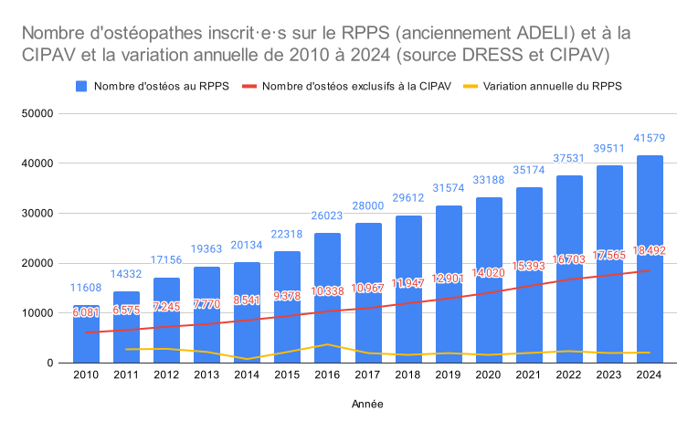
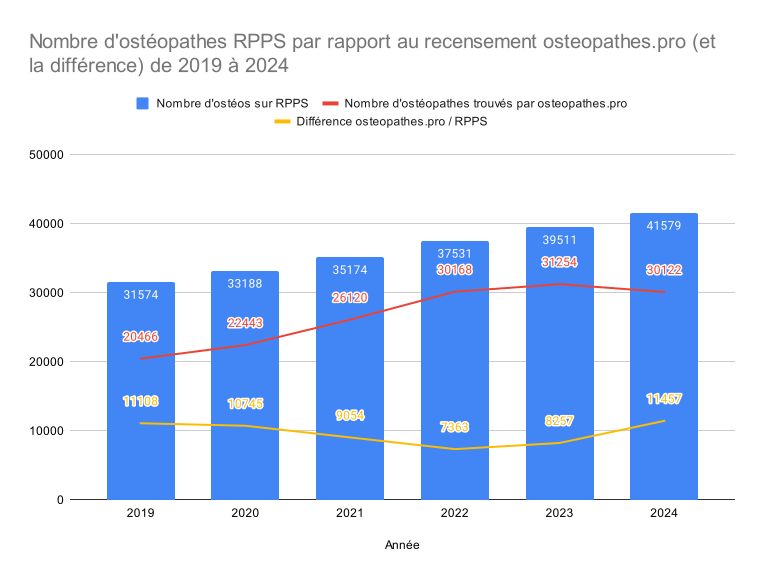
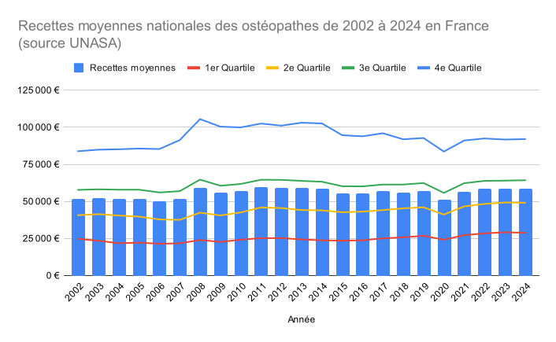
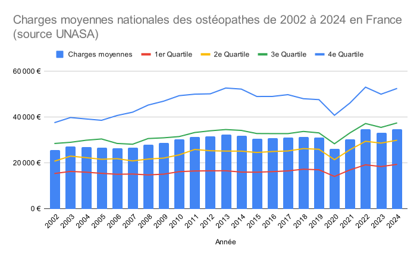
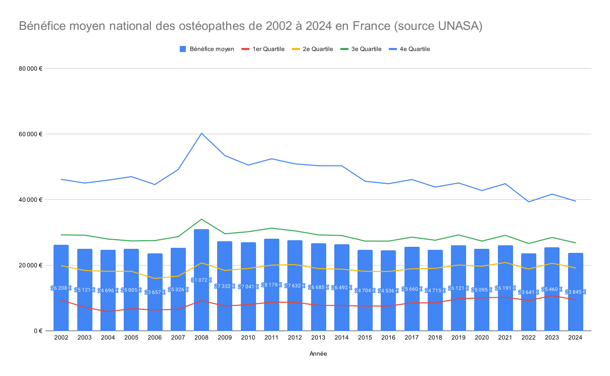

À l’instar de nos
[éditions précédentes](),
notre ambition reste la même: offrir une lecture claire,
utile et transparente de la démographie des ostéopathes en France.

Pour cette édition 2024, nous avons pu **enrichir les informations** que nous
utilisons ainsi que nos sources pour affiner encore davantage les données
et les analyses. Parmi les nouvelles sources, on retrouve principalement la
**<abbr title="Caisse Interprofessionnelle de Prévoyance et d'Assurance Vieillesse des professions libérales">CIPAV</abbr>**
concernant le nombre d’ostéopathes ainsi que les revenus en fonction des statuts.

L’objectif de notre article ici est multiple:
- dans un premier temps, nous revenons sur les **chiffres principaux** qui
  permettent de situer la profession aujourd’hui;
- puis nous poursuivons avec une **analyse démographique et territoriale** afin
  de mieux saisir les disparités et tendances régionales en France.

Enfin, nous proposons une **lecture économique et sociale** du paysage
ostéopathique. Vous trouverez également à la fin notre méthode quant à
l’obtention et au traitement des données, ainsi que les définitions
des termes importants employés.

Nous tenons à remercier chaleureusement toutes les personnes qui contribuent
et qui ont contribué à rendre cette étude possible: nos adhérents, nos partenaires,
nos soutiens, ... Merci à vous toutes et tous !

**Bonne lecture**

<!--more-->

</div>

<div class="p-4 mb-6 border-l-4 border-teal-400 bg-teal-50">
  <div class="flex">
    <div class="flex-shrink-0">
      <svg class="w-5 h-5 text-teal-400" xmlns="http://www.w3.org/2000/svg" viewBox="0 0 20 20" fill="currentColor"><path fill-rule="evenodd" d="M5.05 4.05a7 7 0 119.9 9.9L10 18.9l-4.95-4.95a7 7 0 010-9.9zM10 11a2 2 0 100-4 2 2 0 000 4z" clip-rule="evenodd" /></svg>
    </div>
    <div class="ml-3">
      <p class="text-sm text-teal-700">
        Pour accéder directement à la carte, vous pouvez vous rendre sur la
        <a href="https://www.osteopathes.pro/fr/cartographie" class="font-medium text-teal-700 underline hover:text-teal-600">
          carte interactive de la démographie des ostéopathes en 2024
        </a>
      </p>
    </div>
  </div>
</div>

<div class="w-full px-4 py-4 prose max-w-prose font-readable">

## L'essentiel en chiffre et en lettres
Comme à chaque édition, nous nous efforçons d'améliorer
la précision de nos chiffres et algorithme.
Cette première partie se veut très factuelle, et nous discuterons
de ces chiffres plus loin dans cet article.

- Au 1er janvier 2024, le registre
  <abbr title="Automatisation DEs LIstes">ADELI</abbr> compte
  41&nbsp;579 ostéopathes; nous en avons recensé **30&nbsp;122 actifs·ves en ligne**.
- Par rapport à 2023, <abbr title="Automatisation DEs LIstes">ADELI</abbr> recensait
  39&nbsp;511 ostéopathes, soit une croissance de 5,2% (+2068) en un an, une
  hausse **cohérente avec notre estimation habituelle** d'environ 2&nbsp;000
  diplômé·e·s supplémentaires par an. Le nombre d'ostéopathe semble continuer
  d'**augmenter de manière stable**
- La <abbr title="Caisse Interprofessionnelle de Prévoyance et d'Assurance Vieillesse des professions libérales">CIPAV</abbr>
  dénombre **18&nbsp;492 ostéopathes exclusifs** en 2024, soit 62% du total.
  Par différence avec les 30&nbsp;122 actifs, on déduit la présence d'environ
  **11&nbsp;630 non exclusifs** (38% du total).
- Déjà en 2009, on estimait que la profession tendait à se féminiser[^1]; or,
  en 2024, on constate toujours une légère majorité d'hommes – soit 52% des ostéopathes –
  stable sur ces dernières années.
- **19% des praticien·nes** (5&nbsp;794) disposent d'**au moins deux cabinets**;
  et nous recensons **35&nbsp;916 cabinets** sur le territoire français.
- Les **outils de présence en ligne** représentent une part majeure et
  grandissante de l'activité des ostéopathes. Cela se traduit notamment
  par une **augmentation** du nombre de praticiens proposant
  la **prise de rendez-vous en ligne**: 56% la proposaient en 2023 contre
  **62,5% des 30&nbsp;122 actifs en 2024**, soit 18&nbsp;851 ostéopathes.
- La **moyenne des bénéfices** en 2024 est de 23&nbsp;845€ sur l'année[^2], ce qui
  correspond à 1&nbsp;987€/mois (pour rappel, bénéfices = chiffre d'affaires - charges).
- La densité moyenne en 2024 en considérant seulement les ostéopathes actifs (30&nbsp;122)
  est de 1 ostéopathe pour 2&nbsp;270 habitants[^3].
- Le **tarif moyen** d'une consultation d'ostéopathie s'aligne autour de **60€**;
  plus précisément 58,1€ selon nos chiffres et 59,7€ selon Oostéo (février 2024[^4]).

[^1]: Rapport de l'Observatoire Socio-Économique que l'Ostéopathie (OSEOSTEO) - 2009

[^2]: [Statistiques détaillées des ostéopathes en 2024 <abbr title="Union Nationale des Associations Agréés">UNASA</abbr>](https://www.unasa.fr/statistiques-details/?annee=2024&code_profession=851HAK&profession=851HAK&secteur=NULL&decoupage_statistique=national&region=NULL&departement=null)

[^3]: [INSEE: Population française au 1er janvier 2024 est de 68 373 433](https://www.insee.fr/fr/statistiques/5225246) – Consulté le 13/10/2025

[^4]: [Quel est le tarif d'un ostéopathe ? - Oostéo (février 2024)](https://oosteo.com/blog/2018/01/quel-est-le-tarif-dun-osteopathe/)

Maintenant que nous avons en tête les chiffres clés, passons à l'analyse
détaillée de notre profession.

## L’analyse démographique et territoriale
### Combien y-a-t il d'ostéopathes en France et comment évolue ce chiffre&nbsp;?
D'après **notre étude annuelle la plus robuste**, nous estimons qu'il y a environ
**30&nbsp;122 ostéopathes en activité en France** en 2024. Pour comprendre
comment nous obtenons ce chiffre, lisez la suite.

Si vous vous référez au registre **<abbr title="Automatisation DEs LIstes">ADELI</abbr>**,
vous trouverez un total de 41&nbsp;579 ostéopathes inscrits au 1er janvier 2024.
Ce registre est connu depuis de nombreuses années pour avoir
**de nombreux inconvénients (personnes décédées, reconverties, en retraite, ...)**,
on peut donc considéré que **ce chiffre est faux**.
Pour mieux comprendre le problème, nous vous invitons à consulter la section
["Comment expliquer une telle différence entre vos chiffres et le registre ADELI ?"
dédiée à cette question sur la démographie 2023](#comment-expliquer-une-telle-diff%C3%A9rence-entre-ces-chiffres-et-le-registre-abbr-titleautomatisation-des-listesadeliabbr-).

Si on se fie seulement à ce registre, on peut constater une augmentation d'environ
2&nbsp;000 nouveaux ostéopathes chaque année depuis de nombreuses années.

Dû aux limites des registres nationaux, nous nous efforçons chaque
année de **croiser plusieurs sources** et d'affiner notre méthode pour obtenir
une estimation plus réaliste du nombre d'ostéopathes réellement en activité en France.

Cette année, nous avons notamment intégré une nouvelle source de données qui nous
a été suggérée par [rapport de l'IGAS publié en 2023]():
la <abbr title="Caisse Interprofessionnelle de Prévoyance et d'Assurance Vieillesse des professions libérales">CIPAV</abbr> qui nous a permis d'affiner notre estimation.

C'est la caisse de retraite obligatoire des ostéopathes exclusifs, et elle
recense **18&nbsp;492 ostéopathes exclusifs** en 2024. Ce chiffre est fiable
car il correspond à des praticiens qui ont cotisé rééllement
pour leur retraite en tant qu'ostéopathe.

[](./nombre-osteopathes-en-france-de-2010-a-2024-source-rpps-et-cipav.svg)

Grâce à notre propre système d'analyse (voir la section [Méthodologie](#méthodologie)), nous
disposons d'une estimation indépendante et plutôt fiable du nombre total
d'ostéopathes rééllement en activité. Pour 2024, nous estimons donc
le **nombre total d'ostéopathes en exercice en France à 30&nbsp;122**.

Cela regroupe tous les ostéopathes, qu'ils soient exclusifs ou non-exclusifs.
En soustrayant le nombre d'exclusifs (18&nbsp;492), on en déduit qu'il y aurait environ
**11&nbsp;630 ostéopathes non-exclusifs**, soit 38% du total.

[](./nombre-osteopathes-en-france-au-rpps-vs-recensement-osteopathes-pro-de-2019-a-2024.svg)

On voit donc que la différence entre le registre ADELI et notre estimation
reste importante, et cohérente avec les tendances observées les années précédentes.

Cette année nous avons **recensé pour la première fois une diminution
de 1&nbsp;132 ostéopathes de moins** qu'en 2023 (31&nbsp;254 en 2023 contre 30&nbsp;122 en 2024).
Nous pensons que cela est principalement dû à une amélioration de notre méthode
de recensement et à un meilleur filtrage des faux positifs (données obsolètes).

Concernant la densité moyenne d'ostéopathes en France en 2024, si l'on prend les chiffres du registre
<abbr title="Automatisation DEs LIstes">ADELI</abbr>, on obtient une densité moyenne de
1&nbsp;645 ostéopathe pour 1&nbsp;651 habitants[^3]; et avec notre recensement plus précis,
cela correspond plutôt à un **ratio de 2&nbsp;270 habitants par ostéopathe** sur le territoire.

### Qu'en est-il de la bascule ADELI vers RPPS en octobre 2024&nbsp;?
Certain·e·s d'entre vous l'ont probablement remarqué: en octobre 2024,
le registre ADELI a été remplacé par le registre
<abbr title="Répertoire Partagé des Professionnels intervenant dans le système de Santé">RPPS</abbr>
(Répertoire Partagé des Professionnels intervenant dans le système de Santé).

Cette migration a engendré un effet secondaire notable: **une augmentation
notable du nombre de doublons** dans le registre:
- En effet, en 2023, nous avions identifié 1&nbsp;456 homonymes dont 855 doublons exacts (même numéro ADELI).
- En septembre 2024 nous avons comptabilisé 1&nbsp;618 homonymes dont 896 doublons exacts.
- En octobre 2024, quelques jours après la bascule vers le registre RPPS,
  nous avons recensé 5&nbsp;524 homonymes dont **5&nbsp;040 doublons exacts**,
  une **augmentation de 4&nbsp;000 doublons en quelques semaines** !


Un **homonyme** correspond aux ostéopathes ayant le même nom et prénom.
Un **doublon exact** correspond aux ostéopathes ayant le même nom, prénom
et numéro ADELI/RPPS.


Cela signifie que depuis la bascule, il est plus correct de **systématiquement
soustraire 5&nbsp;000 ostéopathes du total affiché par le registre RPPS**.

### À quoi sert le ratio habitants par ostéopathe&nbsp;?
Le ratio du **nombre d'habitants par ostéopathe est un indicateur clé**
pour évaluer la densité de praticien·ne·s sur un territoire.

C'est un indicateur **simple** mais efficace pour évaluer
l'**offre ostéopathique existante** dans une zone géographique donnée.
Plus concrètement, **plus le ratio est faible** (peu d'habitants par ostéopathe),
**plus les ostéopathes sur place sont nombreux**; et inversement, **plus le ratio est élevé**
(beaucoup d'habitants pour un ostéopathe), **plus la présence de praticiens est faible**.

En conséquence, ce ratio permet d'avoir une estimation rapide de la pression demographique
locale et, pour les zones au ratio élévé, d'identifier des zones au potentiel de développement intéressant.
**Cependant, ce critère utilisé de façon isolée ne suffit pas** comme seul critère. En effet,
il est important de le recouper avec d'autres indicateurs, comme le pouvoir d'achat local,
l'offre de santé existante, les habitudes de la population, etc...

</div>
<div class="p-4 mb-6 border-l-4 border-teal-400 bg-teal-50">
  <div class="flex">
    <div class="flex-shrink-0">
      <svg xmlns="http://www.w3.org/2000/svg" viewBox="0 0 24 24" fill="currentColor" class="w-5 h-5 text-teal-400">
        <path fill-rule="evenodd" d="M4.848 2.771A49.144 49.144 0 0 1 12 2.25c2.43 0 4.817.178 7.152.52 1.978.292 3.348 2.024 3.348 3.97v6.02c0 1.946-1.37 3.678-3.348 3.97a48.901 48.901 0 0 1-3.476.383.39.39 0 0 0-.297.17l-2.755 4.133a.75.75 0 0 1-1.248 0l-2.755-4.133a.39.39 0 0 0-.297-.17 48.9 48.9 0 0 1-3.476-.384c-1.978-.29-3.348-2.024-3.348-3.97V6.741c0-1.946 1.37-3.68 3.348-3.97ZM6.75 8.25a.75.75 0 0 1 .75-.75h9a.75.75 0 0 1 0 1.5h-9a.75.75 0 0 1-.75-.75Zm.75 2.25a.75.75 0 0 0 0 1.5H12a.75.75 0 0 0 0-1.5H7.5Z" clip-rule="evenodd" />
      </svg>
    </div>
    <div class="ml-3">
      <p class="text-sm text-teal-700">
        Pour aller plus loin sur l'étude de marché en ostéopathie, vous pouvez lire la
        <a class="underline" href="https://www.osteopathes.pro/fr/ressources/bds/etude-de-marche-comment-bien-choisir-ou-s-installer?utm_source=publications.osteopathes.pro&utm_medium=xcta_link&utm_campaign=article-demography-2024">
          BD sur l'installation et l'étude de marché
        </a>
      </p>
    </div>
  </div>
</div>

<div class="w-full px-4 py-4 prose max-w-prose font-readable">

### La repartition des ostéopathes sur le territoire est-elle homogène&nbsp;?
Si vous avez déjà consulté notre
[carte interactive de la démographie des ostéopathes en France](https://www.osteopathes.pro/fr/cartographie),
vous avez pu constater que **la répartition des ostéopathes n'est pas homogène
sur le territoire français**. En effet, certaines zones présentent une densité
d'ostéopathes bien plus élevée que d'autres.

Par exemple, les zones urbaines avec une forte population
tendent à avoir une densité plus élevée d'ostéopathes. Malgré notre recensement
précis et notre carte interactive, on observe que **les ostéopathes ont tendance à se
concentrer dans des zones déjà saturées**, ce qui peut rendre la pression
démographique locale très élevée.

Ces disparités de répartition se traduisent par des écarts importants
dans le ratio: celui ci atteint jusqu'à **250 habitants par ostéopathe** dans certaines
communes touristiques ou urbaines, tandis que dans d'autres zones, il peut dépasser
les **10&nbsp;000 habitants par ostéopathe**. Nous constatons également que le nombre
de communes avec un ratio élevé (peu d'ostéopathes) tend à se raréfier au fil des années
ce qui traduit une **excellente couverture ostéopathique du territoire français**.

Pour aller plus loin sur ce sujet, nous vous invitons à consulter la
section sur l'**étude de marché** plus bas dans cet article.

</div>

<div class="p-4 mb-6 border-l-4 border-teal-400 bg-teal-50">
  <div class="flex">
    <div class="flex-shrink-0">
      <svg class="w-5 h-5 text-teal-400" xmlns="http://www.w3.org/2000/svg" viewBox="0 0 20 20" fill="currentColor"><path fill-rule="evenodd" d="M5.05 4.05a7 7 0 119.9 9.9L10 18.9l-4.95-4.95a7 7 0 010-9.9zM10 11a2 2 0 100-4 2 2 0 000 4z" clip-rule="evenodd" /></svg>
    </div>
    <div class="ml-3">
      <p class="text-sm text-teal-700">
        Vous pouvez utiliser les différentes options de la
        <a href="https://www.osteopathes.pro/fr/cartographie" class="font-medium text-teal-700 underline hover:text-teal-600">
          carte interactive de la démographie des ostéopathes en 2024
        </a> pour visualiser les ratios à différentes échelles (communes, départements, régions).
      </p>
    </div>
  </div>
</div>

<div class="w-full px-4 py-4 prose max-w-prose font-readable">

### Le genre comme facteur différenciant local&nbsp;?
Pour conclure cette section démographique, abordons la répartition
homme/femme chez les ostéopathes en France.

D'après plusieurs analyses, en 2009 par l'OSEO[^1] puis en 2021 par le ROF[^5],
la **profession d'ostéopathe tendrait à se féminiser au fil des années**
au rythme de 6% par an avec une majorité de femmes attendue pour 2022.

Cependant, les données du registre <abbr title="Automatisation DEs LIstes">ADELI</abbr>
des dernières années montrent que cette **féminisation est en ralentissement**, avec
toujours une majorité d'hommes:
- 2022 avec 55% d'hommes et 45% de femmes
- 2023 avec 54,5% d'hommes et 45,5% de femmes
- 2024 avec 53,6% d'hommes et 46,4% de femmes

[^5]: [Rapport démographique du ROF 2021](https://www.osteopathie.org/documents.php?url=demographierofjanvier2021_527.pdf)

Au-delà de cette évolution nationale, il peut être pertinent
d'observer les **disparités locales**.
Dans certaines zones où l'un des genres est très majoritaire,
un praticien du genre opposé peut y trouver un **facteur différenciant non négligeable**.
Cela peut devenir un atout distinctif fort lors du choix de son
thérapeute[^6], et donc un élément à considérer !

[^6]: [Enquête Fedosoli 2025 – L’ostéopathie pour tous, un rêve ?](https://fedosoli.org/acces-aux-soins-osteopathiques/)

## L'analyse économique
L'année dernière nous avons introduit une section dédiée à l'analyse
économique de la profession d'ostéopathe en France. Cette année, nous
poursuivons dans cette voie en approfondissant certains aspects.

### Combien gagne un ostéopathe&nbsp;?
C'est *la* question que beaucoup se posent – et nous allons tenter d'y répondre
le plus précisément possible.

Il faut noter que **les revenus varient énormément selon de nombreux paramètres**
comme le lieu d'exercice, le tarif de la consultation, les charges, le régime fiscal,
la durée d'installation, etc.

Pour l'estimation suivante, nous nous appuyons majoritairement sur les
données de l'**<abbr title="Union Nationale des ASsociations Agréées">UNASA</abbr>**[^7],
qui agrègent les bilans des ostéopathes au **régime réel** (*déclaration contrôlée, formulaire 2035*).
Ces chiffres excluent donc les praticien·nes sous le régime micro-BNC, mais donnent
une image relativement fiable de la profession dans son ensemble, nous y reviendrons.

[^7]: [Statistiques <abbr title="Union Nationale des Associations Agréés">UNASA</abbr>](https://www.unasa.fr/statistiques/) – Consulté le 24/10/2025

Ainsi, en 2024, le bénéfice médian (et non moyen) se situe à **19&nbsp;225€ annuels**
(soit environ **1&nbsp;600€ par mois**), ce qui signifie donc que la moitié de la profession
gagne moins que ce montant, et l'autre gagne plus. Il faut également garder en tête que
**le bénéfice n'est pas un salaire** au sens strict: il s'agit du **revenu net avant impôts**,
après déductions des charges.

En comparaison avec les années précédentes, on constate que
**le chiffre d'affaires moyen reste stable** avec 58&nbsp;448€ en 2022,
58&nbsp;653€ en 2023 et 58&nbsp;649€ en 2024. Cependant, **le bénéfice
moyen est plus volatile**: 23&nbsp;641€ en 2022, 25&nbsp;460€ en 2023 et
23&nbsp;845€ soit une diminution de 6,3% de 2023 à 2024. En cause, une
**augmentation des charges professionnelles** depuis plusieurs années.

[](./recettes-ou-chiffre-d-affaires-des-osteopathes-en-france-de-2002-a-2024-d-apres-unasa.svg)

[](./charges-des-osteopathes-en-france-de-2002-a-2024-d-apres-unasa.svg)

[](./benefices-des-osteopathes-en-france-de-2002-a-2024-d-apres-unasa.svg)

### Comment se répartissent les revenus des ostéopathes&nbsp;?
Le tableau *ci-dessous* expose alors les **recettes et bénéfices des ostéopathes en 2024**,
et la colonne "***revenus mensuels nets***" correspond à notre estimation
de **revenu mensuel réel**, via le
**[simulateur de revenus osteopathes.pro](https://www.osteopathes.pro/fr/choisir-son-statut-juridique-liberal)**, en prenant donc en compte les impôts sur le revenu et supposant une situation maritale celibataire.

| Indicateur statistique | Recettes | Bénéfices annuels | Revenus mensuels nets |
| --- | ---: | ---: | ---: |
| 1er Quartile (Q1) | 28&nbsp;857€ | 9&nbsp;534€ | 794€ |
| Médiane | 49&nbsp;098€ | 19&nbsp;225€ | 1&nbsp;560€ |
| Moyenne nationale | 58&nbsp;649€ | 23&nbsp;845€ | 1&nbsp;881€ |
| 3ème Quartile (Q3) | 64&nbsp;291€ | 26&nbsp;890€ | 2&nbsp;093€ |
| 4ème Quartile (Q4) | 92&nbsp;050€ | 39&nbsp;608€ | 2&nbsp;833€ |

### Quelles sont les principales charges des ostéopathes ?
Le **bénéfice d'un ostéopathe dépend de ses charges professionnelles**.
Si on veut donc comprendre combien gagne un ostéopathe ou si l'on
souhaite optimiser ses revenus, il est crucial d'analyser les charges en détail
et de comprendre leur répartition.

Les charges peuvent se diviser en deux principales catégories:
- les charges de fonctionnement (loyer, matériel, fournitures, déplacements, ...);
- les impôts et taxes dont principalement les cotisations sociales (maladie, retraite, ...).

Lorsque nous parlons de charges, nous faisons référence à la **somme de ces deux catégories**.

En reprenant les chiffres de l'<abbr title="Union Nationale des ASsociations Agréées">UNASA</abbr>,
nous pouvons analyser la répartition des charges des ostéopathes. Gardons une
nouvelle fois à l'esprit que les chiffres de
l'<abbr title="Union Nationale des ASsociations Agréées">UNASA</abbr>
concernent uniquement les ostéopathes au **régime réel** (*déclaration controlée, formulaire 2035*).
Nous pouvons cependant considérer que ces chiffres sont représentatifs de la profession
dans son ensemble, comme nous le verrons plus loin.

En 2024, **la médiane des charges annuelles** est de 29&nbsp;873€, avec un
1er quartile (Q1) à 19&nbsp;323€ et un 3ème quartile (Q3) à 37&nbsp;401€.
En d'autres termes, **la moitié des ostéopathes au régime réel dépensent
entre 19&nbsp;323€ et 37&nbsp;401€ de charges par an**.

Si l'on compare ces données aux recettes annuelles, on constate que
les ostéopathes au régime réel payent en moyenne entre
**51% et 67% de charges professionnelles**, avec un taux médian à 51%.

| Indicateur statistique | Charges | Pourcentage des recettes |
| --- | ---: | ---: |
| 1er Quartile (Q1) | 19&nbsp;323€ | 67% |
| Médiane | 29&nbsp;873€ | 51% |
| Moyenne nationale | 34&nbsp;804€ | 59% |
| 3ème Quartile (Q3) | 37&nbsp;401€ | 58% |
| 4ème Quartile (Q4) | 52&nbsp;442€ | 57% |

Afin d'avoir une vision plus concrète de la répartition de ces charges, le tableau ci-dessous détaille comment se divisent celles-ci :

| Catégorie de charge | 1er Quartile&nbsp;(Q1) | 2ème Quartile&nbsp;(Q2) | 3ème Quartile&nbsp;(Q3) | 4ème Quartile&nbsp;(Q4) |
| --- | ---: | ---: | ---: | ---: |
| Loyer et charges locatives | 5&nbsp;598€ | 6&nbsp;923€ | 7&nbsp;908€ | 9&nbsp;757€ |
| *soit mensuellement :* | *467€* | *577€* | *659€* | *813€* |
| Frais de déplacement | 2&nbsp;741€ | 3&nbsp;928€ | 4&nbsp;115€ | 4&nbsp;787€ |
| Autres TFSE | 1&nbsp;962€ | 2&nbsp;553€ | 3&nbsp;215€ | 4&nbsp;142€ |
| Autres frais divers de gestion | 1&nbsp;356€ | 1&nbsp;718€ | 1&nbsp;800€ | 2&nbsp;393€ |
| Fournitures de bureau | 1&nbsp;010€ | 1&nbsp;178€ | 1&nbsp;350€ | 1&nbsp;749€ |
| Honoraires | 808€ | 933€ | 1&nbsp;286€ | 1&nbsp;749€ |
| Primes d'assurances | 548€ | 589€ | 643€ | 828€ |
| Frais de réception | 433€ | 589€ | 771€ | 920€ |
| Achats | 202€ | 295€ | 321€ | 644€ |
| **Total des charges HORS taxes et impôts** | **14&nbsp;659€** | **18&nbsp;706€** | **21&nbsp;409€** | **26&nbsp;970€** |
| Charges sociales | 4&nbsp;819€ | 8&nbsp;298€ | 11&nbsp;315€ | 17&nbsp;766€ |
| *soit mensuel :* | *402€* | *691€* | *943€* | *1480€* |
| Impôts et taxes | 1&nbsp;703€ | 2&nbsp;651€ | 3&nbsp;407€ | 4&nbsp;879€ |
| **Total taxes et impôts** | **6&nbsp;522€** | **10&nbsp;949€** | **14&nbsp;722€** | **22&nbsp;645€** |
| **Total des charges** | **21&nbsp;181€** | **29&nbsp;655€** | **36&nbsp;131€** | **49&nbsp;614€** |


Les **Autres TFSE** correspond aux Télécommunications, Fournitures, et Services Extérieurs.


### Ces chiffres sont-ils représentatifs de la profession&nbsp;?
Pour savoir si **ces chiffres étaient représentatifs de la profession dans son ensemble**,
nous avons comparé ces données avec celles de la
<abbr title="Caisse Interprofessionnelle de Prévoyance et d'Assurance Vieillesse des professions libérales">CIPAV</abbr>. En effet, celle-ci recevant la totalité des cotisations
des ostéopathes exclusifs, ses chiffres représentent une source de données intéressantes
pour valider l'ordre de grandeur des revenus des ostéopathes, quel que soit leur régime
fiscal (micro-BNC ou régime réel). Notons qu'en 2024, **33% des ostéopathes exclusifs sont
au régime micro-BNC** selon la <abbr title="Caisse Interprofessionnelle de Prévoyance et d'Assurance Vieillesse des professions libérales">CIPAV</abbr>.

En comparant les médianes de 2010 à 2022, nous avons constaté que l'écart
était d'environ ~500€ seulement.

| Année | Médiane des bénéfices CIPAV | Médiane des bénéfices UNASA | Différence |
| --- | ---: | ---: | ---: |
| 2010 | 17&nbsp;081€ | 19&nbsp;065€ | 1&nbsp;984€ |
| 2011 | 19&nbsp;517€ | 20&nbsp;076€ | 559€ |
| 2012 | 19&nbsp;319€ | 20&nbsp;236€ | 918€ |
| 2013 | 19&nbsp;091€ | 19&nbsp;020€ | -71€ |
| 2014 | 19&nbsp;076€ | 18&nbsp;837€ | -239€ |
| 2015 | 19&nbsp;043€ | 18&nbsp;186€ | -857€ |
| 2016 | 18&nbsp;843€ | 18&nbsp;139€ | -704€ |
| 2017 | 20&nbsp;070€ | 18&nbsp;956€ | -1&nbsp;114 € |
| 2018 | 19&nbsp;439€ | 19&nbsp;102€ | -337€ |
| 2019 | 21&nbsp;044€ | 20&nbsp;095€ | -949€ |
| 2020 | 17&nbsp;627€ | 19&nbsp;739€ | 2&nbsp;112 € |
| 2021 | 20&nbsp;494€ | 20&nbsp;882€ | 388€ |
| 2022 | 19&nbsp;958€ | 18&nbsp;883€ | -1&nbsp;075 € |
| **Moyenne** | 19&nbsp;277€ | 19&nbsp;324€ | **455€** |

Nous pouvons donc conclure que **les chiffres de
l'<abbr title="Union Nationale des ASsociations Agréées">UNASA</abbr> sont
représentatifs de la profession dans son ensemble**, et ce malgré le fait
qu'ils ne concernent que les ostéopathes au régime réel.

Une donnée manque cependant pour répondre à la question que tout le monde se pose:
*le revenu mensuel des ostéopathes augmente-t-il avec le temps ?* Malheureusement,
les données de l'<abbr title="Union Nationale des ASsociations Agréées">UNASA</abbr>
ne permettent pas de le savoir précisément, ni celles de la <abbr title="Caisse Interprofessionnelle de Prévoyance et d'Assurance Vieillesse des professions libérales">CIPAV</abbr>.
Peut-être arriverons-nous à répondre à cette question dans une prochaine édition.

## Installation et étude de marché en ostéopathie
Cette année, nous avons décidé d'ajouter une section dédiée
à l'installation et à l'**étude de marché en ostéopathie**.

En effet, de nombreux étudiant·e·s en ostéopathie ou jeunes diplômé·e·s
nous contactent régulièrement pour nous demander des conseils sur le choix
de leur future zone d'installation. Nous allons donc aborder
**plusieurs points clés à considérer pour estimer le potentiel d'une zone
pour une future installation ou collaboration**. Cela peut permettre
de **maximiser les chances de réussite et de pérennité du cabinet**.

### Comment savoir si ma future zone d'installation a du potentiel&nbsp;?
Premièrement, il faut garder à l'esprit que
le **ratio habitants&nbsp;/&nbsp;ostéopathe** permet de situer la présence
d'ostéopathes déjà en place et donc **d'évaluer les zones peu denses qui semblent opportunes**.
Pour savoir si une zone géographique donnée présente un potentiel intéressant,
il est intéressant de **comparer le ratio de la zone ciblée** (celui d'une commune notamment)
avec le ratio moyen national et régional, puis des communes aux alentours:
-  **si le ratio est plus petit que la moyenne comparée**, cela traduit une
   offre ostéopathique plutôt élevée dans la zone ciblée, et donc un marché probablement
   plus difficile d'accès pour un nouvel ostéopathe souhaitant s'y installer;
-  **à l'inverse, un ratio plus élevé** peut signaler une zone plus propice
  aux nouveaux ostéopathes souhaitant s'y installer.

Comme nous avions pu le voir dans l'[étude économique en 2023 sur les régions](#évolution-au-niveau-régional),
il semblait y avoir une **corrélation entre le ratio habitants&nbsp;/&nbsp;ostéopathe
et le bénéfice moyen des ostéopathes de cette région**. Cette tendance se confirme en 2024.
Ainsi, prioriser un ratio confortable pourrait permettre d'assurer
une meilleure stabilité économique et un meilleur potentiel de revenus,
**même dans les bassins de vie plus modestes**.

Ensuite – comme dit précédemment – pour donner un réel sens au ratio,
il faut **croiser l'information avec d'autres indicateurs**: profil de la population
locale (âge, revenus, métiers, habitudes, ...), présence d'autres professions de santé,
les flux de mobilité des habitant·e·s, opportunités des locaux disponibles, réseau
personnel déjà implanté, etc.

**En résumé**, une étude de marché ne peut pas se résumer seulement
au ratio habitants&nbsp;/&nbsp;ostéopathe, mais celui-ci constitue un
**indicateur d'équilibre** entre l'offre et la demande sur une zone géographique
donnée. En le croisant avec d'autres indicateurs, il aide grandement à identifier
les zones prometteuses, et constitue donc **une base solide pour un projet d'installation**.

</div>
<div class="p-4 mb-6 border-l-4 border-teal-400 bg-teal-50">
  <div class="flex">
    <div class="flex-shrink-0">
      <svg class="w-5 h-5 text-teal-400" xmlns="http://www.w3.org/2000/svg" viewBox="0 0 20 20" fill="currentColor"><path fill-rule="evenodd" d="M5.05 4.05a7 7 0 119.9 9.9L10 18.9l-4.95-4.95a7 7 0 010-9.9zM10 11a2 2 0 100-4 2 2 0 000 4z" clip-rule="evenodd" /></svg>
    </div>
    <div class="ml-3">
      <p class="text-sm text-teal-700">
        Pour aller plus loin sur le sujet, vous pouvez consultez notre
        <a class="underline" href="https://www.osteopathes.pro/fr/ressources/bds/etude-de-marche-comment-bien-choisir-ou-s-installer?utm_source=publications.osteopathes.pro&utm_medium=xcta_link&utm_campaign=article-demography-2024">
          BD sur l'étude de marché.
        </a>
      </p>
    </div>
  </div>
</div>

<div class="w-full px-4 py-4 prose max-w-prose font-readable">

### Quels facteurs font que les patient·e·s consultent en ostéopathie&nbsp;?
Un autre aspect important à considérer lorsqu'on souhaite s'installer
ou même savoir développer son activité, c'est de comprendre **les facteurs
qui influencent le recours à l'ostéopathie**.

Une étude menée par la **<abbr title="Fédération des Ostéopathes SOLIdaires">FédOSOLI</abbr>**
en 2024 a questionné les français sur les facteurs qui influencent leur recours à
l'ostéopathie. Celle-ci est basée sur un large questionnaire diffusé auprès de patient·e·s
et du grand public, et met en évidence que **la décision de consulter ne repose
pas uniquement sur la douleur** ou le besoin de soin; mais sur un **ensemble de
facteurs économiques, sociaux et relationnels**.

Avant tout, lorsqu'on questionne le public sur les raisons d'un non-recours
à l'ostéopathie, le **coût et l'absence de remboursement** semblent les principaux
freins, restreignant l'accès à l'ostéopathie des foyers à revenus modestes.
Ainsi, les raisons évoquées parmi ceux qui ne consultent pas ou peu en
ostéopathie paraissent plutôt **financières** que liées à la méconnaissance
ou la méfiance envers la profession.

Lorsqu'ils choisissent un ostéopathe, les patients se montrent attentifs
à **des critères très humains**: le **bouche à oreille** représente le
critère principal – **devant la localisation**. Les qualité liées à la
**douceur, l'écoute, la pédagogie et le cadre de confiance** sont également
citées comme **déterminentes dans le choix du praticien**.
Autrement dit, le choix d'un ostéopathe semble **consciemment** reposer
autant sur la **relation thérapeutique** que sur l'acte de soin en lui-même.

En résumé, l'étude de la
**<abbr title="Fédération des Ostéopathes Solidaires">FédOSOLI</abbr>**
semble confirmer que le recours à l'ostéopathie tient à un équilibre
entre **accessibilité financière et qualité relationnelle**.
Le **bouche à oreille** et la confiance paraissent également
les leviers les plus attractifs.

### Comment calculer le revenu maximal possible avec le chiffre d'affaire maximal théorique&nbsp;?
D'après le mémoire de fin d'études d'Esteban Weil intitulé
«L’ostéopathie profession en pleine expansion ou en saturation future»,
portant sur la démographie de la profession, ainsi que notre expertise,
nous vous proposons ici une méthode inédite et simple pour estimer
le **chiffre d'affaire maximal théorique**.

Ce chiffre permet d'**évaluer simplement le revenu maximum possible dans une zone
d'installation donnée** et voir si cela correpond à ses attentes
en terme de revenus. Il peut également servir à comparer plusieurs zones
avant de s'y installer ou pour estimer la croissance possible de son cabinet
par rapport au potentiel maximal qu'il pourrait développer.

Pour estimer ce chiffre, on peut partir d'un raisonnement simple:
le **ratio d'habitants par ostéopathe représente la patientèle potentielle**.
Pour rendre cela plus concret, imaginons un ostéopathe exerçant dans une zone
où le ratio est de **2&nbsp;270 habitants par ostéopathe** (soit le ratio moyen français en 2024).

Selon Harris Interactive en 2019[^8], **un français sur deux** consulte, ou
a déjà consulté, un ostéopathe. Cette donnée est confirmée par plusieurs sondages,
dont le plus récent est celui d'Odoxa pour l'UPO en mai 2024[^9].

[^8]: [Observatoire des parcours de soins des Français – Harris Interactive (2019)](https://harris-interactive.fr/wp-content/uploads/sites/6/2019/11/Rapport-Harris-Etude-sur-les-Francais-et-les-medecines-douces-Santeclair.pdf) – Consulté le 26/10/2025
[^9]: [Les Français et l'ostéopathie – Odoxa pour l'UPO (mai 2024)](https://www.ecole-osteopathie-paris.fr/app/uploads/sites/11/2024/07/odoxa-pour-upo-les-francais-et-losteopathie-juin-2024-1.pdf?) – Consulté le 26/10/2025

Grâce à cette information, on peut estimer le nombre de patients
susceptibles de consulter l'ostéopathe dans notre exemple: **2&nbsp;270 ÷ 2 = 1&nbsp;135 patients**.

Il nous faut ensuite estimer **combien de fois ces patients consultent chaque année**.
Toujours d'après le sondage Odoxa pour l'UPO (mai 2024), les français vont chez l'ostéopathe
en moyenne **1,45 fois par an**. Nous avons souhaité confirmer cette donnée
avec nos propres sources et d'après les statistiques internes de plusieurs cliniques ostéopathiques
(qu'elles appartiennent à des praticien·ne·s en activité ou des écoles d'ostéopathie),
nous retrouvons de façon indépendante une moyenne de consultations à **1,5 fois par an**.
Cette donnée est issue de données quantitatives sur plus de 10&nbsp;000 consultations
au cours de plusieurs années, et indique que le chiffre obtenu par Odoxa est valide.

En multipliant le nombre de patients par le nombre de consultations annuelles,
on obtient donc **1&nbsp;135 x 1,5 = 1&nbsp;702 consultations annuelles possibles**.

Enfin, en considérant un tarif moyen de 60€ d'après le réseau Oostéo[^4], confirmé
par nos propres analyses des tarifs pratiqués par les ostéopathes en France en 2024,
on peut estimer le **chiffre d'affaire annuel maximal théorique**:
**1&nbsp;702 x 60€ = 102&nbsp;120€**.

[^4]: [Blog Oostéo – Quel est le tarif d'un ostéopathe ?](https://oosteo.com/blog/2018/01/quel-est-le-tarif-dun-osteopathe/)

D'après les chiffres précédents sur les charges des ostéopathes,
on peut estimer qu'un ostéopathe au régime réel et dans le 4e quartile de revenus
paye 57% de charges. Ainsi, en déduisant ces charges du chiffre d'affaire maximal théorique,
on peut estimer un **revenu annuel maximal théorique**:
**102&nbsp;120€ x 43% = 43&nbsp;521€**, soit environ **3&nbsp;627€ par mois**.

Pour résumer notre calcul, voici la formule complète:
```
ratio hab/ostéo x ratio de consultation = nb de patients potentiels
nb de patients potentiels x nb de consultations annuelles par patient = nb de consultations annuelles du cabinet
nb de consultations annuelles du cabinet x tarif de la consultation = CA max théorique
CA max théorique x (1 - taux de charges) = revenu max. théorique annuel
revenu max. théorique annuel ÷ 12 = revenu max. théorique mensuel
```

Avec les chiffres de notre exemple:
```
2 270 x 0,5 = 1 135 patients
1 135 x 1,5 = 1 702 consultations annuelles
1 702 x 60€ = 102 120€ de CA maximum théorique
102 120€ x 43% = 43 521€ de revenu maximum théorique
43 521€ ÷ 12 = 3 627€ de revenu maximum théorique mensuel
```

Bien entendu, ce calcul donne surtout une **estimation haute** du potentiel
économique d'un cabinet dans une zone donnée et **dans un contexte idéal**.

Cet outil a également comme intérêt de montrer que le **revenu maximum
que peut espérer avoir un ostéopathe dépend peu de sa durée d'installation
ou de son expérience**, et bien plus du ratio habitants&nbsp;/&nbsp;ostéopathe
local, et donc de la pression démographique locale.

Cela explique également l'augmentation aux systèmes de réservation en ligne
qui traduisent les changements de comportement des patient·e·s:
**la facilité d'accès à un ostéopathe** (disponibilité, rapidité
de prise de rendez-vous, localisation) ainsi que **la visibilité en ligne**
d'un ostéopathe jouent un rôle prépondérant dans le maintien et le développement
de son activité: c'est un levier clé pour capter une part plus importante de la patientèle
potentielle dans une zone donnée, malheureusement au détriment des autres
praticien·ne·s installés dans la même zone. De nombreux·ses ostéopathes
ont pu constater cet effet par eux-mêmes au cours des dernières années.

Pour terminer, voici un tableau des revenus maximums théoriques annuels et mensuels
en fonction du ratio habitants&nbsp;/&nbsp;ostéopathe:

| Ratio habitants&nbsp;/&nbsp;ostéopathe | Pourcentage de charges (adapté au quartile de recettes) | Revenu maximum théorique annuel | Revenu maximum théorique mensuel |
| ---: | ---: | ---: | ---: |
| 500 | 67% | 7&nbsp;425€ | 619€ |
| 750 | 67% | 11&nbsp;138€ | 928€ |
| 1&nbsp;000 | 67% | 14&nbsp;850€ | 1&nbsp;238€ |
| 1&nbsp;500 | 58% | 28&nbsp;350€ | 2&nbsp;362€ |
| 2&nbsp;000 | 58% | 37&nbsp;800€ | 3&nbsp;150€ |
| 2&nbsp;270 (moyenne nationale 2024) | 57% | 43&nbsp;924€ | 3&nbsp;660€ |
| 3&nbsp;000 | 57% | 58&nbsp;050€ | 4&nbsp;837€ |

## Méthodologie
Pour cloturer cette étude, voici les explications d'usage sur notre méthodologie
de collecte et d'analyse des données.

### Comment faites-vous le recensement des ostéopathes en activité&nbsp;?
Chaque année nous utilisons une méthode similaire, tout en tâchant **d'améliorer
la qualité et la précision de nos résultats** en augmentant les recoupes de
données entre nos sources et celles disponibles publiquement ainsi
qu'en affinant nos algorithmes de traitement des données.

</div><!-- Close prose for nice layout -->

<div class="flow-root max-w-xl mx-auto mt-8 mb-8 font-readable">
  <ul>
    <li>
      <div class="relative pb-8">
        <span class="absolute top-5 left-5 -ml-px h-full w-0.5 bg-gray-200" aria-hidden="true"></span>
        <div class="relative flex items-start space-x-3">
          <div class="relative flex items-start space-x-3">
          <div>
            <div class="relative px-1">
              <div class="flex items-center justify-center w-8 h-8 bg-gray-100 rounded-full ring-8 ring-white">
                <svg class="w-5 h-5 text-gray-500" x-description="Heroicon name: solid/user-circle"
                  xmlns="http://www.w3.org/2000/svg" viewBox="0 0 20 20" fill="currentColor" aria-hidden="true"><path fill-rule="evenodd"
                    d="M18 10a8 8 0 11-16 0 8 8 0 0116 0zm-6-3a2 2 0 11-4 0 2 2 0 014 0zm-2 4a5 5 0 00-4.546 2.916A5.986 5.986 0 0010 16a5.986 5.986 0 004.546-2.084A5 5 0 0010 11z"
                    clip-rule="evenodd"></path></svg>
              </div>
            </div>
          </div>
          <div class="flex-1 min-w-0">
            <div>
              <div class="text-sm">
                <span class="font-medium text-gray-900">Récupération du fichier ADELI</span>
              </div>
              <p class="mt-0.5 text-sm text-gray-500">
                41&nbsp;579 ostéopathes inscrit·e·s
              </p>
            </div>
            <div class="mt-2 text-sm text-gray-700">
              <p>
                Le répertoire ADELI public donne uniquement la civilité, le nom, le prénom et le numéro ADELI.
                Il contient (presque) toutes les professions (dont les kinésithérapeutes et les médecins).
              </p>
            </div>
          </div>
        </div>
      </div>
    </li>
    <li>
      <div class="relative pb-8">
        <span class="absolute top-5 left-5 -ml-px h-full w-0.5 bg-gray-200" aria-hidden="true"></span>
        <div class="relative flex items-start space-x-3">
          <div class="relative flex items-start space-x-3">
          <div>
            <div class="relative px-1">
              <div class="flex items-center justify-center w-8 h-8 bg-gray-100 rounded-full ring-8 ring-white">
                <svg class="w-5 h-5 text-gray-500" x-description="Heroicon name: solid/search-circle" xmlns="http://www.w3.org/2000/svg" viewBox="0 0 20 20" fill="currentColor" aria-hidden="true"><path d="M9 9a2 2 0 114 0 2 2 0 01-4 0z" /><path fill-rule="evenodd" d="M10 18a8 8 0 100-16 8 8 0 000 16zm1-13a4 4 0 00-3.446 6.032l-2.261 2.26a1 1 0 101.414 1.415l2.261-2.261A4 4 0 1011 5z" clip-rule="evenodd" /></svg>
              </div>
            </div>
          </div>
          <div class="flex-1 min-w-0">
            <div>
              <div class="text-sm">
                <span class="font-medium text-gray-900">Recherche Internet</span>
              </div>
              <p class="mt-0.5 text-sm text-gray-500">
                30&nbsp;122 ostéopathes trouvé·e·s
              </p>
            </div>
            <div class="mt-2 text-sm text-gray-700">
              <p>
                Nous recherchons chaque ostéopathe sur Internet (sites web, annuaires, réseaux sociaux, lieu Google maps, etc.) et nous supprimons les données de mauvaises qualité (informations datées, incohérentes, etc.). Pour les plus assidus, vous aurez remarqué que ce chiffre a diminué en comparaison à l'année dernière; et cette diminution est majoritairement liée à l'amélioration de la précision de notre algorithme de recherche des ostéopathes actifs.
              </p>
            </div>
          </div>
        </div>
      </div>
    </li>
    <li>
      <div class="relative pb-8">
        <span class="absolute top-5 left-5 -ml-px h-full w-0.5 bg-gray-200" aria-hidden="true"></span>
        <div class="relative flex items-start space-x-3">
          <div class="relative flex items-start space-x-3">
          <div>
            <div class="relative px-1">
              <div class="flex items-center justify-center w-8 h-8 bg-gray-100 rounded-full ring-8 ring-white">
                <svg class="w-5 h-5 text-gray-500" x-description="Heroicon name: solid/library" xmlns="http://www.w3.org/2000/svg" viewBox="0 0 20 20" fill="currentColor" aria-hidden="true"><path fill-rule="evenodd" d="M10.496 2.132a1 1 0 00-.992 0l-7 4A1 1 0 003 8v7a1 1 0 100 2h14a1 1 0 100-2V8a1 1 0 00.496-1.868l-7-4zM6 9a1 1 0 00-1 1v3a1 1 0 102 0v-3a1 1 0 00-1-1zm3 1a1 1 0 012 0v3a1 1 0 11-2 0v-3zm5-1a1 1 0 00-1 1v3a1 1 0 102 0v-3a1 1 0 00-1-1z" clip-rule="evenodd" /></svg>
              </div>
            </div>
          </div>
          <div class="flex-1 min-w-0">
            <div>
              <div class="text-sm">
                <span class="font-medium text-gray-900">Recherche des cabinets d'exercice</span>
              </div>
              <p class="mt-0.5 text-sm text-gray-500">
                35&nbsp;916 cabinets
              </p>
            </div>
            <div class="mt-2 text-sm text-gray-700">
              <p>
                Pour chaque praticien·ne, nous recherchons un ou plusieurs cabinets d'exercice.
              </p>
            </div>
          </div>
        </div>
      </div>
    </li>
    <li>
      <div class="relative pb-8">
        <span class="absolute top-5 left-5 -ml-px h-full w-0.5 bg-gray-200" aria-hidden="true"></span>
        <div class="relative flex items-start space-x-3">
          <div class="relative flex items-start space-x-3">
          <div>
            <div class="relative px-1">
              <div class="flex items-center justify-center w-8 h-8 bg-gray-100 rounded-full ring-8 ring-white">
                <svg class="w-5 h-5 text-gray-500" x-description="Heroicon name: solid/globe-alt" xmlns="http://www.w3.org/2000/svg" viewBox="0 0 20 20" fill="currentColor" aria-hidden="true"><path fill-rule="evenodd" d="M4.083 9h1.946c.089-1.546.383-2.97.837-4.118A6.004 6.004 0 004.083 9zM10 2a8 8 0 100 16 8 8 0 000-16zm0 2c-.076 0-.232.032-.465.262-.238.234-.497.623-.737 1.182-.389.907-.673 2.142-.766 3.556h3.936c-.093-1.414-.377-2.649-.766-3.556-.24-.56-.5-.948-.737-1.182C10.232 4.032 10.076 4 10 4zm3.971 5c-.089-1.546-.383-2.97-.837-4.118A6.004 6.004 0 0115.917 9h-1.946zm-2.003 2H8.032c.093 1.414.377 2.649.766 3.556.24.56.5.948.737 1.182.233.23.389.262.465.262.076 0 .232-.032.465-.262.238-.234.498-.623.737-1.182.389-.907.673-2.142.766-3.556zm1.166 4.118c.454-1.147.748-2.572.837-4.118h1.946a6.004 6.004 0 01-2.783 4.118zm-6.268 0C6.412 13.97 6.118 12.546 6.03 11H4.083a6.004 6.004 0 002.783 4.118z" clip-rule="evenodd" /></svg>
              </div>
            </div>
          </div>
          <div class="flex-1 min-w-0">
            <div>
              <div class="text-sm">
                <span class="font-medium text-gray-900">Géolocalisation des cabinets</span>
              </div>
              <p class="mt-0.5 text-sm text-gray-500">
                recherche des adresses
              </p>
            </div>
            <div class="mt-2 text-sm text-gray-700">
              <p>
                Chaque adresse est convertie en coordonnées GPS pour la comptabilisation.
                Certaines adresses sont identiques, d'où moins d'adresses que de cabinets.
              </p>
            </div>
          </div>
        </div>
      </div>
    </li>
    <li>
      <div class="relative pb-8">
        <div class="relative flex items-start space-x-3">
          <div class="relative flex items-start space-x-3">
          <div>
            <div class="relative px-1">
              <div class="flex items-center justify-center w-8 h-8 bg-gray-100 rounded-full ring-8 ring-white">
                <svg class="w-5 h-5 text-gray-500" x-description="Heroicon name: solid/calculator" xmlns="http://www.w3.org/2000/svg" viewBox="0 0 20 20" fill="currentColor" aria-hidden="true"><path fill-rule="evenodd" d="M6 2a2 2 0 00-2 2v12a2 2 0 002 2h8a2 2 0 002-2V4a2 2 0 00-2-2H6zm1 2a1 1 0 000 2h6a1 1 0 100-2H7zm6 7a1 1 0 011 1v3a1 1 0 11-2 0v-3a1 1 0 011-1zm-3 3a1 1 0 100 2h.01a1 1 0 100-2H10zm-4 1a1 1 0 011-1h.01a1 1 0 110 2H7a1 1 0 01-1-1zm1-4a1 1 0 100 2h.01a1 1 0 100-2H7zm2 1a1 1 0 011-1h.01a1 1 0 110 2H10a1 1 0 01-1-1zm4-4a1 1 0 100 2h.01a1 1 0 100-2H13zM9 9a1 1 0 011-1h.01a1 1 0 110 2H10a1 1 0 01-1-1zM7 8a1 1 0 000 2h.01a1 1 0 000-2H7z" clip-rule="evenodd" /></svg>
              </div>
            </div>
          </div>
          <div class="flex-1 min-w-0">
            <div>
              <div class="text-sm">
                <span class="font-medium text-gray-900">Comptabilisation par zone géographique</span>
              </div>
              <p class="mt-0.5 text-sm text-gray-500">
                34&nbsp;964 communes
              </p>
            </div>
            <div class="mt-2 text-sm text-gray-700">
              <p>
                Chaque cabinet de chaque ostéopathe est comptabilisé pour générer la carte
              </p>
            </div>
          </div>
        </div>
      </div>
    </li>
  </ul>
</div>

<div class="w-full px-4 py-4 prose max-w-prose font-readable">

### Comment expliquer une telle différence entre ces chiffres et le registre <abbr title="Automatisation DEs LIstes">ADELI</abbr>&nbsp;?

Nous vous renvoyons à la section
["Comment expliquer une telle différence entre vos chiffres et le registre ADELI ?"
dédiée à cette question sur la démographie 2023](#comment-expliquer-une-telle-diff%C3%A9rence-entre-ces-chiffres-et-le-registre-abbr-titleautomatisation-des-listesadeliabbr-).

### Quelles sont vos sources de données&nbsp;?
Nos principales sources de données externes sont:
- Le [répertoire ADELI public](https://annuaire.sante.fr/)
- Les données de l'[<abbr title="Union Nationale des ASsociations Agréées">UNASA</abbr>](https://www.unasa.fr/)
- Les données de la [<abbr title="Caisse Interprofessionnelle de Prévoyance et d'Assurance Vieillesse des professions libérales">CIPAV</abbr>](https://www.lacipav.fr/)
- Les données de l'[INSEE](https://www.insee.fr/)
- Renseignements fournis par nos membres sur leur profil osteopathes.pro (avec leur aimable autorisation)
- Les données ouvertes publiques disponibles (data.gouv.fr, openstreetmap.org, etc.)
- Nos propres bases de données internes issues de plusieurs années de collecte
  et d'analyse des données publiques sur les ostéopathes en France: sites web,
  annuaires, réseaux sociaux, lieux sur Google Maps, etc.

## Définitions
- **Ostéopathe "actif"**: Praticien·ne identifié·e comme en activité professionnelle,
  avec au moins un lieu ou une adresse géographique valide et enregistré dans le répertoire ADELI.
- **Cabinet**: Adresse d'exercice
- **Ostéopathe "exclusif"** (CIPAV): Ostéopathe dont l'activité professionnelle libérale
  principale est l'ostéopathie.

## Conclusion
Le millésime 2024 de notre étude démographique et économique des
ostéopathes en France confirme plusieurs tendances observées
les années précédentes:
- la profession **continue de croître en nombre d'ostéopathes actifs**,
  avec une augmentation de +5,2% par rapport à 2023.
- la **répartition géographique des ostéopathes reste inégale**,
  avec des zones de forte concentration mais une excellente
  couverture nationale globale.
- si les recettes des ostéopathes restent stables, les charges
  sont en augmentation (sans compter l'inflation). La tendance
  observée baissière en 2023 se confirme donc en 2024.
- en croisant nos données avec celles de plusieurs organismes,
  nous pouvons nous assurer que nos données et estimations
  présentées sont fiables et représentatives de la profession
  dans son ensemble.

Nous espérons que cette étude sera utile à nos confrères
et consœurs ostéopathes, ainsi qu'aux étudiant·e·s en ostéopathie,
à toutes les personnes intéressées par la profession ainsi
qu'aux décideurs institutionnels.

Nous souhaitons réitérer nos remerciements à toutes celles et ceux
qui rendent ce travail possible, année après années: nos membres
osteopathes.pro, les personnes qui partagent nos publications,
ainsi que les différents organismes qui nous fournissent
des données précieuses et fiable pour mener à bien cette étude.
Si vous souhaitez nous soutenir dans notre démarche et
contribuer à la pérennité de cette étude, n'hésitez pas
à rejoindre notre communauté d'ostéopathes sur
[osteopathes.pro](https://www.osteopathes.pro/fr/?utm_source=publications.osteopathes.pro&utm_medium=xcta_link&utm_campaign=article-demography-2024).

Nous vous donnons rendez-vous pour la prochaine édition
de cette étude qui portera sur l'année 2025.
