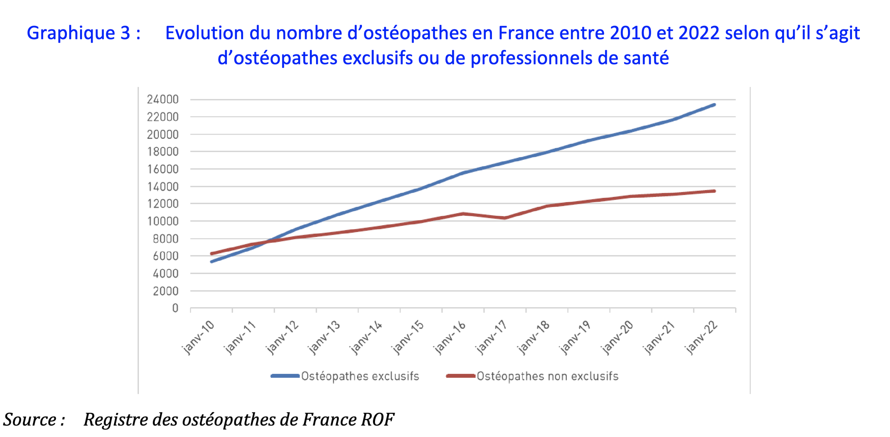

Le 26 octobre 2021, le **Ministre des Solidarités et de la Santé**
a chargé l'*Inspection Générale des Affaires Sociales* (IGAS)
d'évaluer le processus d'agrément des écoles de formation en ostéopathie.

L'IGAS est un organisme interministériel chargé de mener
des missions de contrôle, d'audit, d'expertise et d'évaluation.
Il conseille les autorités publiques et contribue à la conception
et à la mise en œuvre de réformes.

Dans son rapport publié en avril 2022, l'IGAS dresse un état des
lieux de l'ostéopathie en France en 2021. Cet état des lieux
s'appuie notamment sur plusieurs bases de données provenant
de la *Direction de la Recherche, des Études, de l'Évaluation
et des Statistiques* (DREES), de la *Caisse Interprofessionnelle
de Prévoyance et d'Assurance Vieillesse* (CIPAV) des professions libérales et de l'*Union Nationale des Associations Agréées* (UNASA).

Cet article détaillera les éléments clés du constat présenté par l'administration.

<!--more-->

  

    

      <svg class="w-5 h-5 text-blue-400" viewBox="0 0 20 20" fill="currentColor" aria-hidden="true">
        <path fill-rule="evenodd" d="M18 10a8 8 0 11-16 0 8 8 0 0116 0zm-7-4a1 1 0 11-2 0 1 1 0 012 0zM9 9a.75.75 0 000 1.5h.253a.25.25 0 01.244.304l-.459 2.066A1.75 1.75 0 0010.747 15H11a.75.75 0 000-1.5h-.253a.25.25 0 01-.244-.304l.459-2.066A1.75 1.75 0 009.253 9H9z" clip-rule="evenodd" />
      </svg>
    

    

      
Un sondage est en cours à ce sujet

      

        <a href="https://docs.google.com/forms/d/e/1FAIpQLSexwY-mYnXZ81NggRzXBHrKxNKK1xwDpWLLdYalNDCm4FgJFQ/viewform" class="font-medium text-blue-700 whitespace-nowrap hover:text-blue-600">
          Participer
           &rarr;
        </a>
      

    

  

**L'auteur de cet article écrit à titre personnel.**

## L’administration prend position en faveur d’une évolution de l’ostéopathie
> La situation créée par la loi de 2002 n’est plus tenable
> en l’état.

Dans son rapport, l'IGAS conclut que l'ostéopathie occupe une
position ambiguë dans le système de santé et propose de modifier
le code de la santé publique pour **inclure les ostéopathes en
tant qu'auxiliaires médicaux**. L'IGAS estime que l'ostéopathie
mérite une place précise afin de garantir la sécurité des patients.

L'IGAS indique clairement qu'il faut *écarter l'option de la
déréglementation ou de la restriction de la pratique de
l'ostéopathie par des professionnels de santé*. Elle reconnaît
que **les ostéopathes souhaitent rester autonomes**, avoir un accès
direct aux patients et s'intégrer dans une prise en charge coordonnée.

L'institution considère que les exigences du dispositif de formation
en ostéopathie sont insuffisantes en termes de qualité. C'est
pourquoi elle propose une évolution visant à renforcer la
procédure d'agrément, à rendre le conventionnement avec une
université obligatoire, à systématiser les inspections sur place
des écoles et à mettre en place un examen national de validation finale.

L'administration reconnaît que la *Commission Consultative Nationale
d'Agrément* (CCNA) actuelle ne peut jouer qu'un rôle limité dans
l'amélioration du dispositif de formation et du processus
d'agrément des écoles. Elle constate un manque de connexion
entre les *Agences Régionales de Santé* (ARS) et les écoles,
ce qui ne permet pas une gestion décentralisée de la formation.

Selon l'IGAS, il est important d'envisager la possibilité de **réguler
la démographie des ostéopathes** et elle constate l'absence de
quotas basés sur les besoins de la profession.

De manière générale, l'inspection générale propose un transfert de
la responsabilité de l'agrément des écoles du ministère vers
*une structure indépendante* et souhaite *un renforcement de
l'enseignement*, notamment en pratique clinique dans les cliniques
des écoles, ainsi qu'un renforcement de l'enseignement axé sur
la recherche.

En ce qui concerne l'exercice de l'ostéopathie, l'institution
souhaite que l'État dispose d'outils permettant une *meilleure
surveillance des accidents* et d'un dispositif d'*évaluation de
la pratique*. Elle note également que la *Haute Autorité de Santé* (HAS),
chargée d'élaborer et de valider des recommandations de bonnes pratiques
depuis 2002, n'a pas produit de travaux spécifiques sur la discipline.

L'IGAS exprime des inquiétudes quant à la confusion des patients
concernant la délimitation du champ de compétence des ostéopathes.
Selon elle, les importantes pénuries de professionnel·le·s de santé
entraînent une sollicitation accrue des ostéopathes disponibles
dans les déserts médicaux. Cette sollicitation pourrait à terme
entraîner des lacunes dans la prise en charge médicale.

## Une profession appréciée par les français
> L’ostéopathie est une pratique, très appréciée par la population,
> qui s’est démocratisée. L’ostéopathie est la médecine complémentaire
> la plus populaire en France.

Dans son rapport, l'IGAS présente les résultats des différentes enquêtes sur la popularité de l'ostéopathie et confirme que:
- **3 Français sur 5** ont déjà consulté un ostéopathe.
- 78% des patients découvrent l'ostéopathie par le biais du
  bouche-à-oreille.
- 72% des patients consultent un ostéopathe pour des **douleurs
  articulaires ou musculaires**.

Par ailleurs, le recours à l'ostéopathie est favorisé par le
remboursement de plus en plus fréquent par les mutuelles en France.

## Un titre partagé entre médecins, masseurs-kinésithérapeutes et ostéopathes exclusifs

## Une importante représentation des micro-entrepreneur, des jeunes et des femmes.
Au premier **janvier 2022**, le nombre d'ostéopathes actifs·ves
cotisant·e·s à la CIPAV s'élève à **15 043**. Parmi ces
professionnel·le·s, 3&nbsp;953, soit 23,6%, sont des
micro-entrepreneurs·ses (anciennement auto-entrepreneurs·ses).

On observe une forte féminisation avec près de 8&nbsp;320 ostéopathes
femmes pour environ 6&nbsp;723 ostéopathes hommes cotisants à la CIPAV.

L'ostéopathie connaît actuellement un véritable "baby-boom" avec
plus de 50% de ses professionnel·le·s ayant moins de 45 ans. De plus,
le nombre d'ostéopathes prévoyant de prendre leur retraite dans
les cinq prochaines années est relativement faible.

## Une croissance démographique très forte
Au 1er janvier 2022, le **nombre d'ostéopathes exclusifs·ves actifs·ves**
cotisant·e·s à la CIPAV **est de 15&nbsp;043**, ce qui représente **1,5 fois
moins que les estimations basées sur le répertoire ADELI** du
nombre d'ostéopathes en exercice. En effet, le registre ADELI
recense en 2022 un total de 36&nbsp;861 ostéopathes, toutes catégories confondues, dont 23&nbsp;402 ostéopathes exclusifs·ves.

Étant donné que l'*affiliation à la CIPAV est obligatoire* pour
ces professionnel·le·s, ces données semblent plus fiables que celles
obtenues à partir du traitement de la base ADELI. Cependant, ces
chiffres soulèvent des questions quant au nombre d'ostéopathes
exclusifs·ves ayant plusieurs lieux d'exercice et au nombre de
professionnel·le·s qui cessent leur activité.

En 2021, il existe 31 écoles d'ostéopathie agréées par le
ministère de la Santé, avec une capacité d'accueil totale de
11&nbsp;974 étudiants. L'IGAS estime une densité d'ostéopathes entre
42 et 53 pour 100&nbsp;000 habitants en France.

À titre de comparaison, en 2020, la densité moyenne nationale
des masseurs-kinésithérapeutes était de 135 pour 100&nbsp;000 habitants,
tandis que celle des médecins généralistes était de 140 pour
100&nbsp;000 habitants.

Par ailleurs, l'évolution démographique semble *favoriser
l'ostéopathie exclusive*, avec une baisse de 54% des ostéopathes
ayant un titre partagé avec une autre profession de santé en
2010 à 36,5% en 2022.

## Une répartition inégale des ostéopathes sur le territoire français
Comme pour les professionnels de santé, la répartition des ostéopathes
sur le territoire n'est pas uniforme.

Bien que les données varient selon les sources, les chiffres régionaux
sont comparables.

Ainsi, quelle que soit la source des données, on constate que la
densité des ostéopathes est la plus élevée dans les régions
*Provence-Alpes-Côte d'Azur* (PACA), *Auvergne Rhône Alpes* (ARA),
*Occitanie* et *Île-de-France*.

En revanche, les densités les plus faibles sont observées en
*Normandie*, *Hauts-de-France* et *Grand Est*.

## D'importantes inégalités de revenus

L'analyse de l'IGAS met en évidence la modestie des revenus de nombreux
ostéopathes. En effet, l'étude des rémunérations réalisée par l'IGAS
révèle que près de **la moitié des ostéopathes vivent avec un revenu
inférieur au SMIC**. De plus, environ **un quart des ostéopathes ont un
revenu mensuel inférieur à 830 euros**, ce qui est préoccupant.

En 2019, les données estiment le **revenu annuel moyen d'un ostéopathe
entre 25&nbsp;000 et 26&nbsp;000 euros**, ce qui correspond à un
revenu mensuel légèrement supérieur à 2&nbsp;000 euros.

Bien qu’il soit possible que les chiffres de la CIPAV puisse manquer
de fiabilité, le nombre élevé d'ostéopathes qui arrêtent leur
pratique en raison d'une *activité insuffisante* est une des
principales explications de la différence entre le nombre
d'ostéopathes inscrits au registre ADELI et le nombre
d'ostéopathes cotisant à la CIPAV. On constate **une différence
de 8&nbsp;359 ostéopathes exclusifs entre ces deux registres
(CIPAV : 15&nbsp;043, ADELI : 23&nbsp;402)**.

Pour l'IGAS, cette paupérisation de la profession est un signe
alarmant de la **surdensité de la profession**, et la croissance
démographique des ostéopathes **aggravera cette situation dans
les années à venir**.

## Une formation couteuse, peu contrôlé avec une faible visibilité de l’insertion des ancien·ne·s étudiant·e·s
> La formation dispensée par certaines écoles d’ostéopathie ne
> répond pas aux critères d’exigence.

L'IGAS estime le **coût annuel de la formation en ostéopathie** dans
une fourchette de **8&nbsp;400 euros à 9&nbsp;800 euros**, ce qui entraîne
un coût total de formation variant de **42&nbsp;000 euros à 49&nbsp;000 euros** pour un·e étudiant·e.

Les étudiant·e·s peuvent être admis·es dans une école d'ostéopathie
dès l'obtention du baccalauréat, et les effectifs de formation
**ne sont pas déterminés en fonction des besoins de la profession**.

En effet, le nombre maximal d'étudiant·e·s formé·e·s chaque année,
toutes promotions confondues, est déterminé par des critères
relevant de l'agrément du ministère de la santé.
Ces critères sont basés sur:
- la superficie des locaux
- la capacité et le nombre de patient·e·s accueilli·e·s par la
  clinique interne
- l'importance et les effectifs du dispositif pédagogique
- les effectifs de l'équipe administrative

L'IGAS souligne que l'agrément du ministère de la santé *repose
sur des documents déclaratifs, sans contrôle sur place des
établissements*, ce qui entraîne un manque de fiabilité quant
au respect de la réglementation en vigueur.

Malgré une obligation légale, la traçabilité des jeunes diplômé·e·s
et les enquêtes sur l'insertion professionnelle sont **peu fiables
et ne permettent pas aux étudiant·e·s d'avoir une vision claire de
leur future carrière** après l'obtention de leur diplôme.

Dans l'ensemble, l'administration estime que le **dispositif
pédagogique est inadapté** en termes de durée de formation et de
critères de qualité attendus.

Lorsque l'IGAS détaille les neuf dossiers pour lesquels la
<abbr title="Commission Consultative Nationale d'Agrément">CCNA</abbr>
a rendu un avis défavorable en 2021, elle constate que
les principaux aspects de non-conformité sont les suivants :
- l'insuffisance de l'enseignement clinique due à une activité
  insuffisante de la clinique;
- l'absence d'expérience requise pour les tuteurs et tutrices de stage;
- l'absence de convention de stage pour les stages externes;
- le non-respect de la convention nationale de l'enseignement privé;
- la non-conformité des locaux, de l'équipe pédagogique et d'enseignement.
  L'IGAS note une prédominance de la forme sur le fond dans
  l'analyse des dossiers d'agrément.

## Une absence de registre des événements indésirables
> La gravité des accidents relatés justifie d’organiser le
> recueil des déclarations des victimes de complications graves
> et d’en tenir un registre (…) Il semble indispensable que
> les pouvoirs publics organisent le recensement de cas graves
> et la constitution d’un registre afin de protéger les usagers,
> sans à ce stade envisager une indemnisation de ces accidents.
> La nature médicale des accidents décrits oriente vers une
> implication de l’ONIAM dans le recueil des accidents graves.

L'IGAS souligne une probable rareté des sinistres liés à la
pratique de l'ostéopathie, mais constate la possibilité de
survenance d'événements graves.

En effet, au Royaume-Uni, le *National Council for Osteopathic
Research* (NCOR) a recensé en 2017 un total de 184 ostéopathes
faisant l'objet d'une plainte, soit **3,5 % des ostéopathes anglais·es**.
Les principaux motifs de plainte sont liés aux soins dispensés
et au comportement du praticien.

En France, Olivier Dumay, médecin à la cour d'appel, a analysé
18 dossiers concernant des ostéopathes entre 2010 et 2019.

Tous les ostéopathes français doivent disposer d'une assurance
responsabilité professionnelle. Le rapport de l'IGAS indique
que le coût de cette assurance est relativement faible, suggérant
un faible risque assurantiel. Cependant, il est difficile
d'obtenir une image précise des accidents causés par ces pratiques,
car **il n'existe pas de suivi organisé de la sinistralité
ostéopathique ou chiropratique en France**. En effet, étant
donné qu'ils et elles ne sont pas considérés comme des
professionnel·le·s de santé, l'*Office National d'Indemnisation
des Accidents Médicaux* (ONIAM) ne couvre pas ces accidents.

## Conclusion
Le rapport de l'IGAS dresse un portrait global et relativement
précis de l'ostéopathie en France en 2021.

Ce rapport met en évidence un certain nombre de problèmes
auxquels la profession est confrontée, ce qui nécessite une
réforme significative du dispositif de formation et de
l'exercice de l'ostéopathie dans le pays.

En conséquence, l'**IGAS a formulé 26 recommandations** adressées
au ministère de la Santé afin d'initier les réformes nécessaires.

Suite à la publication de ce rapport, l'ensemble des
organisations professionnelles ont communiqué leur position à ce sujet:
- la communication d'[*Ostéopathes de France* (ODF)](https://osteofrance.com/actualites/news/2023/05/rapport-de-ligas-de-reels-motifs-despoir-pour-notre-profession)
- la communication du [*Syndicat Français des Ostéopathes* (SFDO)](https://www.osteopathe-syndicat.fr/une-mission-igas-formule-26-recommandations-sur-la-procedure-d-agrement-et-des-capacites-d-accueil-des-etablissements)
- la communication du [*Registre des Ostéopathes de France* (ROF)](https://www.osteopathie.org/571-communique-de-presse.html)
- la communication de l'[*Association Française d'Ostéopathie* (AFO)](https://www.afosteo.org/actualites/publication-du-rapport-de-ligas-sur-la-formation-en-osteopathie/) ainsi que [son résumé](https://www.afosteo.org/actualites/que-retenir-du-rapport-de-ligas/)
- la communication de la [*Fédération des étudiant·e·s en ostéopathie* (FédEO)](https://www.instagram.com/p/CtOi_oPxJCH/)
- la communication de la [*Fédération Nationale de l'Enseignement Supérieur en Ostéopathie* (FNESO)](https://www.fneso.fr/formation-en-osteopathie-quen-est-il-des-agrements-provisoires/)
- la communication de la [*Association Française de Chiropraxie* (AFC)](https://www.chiropraxie.com/blog/articles/rapport-igas-sur-la-formation-des-chiropracteurs-et-des-osteopathes-4-questions-a-audrey-yargui)

Nous détaillerons ces propositions dans les deux autres articles
suivants de ce [dossier dédié au rapport de l'IGAS]() qui arriverons dans la semaine.

## Références
- lien vers le [rapport de l'IGAS 2021](https://www.igas.gouv.fr/IMG/pdf/2021-095r_rapport.pdf)
- le résumé sur [le portail vie-publique.fr du gouvernement](https://www.vie-publique.fr/en-bref/289582-osteopathie-une-place-ambigue-dans-le-systeme-de-soins)

  

    

      <svg class="w-5 h-5 text-blue-400" viewBox="0 0 20 20" fill="currentColor" aria-hidden="true">
        <path fill-rule="evenodd" d="M18 10a8 8 0 11-16 0 8 8 0 0116 0zm-7-4a1 1 0 11-2 0 1 1 0 012 0zM9 9a.75.75 0 000 1.5h.253a.25.25 0 01.244.304l-.459 2.066A1.75 1.75 0 0010.747 15H11a.75.75 0 000-1.5h-.253a.25.25 0 01-.244-.304l.459-2.066A1.75 1.75 0 009.253 9H9z" clip-rule="evenodd" />
      </svg>
    

    

      
Un sondage est en cours à ce sujet

      

        <a href="https://docs.google.com/forms/d/e/1FAIpQLSexwY-mYnXZ81NggRzXBHrKxNKK1xwDpWLLdYalNDCm4FgJFQ/viewform" class="font-medium text-blue-700 whitespace-nowrap hover:text-blue-600">
          Participer
           &rarr;
        </a>
      

    

  

