> Nous remercions chaleureusement l’ensemble des répondant·e·s à notre enquête 🥰

Suite à la parution du rapport IGAS intitulé [«Évaluation de la procédure d'agrément
et des capacités d'accueil des établissements de formation en ostéopathie
et en chiropraxie et propositions d'évolution»](https://www.igas.gouv.fr/IMG/pdf/2021-095r_rapport.pdf)
en avril 2023, Pierre-Adrien LIOT a proposé de publier une
[série]()
[de trois]()
[articles]()
sur notre site de publications.

L'objectif était de présenter une synthèse factuelle et vulgarisée du rapport à
destination des étudiants et des ostéopathes.

<!--more-->

Marqués par le succès des articles auprès de nos lecteurs et lectrices
(plus de 4 000 visiteurs et visiteuses uniques pour un temps moyen de lecture
de plus de 7 minutes), nous nous avons jugé important d'obtenir leur avis
et de mesurer les dynamiques d'opinions à chaud concernant le contenu du
rapport de l'IGAS.

Pour ce faire, nous avons utilisé une méthode simple et efficace: le
sondage en ligne. Nous avons rédigé et diffusé un sondage sur nos réseaux
et nous allons voir ensemble les résultats obtenus.

## Notre méthode
Afin de nous assurer que seuls les ostéopathes autorisé·e·s à exercer répondaient
à notre sondage, nous avons demandé le numéro ADELI à tous les participant·e·s,
que nous avons ensuite vérifié dans le répertoire officiel.
En ce qui concerne les étudiant·e·s, nous nous sommes simplement basés sur
la sincérité de leurs déclarations.

Par la suite, nous avons analysé séparément les données des étudiant·e·s et
des professionnel·le·s. La plupart des données des étudiants étant très similaires
aux données des professionnel·le·s, nous présentons dans cette article
uniquement les résultats auprès des professionnel·le·s. Nous laissons
le soin à nos lecteurs et lectrices de faire l'exercice sur les données
brutes données disponibles en fin d'article s'ils ou elles le souhaitent.

Le questionnaire a été conçu pour évaluer l'opinion générale des
répondant·e·s concernant le rapport de l'IGAS et leur volonté ou non d'une
réforme en profondeur de l'ostéopathie en France, à l'aide de questions à choix fermés.

Ensuite, nous avons évalue les propositions de l'IGAS une par une, en offrant quatre
possibilités de réponses auxquelles nous avons attribué un score privé:
- très favorable (+2),
- plutôt favorable (+1),
- peu favorable (-1),
- pas favorable (-2).

Ce système nous a permis de mesurer à la fois le degré de faveur de chaque
proposition et d'établir un classement global.

Les répondant·e·s n'étaient pas tenu·e·s de répondre à toutes les questions
de cette partie du questionnaire, et pouvaient choisir de n'accorder aucun
point à une proposition.

Dans un troisième temps, nous avons souhaité connaître la position des
répondant·e·s concernant l'évolution de notre statut vers celui de professionnel·le
de santé, sans préciser à quel titre. Ensuite, nous avons proposé différentes
possibilités de titres:
- auxiliaire médical,
- professionnel·le de santé,
- ou la création d'un titre spécifique dans le code de la santé publique.

De même, nous avons souhaité recueillir l'avis des répondant·e·s concernant
la création d'une autorité de l'ostéopathie en France, tout en évaluant
les différentes formes possibles, les modalités d'élection et de financement de cet organisme.
Nous avons formulé des propositions, mais avons laissé aux répondant·e·s la
possibilité de formuler leur propre réponse.

Enfin, nous avons laissé une question ouverte pour permettre à chaque répondant·e
de donner son opinion sur l'avenir de la profession.

## Mode de diffusion
Nous avons diffusé le sondage sur les réseaux sociaux tels que les groupes
Facebook et Instagram, ainsi que par e-mail aux membres osteopathes.pro
inscrits à notre liste de diffusion.

Ce sondage représente l'opinion d'un échantillon d'ostéopathes et vise
à mettre en évidence les dynamiques d'opinion parmi les lecteurs et lectrices de notre
blog. Nous espérons que cela pourra éclairer nos confrères et consœurs et
contribuer au débat sur les enjeux de l'avenir de notre profession.

## Résultats
Sans plus attendre, intéressons nous aux résultats obtenus.

Vous pouvez également vous rendre en fin d'article pour avoir accès directement
aux données brutes du formulaire pour faire vos propres analyses.

Certains graphiques de l'article sont également disponibles
dans le lien fourni vers les données brutes.

### Nombre de participant·e·s aux sondages
Nombre de répondant·e·s: 471 \
Nombre de professionnel·le·s: 420 \
Nombre d’étudiant·e·s: 45 \
Nombre de valeurs invalides: ADELI manquant ou faux, données incohérentes: 6

### Profil des répondant·e·s
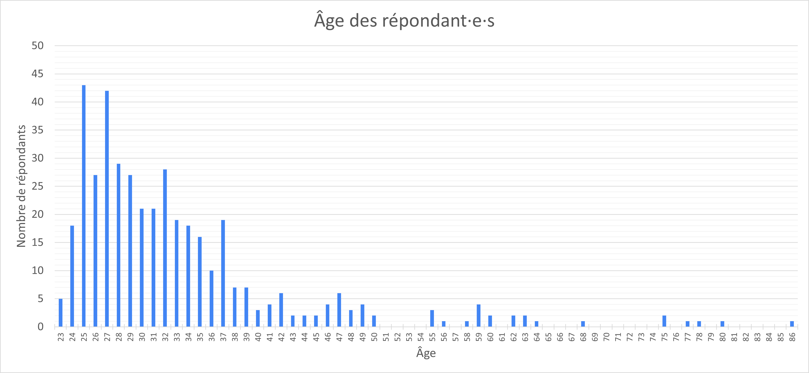
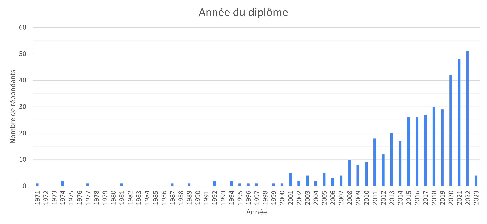
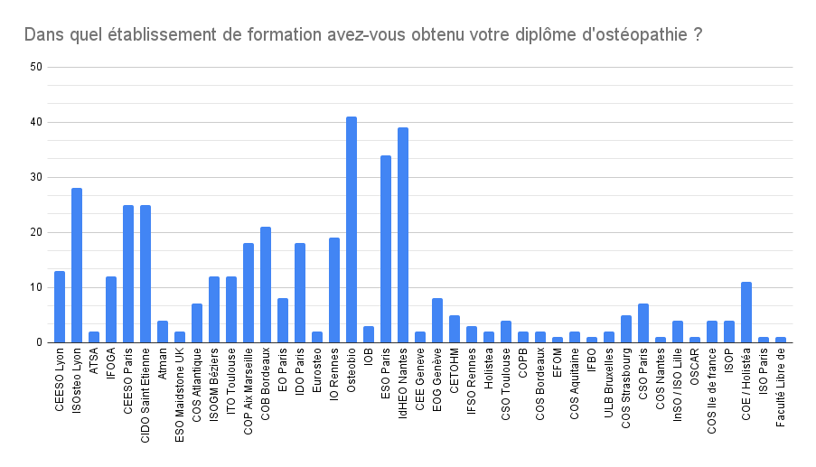
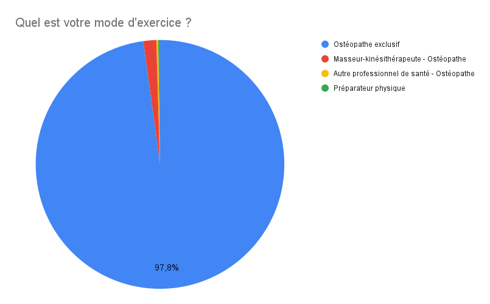
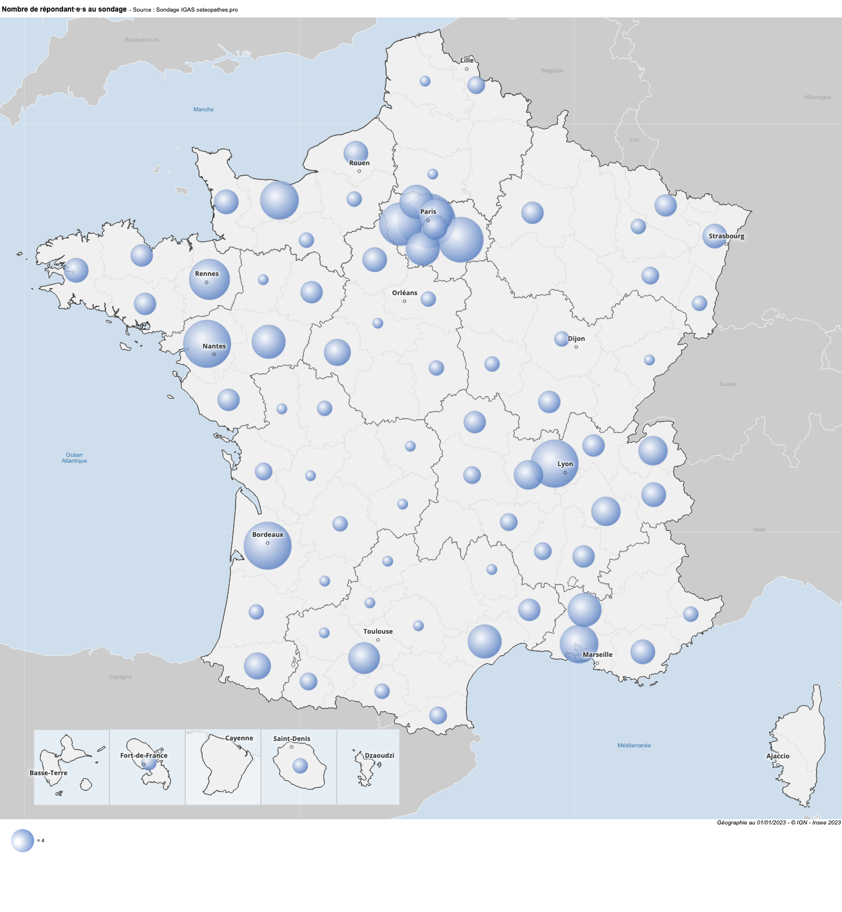

### Quel est votre sentiment sur le rapport de l'IGAS 2022 ?
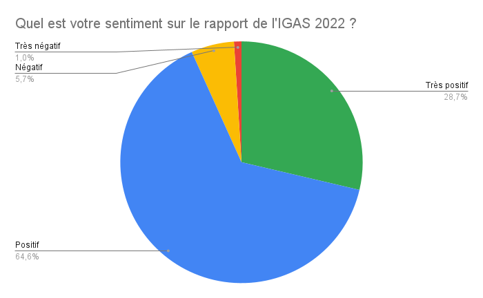

### Souhaitez-vous qu'une réforme profonde de l'ostéopathie ait lieu en France dans les prochaines années ?
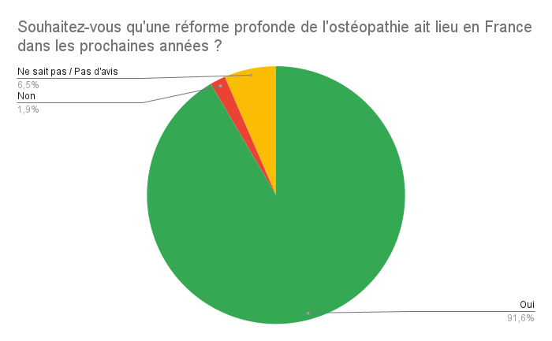

### Résultats pour les 26 propositions du rapport
Taux moyen de faveur des proposition: 84%

Ce tableau est dans l'ordre croissant de la moins
favorable à la plus favorable. Cela est repris dans un
graphique en fin de tableau.

Pour revoir le détail des propositions, vous pouvez vous
rendre sur [notre article détailant les 26 propositions]()

| Proposition                                                                                                                                                                                                                                                                                    | R: Très favorable (+2) | R: Plutôt favorable (+1) | R: Peu favorable (-1) | R: Pas favorable (-2) | R: N/A | Score |
|------------------------------------------------------------------------------------------------------------------------------------------------------------------------------------------------------------------------------------------------------------------------------------------------|------------------------|--------------------------|-----------------------|-----------------------|--------|-------|
| Proposition 11: « Confier à l’ARS la présidence du conseil pédagogique et renforcer la composition de ce conseil par une représentation systématique de l’ensemble des coordonnateurs de promotion et des tuteurs de stage »                                                                   |                    117 |                      158 |                    99 |                    26 |     19 |   241 |
| Proposition 21: « Améliorer l’accès et l’ergonomie de la plateforme informatique AEO utilisée par les membres de la CCNA et standardiser la présentation des dossiers de demande d’agrément ou de renouvellement »                                                                             |                    153 |                      207 |                    21 |                     2 |     36 |   488 |
| Proposition 10: « Déconcentrer une partie de l’instruction du dossier d’agrément en confiant aux ARS en particulier la validation des critères nécessitant une visite sur site »                                                                                                               |                    200 |                      159 |                    37 |                     7 |     16 |   508 |
| Proposition 20: « Elargir la composition de la CCNA à un autre membre du ministère en charge de l’enseignement supérieur de la recherche et de l’innovation et à des personnalités qualifiées et accroitre ses compétences pour la faire évoluer vers une instance technique de référence »    |                    202 |                      157 |                    37 |                     5 |     18 |   514 |
| Proposition 13: « Ajouter aux critères d’agrément l’obligation de fournir une cartographie des terrains de stage extérieurs conforme à la réglementation »                                                                                                                                     |                    203 |                      159 |                    39 |                     4 |     14 |   518 |
| Proposition 1: « Organiser le recueil et mettre en place un registre des accidents graves consécutifs à des actes d’ostéopathie »                                                                                                                                                              |                    191 |                      188 |                    30 |                     8 |      2 |   524 |
| Proposition 2: « Mettre en place une commission nationale chargée de décrire et d’évaluer les pratiques des ostéopathes »                                                                                                                                                                      |                    217 |                      158 |                    32 |                     9 |      3 |   542 |
| Proposition 14: « Renforcer le critère d’agrément portant sur les stages extérieurs en prévoyant des conventions comportant des objectifs et des critères d’évaluation précis et spécifiques »                                                                                                 |                    212 |                      160 |                    28 |                     5 |     14 |   546 |
| Proposition 15: « Inciter les écoles d’ostéopathie à mettre en place une certification réalisée par un organisme extérieur indépendant sur des critères définis par la CCNA »                                                                                                                  |                    243 |                      131 |                    30 |                     6 |      9 |   575 |
| Proposition 12: « Introduire dans l’agrément une charte d’encadrement des étudiants pour les stages extérieurs précisant les grands principes communs à tous les stages »                                                                                                                      |                    231 |                      155 |                    24 |                     1 |      8 |   591 |
| Proposition 7: « Proposer à tout nouveau membre de la CCNA une formation portant d’une part sur le rôle et les engagements des membres et d’autre part sur les critères d’agrément »                                                                                                           |                    215 |                      178 |                     6 |                     1 |     19 |   600 |
| Proposition 23: « Caractériser des objectifs de qualité à introduire dans la partie pédagogique des dossiers de demande ou de renouvellement d’agrément en s’inspirant de modèles utilisés à l’université (HCERES) »                                                                           |                    231 |                      157 |                    12 |                     3 |     16 |   601 |
| Proposition 3: « Standardiser et consolider les enquêtes d’insertion réalisées par les écoles d’ostéopathie et publier annuellement une synthèse nationale incluant les médecins nouvellement titulaires d’un diplôme universitaire en ostéopathie »                                           |                    256 |                      128 |                    22 |                     6 |      7 |   606 |
| Proposition 17: « Mettre en place un examen diplômant avec la participation de jurés extérieurs indépendants »                                                                                                                                                                                 |                    282 |                      105 |                    21 |                     8 |      3 |   632 |
| Proposition 16: « Systématiser la traçabilité des résultats de validation des acquis dans les outils de suivi de l’étudiant »                                                                                                                                                                  |                    260 |                      134 |                    16 |                     2 |      7 |   634 |
| Proposition 22: « Déterminer les critères prioritaires à vérifier sur site par l’ARS et élaborer un questionnaire permettant de recueillir les informations utiles » ET Proposition 25: « Mettre en place un programme de contrôle systématique des écoles d’ostéopathie réalisé par les ARS » |                    274 |                      113 |                    17 |                     3 |     12 |   638 |
| Proposition 8: « Faire obligation aux écoles de demander une augmentation capacitaire à la CCNA avant toute ouverture de classes préparatoires »                                                                                                                                               |                    295 |                       90 |                    11 |                     9 |     14 |   651 |
| Proposition 19: « Engager une collaboration effective entre le ministère en charge de la santé et le ministère en charge de l’enseignement supérieur de la recherche et de l’innovation sur des positions communes relatives au contrôle effectif de la formation des ostéopathes »            |                    272 |                      127 |                     5 |                     4 |     11 |   658 |
| Proposition 6: « Modifier le calendrier de dépôt des demandes afin de permettre à la CCNA de rendre au ministre les avis de renouvellement d’agrément l’année précédant la fin de l’agrément »                                                                                                 |                    275 |                      124 |                     6 |                     2 |     12 |   664 |
| Proposition 26: « Encourager des rapprochements avec les universités de la région académique, sous forme de conventionnements qui définissent les modalités d’intervention de l’université »                                                                                                   |                    298 |                       97 |                    12 |                     3 |      9 |   675 |
| Proposition 9: « Préciser les attendus qualitatifs et quantitatifs de la formation pratique clinique et de son organisation en faisant évoluer l’article 18 du décret du 12 septembre 2014 relatif à l’agrément des établissements de formation en ostéopathie »                               |                    310 |                       90 |                    10 |                     0 |      9 |   700 |
| Proposition 18: « Intégrer une unité d’enseignement à l’initiation à la démarche de recherche »                                                                                                                                                                                                |                    319 |                       83 |                    11 |                     2 |      4 |   706 |
| Proposition 24: « Systématiser un enseignement incluant des interventions sur les collaborations interprofessionnelles au service d’un parcours coordonné du patient »                                                                                                                         |                    314 |                       91 |                     8 |                     1 |      5 |   709 |
| Proposition 4: « Elaborer un atlas démographique fiabilisé, régulièrement mis à jour, des ostéopathes en exercice »                                                                                                                                                                            |                    332 |                       77 |                     3 |                     2 |      5 |   734 |
| Proposition 5: « Adapter le cadre juridique afin d’arrêter d’ici à quatre ans une réduction du capacitaire des écoles en adéquation avec les besoins estimés en ostéopathes »                                                                                                                  |                    369 |                       41 |                     5 |                     3 |      1 |   768 |

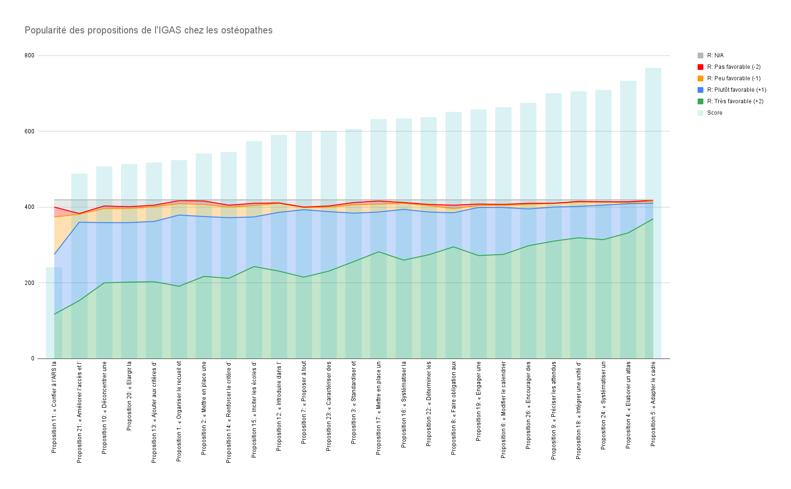

### Les ostéopathes exclusifs devraient-ils et devraient-elles accéder au statut de «Professionnel·le de Santé» ?
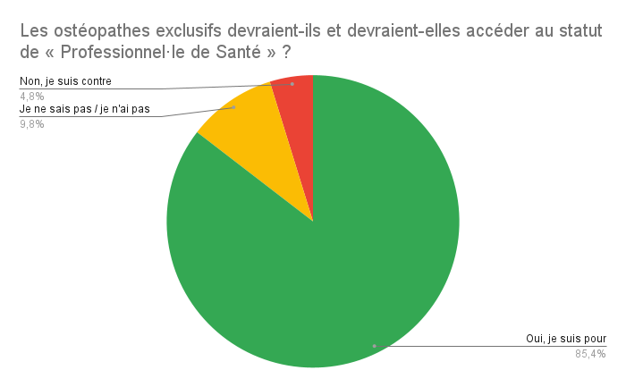

### Si oui, à quel titre ?
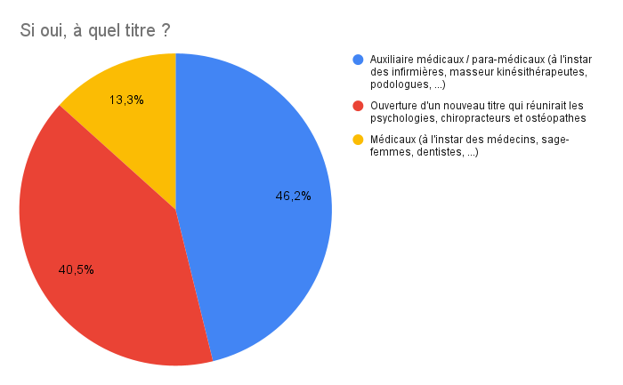

### L'ostéopathie devrait-elle disposer d'une autorité ayant une délégation de service public ?
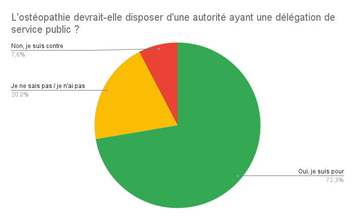

### Si oui, sous quelle forme ?
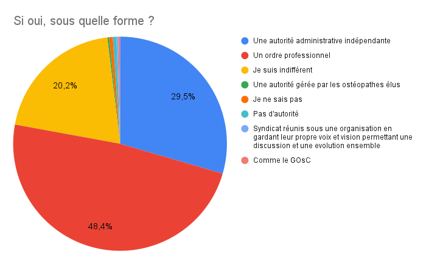

### Cette autorité devrait-elle être financée par... ?

### Les représentants à cette autorité devrait-ils être soumis à... ?

### Souhaitez-vous une union des organisations professionnels et syndicales pour soutenir les propositions de l’IGAS auprès du gouvernement ?
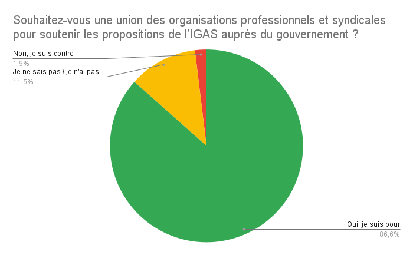

### Quel est votre sentiment sur l'avenir de l'ostéopathie en France ?
Les commentaires exprimés à la suite de la question sur l'avenir de
l'ostéopathie en France **sont variés, reflétant un mélange d'espoir,
d'inquiétude et de besoin de réformes**.

Voici un résumé des sentiments exprimés par les ostéopathes, nous vous
invitons à aller lire le verbatim si vous souhaitez en savoir plus.

- **Réformes et Régulations**: les ostéopathes soulignent la
  nécessité de réformes pour assurer l'avenir de la profession,
  sa reconnaissance et pour son évolution. Ils et elles
  en appellent à encadrer et réguler les pratiques pour éviter
  les dérives thérapeutiques.
- **Contrôle et Qualité de l'Education**: Les ostéopathes appellent à
  limiter le nombre d'étudiant·e·s et à contrôler le nombre de diplômé·e·s.
  Ils et elles en appellent également à encadrer la formation, de procéder
  à des contrôles stricts de la qualité des écoles et à la fermeture
  d'écoles ne respectant pas les normes de qualité.
- **Préoccupations liées au Marché**: Les ostéopathes sont préoccupé·e·s
  par la saturation du marché. Cela cause de grandes inquiétudes quant
  à l'avenir de la profession, la saturation du marché de l'emploi
  et sur la qualité de la prise en charge ostéopathique.
- **Vision Scientifique et Évolution des Enseignements**: Les ostéopathes
  reconnaissent l'importance de l'EBP (Evidence-Based Practice) et appellent
  à une formation basée sur des preuves scientifiques solides.
  Ils et elles souhaitent également une uniformisation des enseignements,
  l'élimination des dogmes et des fausses croyances enseignées dans les écoles
  et une vision plus scientifique de la profession.
  Cela permettrait de faire évoluer la profession et de la rendre plus
  en phase avec les avancées scientifiques et les exigences de santé actuelles.
- **Collaboration Interprofessionnelle**: Certain·e·s ostéopathes
  soulignent l'importance de la collaboration avec d'autres
  professionnel·le·s de santé et appellent à une intégration de
  l'ostéopathie dans le parcours de soin.
- **Attitudes face à l'Avenir**: Malgré des opinions variées, la plupart
  des ostéopathes sondé·e·s ont des attentes positives quant aux mesures
  du rapport IGAS pour l'évolution de la profession. Ils et elles sont
  optimistes quant au potentiel positif pour l'avenir de l'ostéopathie
  en France. Cependant, l'avenir de l'ostéopathie en France reste incertain
  en raison des divergences entre les praticiens traditionnels et ceux
  cherchant une plus grande légitimité médicale.

En résumé, les ostéopathes reconnaissent généralement la nécessité d'une
réforme et d'une régulation de la profession pour assurer son avenir.
Ils et elles expriment des préoccupations quant au nombre d'ostéopathes,
à la qualité de la formation, à la réputation de la profession et aux
dérives thérapeutiques. Certain·e·s sont optimistes quant aux propositions
du rapport IGAS, tandis que d'autres restent sceptiques quant à
la mise en œuvre effective des changements nécessaires.

### Réseau de mots
Nous avons également effectué une analyse en réseaux de mots pour
identifier les mots les plus fréquents dans les commentaires et leurs
relations.

L'épaisseur du lien reflète l'intensité de la corrélation entre
deux mots. La taille des noeuds, du texte et leur couleur reflètent
leur fréquence d'apparition dans les commentaires.

Pour les plus ferrus de code informatique parmis vous,
vous pouvez retrouver l'algorithme ayant permis de générer ce réseau
de mots sur le dépôt git de
[Mathis Brier](https://gitlab.univ-nantes.fr/mbrier/word-network.pro).
Merci beaucoup à lui 🥰 (ainsi que pour ses commentaires).

## Données brutes
Si vous souhaitez faire vos propres analyses avec les données du sondage,
vous pouvez retrouver [toutes les données brutes du sondage anonymisées](https://docs.google.com/spreadsheets/d/1f6jvGMyTOBhnbPjY5OuDZqTTGYqhBz1FIRxIs6CvymU/edit?usp=sharing).

Les données ont été anonymisées de la façon suivante:
- les numéro ADELI ont été supprimés
- les emails remplacés par une fausse adresse
- les code postaux ont été modifiés pour ne garder que le
  département (le code postal se termine toujours en 000)
- certains commentaires ont été édités pour éviter
  toute identification

## Conclusion

En conclusion, l'enquête sur le rapport IGAS 2022 menée auprès des
étudiant·e·s et professionnel·le·s en ostéopathie a démontré un
intérêt marqué pour le sujet mais une participation modérée au sondage.
Les **résultats indiquent une volonté d'une réforme en profondeur de
l'ostéopathie en France**, ainsi qu'un taux de faveur moyen de 84%
pour les propositions du rapport. Il est probable que nos résultats
soient biaisés par notre public et lectorat mais ils reflètent
néanmoins une tendance significative.

Il est intéressant de noter que la majorité des répondants ont
trouvé pertinentes et souhaitables les diverses propositions énoncées
dans le rapport IGAS.

Par ailleurs, nous avons constaté **une volonté manifeste de voir
évoluer le statut de l'ostéopathie en France**. Nombreux et nombreuses
sont ceux et celles qui préconisent également le développement d'une
autorité de l'ostéopathie en France pour garantir une meilleure
régulation de notre pratique.

Enfin, nous tenons à exprimer notre gratitude à toutes celles et ceux
qui ont participé à cette enquête. Votre contribution a permis
d'éclairer les enjeux futurs de l'ostéopathie en France, et
nous espérons que ces informations pourront aider à guider
l'évolution de notre profession. À l'aune de ces résultats,
il est clair que notre profession est en attente d'une évolution
qui mettra sans doute en lumière le rôle notable que joue
l'ostéopathie dans le domaine de la santé en France et sur
sa responsabilité grandissante.
